# 📝 CreateOneFieldMetadataItem GraphQL Mutation Documentation

> **Complete Technical Deep-Dive**: Understanding how Twenty CRM's `CreateOneFieldMetadataItem` mutation works from GraphQL request to PostgreSQL column creation.

## 📋 Table of Contents

- [Overview](#overview)
- [Complete Flow Diagram](#complete-flow-diagram)
- [GraphQL Entry Point](#graphql-entry-point)
- [Resolver & Service Layer](#resolver--service-layer)
- [Field Type System](#field-type-system)
- [Validation & Business Logic](#validation--business-logic)
- [Database Operations](#database-operations)
- [Migration Generation & Execution](#migration-generation--execution)
- [Database Schema Changes](#database-schema-changes)
- [Complete Examples](#complete-examples)
- [Best Practices](#best-practices)

---

## Overview

The `CreateOneFieldMetadataItem` mutation is Twenty's mechanism for adding custom fields to existing objects. Unlike object creation, field creation:

1. **Creates field metadata entries** in the core schema
2. **Generates column migrations** for existing workspace tables
3. **Executes DDL operations** to add new columns to PostgreSQL tables
4. **Updates field maps** and triggers cache invalidation

### Key Insight
Field creation modifies existing tables by adding new columns, while object creation creates entirely new tables. This makes field creation both more complex (affecting existing data) and more constrained (must preserve data integrity).

---

## Complete Flow Diagram

```mermaid
sequenceDiagram
    participant Client as 📱 Frontend Client
    participant GQL as 🌐 GraphQL API
    participant FM as 🏢 FieldMetadata Resolver
    participant FMS as ⚙️ FieldMetadata Service
    participant Validation as 🔍 Validation Services
    participant Migration as 🔄 Migration System
    participant DB as 🗄️ PostgreSQL
    
    Client->>GQL: CreateOneFieldMetadataItem
    Note over Client,GQL: { field: { name: "price", type: "NUMBER", objectMetadataId: "..." } }
    
    GQL->>FM: createOneField(input)
    Note over FM: Direct mutation resolver
    
    FM->>FMS: createOne(fieldInput)
    Note over FMS: Routes to V1 or V2 based on feature flag
    
    FMS->>Validation: validateFieldMetadata()
    Note over Validation: Field name, type, settings validation
    
    Validation->>Validation: validateFieldNameAvailability()
    Validation->>Validation: validateFieldSettings()
    Validation->>Validation: validateDefaultValue()
    Validation-->>FMS: ✅ Validation passed
    
    FMS->>DB: INSERT into core.fieldMetadata
    Note over DB: Creates metadata entry
    DB-->>FMS: ✅ Field metadata created
    
    FMS->>Migration: generateFieldMigration()
    Note over Migration: WorkspaceMigrationFactory
    
    Migration->>Migration: createColumnActions()
    Note over Migration: Generate ALTER TABLE ADD COLUMN
    
    Migration->>DB: INSERT workspaceMigration
    Note over DB: Queue column addition migration
    DB-->>Migration: ✅ Migration queued
    
    Migration->>DB: ALTER TABLE workspace_abc.product ADD COLUMN price float
    Note over DB: Execute DDL operation
    DB-->>Migration: ✅ Column added
    
    Migration-->>FMS: ✅ Migration complete
    FMS->>FMS: invalidateCache()
    FMS-->>FM: ✅ Field created
    FM-->>GQL: ✅ FieldMetadata
    GQL-->>Client: ✅ Created field metadata
```



---

## GraphQL Entry Point

### Mutation Definition
```graphql
mutation CreateOneFieldMetadataItem($input: CreateOneFieldMetadataInput!) {
  createOneField(input: $input) {
    id
    type
    name
    label
    description
    icon
    isCustom
    isActive
    isUnique
    isNullable
    createdAt
    updatedAt
    settings
    defaultValue
    options
    isLabelSyncedWithName
    object {
      id
    }
  }
}
```

### Input Schema
```typescript
type CreateOneFieldMetadataInput = {
  field: CreateFieldInput!
}

type CreateFieldInput = {
  objectMetadataId: string!     // Target object UUID
  type: FieldMetadataType!      // Field type (TEXT, NUMBER, etc.)
  name: string!                 // Field name (camelCase)
  label: string!                // Display label
  description?: string          // Field description
  icon?: string                 // UI icon
  isNullable?: boolean         // Allow null values (default: true)
  isUnique?: boolean           // Unique constraint (default: false)
  defaultValue?: any           // Default value
  settings?: FieldSettings     // Type-specific settings
  options?: FieldOption[]      // For SELECT/MULTI_SELECT fields
  isLabelSyncedWithName?: boolean  // Auto-sync label with name
}
```

### Example Request
```javascript
const response = await apolloClient.mutate({
  mutation: CREATE_ONE_FIELD_METADATA_ITEM,
  variables: {
    input: {
      field: {
        objectMetadataId: 'obj-uuid-123',
        type: 'NUMBER',
        name: 'price',
        label: 'Price',
        description: 'Product price in USD',
        icon: 'IconCurrencyDollar',
        isNullable: false,
        settings: {
          dataType: 'FLOAT'
        }
      }
    }
  }
});
```

---

## Resolver & Service Layer

### Direct GraphQL Resolver

Unlike objects, field metadata has a **direct resolver** (not auto-generated):

```typescript
// File: src/engine/metadata-modules/field-metadata/field-metadata.resolver.ts

@Resolver(() => FieldMetadataDTO)
export class FieldMetadataResolver {
  constructor(
    private readonly fieldMetadataService: FieldMetadataService,
    private readonly fieldMetadataServiceV2: FieldMetadataServiceV2,
  ) {}

  @Mutation(() => FieldMetadataDTO)
  async createOneField(
    @Args('input') input: CreateOneFieldMetadataInput,
    @AuthWorkspace() { id: workspaceId }: Workspace,
  ) {
    try {
      return await this.fieldMetadataService.createOne({
        ...input.field,
        workspaceId,
      });
    } catch (error) {
      return fieldMetadataGraphqlApiExceptionHandler(error);
    }
  }
}
```

### Core Service Implementation

```typescript
// File: src/engine/metadata-modules/field-metadata/services/field-metadata.service.ts

export class FieldMetadataService extends TypeOrmQueryService<FieldMetadataEntity> {
  override async createOne(
    fieldMetadataInput: CreateFieldInput,
  ): Promise<FieldMetadataEntity> {
    // Feature flag check for V2 migration system
    const isWorkspaceMigrationV2Enabled =
      await this.featureFlagService.isFeatureEnabled(
        FeatureFlagKey.IS_WORKSPACE_MIGRATION_V2_ENABLED,
        fieldMetadataInput.workspaceId,
      );

    if (isWorkspaceMigrationV2Enabled) {
      return this.fieldMetadataServiceV2.createOne({
        createFieldInput: fieldMetadataInput,
        workspaceId: fieldMetadataInput.workspaceId,
      });
    }

    // Use legacy V1 migration system
    const [createdFieldMetadata] = await this.createMany([fieldMetadataInput]);
    return createdFieldMetadata;
  }
}
```

---

## Field Type System

### Supported Field Types

Twenty supports a comprehensive field type system with database mappings:

#### **Basic Types**
```typescript
// Scalar field types
const BASIC_FIELD_TYPES = {
  UUID: 'uuid',           // Unique identifiers
  TEXT: 'text',           // Text strings
  NUMBER: 'float',        // Numeric values (integer/float)
  NUMERIC: 'numeric',     // High-precision decimals
  BOOLEAN: 'boolean',     // True/false values
  DATE: 'date',           // Date only
  DATE_TIME: 'timestamptz', // Date and time with timezone
  POSITION: 'float',      // Ordering position
  ARRAY: 'text[]'         // Array of values
};
```

#### **Composite Types**
```typescript
// Complex field types with sub-fields
const COMPOSITE_FIELD_TYPES = {
  CURRENCY: {
    amountMicros: 'int8',
    currencyCode: 'text'
  },
  FULL_NAME: {
    firstName: 'text',
    lastName: 'text'
  },
  ADDRESS: {
    addressStreet1: 'text',
    addressStreet2: 'text',
    addressCity: 'text',
    addressState: 'text',
    addressPostcode: 'text',
    addressCountry: 'text',
    addressLat: 'float',
    addressLng: 'float'
  },
  LINKS: {
    primaryLinkUrl: 'text',
    primaryLinkLabel: 'text',
    secondaryLinks: 'jsonb'
  },
  EMAILS: {
    primaryEmail: 'text',
    additionalEmails: 'jsonb'
  },
  PHONES: {
    primaryPhoneNumber: 'text',
    primaryPhoneCountryCode: 'text',
    additionalPhones: 'jsonb'
  }
};
```

#### **Enum-Based Types**
```typescript
// Types that use PostgreSQL ENUMs
const ENUM_FIELD_TYPES = {
  SELECT: 'enum',         // Single selection
  MULTI_SELECT: 'enum',   // Multiple selections
  RATING: 'enum'          // Rating scale (1-5)
};
```

#### **Special Types**
```typescript
// Advanced field types
const SPECIAL_FIELD_TYPES = {
  RELATION: 'uuid',          // Foreign key relationships
  MORPH_RELATION: 'uuid',    // Polymorphic relationships
  RAW_JSON: 'jsonb',         // JSON data
  RICH_TEXT: 'text',         // HTML content
  RICH_TEXT_V2: 'jsonb',     // Structured rich text
  ACTOR: 'jsonb',            // User/system actor info
  TS_VECTOR: 'tsvector'      // Full-text search vector
};
```

### Field Settings by Type

#### **NUMBER Field Settings**
```typescript
interface NumberSettings {
  dataType: 'INT' | 'FLOAT';    // Integer or floating point
  precision?: number;           // Decimal precision
  scale?: number;              // Decimal scale
}

// Example
{
  type: 'NUMBER',
  settings: {
    dataType: 'FLOAT'
  }
}
```

#### **TEXT Field Settings**
```typescript
interface TextSettings {
  maxLength?: number;          // Maximum character length
}

// Example
{
  type: 'TEXT',
  settings: {
    maxLength: 255
  }
}
```

#### **DATE/DATE_TIME Settings**
```typescript
interface DateSettings {
  displayFormat?: string;      // Display format preference
}

// Example
{
  type: 'DATE',
  settings: {
    displayFormat: 'YYYY-MM-DD'
  }
}
```

#### **SELECT Field Options**
```typescript
interface SelectOption {
  value: string;               // Option value
  label: string;               // Display label
  color: string;               // UI color
  position: number;            // Sort order
}

// Example
{
  type: 'SELECT',
  options: [
    { value: 'draft', label: 'Draft', color: 'gray', position: 0 },
    { value: 'published', label: 'Published', color: 'green', position: 1 }
  ]
}
```

#### **RELATION Field Settings**
```typescript
interface RelationSettings {
  relationType: 'ONE_TO_ONE' | 'ONE_TO_MANY' | 'MANY_TO_ONE' | 'MANY_TO_MANY';
  onDelete?: 'SET_NULL' | 'CASCADE' | 'RESTRICT';
  joinColumnName?: string;
}

// Example
{
  type: 'RELATION',
  settings: {
    relationType: 'MANY_TO_ONE',
    onDelete: 'SET_NULL'
  },
  relationCreationPayload: {
    targetObjectMetadataId: 'target-obj-uuid',
    targetFieldLabel: 'Products',
    targetFieldIcon: 'IconPackage'
  }
}
```

---

## Validation & Business Logic

### Validation Pipeline

Field creation involves extensive validation through multiple services:

#### **1. Field Name Validation**
```typescript
// Validates field name follows conventions
validateMetadataNameOrThrow(fieldInput.name);

// Checks name availability within object
validateFieldNameAvailabilityOrThrow(
  fieldInput.name,
  objectMetadata.fieldsById
);

// Validates name/label synchronization
if (fieldInput.isLabelSyncedWithName) {
  validateNameAndLabelAreSyncOrThrow({
    label: fieldInput.label,
    name: fieldInput.name,
  });
}
```

#### **2. Field Type Validation**
```typescript
// Validates field type-specific requirements
await fieldMetadataValidationService.validateFieldMetadata({
  fieldMetadataType: fieldInput.type,
  fieldMetadataInput: fieldInput,
  objectMetadata,
});

// For SELECT/MULTI_SELECT fields
if (isEnumFieldMetadataType(fieldInput.type)) {
  await fieldMetadataEnumValidationService.validateEnumOptions(
    fieldInput.options
  );
}
```

#### **3. Settings Validation**
```typescript
// Type-specific settings validation
class NumberSettingsValidation {
  @IsOptional()
  @IsEnum(['INT', 'FLOAT'])
  dataType?: 'INT' | 'FLOAT';
}

class TextSettingsValidation {
  @IsOptional()
  @IsInt()
  @Min(1)
  @Max(10000)
  maxLength?: number;
}
```

#### **4. Default Value Validation**
```typescript
// Validates default value matches field type
const validationResult = validateDefaultValueForType(
  fieldInput.type,
  fieldInput.defaultValue
);

if (!validationResult.isValid) {
  throw new FieldMetadataException(
    'Invalid default value for field type',
    FieldMetadataExceptionCode.INVALID_DEFAULT_VALUE
  );
}
```

#### **5. Relation-Specific Validation**
```typescript
// For RELATION fields
if (fieldInput.type === FieldMetadataType.RELATION) {
  await fieldMetadataRelationService.validateFieldMetadataRelationSpecifics({
    fieldMetadataInput: fieldInput,
    fieldMetadataType: fieldInput.type,
    objectMetadataMaps,
    objectMetadata,
  });
}
```

---

## Database Operations

### Primary Database Table: `core.fieldMetadata`

```sql
-- Core schema table that stores field definitions
CREATE TABLE core."fieldMetadata" (
    id uuid PRIMARY KEY DEFAULT gen_random_uuid(),
    "objectMetadataId" uuid NOT NULL REFERENCES "objectMetadata"(id),
    "workspaceId" uuid NOT NULL REFERENCES workspace(id),
    
    -- Field Identity
    name varchar NOT NULL,                  -- 'price'
    label varchar NOT NULL,                 -- 'Price'
    description text,                       -- 'Product price in USD'
    
    -- Field Configuration
    type varchar NOT NULL,                  -- 'NUMBER', 'TEXT', etc.
    "isCustom" boolean DEFAULT false,       -- TRUE for user-created fields
    "isActive" boolean DEFAULT true,
    "isSystem" boolean DEFAULT false,       -- Core system fields
    "isNullable" boolean DEFAULT true,
    "isUnique" boolean DEFAULT false,
    
    -- Type-specific Configuration
    settings jsonb,                         -- Type-specific settings
    "defaultValue" jsonb,                   -- Default value
    options jsonb,                          -- For SELECT/MULTI_SELECT
    
    -- UI Configuration
    icon varchar DEFAULT 'IconArchive',
    "isLabelSyncedWithName" boolean DEFAULT true,
    
    -- Relation Configuration
    "relationTargetFieldMetadataId" uuid REFERENCES "fieldMetadata"(id),
    "relationTargetObjectMetadataId" uuid REFERENCES "objectMetadata"(id),
    
    -- Audit
    "createdAt" timestamptz DEFAULT now() NOT NULL,
    "updatedAt" timestamptz DEFAULT now() NOT NULL,
    "deletedAt" timestamptz,
    
    UNIQUE(name, "objectMetadataId"),
    INDEX("objectMetadataId"),
    INDEX("workspaceId"),
    INDEX(type)
);
```

### Insert Operation Details

```typescript
// TypeORM entity insertion with automatic field population
const fieldMetadataEntity = await fieldMetadataRepository.save({
  objectMetadataId: 'obj-uuid-123',
  workspaceId: 'workspace-uuid',
  name: 'price',
  label: 'Price',
  description: 'Product price in USD',
  type: FieldMetadataType.NUMBER,
  icon: 'IconCurrencyDollar',
  isCustom: true,           // Automatically set for user-created fields
  isActive: true,
  isNullable: false,
  settings: {
    dataType: 'FLOAT'
  },
  // id, createdAt, updatedAt auto-generated
});
```

---

## Migration Generation & Execution

### Migration Generation Process

When a field is created, Twenty automatically generates database migrations:

#### **1. Basic Field Migration**
```typescript
// File: src/engine/metadata-modules/workspace-migration/factories/basic-column-action.factory.ts

export class BasicColumnActionFactory {
  protected handleCreateAction(
    fieldMetadata: FieldMetadataEntity,
    options?: WorkspaceColumnActionOptions,
  ): WorkspaceMigrationColumnCreate[] {
    const columnName = computeColumnName(fieldMetadata);
    const defaultValue = fieldMetadata.defaultValue ?? options?.defaultValue;
    const serializedDefaultValue = serializeDefaultValue(defaultValue);

    return [
      {
        action: WorkspaceMigrationColumnActionType.CREATE,
        columnName,
        columnType: fieldMetadataTypeToColumnType(fieldMetadata.type),
        isArray: fieldMetadata.type === FieldMetadataType.ARRAY,
        isNullable: fieldMetadata.isNullable ?? true,
        isUnique: fieldMetadata.isUnique ?? false,
        defaultValue: serializedDefaultValue,
      },
    ];
  }
}
```

#### **2. Composite Field Migration**
```typescript
// For composite types (CURRENCY, FULL_NAME, etc.)
const compositeType = compositeTypeDefinitions.get(fieldMetadata.type);

if (compositeType) {
  return compositeType.properties.map((property) => ({
    action: WorkspaceMigrationColumnActionType.CREATE,
    columnName: computeCompositeColumnName(fieldMetadata.name, property),
    columnType: fieldMetadataTypeToColumnType(property.type),
    isNullable: property.isNullable ?? true,
    defaultValue: property.defaultValue,
  }));
}
```

#### **3. Relation Field Migration**
```typescript
// For RELATION fields
if (fieldMetadata.type === FieldMetadataType.RELATION) {
  const joinColumnName = computeJoinColumnName(fieldMetadata);
  
  return [
    {
      action: WorkspaceMigrationColumnActionType.CREATE,
      columnName: joinColumnName,
      columnType: 'uuid',
      isNullable: true,
      // Add foreign key constraint in separate migration
    }
  ];
}
```

### Migration Execution Pipeline

#### **V1 Migration System (Legacy)**
```typescript
// Traditional migration approach
await workspaceMigrationService.createCustomMigration(
  generateMigrationName(`create-${fieldMetadata.name}`),
  workspaceId,
  [
    {
      name: computeObjectTargetTable(objectMetadata),
      action: WorkspaceMigrationTableActionType.ALTER,
      columns: columnActions,
    }
  ],
  queryRunner,
);

await workspaceMigrationRunnerService.executeMigrationFromPendingMigrations(
  workspaceId,
  queryRunner,
);
```

#### **V2 Migration System (Modern)**
```typescript
// Enhanced migration with better validation and performance
return fieldMetadataServiceV2.createOne({
  createFieldInput: fieldMetadataInput,
  workspaceId: fieldMetadataInput.workspaceId,
});

// Uses WorkspaceMigrationValidateBuildAndRunService
// - Validates all changes before execution
// - Builds optimized migration plan
// - Executes with rollback support
```

---

## Database Schema Changes

### 1. Core Schema Changes

#### **New Field Metadata Record**
```sql
-- Example: Adding a price field to product object
INSERT INTO core."fieldMetadata" (
    id,
    "objectMetadataId",
    "workspaceId",
    name,
    label,
    type,
    description,
    icon,
    "isCustom",
    "isActive",
    "isNullable",
    settings,
    "createdAt",
    "updatedAt"
) VALUES (
    'field-uuid-123',
    'obj-uuid-456',
    'workspace-uuid-789',
    'price',
    'Price',
    'NUMBER',
    'Product price in USD',
    'IconCurrencyDollar',
    true,
    true,
    false,
    '{"dataType": "FLOAT"}'::jsonb,
    now(),
    now()
);
```

#### **Migration Queue Entry**
```sql
-- New record in core.workspaceMigration
INSERT INTO core."workspaceMigration" (
    id,
    "workspaceId",
    name,
    migrations,
    "isCustom",
    "createdAt"
) VALUES (
    'migration-uuid-999',
    'workspace-uuid-789',
    '1728000000000-create-price-field',
    '[{
        "name": "product",
        "action": "ALTER",
        "columns": [
            {
                "action": "CREATE",
                "columnName": "price",
                "columnType": "float",
                "isNullable": false,
                "defaultValue": null
            }
        ]
    }]'::jsonb,
    true,
    now()
);
```

### 2. Workspace Schema Changes

#### **Basic Field Addition**
```sql
-- Add simple field to existing table
ALTER TABLE "workspace_abc123"."product" 
ADD COLUMN price float NOT NULL DEFAULT 0;

-- Add index for performance
CREATE INDEX "IDX_product_price" 
    ON "workspace_abc123"."product"(price) 
    WHERE "deletedAt" IS NULL;
```

#### **Composite Field Addition**
```sql
-- Add CURRENCY field (creates multiple columns)
ALTER TABLE "workspace_abc123"."product" 
ADD COLUMN "priceAmountMicros" int8,
ADD COLUMN "priceCurrencyCode" text DEFAULT 'USD';

-- Add FULL_NAME field
ALTER TABLE "workspace_abc123"."person" 
ADD COLUMN "nameFirstName" text,
ADD COLUMN "nameLastName" text;
```

#### **SELECT Field Addition**
```sql
-- Create enum type for SELECT field
CREATE TYPE "workspace_abc123"."product_status_enum" AS ENUM (
    'draft',
    'published',
    'archived'
);

-- Add column with enum type
ALTER TABLE "workspace_abc123"."product" 
ADD COLUMN status "workspace_abc123"."product_status_enum" DEFAULT 'draft';
```

#### **Relation Field Addition**
```sql
-- Add foreign key column
ALTER TABLE "workspace_abc123"."product" 
ADD COLUMN "categoryId" uuid;

-- Add foreign key constraint
ALTER TABLE "workspace_abc123"."product" 
ADD CONSTRAINT "FK_product_categoryId" 
    FOREIGN KEY ("categoryId") 
    REFERENCES "workspace_abc123"."category"(id) 
    ON DELETE SET NULL;

-- Add index for join performance
CREATE INDEX "IDX_product_categoryId" 
    ON "workspace_abc123"."product"("categoryId") 
    WHERE "deletedAt" IS NULL;
```

---

## Complete Examples

### Example 1: Text Field Creation

```typescript
// Frontend implementation
const { createOneFieldMetadataItem } = useCreateOneFieldMetadataItem();

const createDescriptionField = async () => {
  const result = await createOneFieldMetadataItem({
    objectMetadataId: productObjectId,
    type: FieldMetadataType.TEXT,
    name: 'description',
    label: 'Description',
    description: 'Product description',
    icon: 'IconFileText',
    isNullable: true,
    settings: {
      maxLength: 1000
    }
  });

  console.log('Created field:', result.data?.createOneField);
};

// Generated SQL
ALTER TABLE "workspace_abc123"."product" 
ADD COLUMN description text;
```

### Example 2: Number Field with Settings

```typescript
const createPriceField = async () => {
  const result = await createOneFieldMetadataItem({
    objectMetadataId: productObjectId,
    type: FieldMetadataType.NUMBER,
    name: 'price',
    label: 'Price',
    description: 'Product price in USD',
    icon: 'IconCurrencyDollar',
    isNullable: false,
    isUnique: false,
    defaultValue: 0,
    settings: {
      dataType: 'FLOAT'
    }
  });
};

// Generated SQL
ALTER TABLE "workspace_abc123"."product" 
ADD COLUMN price float NOT NULL DEFAULT 0;
```

### Example 3: Select Field with Options

```typescript
const createStatusField = async () => {
  const result = await createOneFieldMetadataItem({
    objectMetadataId: productObjectId,
    type: FieldMetadataType.SELECT,
    name: 'status',
    label: 'Status',
    description: 'Product status',
    icon: 'IconTag',
    isNullable: false,
    defaultValue: 'draft',
    options: [
      { value: 'draft', label: 'Draft', color: 'gray', position: 0 },
      { value: 'published', label: 'Published', color: 'green', position: 1 },
      { value: 'archived', label: 'Archived', color: 'red', position: 2 }
    ]
  });
};

// Generated SQL
CREATE TYPE "workspace_abc123"."product_status_enum" AS ENUM (
    'draft', 'published', 'archived'
);

ALTER TABLE "workspace_abc123"."product" 
ADD COLUMN status "workspace_abc123"."product_status_enum" DEFAULT 'draft';
```

### Example 4: Currency Field (Composite)

```typescript
const createPriceCurrencyField = async () => {
  const result = await createOneFieldMetadataItem({
    objectMetadataId: productObjectId,
    type: FieldMetadataType.CURRENCY,
    name: 'price',
    label: 'Price',
    description: 'Product price with currency',
    icon: 'IconMoneybag',
    isNullable: true,
    defaultValue: {
      amountMicros: 0,
      currencyCode: 'USD'
    }
  });
};

// Generated SQL
ALTER TABLE "workspace_abc123"."product" 
ADD COLUMN "priceAmountMicros" int8,
ADD COLUMN "priceCurrencyCode" text DEFAULT 'USD';
```

### Example 5: Relation Field

```typescript
const createCategoryRelation = async () => {
  const result = await createOneFieldMetadataItem({
    objectMetadataId: productObjectId,
    type: FieldMetadataType.RELATION,
    name: 'category',
    label: 'Category',
    description: 'Product category',
    icon: 'IconFolder',
    isNullable: true,
    settings: {
      relationType: RelationType.MANY_TO_ONE,
      onDelete: 'SET_NULL'
    },
    relationCreationPayload: {
      targetObjectMetadataId: categoryObjectId,
      targetFieldLabel: 'Products',
      targetFieldIcon: 'IconPackage',
      type: RelationType.ONE_TO_MANY
    }
  });
};

// Generated SQL
-- On product table
ALTER TABLE "workspace_abc123"."product" 
ADD COLUMN "categoryId" uuid;

ALTER TABLE "workspace_abc123"."product" 
ADD CONSTRAINT "FK_product_categoryId" 
    FOREIGN KEY ("categoryId") 
    REFERENCES "workspace_abc123"."category"(id) 
    ON DELETE SET NULL;

-- Reverse relation field created on category
-- (handled by FieldMetadataRelationService)
```

---

## Best Practices

### 1. **Field Naming Conventions**

```typescript
// ✅ GOOD: Clear, descriptive naming
{
  name: 'customerEmail',          // camelCase, descriptive
  label: 'Customer Email',        // Human-readable
  description: 'Primary email address for customer communication'
}

// ❌ BAD: Unclear, inconsistent naming
{
  name: 'cust_em',               // Abbreviated, unclear
  label: 'email',                // Doesn't match name
  description: 'email'           // Not descriptive
}
```

### 2. **Type Selection Guidelines**

```typescript
// ✅ GOOD: Appropriate type selection
{
  type: FieldMetadataType.NUMBER,
  settings: { dataType: 'INT' }   // For quantities, counts
}

{
  type: FieldMetadataType.NUMERIC, // For precise financial calculations
}

{
  type: FieldMetadataType.TEXT,
  settings: { maxLength: 255 }     // With appropriate limits
}

// ❌ BAD: Poor type choices
{
  type: FieldMetadataType.TEXT,    // For numeric data
}

{
  type: FieldMetadataType.NUMBER,  // For precise financial data
}
```

### 3. **Default Value Strategy**

```typescript
// ✅ GOOD: Thoughtful default values
{
  type: FieldMetadataType.BOOLEAN,
  defaultValue: false,             // Clear false default
  isNullable: false
}

{
  type: FieldMetadataType.SELECT,
  defaultValue: 'draft',           // Logical workflow start
  options: [
    { value: 'draft', label: 'Draft', color: 'gray', position: 0 }
  ]
}

// ❌ BAD: Poor default handling
{
  type: FieldMetadataType.BOOLEAN,
  defaultValue: null,              // Ambiguous state
  isNullable: true
}
```

### 4. **Error Handling**

```typescript
const createFieldWithErrorHandling = async (fieldInput: CreateFieldInput) => {
  try {
    // Validate object exists
    const objectMetadata = await getObjectMetadata(fieldInput.objectMetadataId);
    if (!objectMetadata) {
      throw new Error('Target object not found');
    }

    // Check field name availability
    if (objectMetadata.fields[fieldInput.name]) {
      throw new Error(`Field "${fieldInput.name}" already exists`);
    }

    const result = await createOneFieldMetadataItem(fieldInput);
    
    // Wait for migration completion
    await waitForFieldMigrationCompletion(result.data?.createOneField?.id);
    
    return result;
    
  } catch (error) {
    // Handle specific error types
    if (error.message.includes('already exists')) {
      throw new Error(`Field "${fieldInput.name}" already exists on this object`);
    }
    
    if (error.message.includes('invalid type')) {
      throw new Error('Invalid field type or settings');
    }
    
    throw error;
  }
};
```

### 5. **Performance Considerations**

```typescript
// ✅ GOOD: Consider indexing strategy
{
  type: FieldMetadataType.TEXT,
  name: 'email',
  isUnique: true,                  // Automatically creates unique index
}

{
  type: FieldMetadataType.RELATION,
  name: 'category',                // Automatically creates join index
}

// ⚠️ CONSIDER: Index implications for frequently queried fields
{
  type: FieldMetadataType.SELECT,
  name: 'status',                  // Consider manual index creation
}
```

### 6. **Migration Safety**

```typescript
// ✅ GOOD: Safe field creation
const createFieldSafely = async (fieldInput: CreateFieldInput) => {
  // Create as nullable first
  const safeFieldInput = {
    ...fieldInput,
    isNullable: true,
    defaultValue: null
  };
  
  const field = await createOneFieldMetadataItem(safeFieldInput);
  
  // Later update with constraints if needed
  // This allows existing records to adapt gradually
  
  return field;
};

// ❌ RISKY: Adding non-nullable field without default
{
  type: FieldMetadataType.NUMBER,
  isNullable: false,               // Will fail if table has existing records
  defaultValue: null               // No fallback value
}
```

### 7. **Testing Approach**

```typescript
// Integration test example
describe('CreateOneFieldMetadataItem', () => {
  it('should create field and add column to table', async () => {
    const objectMetadata = await createTestObject();
    
    const fieldInput = {
      objectMetadataId: objectMetadata.id,
      type: FieldMetadataType.TEXT,
      name: 'testField',
      label: 'Test Field',
      isNullable: true
    };
    
    // Create field
    const result = await createOneFieldMetadataItem(fieldInput);
    expect(result.data?.createOneField).toBeDefined();
    
    // Verify metadata created
    const fieldId = result.data?.createOneField?.id;
    const fieldMetadata = await getFieldMetadata(fieldId);
    expect(fieldMetadata.name).toBe(fieldInput.name);
    
    // Verify column created
    const tableSchema = await getTableSchema(objectMetadata.nameSingular);
    expect(tableSchema.columns).toHaveProperty('testField');
    
    // Verify field is queryable
    const queryResult = await queryWorkspaceTable(
      objectMetadata.nameSingular,
      ['id', 'testField']
    );
    expect(queryResult).toBeDefined();
    
    // Cleanup
    await deleteFieldMetadata(fieldId);
  });

  it('should handle validation errors appropriately', async () => {
    const invalidFieldInput = {
      objectMetadataId: 'invalid-uuid',
      type: 'INVALID_TYPE',
      name: '123invalid',          // Invalid name
      label: ''                   // Empty label
    };
    
    await expect(
      createOneFieldMetadataItem(invalidFieldInput)
    ).rejects.toThrow();
  });
});
```

---

## Summary

The `CreateOneFieldMetadataItem` mutation provides a powerful and flexible system for extending Twenty's data model:

### **Key Strengths**
1. **Comprehensive Type System**: Supports 20+ field types from basic TEXT to complex RELATIONS
2. **Automatic Migration**: Seamlessly adds columns to existing database tables
3. **Type Safety**: Extensive validation ensures data integrity
4. **Performance Optimized**: Automatic indexing and migration optimization
5. **Flexible Configuration**: Rich settings and options for each field type

### **Migration Evolution**
- **V1 System**: Traditional migration approach with immediate execution
- **V2 System**: Enhanced validation, batching, and rollback support
- **Future**: Real-time schema evolution with zero-downtime migrations

### **Use Cases**
- **Custom Business Fields**: Add domain-specific fields to standard objects
- **Integration Requirements**: Create fields for external system mappings
- **Workflow Enhancement**: Add status, priority, and categorization fields
- **Data Enrichment**: Extend objects with calculated or derived fields

**Key Takeaway**: Field creation in Twenty is both powerful and safe, enabling dynamic schema evolution while maintaining data integrity and performance. The system handles the complexity of database migrations while providing a simple, intuitive API for developers.

---

*This documentation covers the complete lifecycle of field creation in Twenty CRM. For object creation, see the `CreateOneObjectMetadataItem` documentation.*