# 📝 CreateOneObjectMetadataItem GraphQL Mutation Documentation

> **Complete Technical Deep-Dive**: Understanding how Twenty CRM's `CreateOneObjectMetadataItem` mutation works from GraphQL request to PostgreSQL schema generation.

## 📋 Table of Contents

- [Overview](#overview)
- [Complete Flow Diagram](#complete-flow-diagram)
- [GraphQL Entry Point](#graphql-entry-point)
- [Resolver & Service Layer](#resolver--service-layer)
- [Database Operations](#database-operations)
- [Schema Migration Generation](#schema-migration-generation)
- [WorkspaceSchemaManager Execution](#workspaceschemamanager-execution)
- [Database Schema Changes](#database-schema-changes)
- [Complete Example](#complete-example)
- [Best Practices](#best-practices)

---

## Overview

The `CreateOneObjectMetadataItem` mutation is Twenty's core mechanism for creating new custom objects in the metadata-driven architecture. When called, it:

1. **Creates metadata entries** in the core schema
2. **Generates schema migrations** for workspace schemas
3. **Executes DDL operations** to create actual PostgreSQL tables
4. **Updates caches** and triggers recompilation

### Key Insight
This mutation doesn't directly create tables - it creates **metadata that describes tables**, and the migration system compiles that metadata into actual PostgreSQL schema changes.

---

## Complete Flow Diagram

```mermaid
sequenceDiagram
    participant Client as 📱 Frontend Client
    participant GQL as 🌐 GraphQL API
    participant WSR as ⚙️ Workspace Resolver
    participant OM as 🏢 ObjectMetadata Entity
    participant MS as 🔄 Migration System
    participant WSM as 🛠️ WorkspaceSchemaManager
    participant DB as 🗄️ PostgreSQL
    
    Client->>GQL: CreateOneObjectMetadataItem
    Note over Client,GQL: { nameSingular: "product", labelSingular: "Product" }
    
    GQL->>WSR: createOneObject(input)
    Note over WSR: Auto-generated workspace resolver
    
    WSR->>OM: Insert into core.objectMetadata
    Note over OM: Creates metadata entry
    
    OM->>DB: INSERT objectMetadata
    DB-->>OM: ✅ Created with ID
    
    OM->>MS: Trigger Migration Generation
    Note over MS: Based on objectMetadata.isCustom=true
    
    MS->>MS: Generate CREATE TABLE migration
    Note over MS: CREATE TABLE workspace_abc.product (...)
    
    MS->>DB: INSERT into workspaceMigration
    DB-->>MS: ✅ Migration queued
    
    MS->>WSM: Execute migration
    Note over WSM: WorkspaceSchemaManagerService
    
    WSM->>DB: CREATE TABLE workspace_abc.product
    WSM->>DB: CREATE INDEXES
    WSM->>DB: ADD default columns
    DB-->>WSM: ✅ Schema updated
    
    WSM-->>MS: Migration complete
    MS-->>OM: ✅ Table created
    OM-->>WSR: ✅ Object ready
    WSR-->>GQL: ✅ ObjectMetadata
    GQL-->>Client: ✅ Created object metadata
```



---

## GraphQL Entry Point

### Mutation Definition
```graphql
mutation CreateOneObjectMetadataItem($input: CreateOneObjectInput!) {
  createOneObject(input: $input) {
    id
    nameSingular
    namePlural
    labelSingular
    labelPlural
    description
    icon
    isCustom
    isActive
    isSearchable
    createdAt
    updatedAt
    labelIdentifierFieldMetadataId
    imageIdentifierFieldMetadataId
    isLabelSyncedWithName
  }
}
```

### Input Schema
```typescript
type CreateOneObjectInput = {
  object: CreateObjectInput!
}

type CreateObjectInput = {
  nameSingular: string!      // e.g., "product"
  namePlural: string!        // e.g., "products"
  labelSingular: string!     // e.g., "Product"
  labelPlural: string!       // e.g., "Products"
  description?: string       // e.g., "Product catalog items"
  icon?: string             // e.g., "IconPackage"
  isLabelSyncedWithName?: boolean  // Default: true
}
```

### Example Request
```javascript
const response = await apolloClient.mutate({
  mutation: CREATE_ONE_OBJECT_METADATA_ITEM,
  variables: {
    input: {
      object: {
        nameSingular: 'product',
        namePlural: 'products',
        labelSingular: 'Product',
        labelPlural: 'Products',
        description: 'Product catalog items',
        icon: 'IconPackage'
      }
    }
  }
});
```

---

## Resolver & Service Layer

### Auto-Generated Workspace Resolver

The `createOneObject` resolver is **automatically generated** by Twenty's workspace resolver factory system:

```typescript
// Auto-generated resolver for "Object" workspace entity
// Location: WorkspaceResolverFactory creates this dynamically

const createOneObjectResolver = async (
  _source: unknown,
  args: CreateOneResolverArgs,
  _context: unknown,
  info: GraphQLResolveInfo
) => {
  const options: WorkspaceQueryRunnerOptions = {
    authContext: internalContext.authContext,
    info,
    objectMetadataMaps: internalContext.objectMetadataMaps,
    objectMetadataItemWithFieldMaps: internalContext.objectMetadataItemWithFieldMaps,
  };

  return await graphqlQueryCreateOneResolverService.execute(
    args,
    options,
    'createOne'
  );
};
```

### Core Services Involved

#### 1. **GraphqlQueryCreateOneResolverService**
```typescript
// File: src/engine/api/graphql/graphql-query-runner/resolvers/graphql-query-create-one-resolver.service.ts

@Injectable()
export class GraphqlQueryCreateOneResolverService {
  async resolve(executionArgs: GraphqlQueryResolverExecutionArgs<CreateOneResolverArgs>): Promise<ObjectRecord> {
    // Delegates to CreateManyResolverService with single item
    const result = await this.createManyResolverService.resolve({
      ...executionArgs,
      args: {
        ...executionArgs.args,
        data: [executionArgs.args.data],
      },
    });

    return result[0];
  }
}
```

#### 2. **Validation Pipeline**
```typescript
async validate(
  args: CreateOneResolverArgs<Partial<ObjectRecord>>,
  options: WorkspaceQueryRunnerOptions,
): Promise<void> {
  // Ensures not trying to create remote objects
  assertMutationNotOnRemoteObject(options.objectMetadataItemWithFieldMaps);

  // Validates UUID format if provided
  if (args.data?.id) {
    assertIsValidUuid(args.data.id);
  }
}
```

---

## Database Operations

### Primary Database Table: `core.objectMetadata`

```sql
-- Core schema table that stores object definitions
CREATE TABLE core."objectMetadata" (
    id uuid PRIMARY KEY DEFAULT gen_random_uuid(),
    "workspaceId" uuid NOT NULL REFERENCES workspace(id),
    
    -- Object Identity
    "nameSingular" varchar NOT NULL,        -- 'product'
    "namePlural" varchar NOT NULL,          -- 'products'
    "labelSingular" varchar NOT NULL,       -- 'Product'
    "labelPlural" varchar NOT NULL,         -- 'Products'
    
    -- Configuration
    "description" text,
    "icon" varchar DEFAULT 'IconArchive',
    "isCustom" boolean DEFAULT false,       -- TRUE for user-created objects
    "isActive" boolean DEFAULT true,
    "isSystem" boolean DEFAULT false,       -- Core system objects
    
    -- UI Configuration
    "labelIdentifierFieldMetadataId" uuid,
    "imageIdentifierFieldMetadataId" uuid,
    "isLabelSyncedWithName" boolean DEFAULT true,
    
    -- Audit
    "createdAt" timestamptz DEFAULT now() NOT NULL,
    "updatedAt" timestamptz DEFAULT now() NOT NULL,
    "deletedAt" timestamptz,
    
    UNIQUE("nameSingular", "workspaceId"),
    UNIQUE("namePlural", "workspaceId")
);
```

### Insert Operation Details

```typescript
// TypeORM entity insertion with automatic field population
const objectMetadataEntity = await workspaceEntityManager.save(
  ObjectMetadataEntity,
  {
    nameSingular: 'product',
    namePlural: 'products',
    labelSingular: 'Product',
    labelPlural: 'Products',
    description: 'Product catalog items',
    icon: 'IconPackage',
    isCustom: true,           // Automatically set for user-created objects
    isActive: true,
    workspaceId: 'workspace-uuid',
    // id, createdAt, updatedAt auto-generated
  }
);
```

---

## Schema Migration Generation

### Migration Trigger System

When an `objectMetadata` record is created with `isCustom: true`, the system automatically triggers migration generation:

```typescript
// File: src/engine/metadata-modules/object-metadata/services/object-metadata-migration.service.ts

@Injectable()
export class ObjectMetadataMigrationService {
  
  // 1. Create table migration
  async createTableMigration(
    createdObjectMetadata: ObjectMetadataEntity,
    queryRunner?: QueryRunner,
  ) {
    await this.workspaceMigrationService.createCustomMigration(
      generateMigrationName(`create-${createdObjectMetadata.nameSingular}`),
      createdObjectMetadata.workspaceId,
      [
        {
          name: computeObjectTargetTable(createdObjectMetadata),
          action: WorkspaceMigrationTableActionType.CREATE,
        } satisfies WorkspaceMigrationTableAction,
      ],
      queryRunner,
    );
  }

  // 2. Create default columns migration
  async createColumnsMigrations(
    createdObjectMetadata: ObjectMetadataEntity,
    fieldMetadataCollection: FieldMetadataEntity[],
    queryRunner?: QueryRunner,
  ) {
    await this.workspaceMigrationService.createCustomMigration(
      generateMigrationName(`create-${createdObjectMetadata.nameSingular}-fields`),
      createdObjectMetadata.workspaceId,
      [
        {
          name: computeObjectTargetTable(createdObjectMetadata),
          action: WorkspaceMigrationTableActionType.ALTER,
          columns: fieldMetadataCollection.flatMap((fieldMetadata) =>
            this.workspaceMigrationFactory.createColumnActions(
              WorkspaceMigrationColumnActionType.CREATE,
              fieldMetadata,
            ),
          ),
        },
      ],
      queryRunner,
    );
  }
}
```

### Generated Migration Structure

```typescript
// Example migration record in core.workspaceMigration
{
  id: "migration-uuid",
  workspaceId: "workspace-uuid",
  name: "1728000000000-create-product",
  migrations: [
    {
      name: "product",
      action: "CREATE",
      // Additional table creation details
    }
  ],
  appliedAt: null,  // Will be set when executed
  isCustom: true
}
```

---

## WorkspaceSchemaManager Execution

### Migration Execution Pipeline

The `WorkspaceSchemaManagerService` handles the actual DDL execution:

```typescript
// File: src/engine/twenty-orm/workspace-schema-manager/workspace-schema-manager.service.ts

@Injectable()
export class WorkspaceSchemaManagerService {
  public readonly tableManager: WorkspaceSchemaTableManagerService;
  public readonly columnManager: WorkspaceSchemaColumnManagerService;
  public readonly indexManager: WorkspaceSchemaIndexManagerService;
  public readonly enumManager: WorkspaceSchemaEnumManagerService;
  public readonly foreignKeyManager: WorkspaceSchemaForeignKeyManagerService;
}
```

### Table Creation Process

```typescript
// File: src/engine/twenty-orm/workspace-schema-manager/services/workspace-schema-table-manager.service.ts

export class WorkspaceSchemaTableManagerService {
  async createTable({
    queryRunner,
    schemaName,           // "workspace_abc123"
    tableName,            // "product"
    columnDefinitions,    // Default columns + custom fields
  }: {
    queryRunner: QueryRunner;
    schemaName: string;
    tableName: string;
    columnDefinitions?: WorkspaceSchemaColumnDefinition[];
  }): Promise<void> {
    
    const sqlColumnDefinitions = columnDefinitions?.map((columnDefinition) =>
      buildSqlColumnDefinition(columnDefinition),
    ) || [];

    // Add default columns if no columns specified
    if (sqlColumnDefinitions.length === 0) {
      sqlColumnDefinitions.push(
        '"id" uuid PRIMARY KEY DEFAULT gen_random_uuid()',
      );
    }

    const safeSchemaName = removeSqlDDLInjection(schemaName);
    const safeTableName = removeSqlDDLInjection(tableName);
    const sql = `CREATE TABLE IF NOT EXISTS "${safeSchemaName}"."${safeTableName}" (${sqlColumnDefinitions.join(', ')})`;

    await queryRunner.query(sql);
  }
}
```

---

## Database Schema Changes

### 1. Core Schema Changes

```sql
-- New record in core.objectMetadata
INSERT INTO core."objectMetadata" (
    id,
    "workspaceId",
    "nameSingular",
    "namePlural", 
    "labelSingular",
    "labelPlural",
    description,
    icon,
    "isCustom",
    "isActive",
    "createdAt",
    "updatedAt"
) VALUES (
    'obj-uuid-123',
    'workspace-uuid-456',
    'product',
    'products',
    'Product',
    'Products',
    'Product catalog items',
    'IconPackage',
    true,
    true,
    now(),
    now()
);
```

### 2. Migration Queue Entry

```sql
-- New record in core.workspaceMigration
INSERT INTO core."workspaceMigration" (
    id,
    "workspaceId",
    name,
    migrations,
    "isCustom",
    "createdAt"
) VALUES (
    'migration-uuid-789',
    'workspace-uuid-456', 
    '1728000000000-create-product',
    '[{
        "name": "product",
        "action": "CREATE",
        "columns": [
            {"name": "id", "type": "uuid", "primaryKey": true, "default": "gen_random_uuid()"},
            {"name": "createdAt", "type": "timestamptz", "default": "now()", "notNull": true},
            {"name": "updatedAt", "type": "timestamptz", "default": "now()", "notNull": true},
            {"name": "deletedAt", "type": "timestamptz"},
            {"name": "position", "type": "integer"}
        ]
    }]'::jsonb,
    true,
    now()
);
```

### 3. Workspace Schema Changes

```sql
-- New table in workspace schema
CREATE TABLE IF NOT EXISTS "workspace_abc123"."product" (
    id uuid PRIMARY KEY DEFAULT gen_random_uuid(),
    "createdAt" timestamptz DEFAULT now() NOT NULL,
    "updatedAt" timestamptz DEFAULT now() NOT NULL,
    "deletedAt" timestamptz,           -- Soft delete support
    position integer                   -- For ordering
);

-- Performance indexes
CREATE INDEX "IDX_product_deletedAt" 
    ON "workspace_abc123"."product"("deletedAt");
    
CREATE INDEX "IDX_product_createdAt" 
    ON "workspace_abc123"."product"("createdAt") 
    WHERE "deletedAt" IS NULL;
    
CREATE INDEX "IDX_product_updatedAt" 
    ON "workspace_abc123"."product"("updatedAt") 
    WHERE "deletedAt" IS NULL;
```

### 4. Default Fields Creation

Twenty automatically creates standard fields for every custom object:

```sql
-- Records in core.fieldMetadata for the new object
INSERT INTO core."fieldMetadata" VALUES
    ('field-uuid-1', 'obj-uuid-123', 'workspace-uuid-456', 'id', 'ID', 'UUID', '{}', null, false, true, false, true, now(), now()),
    ('field-uuid-2', 'obj-uuid-123', 'workspace-uuid-456', 'createdAt', 'Created At', 'DATE_TIME', '{}', null, false, true, false, true, now(), now()),
    ('field-uuid-3', 'obj-uuid-123', 'workspace-uuid-456', 'updatedAt', 'Updated At', 'DATE_TIME', '{}', null, false, true, false, true, now(), now()),
    ('field-uuid-4', 'obj-uuid-123', 'workspace-uuid-456', 'deletedAt', 'Deleted At', 'DATE_TIME', '{}', null, false, true, true, true, now(), now()),
    ('field-uuid-5', 'obj-uuid-123', 'workspace-uuid-456', 'position', 'Position', 'POSITION', '{}', null, false, true, true, true, now(), now());
```

---

## Complete Example

### Frontend Implementation

```typescript
// File: src/modules/object-metadata/hooks/useCreateOneObjectMetadataItem.ts

export const useCreateOneObjectMetadataItem = () => {
  const { refreshObjectMetadataItems } = useRefreshObjectMetadataItems('network-only');
  const { refreshCoreViewsByObjectMetadataId } = useRefreshCoreViewsByObjectMetadataId();

  const [mutate] = useMutation<
    CreateOneObjectMetadataItemMutation,
    CreateOneObjectMetadataItemMutationVariables
  >(CREATE_ONE_OBJECT_METADATA_ITEM);

  const createOneObjectMetadataItem = async (input: CreateObjectInput) => {
    const createdObjectMetadata = await mutate({
      variables: {
        input: { object: input },
      },
    });

    // Refresh caches
    await refreshObjectMetadataItems();

    if (isDefined(createdObjectMetadata.data?.createOneObject?.id)) {
      await refreshCoreViewsByObjectMetadataId(
        createdObjectMetadata.data.createOneObject.id,
      );
    }

    return createdObjectMetadata;
  };

  return { createOneObjectMetadataItem };
};
```

### Usage Example

```typescript
// Creating a Product object
const { createOneObjectMetadataItem } = useCreateOneObjectMetadataItem();

const createProductObject = async () => {
  try {
    const result = await createOneObjectMetadataItem({
      nameSingular: 'product',
      namePlural: 'products',
      labelSingular: 'Product',
      labelPlural: 'Products',
      description: 'Catalog items for our store',
      icon: 'IconPackage',
      isLabelSyncedWithName: true
    });

    console.log('Created object:', result.data?.createOneObject);
    
    // Object is now available for:
    // 1. Adding custom fields
    // 2. Creating records
    // 3. Setting up relationships
    // 4. Generating GraphQL API endpoints
    
  } catch (error) {
    console.error('Failed to create object:', error);
  }
};
```

### Generated GraphQL API

After creation, Twenty automatically generates a complete GraphQL API for the new object:

```graphql
# Queries
type Query {
  products(filter: ProductFilterInput, orderBy: [ProductOrderByInput!]): ProductConnection!
  product(filter: ProductFilterInput!): Product
  # ... other standard queries
}

# Mutations  
type Mutation {
  createOneProduct(input: CreateOneProductInput!): Product!
  createManyProducts(input: CreateManyProductsInput!): [Product!]!
  updateOneProduct(input: UpdateOneProductInput!): Product!
  updateManyProducts(input: UpdateManyProductsInput!): [Product!]!
  deleteOneProduct(input: DeleteOneProductInput!): Product!
  deleteManyProducts(input: DeleteManyProductsInput!): [Product!]!
  # ... other standard mutations
}

# Types
type Product {
  id: ID!
  createdAt: DateTime!
  updatedAt: DateTime!
  deletedAt: DateTime
  position: Float
  # Custom fields will appear here as they're added
}
```

---

## Best Practices

### 1. **Object Naming Conventions**

```typescript
// ✅ GOOD: Clear, descriptive naming
{
  nameSingular: 'customerOrder',      // camelCase, descriptive
  namePlural: 'customerOrders',       // Consistent plural
  labelSingular: 'Customer Order',    // Human-readable
  labelPlural: 'Customer Orders'      // Consistent labeling
}

// ❌ BAD: Unclear, inconsistent naming
{
  nameSingular: 'custOrd',           // Abbreviated, unclear
  namePlural: 'custOrder',           // Inconsistent plural
  labelSingular: 'Order',            // Ambiguous
  labelPlural: 'Orders'              // Doesn't match singular
}
```

### 2. **Error Handling**

```typescript
const createObjectWithErrorHandling = async (input: CreateObjectInput) => {
  try {
    // Validate input first
    if (!input.nameSingular || !input.namePlural) {
      throw new Error('Name fields are required');
    }

    if (input.nameSingular.includes(' ')) {
      throw new Error('nameSingular must not contain spaces');
    }

    const result = await createOneObjectMetadataItem(input);
    
    // Wait for migration completion
    await waitForMigrationCompletion(result.data?.createOneObject?.id);
    
    return result;
    
  } catch (error) {
    // Handle specific error types
    if (error.message.includes('already exists')) {
      throw new Error(`Object "${input.nameSingular}" already exists`);
    }
    
    if (error.message.includes('invalid name')) {
      throw new Error('Object name contains invalid characters');
    }
    
    throw error;
  }
};
```

### 3. **Performance Considerations**

```typescript
// ✅ GOOD: Batch object creation
const createMultipleObjects = async (objectInputs: CreateObjectInput[]) => {
  // Create objects sequentially to avoid conflicts
  const results = [];
  
  for (const input of objectInputs) {
    const result = await createOneObjectMetadataItem(input);
    results.push(result);
    
    // Small delay to allow migration processing
    await new Promise(resolve => setTimeout(resolve, 100));
  }
  
  return results;
};

// ❌ BAD: Creating objects in rapid succession
const createMultipleObjectsBad = async (objectInputs: CreateObjectInput[]) => {
  return Promise.all(
    objectInputs.map(input => createOneObjectMetadataItem(input))
  ); // Can cause migration conflicts
};
```

### 4. **Migration Monitoring**

```typescript
// Monitor migration status
const waitForMigrationCompletion = async (objectId: string, timeout = 30000) => {
  const startTime = Date.now();
  
  while (Date.now() - startTime < timeout) {
    const migrationStatus = await checkMigrationStatus(objectId);
    
    if (migrationStatus === 'completed') {
      return true;
    }
    
    if (migrationStatus === 'failed') {
      throw new Error('Migration failed');
    }
    
    // Wait before next check
    await new Promise(resolve => setTimeout(resolve, 1000));
  }
  
  throw new Error('Migration timeout');
};
```

### 5. **Testing Considerations**

```typescript
// Integration test example
describe('CreateOneObjectMetadataItem', () => {
  it('should create object and generate schema', async () => {
    const input = {
      nameSingular: 'testProduct',
      namePlural: 'testProducts',
      labelSingular: 'Test Product',
      labelPlural: 'Test Products'
    };
    
    // Create object
    const result = await createOneObjectMetadataItem(input);
    expect(result.data?.createOneObject).toBeDefined();
    
    // Verify metadata created
    const objectId = result.data?.createOneObject?.id;
    const metadata = await getObjectMetadata(objectId);
    expect(metadata.nameSingular).toBe(input.nameSingular);
    
    // Verify table created
    const tableExists = await checkTableExists('testProduct');
    expect(tableExists).toBe(true);
    
    // Verify default fields created
    const fields = await getObjectFields(objectId);
    expect(fields).toHaveLength(5); // id, createdAt, updatedAt, deletedAt, position
    
    // Cleanup
    await deleteObjectMetadata(objectId);
  });
});
```

---

## Summary

The `CreateOneObjectMetadataItem` mutation is the foundation of Twenty's dynamic schema system. It:

1. **Creates metadata records** that describe the object structure
2. **Generates migration instructions** for schema changes  
3. **Executes DDL operations** to create actual database tables
4. **Provides immediate GraphQL API** for the new object

This powerful system enables users to create fully-functional custom objects with complete CRUD operations, relationships, and UI integration - all through a single GraphQL mutation!

**Key Takeaway**: The mutation creates the *blueprint* for an object, and Twenty's migration system transforms that blueprint into working database schema and API endpoints.

---

*This documentation covers the complete lifecycle of object creation in Twenty CRM. For adding fields to objects, see the `CreateOneFieldMetadataItem` documentation.*