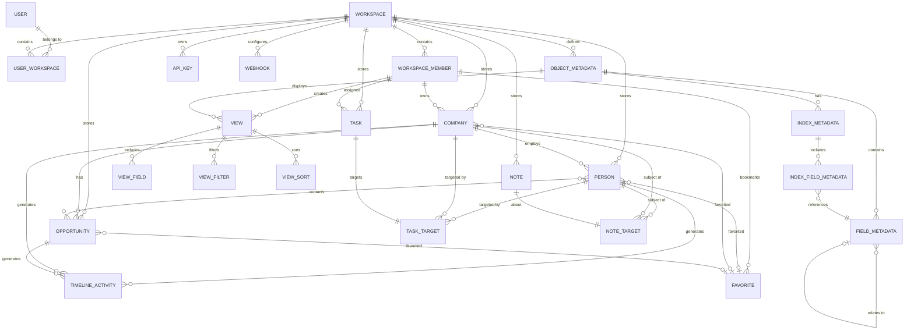
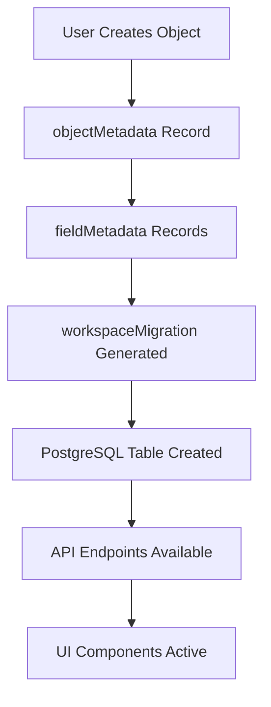

# Twenty CRM Database Documentation

> **📚 For the most comprehensive documentation**: See [`DATABASE_DOCUMENTATION_ENHANCED.md`](./DATABASE_DOCUMENTATION_ENHANCED.md) for a complete developer guide with detailed explanations, visual diagrams, and advanced patterns.

## Overview

Twenty is an open-source Customer Relationship Management (CRM) platform built with a modern, extensible architecture. The database is designed to support a multi-tenant workspace system where each workspace operates independently with its own schema and data isolation.

### Purpose

The Twenty database serves as the foundation for a comprehensive CRM system that enables businesses to:
- **Manage Customer Relationships**: Store and organize contacts, companies, and their interactions
- **Track Sales Opportunities**: Follow sales pipelines and deal progression
- **Collaborate Effectively**: Support team workspaces with role-based permissions
- **Integrate Communications**: Handle email, calendar events, and messaging workflows
- **Automate Processes**: Support workflow automation and business process management
- **Maintain Data Integrity**: Ensure data consistency across complex relationships

### Technology Stack

- **Database Engine**: PostgreSQL 16+
- **ORM**: TypeORM with custom Twenty-ORM layer
- **Architecture**: Multi-schema design with workspace isolation
- **Schema Management**: Dynamic schema creation and migration system
- **Data Types**: Extensive use of JSONB for flexible metadata storage

## Database Schema

Twenty implements a revolutionary **dual-schema architecture** that enables true multi-tenancy while maintaining system-level control. This design separates platform management from business data through two distinct PostgreSQL schemas:

1. **Core Schema (`core`)**: The platform's control plane that manages metadata, users, and workspace definitions
2. **Workspace Schemas (`workspace_<id>`)**: Dynamically created schemas containing isolated business data for each workspace

### Architecture Overview

```
PostgreSQL Database
├── core (schema) - Platform Management Layer
│   ├── user                    # Platform users
│   ├── workspace              # Workspace instances  
│   ├── userWorkspace          # User-workspace relationships
│   ├── objectMetadata         # Dynamic table definitions
│   ├── fieldMetadata          # Dynamic field definitions
│   ├── dataSource             # Schema references
│   ├── apiKey                 # API credentials
│   └── webhook                # Event configurations
│
└── workspace_<uuid_base36> (schemas) - Business Data Layer
    ├── person                 # Contacts and leads
    ├── company               # Organizations
    ├── opportunity           # Sales deals
    ├── workspaceMember       # Workspace users
    ├── task                  # Action items
    ├── note                  # Documentation
    └── [custom objects]      # User-defined entities
```

### Core Schema (`core`) - The Metadata Engine
The core schema serves as the **metadata engine** that orchestrates the entire Twenty platform. It defines "what can exist" rather than "what does exist" in terms of business data.

#### Core Tables

**1. `user`**
- **Purpose**: Platform users who can access multiple workspaces
- **Key Columns**:
  - `id` (UUID, PK): Unique user identifier
  - `firstName` (VARCHAR): User's first name
  - `lastName` (VARCHAR): User's last name
  - `email` (VARCHAR, UNIQUE): User's email address
  - `passwordHash` (VARCHAR): Encrypted password
  - `canImpersonate` (BOOLEAN): Admin privilege flag
  - `canAccessFullAdminPanel` (BOOLEAN): Super admin flag
  - `isEmailVerified` (BOOLEAN): Email verification status
  - `disabled` (BOOLEAN): Account status
  - `locale` (VARCHAR): User's preferred language
  - `defaultAvatarUrl` (VARCHAR): Profile picture URL
  - `createdAt`, `updatedAt`, `deletedAt` (TIMESTAMPTZ): Audit timestamps

**2. `workspace`**
- **Purpose**: Individual CRM instances/organizations
- **Key Columns**:
  - `id` (UUID, PK): Unique workspace identifier
  - `displayName` (VARCHAR): Human-readable workspace name
  - `logo` (VARCHAR): Workspace logo URL
  - `inviteHash` (VARCHAR): Public invitation link hash
  - `allowImpersonation` (BOOLEAN): Allow admin impersonation
  - `isPublicInviteLinkEnabled` (BOOLEAN): Public invite feature
  - `activationStatus` (ENUM): Workspace lifecycle status
  - `defaultRoleId` (UUID, FK): Default role for new members
  - `createdAt`, `updatedAt`, `deletedAt` (TIMESTAMPTZ): Audit timestamps

**3. `userWorkspace`**
- **Purpose**: Many-to-many relationship between users and workspaces
- **Key Columns**:
  - `id` (UUID, PK): Unique relationship identifier
  - `userId` (UUID, FK): Reference to user
  - `workspaceId` (UUID, FK): Reference to workspace
  - `createdAt`, `updatedAt`, `deletedAt` (TIMESTAMPTZ): Audit timestamps

**4. `objectMetadata`** - **The Schema Definition Engine**
- **Purpose**: Defines the blueprint for all tables that can exist in workspace schemas
- **Critical Role**: Acts as a "table factory" - each record here can generate a real PostgreSQL table
- **Key Columns**:
  - `id` (UUID, PK): Unique object identifier
  - `standardId` (UUID): Links to predefined standard objects (Person, Company, etc.)
  - `dataSourceId` (UUID, FK): References the workspace's data source
  - `nameSingular` (VARCHAR): API name (e.g., "person", "customObject")
  - `namePlural` (VARCHAR): Plural form (e.g., "people", "customObjects")
  - `labelSingular`, `labelPlural` (VARCHAR): Human-readable labels
  - `description` (TEXT): Object description
  - `targetTableName` (VARCHAR): Actual PostgreSQL table name in workspace schema
  - `isCustom` (BOOLEAN): User-created vs system-predefined object
  - `isRemote` (BOOLEAN): External data source (foreign tables)
  - `isActive` (BOOLEAN): Controls object availability
  - `isSystem` (BOOLEAN): System-managed objects (non-deletable)
  - `isLabelSyncedWithName` (BOOLEAN): Auto-sync labels with names
  - `workspaceId` (UUID, FK): Owner workspace

**5. `fieldMetadata`** - **The Column Definition Engine**
- **Purpose**: Defines every possible column/field within objects, enabling dynamic schema evolution
- **Critical Role**: Each record represents a column that will be created in workspace tables
- **Key Columns**:
  - `id` (UUID, PK): Unique field identifier
  - `standardId` (UUID): Links to predefined standard fields
  - `objectMetadataId` (UUID, FK): Parent object (table) this field belongs to
  - `name` (VARCHAR): Column name in the database
  - `label` (VARCHAR): Human-readable field label
  - `description` (TEXT): Field purpose and usage
  - `type` (ENUM): Data type - TEXT, NUMBER, DATE, BOOLEAN, RELATION, SELECT, MULTI_SELECT, etc.
  - `isNullable` (BOOLEAN): NULL values allowed
  - `isUnique` (BOOLEAN): Uniqueness constraint
  - `isSystem` (BOOLEAN): System-managed field (cannot be deleted)
  - `isCustom` (BOOLEAN): User-created vs predefined field
  - `defaultValue` (JSONB): Default value specification with type information
  - `options` (JSONB): Field-specific options (e.g., SELECT choices)
  - `settings` (JSONB): Type-specific settings (e.g., relation configuration)
  - `relationTargetObjectMetadataId` (UUID, FK): Target object for RELATION fields
  - `relationTargetFieldMetadataId` (UUID, FK): Target field for RELATION fields
  - `workspaceId` (UUID, FK): Owner workspace

**6. `dataSource`**
- **Purpose**: Links workspaces to their PostgreSQL schemas and manages schema references
- **Key Columns**:
  - `id` (UUID, PK): Unique data source identifier  
  - `workspaceId` (UUID, FK): Associated workspace
  - `schema` (VARCHAR): PostgreSQL schema name (e.g., "workspace_abc123")
  - `type` (ENUM): Data source type (usually 'POSTGRES')
  - `createdAt`, `updatedAt` (TIMESTAMPTZ): Audit timestamps

**7. `workspaceMigration`**
- **Purpose**: Tracks schema changes and migrations between metadata definitions and actual database structure
- **Key Columns**:
  - `id` (UUID, PK): Unique migration identifier
  - `workspaceId` (UUID, FK): Target workspace
  - `name` (VARCHAR): Human-readable migration name
  - `isCustom` (BOOLEAN): Custom vs system migration
  - `migrations` (JSONB): Array of table/column operations to execute
  - `appliedAt` (TIMESTAMPTZ): When migration was executed
  - `createdAt` (TIMESTAMPTZ): When migration was created

**8. `apiKey`**
- **Purpose**: API access credentials for integrations and external access
- **Key Columns**:
  - `id` (UUID, PK): Unique key identifier
  - `name` (VARCHAR): Human-readable key name
  - `secret` (VARCHAR): Encrypted secret key
  - `revokedAt` (TIMESTAMPTZ): Revocation timestamp
  - `expiresAt` (TIMESTAMPTZ): Expiration timestamp
  - `workspaceId` (UUID, FK): Owner workspace

**9. `webhook`**
- **Purpose**: Outbound webhook configurations for event notifications
- **Key Columns**:
  - `id` (UUID, PK): Unique webhook identifier
  - `targetUrl` (VARCHAR): Destination URL
  - `operations` (VARCHAR[]): Trigger operations (CREATE, UPDATE, DELETE)
  - `description` (TEXT): Webhook description
  - `workspaceId` (UUID, FK): Owner workspace

#### How Core Schema Orchestrates Workspace Creation

When a new workspace is created, the core schema orchestrates a complex dance:

1. **Workspace Registration**: New `workspace` record created with unique ID
2. **Schema Creation**: PostgreSQL schema `workspace_<uuid_base36>` created
3. **Data Source Linking**: `dataSource` record links workspace to its schema
4. **Standard Objects Bootstrap**: `objectMetadata` records created for Person, Company, etc.
5. **Field Definitions**: `fieldMetadata` records define all standard fields
6. **Migration Generation**: `workspaceMigration` records track upcoming table creations
7. **Schema Execution**: Actual PostgreSQL tables created in workspace schema

### Workspace Schemas (`workspace_<uuid_base36>`) - The Business Data Layer

Each workspace gets its own **completely isolated PostgreSQL schema** with a unique name derived from the workspace UUID (converted to base36 for shorter names). This provides true multi-tenant data isolation while sharing the same PostgreSQL instance.

#### Schema Naming Convention
```typescript
// Example: workspace ID "123e4567-e89b-12d3-a456-426614174000" 
// becomes schema "workspace_2n9a7w4k1x8p9q2"
const getWorkspaceSchemaName = (workspaceId: string): string => {
  return `workspace_${uuidToBase36(workspaceId)}`;
};
```

#### Dynamic Schema Generation

The workspace schemas are **not static** - they are dynamically generated based on the metadata definitions in the core schema. The process works as follows:

1. **Metadata-Driven**: All table and column definitions come from `objectMetadata` and `fieldMetadata`
2. **Migration System**: Changes to metadata trigger migrations that alter the workspace schema
3. **Customizable**: Users can add custom objects and fields through the UI, which create new metadata and trigger schema changes
4. **Standardized**: All workspace schemas follow the same patterns and constraints

#### Standard Objects (Generated in Each Workspace Schema)

These objects are created in every workspace based on predefined metadata in the core schema:

**1. `person`**
- **Purpose**: Individual contacts and leads
- **Key Columns**:
  - `id` (UUID, PK): Unique person identifier
  - `name` (JSONB): Composite full name (firstName, lastName)
  - `emails` (JSONB): Contact email addresses
  - `phones` (JSONB): Phone numbers
  - `linkedinLink` (JSONB): LinkedIn profile URL
  - `xLink` (JSONB): X/Twitter profile URL
  - `jobTitle` (VARCHAR): Professional title
  - `city` (VARCHAR): Location
  - `avatarUrl` (VARCHAR): Profile picture
  - `companyId` (UUID, FK): Associated company
  - `position` (FLOAT): Ordering/ranking
  - `createdBy` (JSONB): Creator information
  - `createdAt`, `updatedAt`, `deletedAt` (TIMESTAMPTZ): Audit timestamps

**2. `company`**
- **Purpose**: Organizations and business entities
- **Key Columns**:
  - `id` (UUID, PK): Unique company identifier
  - `name` (VARCHAR): Company name
  - `domainName` (JSONB): Website URL
  - `employees` (INTEGER): Employee count
  - `address` (JSONB): Physical address
  - `linkedinLink` (JSONB): LinkedIn company page
  - `xLink` (JSONB): X/Twitter account
  - `annualRecurringRevenue` (JSONB): Revenue information
  - `idealCustomerProfile` (BOOLEAN): ICP flag
  - `accountOwnerId` (UUID, FK): Assigned account owner
  - `position` (FLOAT): Ordering/ranking
  - `createdBy` (JSONB): Creator information
  - `createdAt`, `updatedAt`, `deletedAt` (TIMESTAMPTZ): Audit timestamps

**3. `opportunity`**
- **Purpose**: Sales deals and prospects
- **Key Columns**:
  - `id` (UUID, PK): Unique opportunity identifier
  - `name` (VARCHAR): Deal name
  - `amount` (JSONB): Deal value with currency
  - `closeDate` (DATE): Expected close date
  - `stage` (VARCHAR): Sales stage
  - `probability` (VARCHAR): Success probability
  - `companyId` (UUID, FK): Associated company
  - `pointOfContactId` (UUID, FK): Primary contact
  - `position` (FLOAT): Pipeline position
  - `createdBy` (JSONB): Creator information
  - `createdAt`, `updatedAt`, `deletedAt` (TIMESTAMPTZ): Audit timestamps

**4. `workspaceMember`**
- **Purpose**: Users within a specific workspace
- **Key Columns**:
  - `id` (UUID, PK): Unique member identifier
  - `name` (JSONB): Member's full name
  - `colorScheme` (VARCHAR): UI color preference
  - `avatarUrl` (VARCHAR): Profile picture
  - `locale` (VARCHAR): Language preference
  - `timeZone` (VARCHAR): Timezone setting
  - `userEmail` (VARCHAR): Associated user email
  - `userId` (UUID, FK): Reference to core user
  - `createdAt`, `updatedAt`, `deletedAt` (TIMESTAMPTZ): Audit timestamps

**5. `task`**
- **Purpose**: To-do items and action items
- **Key Columns**:
  - `id` (UUID, PK): Unique task identifier
  - `title` (VARCHAR): Task description
  - `body` (TEXT): Detailed content
  - `dueAt` (TIMESTAMPTZ): Due date
  - `status` (VARCHAR): Task status (TODO, DONE)
  - `assigneeId` (UUID, FK): Assigned member
  - `position` (FLOAT): List ordering
  - `createdBy` (JSONB): Creator information
  - `createdAt`, `updatedAt`, `deletedAt` (TIMESTAMPTZ): Audit timestamps

**6. `note`**
- **Purpose**: Rich text notes and documentation that can be linked to any business entity
- **Key Columns**:
  - `id` (UUID, PK): Unique note identifier
  - `title` (VARCHAR): Note title
  - `body` (TEXT): Rich text note content
  - `position` (FLOAT): Ordering for manual sorting
  - `createdBy` (JSONB): Creator information with workspace member details
  - `createdAt`, `updatedAt`, `deletedAt` (TIMESTAMPTZ): Audit timestamps

#### Common Workspace Schema Patterns

All workspace schemas follow standardized patterns enforced by the core metadata system:

**1. Universal Base Columns**
Every table in workspace schemas includes these system-managed columns:
```sql
-- Standard columns present in ALL workspace tables
id                UUID PRIMARY KEY DEFAULT gen_random_uuid()
position          FLOAT            -- Manual ordering
"createdBy"       JSONB           -- Actor metadata (who created)
"createdAt"       TIMESTAMPTZ     DEFAULT NOW()
"updatedAt"       TIMESTAMPTZ     DEFAULT NOW()
"deletedAt"       TIMESTAMPTZ     -- Soft delete pattern
```

**2. Composite Type Pattern**
Complex fields use JSONB columns with standardized structures:
```sql
-- Example: name field (FullName composite type)
"name" JSONB DEFAULT '{"firstName": "", "lastName": ""}'

-- Example: emails field (Emails composite type)  
"emails" JSONB DEFAULT '{"primaryEmail": "", "additionalEmails": []}'

-- Example: address field (Address composite type)
"address" JSONB DEFAULT '{
  "addressStreet1": "", "addressStreet2": "",
  "addressCity": "", "addressState": "", 
  "addressPostcode": "", "addressCountry": ""
}'
```

**3. Relationship Pattern**
Foreign key relationships follow consistent naming:
```sql
-- Pattern: <objectName>Id for single relationships
"companyId"       UUID REFERENCES "company"("id") ON DELETE SET NULL
"assigneeId"      UUID REFERENCES "workspaceMember"("id") ON DELETE SET NULL

-- Polymorphic relationships use separate target tables
-- Example: task_target, note_target for flexible linking
```

#### Schema Evolution and Custom Objects

The workspace schemas are designed to evolve dynamically:

**Custom Object Creation Flow:**
1. User creates custom object through UI
2. New `objectMetadata` record created in core schema
3. `fieldMetadata` records created for custom fields  
4. `workspaceMigration` generated with CREATE TABLE operations
5. Migration executed in workspace schema
6. New table becomes available immediately

**Field Addition Flow:**
1. User adds field to existing object
2. New `fieldMetadata` record created
3. `workspaceMigration` generated with ALTER TABLE ADD COLUMN
4. Migration executed in workspace schema
5. Field becomes available across API and UI

## Entity Relationship Diagram



## Detailed Relationships

### Core Platform Relationships

**1. User-Workspace Multi-Tenancy Model**
- Users exist globally in the `core.user` table
- Workspaces are isolated CRM instances in `core.workspace` table  
- `core.userWorkspace` creates many-to-many relationships with role-based access
- Each workspace gets its own PostgreSQL schema for complete data isolation
- Users can access multiple workspaces but see only their authorized data

**2. Metadata-Driven Dynamic Schema Architecture**
The core schema acts as a "schema compiler" that generates workspace schemas:



**Flow Details:**
- `objectMetadata` defines **what tables can exist** (like a table blueprint)
- `fieldMetadata` defines **what columns each table has** (like column blueprints)
- `workspaceMigration` defines **how to transform metadata into SQL** (like build instructions)
- Workspace schemas contain **actual business data** (like the built houses)

**3. Metadata Synchronization System**
Twenty maintains perfect sync between metadata (core schema) and actual database structure (workspace schemas):

- **Metadata Changes**: When users modify objects/fields via UI, metadata records are updated
- **Migration Generation**: Background services detect metadata changes and generate SQL migrations
- **Schema Application**: Migrations are executed against workspace schemas to match metadata
- **Consistency Enforcement**: System ensures workspace schemas never drift from metadata definitions

**4. Cross-Schema Reference Management**
While data is isolated per workspace, metadata relationships span the entire system:

```sql
-- Core schema defines the relationships
SELECT 
    obj.nameSingular as object_name,
    field.name as field_name,
    target_obj.nameSingular as related_object
FROM core."fieldMetadata" field
JOIN core."objectMetadata" obj ON obj.id = field."objectMetadataId"  
LEFT JOIN core."objectMetadata" target_obj ON target_obj.id = field."relationTargetObjectMetadataId"
WHERE field.type = 'RELATION'
    AND obj."workspaceId" = 'workspace-uuid';

-- This generates actual foreign keys in workspace schema:
-- ALTER TABLE "workspace_abc123"."person" 
-- ADD CONSTRAINT "FK_person_company" 
-- FOREIGN KEY ("companyId") REFERENCES "workspace_abc123"."company"("id");
```

### Business Entity Relationships

**1. Company-Person Hierarchy (Many-to-One)**
- Companies can have many people (employees, contacts, prospects)
- People belong to one primary company via `companyId` foreign key
- Supports professional relationship tracking and account-based sales

**2. Sales Pipeline Management (Complex Network)**
- Opportunities link to companies (account-based deals)
- Opportunities have point-of-contact persons (relationship selling)
- Account owners (workspace members) manage company relationships
- Deals flow: Company → Opportunity → Person (contact) → WorkspaceMember (owner)

**3. Activity and Task Management (Polymorphic Pattern)**
- Tasks can target any entity through `taskTarget` junction table
- Timeline activities track interactions across all business entities
- Notes can be associated with any entity through `noteTarget` junction table
- This enables activity streams on any business record

**4. Workspace Team Structure**
- `workspaceMember` represents users within specific workspaces
- Different from `core.user` - these are workspace-specific user profiles
- Members can own companies, be assigned tasks, create records
- Supports role-based permissions and team collaboration

### Core Schema Control Mechanisms

**1. Schema Generation Control**
The core schema controls every aspect of workspace schema creation:

```typescript
// Example: How core metadata generates a workspace table
interface ObjectMetadata {
  nameSingular: 'person';           // → table name "person"
  workspaceId: 'uuid';              // → schema "workspace_abc123"  
  fields: FieldMetadata[];          // → columns in the table
}

// Results in SQL:
// CREATE TABLE "workspace_abc123"."person" (
//   id UUID PRIMARY KEY DEFAULT gen_random_uuid(),
//   "name" JSONB,
//   "emails" JSONB,
//   "companyId" UUID REFERENCES "company"("id"),
//   "createdAt" TIMESTAMPTZ DEFAULT NOW(),
//   ...
// );
```

**2. Migration Orchestration**
The migration system ensures workspace schemas stay synchronized with metadata:

```sql
-- Core tracks pending changes
SELECT name, migrations FROM core."workspaceMigration" 
WHERE "workspaceId" = ? AND "appliedAt" IS NULL;

-- Example migration structure (stored as JSONB):
{
  "name": "person",
  "action": "ALTER", 
  "columns": [{
    "action": "CREATE",
    "columnName": "jobTitle",
    "columnType": "text"
  }]
}
```

**3. Data Integrity Enforcement**
Core schema enforces business rules across all workspaces:

- **Object Naming**: Prevents duplicate object names within workspaces
- **Field Constraints**: Ensures valid field types and relationships
- **Migration Safety**: Validates migrations before execution
- **Schema Consistency**: Maintains sync between metadata and actual schemas

### Content Organization

**1. Views and Filtering (Per-Workspace Customization)**
- Views provide customized perspectives on workspace entity lists
- Each view belongs to a specific workspace and object type
- Support filtering, sorting, field selection, and layout preferences  
- Enable personalized workflows for different user roles within workspaces
- Views are defined in the core schema but operate on workspace data

**2. Favorites and Bookmarking (User-Specific)**
- Users can bookmark frequently accessed entities within their workspaces
- Favorites are workspace-scoped and user-specific
- Supports quick navigation and personal organization
- Cross-references between core user identity and workspace business entities

### The Complete Data Flow

Understanding how the two schemas work together in practice:

**1. User Login Flow**
```sql
-- Step 1: Authenticate user (core schema)
SELECT * FROM core."user" WHERE email = 'user@company.com';

-- Step 2: Get user's workspaces (core schema)  
SELECT w.* FROM core."workspace" w
JOIN core."userWorkspace" uw ON uw."workspaceId" = w.id
WHERE uw."userId" = ?;

-- Step 3: Switch to workspace schema for business data
SET search_path = 'workspace_abc123';
SELECT * FROM "person" WHERE "deletedAt" IS NULL;
```

**2. Custom Object Creation Flow**
```sql
-- Step 1: Create object definition (core schema)
INSERT INTO core."objectMetadata" (
  "workspaceId", "nameSingular", "namePlural", 
  "labelSingular", "isCustom"
) VALUES (?, 'product', 'products', 'Product', true);

-- Step 2: Define custom fields (core schema)
INSERT INTO core."fieldMetadata" (
  "objectMetadataId", "name", "type", "label", "isCustom"  
) VALUES (?, 'price', 'NUMBER', 'Price', true);

-- Step 3: Generate migration (core schema)
INSERT INTO core."workspaceMigration" (
  "workspaceId", "name", "migrations"
) VALUES (?, 'create-product', '[{"action": "CREATE", "name": "product"}]');

-- Step 4: Execute in workspace schema  
CREATE TABLE "workspace_abc123"."product" (
  id UUID PRIMARY KEY DEFAULT gen_random_uuid(),
  "price" numeric,
  "position" float,
  "createdAt" timestamptz DEFAULT NOW(),
  "updatedAt" timestamptz DEFAULT NOW(),
  "deletedAt" timestamptz
);
```

**3. Cross-Workspace Query Prevention**
The architecture prevents data leakage between workspaces:

```sql
-- This query is impossible - schemas are isolated
SELECT p1.name, p2.name 
FROM "workspace_abc123"."person" p1,
     "workspace_def456"."person" p2;  -- Error: schema not accessible

-- Metadata queries work across workspaces (for admins)
SELECT 
  w."displayName" as workspace,
  COUNT(om.id) as object_count
FROM core."workspace" w
LEFT JOIN core."objectMetadata" om ON om."workspaceId" = w.id
GROUP BY w.id, w."displayName";
```

## Indexes & Performance

Twenty implements a comprehensive indexing strategy for optimal performance:

### Index Types Used

**1. B-Tree Indexes (Default)**
- Standard for equality and range queries
- Used on most foreign keys and frequently queried columns
- Automatically created for primary keys and unique constraints

**2. GIN Indexes**
- Used for JSONB columns (composite types like emails, phones, address)
- Enables efficient querying within JSON structures
- Critical for metadata and settings columns

**3. Partial Indexes**
- Include `WHERE "deletedAt" IS NULL` conditions
- Optimize queries on active records only
- Reduce index size and improve performance

### Key Performance Indexes

**1. Core Schema Indexes**
```sql
-- User lookup optimization
CREATE UNIQUE INDEX "UQ_USER_EMAIL" ON "core"."user" ("email") 
WHERE "deletedAt" IS NULL;

-- Workspace member queries
CREATE INDEX "IDX_USER_WORKSPACE_USER_ID" ON "core"."userWorkspace" ("userId");
CREATE INDEX "IDX_USER_WORKSPACE_WORKSPACE_ID" ON "core"."userWorkspace" ("workspaceId");

-- Metadata system optimization
CREATE INDEX "IDX_OBJECT_METADATA_WORKSPACE_ID" ON "core"."objectMetadata" ("workspaceId");
CREATE INDEX "IDX_FIELD_METADATA_OBJECT_ID" ON "core"."fieldMetadata" ("objectMetadataId");
CREATE INDEX "IDX_FIELD_METADATA_RELATION_TARGET" ON "core"."fieldMetadata" ("relationTargetObjectMetadataId");
```

**2. Workspace Schema Indexes**
```sql
-- Business entity optimization (per workspace)
CREATE INDEX "IDX_COMPANY_DOMAIN" ON "{workspace_schema}"."company" 
USING GIN ("domainName") WHERE "deletedAt" IS NULL;

CREATE INDEX "IDX_PERSON_EMAIL" ON "{workspace_schema}"."person" 
USING GIN ("emails") WHERE "deletedAt" IS NULL;

CREATE INDEX "IDX_PERSON_COMPANY" ON "{workspace_schema}"."person" ("companyId") 
WHERE "deletedAt" IS NULL;

-- Search optimization using PostgreSQL full-text search
CREATE INDEX "IDX_COMPANY_SEARCH" ON "{workspace_schema}"."company" 
USING GIN (to_tsvector('english', 
  name || ' ' || COALESCE(("domainName"->>'primaryLinkUrl'), '')
)) WHERE "deletedAt" IS NULL;

CREATE INDEX "IDX_PERSON_SEARCH" ON "{workspace_schema}"."person" 
USING GIN (to_tsvector('english', 
  COALESCE(("name"->>'firstName'), '') || ' ' || 
  COALESCE(("name"->>'lastName'), '') || ' ' ||
  COALESCE("jobTitle", '')
)) WHERE "deletedAt" IS NULL;

-- Relationship optimization
CREATE INDEX "IDX_OPPORTUNITY_COMPANY" ON "{workspace_schema}"."opportunity" ("companyId")
WHERE "deletedAt" IS NULL;

CREATE INDEX "IDX_TASK_ASSIGNEE" ON "{workspace_schema}"."task" ("assigneeId")
WHERE "deletedAt" IS NULL;
```

**3. Cross-Schema Index Strategy**
The dual-schema architecture enables sophisticated indexing strategies:

- **Core Schema**: Optimized for metadata queries, user lookups, and admin operations
- **Workspace Schemas**: Optimized for business queries, reporting, and user operations  
- **Schema-Specific**: Each workspace can have different index strategies based on usage
- **Dynamic Indexing**: Indexes can be created/dropped based on workspace activity patterns

### Performance Considerations

**1. Query Optimization**
- All list queries include `deletedAt IS NULL` filters
- Position-based ordering for consistent pagination
- Composite indexes for common filter combinations

**2. JSONB Query Performance**
- GIN indexes enable fast JSON key/value lookups
- Proper use of `->>` vs `->` operators for type-specific queries
- Structured composite types for better query predictability

**3. Workspace Scaling**
- Each workspace schema remains relatively small
- Horizontal scaling through workspace distribution
- Independent backup and maintenance per workspace

## Constraints & Data Integrity

### Foreign Key Constraints

**1. Cascade Deletion Rules**
```sql
-- Workspace deletion cascades to all contained entities
ALTER TABLE "core"."objectMetadata" 
ADD CONSTRAINT "FK_OBJECT_WORKSPACE" 
FOREIGN KEY ("workspaceId") REFERENCES "core"."workspace"("id") 
ON DELETE CASCADE;

-- Soft delete preservation for business entities
ALTER TABLE "{workspace_schema}"."person" 
ADD CONSTRAINT "FK_PERSON_COMPANY" 
FOREIGN KEY ("companyId") REFERENCES "{workspace_schema}"."company"("id") 
ON DELETE SET NULL;
```

**2. Referential Integrity**
- Strict foreign key enforcement in core schema
- Business entity relationships use UUID references
- Polymorphic relationships handled through conventions

### Check Constraints

**1. Data Validation**
```sql
-- Ensure metadata consistency
ALTER TABLE "core"."fieldMetadata" 
ADD CONSTRAINT "CHK_FIELD_METADATA_MORPH_RELATION_REQUIRES_MORPH_ID"
CHECK (("type" != 'MORPH_RELATION') OR ("type" = 'MORPH_RELATION' AND "morphId" IS NOT NULL));

-- Workspace activation status validation
ALTER TABLE "core"."workspace"
ADD CONSTRAINT "onboarded_workspace_requires_default_role"
CHECK ("activationStatus" IN ('PENDING_CREATION', 'ONGOING_CREATION') OR "defaultRoleId" IS NOT NULL);
```

**2. Unique Constraints**
```sql
-- Prevent duplicate objects per workspace
ALTER TABLE "core"."objectMetadata" 
ADD CONSTRAINT "IDX_OBJECT_METADATA_NAME_SINGULAR_WORKSPACE_ID_UNIQUE" 
UNIQUE ("nameSingular", "workspaceId");

-- Ensure unique field names per object
ALTER TABLE "core"."fieldMetadata" 
ADD CONSTRAINT "IDX_FIELD_METADATA_NAME_OBJECT_METADATA_ID_WORKSPACE_ID_UNIQUE" 
UNIQUE ("name", "objectMetadataId", "workspaceId");
```

### Data Integrity Preservation

**1. Soft Delete Pattern**
- All business entities use `deletedAt` for soft deletion
- Maintains referential integrity while preserving audit trails
- Enables data recovery and compliance requirements

**2. Audit Tracking**
- `createdBy` JSONB field captures creation context
- `createdAt`, `updatedAt` timestamps for change tracking
- Position fields for maintaining user-defined ordering

**3. Workspace Isolation**
- Cross-workspace references are prevented by design
- All workspace-specific data includes `workspaceId` validation
- Schema-level separation ensures data security

## Sample Queries

### 1. Find All Companies with Their Contact Count
```sql
-- Get companies with number of associated contacts
SELECT 
    c.id,
    c.name as company_name,
    c."domainName"->>'primaryLinkUrl' as website,
    c.employees,
    COUNT(p.id) as contact_count,
    c."createdAt"
FROM "workspace_abc123"."company" c
LEFT JOIN "workspace_abc123"."person" p ON p."companyId" = c.id 
    AND p."deletedAt" IS NULL
WHERE c."deletedAt" IS NULL
GROUP BY c.id, c.name, c."domainName", c.employees, c."createdAt"
ORDER BY contact_count DESC, c.name;
```

**Purpose**: Identify companies with the most contacts for relationship mapping and prioritization.

### 2. Search Contacts by Email Domain
```sql
-- Find all contacts from specific email domains
SELECT 
    p.id,
    p."name"->>'firstName' as first_name,
    p."name"->>'lastName' as last_name,
    p."emails"->>'primaryEmail' as email,
    p."jobTitle",
    c.name as company_name
FROM "workspace_abc123"."person" p
LEFT JOIN "workspace_abc123"."company" c ON c.id = p."companyId"
WHERE p."deletedAt" IS NULL
    AND p."emails"->>'primaryEmail' ILIKE '%@acme.com'
ORDER BY p."name"->>'lastName', p."name"->>'firstName';
```

**Purpose**: Useful for account-based marketing and identifying contacts within target organizations.

### 3. Active Opportunities by Stage with Revenue Forecast
```sql
-- Pipeline analysis with revenue forecasting
SELECT 
    o.stage,
    COUNT(*) as opportunity_count,
    SUM((o.amount->>'amountMicros')::BIGINT / 1000000.0) as total_amount,
    AVG((o.amount->>'amountMicros')::BIGINT / 1000000.0) as avg_deal_size,
    SUM(
        CASE 
            WHEN o.probability = 'VERY_HIGH' THEN (o.amount->>'amountMicros')::BIGINT / 1000000.0 * 0.9
            WHEN o.probability = 'HIGH' THEN (o.amount->>'amountMicros')::BIGINT / 1000000.0 * 0.7
            WHEN o.probability = 'MEDIUM' THEN (o.amount->>'amountMicros')::BIGINT / 1000000.0 * 0.5
            WHEN o.probability = 'LOW' THEN (o.amount->>'amountMicros')::BIGINT / 1000000.0 * 0.3
            ELSE 0
        END
    ) as weighted_forecast
FROM "workspace_abc123"."opportunity" o
WHERE o."deletedAt" IS NULL 
    AND o.stage != 'WON' 
    AND o.stage != 'LOST'
GROUP BY o.stage
ORDER BY total_amount DESC;
```

**Purpose**: Sales forecasting and pipeline health analysis for management reporting.

### 4. Recent Activity Timeline Across All Entities
```sql
-- Recent activity feed showing all interactions
SELECT 
    ta.id,
    ta.name as activity_name,
    ta."createdAt",
    ta."createdBy"->>'name' as created_by,
    CASE 
        WHEN ta."personId" IS NOT NULL THEN 'Person'
        WHEN ta."companyId" IS NOT NULL THEN 'Company'
        WHEN ta."opportunityId" IS NOT NULL THEN 'Opportunity'
        ELSE 'Unknown'
    END as entity_type,
    COALESCE(
        p."name"->>'firstName' || ' ' || p."name"->>'lastName',
        c.name,
        op.name
    ) as entity_name
FROM "workspace_abc123"."timelineActivity" ta
LEFT JOIN "workspace_abc123"."person" p ON p.id = ta."personId" AND p."deletedAt" IS NULL
LEFT JOIN "workspace_abc123"."company" c ON c.id = ta."companyId" AND c."deletedAt" IS NULL  
LEFT JOIN "workspace_abc123"."opportunity" op ON op.id = ta."opportunityId" AND op."deletedAt" IS NULL
WHERE ta."deletedAt" IS NULL
ORDER BY ta."createdAt" DESC
LIMIT 50;
```

**Purpose**: Provides a unified activity stream for understanding recent interactions across the CRM.

### 5. Workspace Member Task Load Analysis
```sql
-- Analyze task distribution among team members
SELECT 
    wm.id as member_id,
    wm."name"->>'firstName' || ' ' || wm."name"->>'lastName' as member_name,
    COUNT(CASE WHEN t.status = 'TODO' THEN 1 END) as open_tasks,
    COUNT(CASE WHEN t.status = 'DONE' THEN 1 END) as completed_tasks,
    COUNT(CASE WHEN t."dueAt" < NOW() AND t.status = 'TODO' THEN 1 END) as overdue_tasks,
    COUNT(CASE WHEN t."dueAt" BETWEEN NOW() AND NOW() + INTERVAL '7 days' AND t.status = 'TODO' THEN 1 END) as due_this_week
FROM "workspace_abc123"."workspaceMember" wm
LEFT JOIN "workspace_abc123"."task" t ON t."assigneeId" = wm.id AND t."deletedAt" IS NULL
WHERE wm."deletedAt" IS NULL
GROUP BY wm.id, wm."name"
ORDER BY open_tasks DESC;
```

**Purpose**: Team productivity analysis and workload balancing for managers.

## Future Considerations

### Scalability Improvements

**1. Read Replicas**
- Implement read-only replicas for reporting workloads
- Separate analytical queries from transactional operations
- Consider workspace-specific replica strategies

**2. Partitioning Strategy**
```sql
-- Time-based partitioning for activity tables
CREATE TABLE "workspace_abc123"."timelineActivity" (
    -- existing columns
    "createdAt" TIMESTAMPTZ NOT NULL
) PARTITION BY RANGE ("createdAt");

-- Create monthly partitions
CREATE TABLE "workspace_abc123"."timelineActivity_2024_01" 
PARTITION OF "workspace_abc123"."timelineActivity"
FOR VALUES FROM ('2024-01-01') TO ('2024-02-01');
```

**3. Caching Strategies**
- Redis for frequently accessed metadata
- Application-level caching for object/field definitions
- Query result caching for expensive analytical queries

### Performance Optimizations

**1. Advanced Indexing**
```sql
-- Covering indexes for common query patterns
CREATE INDEX "IDX_PERSON_COMPANY_COVERING" ON "workspace_abc123"."person" 
("companyId", "deletedAt") 
INCLUDE ("name", "emails", "jobTitle");

-- Expression indexes for computed values
CREATE INDEX "IDX_OPPORTUNITY_WEIGHTED_VALUE" ON "workspace_abc123"."opportunity"
((amount->>'amountMicros')::BIGINT * 
 CASE probability 
   WHEN 'VERY_HIGH' THEN 90 
   WHEN 'HIGH' THEN 70 
   ELSE 50 
 END);
```

**2. Data Archiving**
- Archive old deleted records to separate tables
- Implement data retention policies by workspace
- Consider cold storage for compliance data

### Schema Evolution

**1. Version Management**
- Implement schema versioning for backward compatibility
- Migration strategies for breaking changes
- Feature flags for gradual rollouts

**2. Custom Object Expansion**
- Support for user-defined relationships
- Advanced field types (formulas, rollups)
- Cross-object validation rules

### Security Enhancements

**1. Column-Level Security**
```sql
-- Row-level security for workspace isolation
ALTER TABLE "core"."objectMetadata" ENABLE ROW LEVEL SECURITY;

CREATE POLICY "workspace_isolation" ON "core"."objectMetadata"
USING ("workspaceId" = current_setting('app.current_workspace_id')::UUID);
```

**2. Audit Logging**
- Comprehensive change tracking
- Compliance reporting capabilities
- Data access monitoring

### Integration Improvements

**1. Event Sourcing**
- Implement event sourcing for critical business events
- Enable real-time notifications and webhooks
- Support for event replay and debugging

**2. Data Synchronization**
- Two-way sync with external CRM systems
- Conflict resolution strategies
- Change detection and delta synchronization

---

*This documentation reflects the Twenty CRM database architecture as of the current version. For the most up-to-date schema information, please refer to the migration files and entity definitions in the codebase.*