# 🚀 Twenty CRM Database Architecture - Complete Developer Guide

> **Master the Twenty Database**: Your comprehensive guide to understanding Twenty's revolutionary dual-schema architecture, metadata-driven system, and advanced multi-tenancy patterns.

## Quick Architecture Overview

```mermaid
flowchart TB
    subgraph "🌐 PostgreSQL Database"
        subgraph "🎛️ Core Schema (Control Plane)"
            direction TB
            A[👤 Users] --> B[🏢 Workspaces]
            B --> C[🔗 User-Workspace Links]
            C --> D[📋 Object Definitions]
            D --> E[📝 Field Definitions]
            E --> F[🔄 Migration Queue]
            F --> G[🛡️ Security Roles]
        end
        
        subgraph "📊 Workspace Schemas (Data Plane)"
            direction TB
            H[👥 People/Contacts]
            I[🏢 Companies]
            J[💼 Opportunities]
            K[📋 Tasks]
            L[📝 Notes]
            M[🎯 Custom Objects]
            
            H --> I
            I --> J
            J --> K
        end
        
        subgraph "🔧 System Services"
            N[Schema Manager]
            O[Migration Engine]
            P[Permission Engine]
            Q[API Generator]
        end
    end
    
    F -.->|"Generates"| H
    F -.->|"Creates"| I
    F -.->|"Manages"| J
    D -.->|"Defines Structure"| H
    E -.->|"Defines Columns"| H
    
    N --> F
    O --> F
    P --> G
    Q --> D
    
    style A fill:#e3f2fd
    style B fill:#f3e5f5
    style D fill:#fff3e0
    style E fill:#fff3e0
    style F fill:#ffebee
```

## � Table of Contents

1. [�️ Architecture Overview](#️-architecture-overview)
2. [🧠 Core Schema Deep Dive](#-core-schema-deep-dive)
3. [� Workspace Schema Structure](#-workspace-schema-structure)
4. [⚡ Performance Architecture](#-performance-architecture)
5. [� Migration System](#-migration-system)
6. [📊 Advanced Query Patterns](#-advanced-query-patterns)
7. [🛡️ Security & Permissions](#️-security--permissions)
8. [�️ Development Workflows](#️-development-workflows)
9. [🚀 Scaling & Best Practices](#-scaling--best-practices)
10. [📚 Resources & Troubleshooting](#-resources--troubleshooting)

---

## Architecture Overview

### The Revolutionary Dual-Schema Design

Twenty implements a **metadata-driven, dual-schema architecture** that separates platform control from business data:


### 🔑 Core Architectural Principles

| Principle | Description | Benefit |
|-----------|-------------|---------|
| **Metadata-Driven** | Schema structure defined in data, not code | Dynamic schema evolution |
| **Schema Isolation** | Complete data separation per workspace | True multi-tenancy |
| **Declarative Design** | Describe what you want, system figures out how | Simplified development |
| **Migration-Based** | All changes tracked and versioned | Auditability & rollback |

---

## Core Schema Deep Dive

> **🎯 KEY CONCEPT**: The core schema is a **"Schema Compiler"** - it transforms high-level metadata into actual PostgreSQL tables, just like a programming compiler transforms source code into machine code.

### 📊 Metadata Compilation Flow

```mermaid
sequenceDiagram
    participant UI as 🎨 User Interface
    participant API as 🔌 GraphQL API
    participant Meta as 🧠 Metadata Engine
    participant Mig as 🔄 Migration System
    participant DB as 🗄️ Workspace Database
    
    UI->>API: Create Custom Object "Project"
    API->>Meta: Generate objectMetadata
    Meta->>Meta: Validate schema rules
    Meta->>Meta: Create fieldMetadata records
    Meta->>Mig: Queue CREATE TABLE migration
    Mig->>DB: Execute SQL in workspace schema
    DB->>Mig: Confirm table created
    Mig->>Meta: Mark migration as applied
    Meta->>API: Update GraphQL schema
    API->>UI: Enable new object in interface
    
    Note over UI,DB: Complete end-to-end object creation
```

### 🗂️ Core Schema Entity Relationship Map


---

## 🏢 **1. Multi-Tenancy & Workspace Management**

### `workspace` - The CRM Instance Registry

**🎯 Purpose**: Each record represents a complete, isolated CRM instance

**📋 Key Attributes**:
- **Identity**: `displayName`, `domainName`, `logo`
- **Access Control**: `inviteHash`, `allowImpersonation`, `isPublicInviteLinkEnabled`
- **Authentication**: `isGoogleAuthEnabled`, `isMicrosoftAuthEnabled`
- **Business**: `subscriptionStatus`, `activationStatus`
- **Configuration**: `defaultRoleId`
- **Audit**: `createdAt`, `updatedAt`, `deletedAt`

**🔗 Relationships**:
- One workspace → Many users (via `userWorkspace`)
- One workspace → Many objects (via `objectMetadata`)
- One workspace → Many migrations (via `workspaceMigration`)

---

### `dataSource` - Schema Connection Manager

**🎯 Purpose**: Maps workspaces to their isolated PostgreSQL schemas

**📋 Key Attributes**:
- **Connection**: `workspaceId` → Links to workspace
- **Schema Reference**: `schema` → Points to "workspace_abc123xyz" schema
- **Type**: `type` → Database engine type (usually 'postgres')
- **Audit**: `createdAt`, `updatedAt`

**🔗 Enables**:
- Cross-schema queries (with proper security)
- Schema management operations
- Multi-database support (future)

---

### `userWorkspace` - Access Matrix

```sql
CREATE TABLE core."userWorkspace" (
    id uuid PRIMARY KEY DEFAULT gen_random_uuid(),
    "userId" uuid NOT NULL REFERENCES "user"(id),
    "workspaceId" uuid NOT NULL REFERENCES workspace(id),
    
    /* User Preferences */
    "defaultAvatarUrl" varchar,
    locale varchar DEFAULT 'en',
    
    /* Audit Trail */
    "createdAt" timestamptz DEFAULT now() NOT NULL,
    "updatedAt" timestamptz DEFAULT now() NOT NULL,
    "deletedAt" timestamptz,
    
    UNIQUE("userId", "workspaceId")
);
```

**🎯 Purpose**: Enables users to access multiple workspaces while maintaining security boundaries.

---

## 🧠 **2. The Metadata Engine - "Schema Compiler"**

### `objectMetadata` - Table Definition Engine

**🎯 Purpose**: The "Class Definition" of Twenty - defines what objects can exist in workspace schemas


**📋 Key Attributes**:
- **Identity**: `nameSingular`, `namePlural`, `labelSingular`, `labelPlural`, `targetTableName`
- **Configuration**: `isCustom`, `isActive`, `isSystem`, `isRemote`, `isAuditLogged`
- **UI**: `description`, `icon`, `shortcut`
- **Advanced**: `duplicateCriteria`, `standardOverrides`
- **Links**: `standardId`, `applicationId`, `labelIdentifierFieldMetadataId`

**🔥 Critical Understanding**: This is like a **class definition in OOP** - it describes what objects can exist, not the actual data instances.

---

### `fieldMetadata` - Column Definition Engine

**🎯 Purpose**: Defines every possible column/field within objects, enabling dynamic schema evolution


**📋 Key Attributes**:
- **Identity**: `name`, `label`, `description`
- **Type System**: `type`, `defaultValue`, `options`, `settings`
- **Constraints**: `isNullable`, `isUnique`, `isSystem`, `isCustom`
- **Relations**: `relationTargetObjectMetadataId`, `relationTargetFieldMetadataId`
- **Advanced**: `morphId` (for polymorphic relations)

**🔥 Critical Understanding**: Each record defines a database column with complete type information, constraints, and UI behavior.

---

### `relationMetadata` - Relationship Engine

```sql
CREATE TABLE core."relationMetadata" (
    id uuid PRIMARY KEY DEFAULT gen_random_uuid(),
    "workspaceId" uuid NOT NULL REFERENCES workspace(id),
    
    /* Relationship Definition */
    "relationType" varchar NOT NULL,
    
    /* Source & Target Objects */
    "fromObjectMetadataId" uuid NOT NULL REFERENCES "objectMetadata"(id),
    "toObjectMetadataId" uuid NOT NULL REFERENCES "objectMetadata"(id),
    "fromFieldMetadataId" uuid NOT NULL REFERENCES "fieldMetadata"(id),
    "toFieldMetadataId" uuid NOT NULL REFERENCES "fieldMetadata"(id),
    
    /* Audit Trail */
    "createdAt" timestamptz DEFAULT now() NOT NULL,
    "updatedAt" timestamptz DEFAULT now() NOT NULL
);
```

**🎯 Purpose**: Defines foreign key relationships that will be created between workspace tables.

---

### `indexMetadata` - Performance Optimization Engine

```sql
CREATE TABLE core."indexMetadata" (
    id uuid PRIMARY KEY DEFAULT gen_random_uuid(),
    name varchar NOT NULL,
    "workspaceId" varchar NOT NULL,
    "objectMetadataId" uuid NOT NULL REFERENCES "objectMetadata"(id),
    
    /* Index Configuration */
    "indexType" index_type_enum DEFAULT 'BTREE',
    "isUnique" boolean DEFAULT false,
    "indexWhereClause" text,
    "isCustom" boolean DEFAULT false,
    
    /* System Integration */
    "universalIdentifier" uuid,
    
    /* Audit Trail */
    "createdAt" timestamptz DEFAULT now() NOT NULL,
    "updatedAt" timestamptz DEFAULT now() NOT NULL,
    
    UNIQUE(name, "workspaceId", "objectMetadataId")
);
```

---

### `indexFieldMetadata` - Multi-Column Index Support

```sql
CREATE TABLE core."indexFieldMetadata" (
    id uuid PRIMARY KEY DEFAULT gen_random_uuid(),
    "indexMetadataId" uuid NOT NULL REFERENCES "indexMetadata"(id),
    "fieldMetadataId" uuid NOT NULL REFERENCES "fieldMetadata"(id),
    "order" integer NOT NULL,              -- Column order in composite index
    
    "createdAt" timestamptz DEFAULT now() NOT NULL,
    "updatedAt" timestamptz DEFAULT now() NOT NULL
);
```

---

## 🔄 **3. Migration & Schema Evolution**

### `workspaceMigration` - Schema Change Orchestrator

```sql
CREATE TABLE core."workspaceMigration" (
    id uuid PRIMARY KEY DEFAULT gen_random_uuid(),
    "workspaceId" uuid NOT NULL REFERENCES workspace(id),
    
    /* Migration Definition */
    name varchar NOT NULL,
    migrations jsonb NOT NULL,
    "isCustom" boolean DEFAULT false,
    
    /* Execution Status */
    "appliedAt" timestamptz,
    
    /* Audit Trail */
    "createdAt" timestamptz DEFAULT now() NOT NULL
);
```

**🔥 Critical Understanding**: This is the "build queue" - when metadata changes, migrations are automatically generated and queued for execution.

**Example Migration JSON:**
```json
{
  "migrations": [
    {
      "name": "create-custom-object-project",
      "sql": "CREATE TABLE \"workspace_abc123\".\"project\" (id uuid PRIMARY KEY DEFAULT gen_random_uuid(), name varchar NOT NULL, \"createdAt\" timestamptz DEFAULT now())"
    },
    {
      "name": "add-project-status-field", 
      "sql": "ALTER TABLE \"workspace_abc123\".\"project\" ADD COLUMN status varchar DEFAULT 'active'"
    }
  ]
}
```

---

## 👤 **4. User & Authentication Layer**

### `user` - Global User Registry

```sql
CREATE TABLE core."user" (
    id uuid PRIMARY KEY DEFAULT gen_random_uuid(),
    
    /* Identity */
    "firstName" varchar DEFAULT '' NOT NULL,
    "lastName" varchar DEFAULT '' NOT NULL,
    email varchar NOT NULL UNIQUE,
    
    /* Authentication */
    "passwordHash" varchar,
    "isEmailVerified" boolean DEFAULT false,
    disabled boolean DEFAULT false,
    
    /* Admin Capabilities */
    "canImpersonate" boolean DEFAULT false,
    "canAccessFullAdminPanel" boolean DEFAULT false,
    
    /* Preferences */
    "defaultAvatarUrl" varchar,
    locale varchar DEFAULT 'en',
    
    /* Audit Trail */
    "createdAt" timestamptz DEFAULT now() NOT NULL,
    "updatedAt" timestamptz DEFAULT now() NOT NULL,
    "deletedAt" timestamptz
);
```

---

### `apiKey` - API Authentication

```sql
CREATE TABLE core."apiKey" (
    id uuid PRIMARY KEY DEFAULT gen_random_uuid(),
    "workspaceId" uuid NOT NULL REFERENCES workspace(id),
    
    /* Key Configuration */
    name varchar NOT NULL,
    "hashedKey" varchar NOT NULL,
    
    /* Lifecycle Management */
    "revokedAt" timestamptz,
    "expiresAt" timestamptz,
    
    /* Audit Trail */
    "createdAt" timestamptz DEFAULT now() NOT NULL,
    "updatedAt" timestamptz DEFAULT now() NOT NULL
);
```

---

## 🛡️ **5. Security & Permissions Layer**

### `role` - Permission Templates

```sql
CREATE TABLE core.role (
    id uuid PRIMARY KEY DEFAULT gen_random_uuid(),
    "workspaceId" uuid NOT NULL REFERENCES workspace(id),
    
    /* Role Identity */
    name varchar NOT NULL,
    label varchar NOT NULL,
    
    /* Role Configuration */
    "isEditable" boolean DEFAULT true,
    icon varchar,
    
    /* Global Permissions */
    "canReadAllObjectRecords" boolean DEFAULT false,
    "canUpdateAllObjectRecords" boolean DEFAULT false,
    "canSoftDeleteAllObjectRecords" boolean DEFAULT false,
    "canDestroyAllObjectRecords" boolean DEFAULT false,
    "canAccessAllTools" boolean DEFAULT false,
    
    /* Assignment Permissions */
    "canBeAssignedToUsers" boolean DEFAULT true,
    "canBeAssignedToAgents" boolean DEFAULT true,
    "canBeAssignedToApiKeys" boolean DEFAULT true,
    
    /* System Integration */
    "standardId" uuid,
    
    /* Audit Trail */
    "createdAt" timestamptz DEFAULT now() NOT NULL,
    "updatedAt" timestamptz DEFAULT now() NOT NULL,
    "deletedAt" timestamptz,
    
    UNIQUE(label, "workspaceId")
);
```

---

### `objectPermission` - Object-Level Access Control

```sql
CREATE TABLE core."objectPermission" (
    id uuid PRIMARY KEY DEFAULT gen_random_uuid(),
    "workspaceId" uuid NOT NULL REFERENCES workspace(id),
    "roleId" uuid NOT NULL REFERENCES role(id),
    "objectMetadataId" uuid NOT NULL REFERENCES "objectMetadata"(id),
    
    /* CRUD Permissions */
    "canReadObjectRecords" boolean,
    "canUpdateObjectRecords" boolean,
    "canSoftDeleteObjectRecords" boolean,
    "canDestroyObjectRecords" boolean,
    
    /* Audit Trail */
    "createdAt" timestamptz DEFAULT now() NOT NULL,
    "updatedAt" timestamptz DEFAULT now() NOT NULL,
    
    UNIQUE("objectMetadataId", "roleId")
);
```

---

### `fieldPermission` - Field-Level Access Control

```sql
CREATE TABLE core."fieldPermission" (
    id uuid PRIMARY KEY DEFAULT gen_random_uuid(),
    "workspaceId" uuid NOT NULL REFERENCES workspace(id),
    "roleId" uuid NOT NULL REFERENCES role(id),
    "objectMetadataId" uuid NOT NULL REFERENCES "objectMetadata"(id),
    "fieldMetadataId" uuid NOT NULL REFERENCES "fieldMetadata"(id),
    
    /* Field Permissions */
    "canReadFieldValue" boolean,
    "canUpdateFieldValue" boolean,
    
    /* Audit Trail */
    "createdAt" timestamptz DEFAULT now() NOT NULL,
    "updatedAt" timestamptz DEFAULT now() NOT NULL,
    
    UNIQUE("fieldMetadataId", "roleId")
);
```

---

## 🎨 **6. UI & Experience Layer**

### `view` - Data View Definitions

```sql
CREATE TABLE core.view (
    id uuid PRIMARY KEY DEFAULT gen_random_uuid(),
    "workspaceId" uuid NOT NULL REFERENCES workspace(id),
    "objectMetadataId" uuid NOT NULL REFERENCES "objectMetadata"(id),
    
    /* View Identity */
    name text NOT NULL,
    icon text NOT NULL,
    
    /* View Configuration */
    type view_type_enum DEFAULT 'TABLE',
    "position" double precision DEFAULT 0,
    "isCompact" boolean DEFAULT false,
    "isCustom" boolean DEFAULT false,
    
    /* Interaction Settings */
    "openRecordIn" view_openrecordin_enum DEFAULT 'SIDE_PANEL',
    
    /* Kanban Configuration */
    "kanbanAggregateOperation" kanban_operation_enum,
    "kanbanAggregateOperationFieldMetadataId" uuid,
    
    /* Calendar Configuration */
    "calendarLayout" calendar_layout_enum,
    "calendarFieldMetadataId" uuid,
    
    /* Search Configuration */
    "anyFieldFilterValue" text,
    
    /* System Integration */
    key view_key_enum,
    "universalIdentifier" uuid,
    
    /* Audit Trail */
    "createdAt" timestamptz DEFAULT now() NOT NULL,
    "updatedAt" timestamptz DEFAULT now() NOT NULL,
    "deletedAt" timestamptz
);
```

---

### `viewField` - Column Configuration

```sql
CREATE TABLE core."viewField" (
    id uuid PRIMARY KEY DEFAULT gen_random_uuid(),
    "workspaceId" uuid NOT NULL REFERENCES workspace(id),
    "viewId" uuid NOT NULL REFERENCES view(id),
    "fieldMetadataId" uuid NOT NULL REFERENCES "fieldMetadata"(id),
    
    /* Display Configuration */
    "isVisible" boolean DEFAULT true,
    size integer DEFAULT 0,
    "position" double precision DEFAULT 0,
    
    /* Aggregation Configuration */
    "aggregateOperation" aggregate_operation_enum,
    
    /* Audit Trail */
    "createdAt" timestamptz DEFAULT now() NOT NULL,
    "updatedAt" timestamptz DEFAULT now() NOT NULL
);
```

---

## 🔧 **7. Advanced Features**

### `serverlessFunction` - Custom Code Execution

```sql
CREATE TABLE core."serverlessFunction" (
    id uuid PRIMARY KEY DEFAULT gen_random_uuid(),
    "workspaceId" uuid NOT NULL REFERENCES workspace(id),
    
    -- 🏷️ Function Identity
    name varchar NOT NULL,
    description varchar,
    
    -- ⚙️ Runtime Configuration
    runtime varchar DEFAULT 'nodejs22.x',
    "timeoutSeconds" integer DEFAULT 300,
    "latestVersion" varchar,
    "layerVersion" integer,
    
    -- 📦 Version Management
    "publishedVersions" jsonb DEFAULT '[]' NOT NULL,
    "latestVersionInputSchema" jsonb,
    
    -- 🔧 System Integration
    "universalIdentifier" uuid,
    "applicationId" uuid,
    
    -- 📊 Audit Trail
    "createdAt" timestamptz DEFAULT now() NOT NULL,
    "updatedAt" timestamptz DEFAULT now() NOT NULL,
    "deletedAt" timestamptz,
    
    -- 🔒 Constraints
    CONSTRAINT timeout_range CHECK ("timeoutSeconds" >= 1 AND "timeoutSeconds" <= 900)
);
```

---

### `webhook` - Event Notifications

```sql
CREATE TABLE core.webhook (
    id uuid PRIMARY KEY DEFAULT gen_random_uuid(),
    "workspaceId" uuid NOT NULL REFERENCES workspace(id),
    "objectMetadataId" uuid NOT NULL REFERENCES "objectMetadata"(id),
    
    -- 🎯 Webhook Configuration
    "targetUrl" varchar NOT NULL,
    operation varchar NOT NULL,            -- CREATE, UPDATE, DELETE
    description text,
    
    -- 📊 Audit Trail
    "createdAt" timestamptz DEFAULT now() NOT NULL,
    "updatedAt" timestamptz DEFAULT now() NOT NULL
);
```

---

### `agent` - AI Assistant Configuration

```sql
CREATE TABLE core.agent (
    id uuid PRIMARY KEY DEFAULT gen_random_uuid(),
    "workspaceId" uuid NOT NULL REFERENCES workspace(id),
    
    -- 🤖 Agent Identity
    "displayName" varchar NOT NULL,
    
    -- 📧 Email Integration
    "emailIntegrationOption" varchar,
    "isEmailIntegrationActive" boolean DEFAULT false,
    
    -- 📊 Audit Trail
    "createdAt" timestamptz DEFAULT now() NOT NULL,
    "updatedAt" timestamptz DEFAULT now() NOT NULL
);
```

---

## Workspace Schema Architecture

### 🏗️ Schema Generation Process

```mermaid
sequenceDiagram
    participant UI as 👤 User Action
    participant Core as 🧠 Core Schema
    participant Mig as 🔄 Migration Engine
    participant WS as 📊 Workspace Schema
    participant API as 🔌 GraphQL API
    
    UI->>Core: Create Workspace "Acme Corp"
    Core->>Core: Generate workspace record
    Core->>Core: Create dataSource record
    Core->>Core: Generate standard objectMetadata
    Core->>Core: Generate standard fieldMetadata
    Core->>Mig: Queue workspace creation migrations
    
    Note over Mig: Migration Processing
    Mig->>WS: CREATE SCHEMA workspace_abc123
    Mig->>WS: CREATE TABLE person
    Mig->>WS: CREATE TABLE company
    Mig->>WS: CREATE TABLE opportunity
    Mig->>WS: CREATE INDEXES
    
    Mig->>Core: Mark migrations as applied
    Core->>API: Update GraphQL schema
    API->>UI: Workspace ready for use
    
    rect rgb(240, 248, 255)
        Note over UI,API: Complete workspace creation in ~2-3 seconds
    end
```

### 📊 Standard Workspace Schema Structure

```mermaid
flowchart TB
    subgraph "workspace_abc123 Schema"
        direction TB
        
        subgraph "👥 Core CRM Objects"
            P[person - Contacts & Leads]
            C[company - Organizations]
            O[opportunity - Sales Deals]
            T[task - Action Items]
            N[note - Documentation]
        end
        
        subgraph "🔗 Relationships"
            P --> |"works at"| C
            O --> |"belongs to"| C
            O --> |"contact"| P
            T --> |"assigned to"| P
            T --> |"related to"| O
        end
        
        subgraph "🎯 Custom Objects"
            X1[project]
            X2[invoice]
            X3[contract]
            X4[...unlimited]
        end
        
        subgraph "📊 System Fields (Every Table)"
            ID[id - UUID Primary Key]
            POS[position - Ordering]
            CR[createdAt - Timestamp]
            UP[updatedAt - Timestamp]
            DEL[deletedAt - Soft Delete]
            AUDIT[createdBy/updatedBy - Audit]
        end
    end
    
    style P fill:#e3f2fd
    style C fill:#f3e5f5
    style O fill:#fff3e0
    style T fill:#e8f5e8
```

### 📋 Standard Object Definitions

#### 👥 `person` - Contacts & Leads
**Purpose**: Individual contacts, leads, and decision makers

**Key Fields**:
- `name` (jsonb) → `{firstName: "John", lastName: "Doe"}`
- `emails` (jsonb) → `[{email: "john@acme.com", isPrimary: true}]`
- `phones` (jsonb) → `[{number: "+1234567890", type: "work"}]`
- `jobTitle` (varchar) → "Sales Director"
- `companyId` (uuid) → References company table
- `linkedinLink`, `xLink` (jsonb) → Social profiles

#### 🏢 `company` - Organizations
**Purpose**: Companies, prospects, and customer organizations

**Key Fields**:
- `name` (varchar) → "Acme Corporation"
- `domainName` (jsonb) → `{primaryLinkUrl: "acme.com"}`
- `employees` (integer) → Employee count
- `annualRecurringRevenue` (jsonb) → `{amountMicros: 1000000, currencyCode: "USD"}`
- `idealCustomerProfile` (boolean) → ICP flag

#### 💼 `opportunity` - Sales Deals
**Purpose**: Sales opportunities and deal tracking

**Key Fields**:
- `name` (varchar) → "Q4 Enterprise Deal"
- `amount` (jsonb) → `{amountMicros: 50000, currencyCode: "USD"}`
- `stage` (varchar) → "prospecting", "qualification", "closed-won"
- `probability` (integer) → 0-100 percentage
- `closeDate` (date) → Expected close date
- `companyId`, `pointOfContactId` (uuid) → Related records

### Dynamic Custom Objects

Users can create custom objects through the UI, which generates new metadata and tables:

```sql
-- Example: User creates "Project" object
-- 1. Core schema gets new objectMetadata record
INSERT INTO core."objectMetadata" (
    "workspaceId", 
    "dataSourceId",
    "nameSingular", 
    "namePlural",
    "targetTableName",
    "isCustom"
) VALUES (
    'workspace-uuid',
    'datasource-uuid', 
    'project',
    'projects', 
    'project',
    true
);

-- 2. Migration generated automatically
INSERT INTO core."workspaceMigration" (
    "workspaceId",
    name,
    migrations
) VALUES (
    'workspace-uuid',
    'create-project-object',
    '[{"sql": "CREATE TABLE \"workspace_abc123\".\"project\" (id uuid PRIMARY KEY, name varchar, \"createdAt\" timestamptz DEFAULT now())"}]'
);

-- 3. Actual table created in workspace schema
CREATE TABLE "workspace_abc123"."project" (
    id uuid PRIMARY KEY DEFAULT gen_random_uuid(),
    name varchar,
    "createdAt" timestamptz DEFAULT now(),
    "updatedAt" timestamptz DEFAULT now(),
    "deletedAt" timestamptz,
    "createdBy" jsonb,
    "updatedBy" jsonb,
    "position" integer
);
```

---

## Schema Orchestration Flow

### The Complete Metadata → Schema Pipeline


### Step-by-Step Example: Adding a Custom Field

1. **User Action**: User adds "Budget" field to Company object via UI

2. **Metadata Creation**:
```sql
INSERT INTO core."fieldMetadata" (
    "objectMetadataId",
    "workspaceId", 
    name,
    label,
    type,
    "isCustom",
    settings
) VALUES (
    'company-object-uuid',
    'workspace-uuid',
    'budget',
    'Annual Budget', 
    'CURRENCY',
    true,
    '{"currencyCode": "USD"}'
);
```

3. **Migration Generation**:
```sql
INSERT INTO core."workspaceMigration" (
    "workspaceId",
    name,
    migrations
) VALUES (
    'workspace-uuid',
    'add-budget-field-to-company',
    '[{"sql": "ALTER TABLE \"workspace_abc123\".\"company\" ADD COLUMN budget jsonb"}]'
);
```

4. **Schema Execution**:
```sql
-- Executed in workspace schema
ALTER TABLE "workspace_abc123"."company" 
ADD COLUMN budget jsonb;
```

5. **API & UI Update**: GraphQL schema regenerated, UI components activated

---

## Cross-Schema Relationships

### Workspace Isolation Enforcement

```sql
/* ALLOWED: Query within same workspace */
SELECT 
    p.name->>'firstName' as first_name,
    c.name as company_name
FROM "workspace_abc123"."person" p
JOIN "workspace_abc123"."company" c ON c.id = p."companyId"
WHERE p."deletedAt" IS NULL;

/* IMPOSSIBLE: Cross-workspace data access (this will error) */
SELECT p1.name, p2.name 
FROM "workspace_abc123"."person" p1,
     "workspace_def456"."person" p2;
```

### Core Schema Metadata Queries

```sql
/* Administrators can query across workspace metadata */
SELECT 
    w."displayName" as workspace,
    obj."labelPlural" as object_name,
    COUNT(field.id) as field_count
FROM core.workspace w
JOIN core."objectMetadata" obj ON obj."workspaceId" = w.id
LEFT JOIN core."fieldMetadata" field ON field."objectMetadataId" = obj.id
WHERE w."deletedAt" IS NULL
  AND obj."isActive" = true
GROUP BY w.id, w."displayName", obj.id, obj."labelPlural"
ORDER BY w."displayName", obj."labelPlural";
```

### Schema Manager Service Integration

The `WorkspaceSchemaManagerService` coordinates all schema operations:

```typescript
@Injectable()
export class WorkspaceSchemaManagerService {
  async createTable(params: {
    queryRunner: QueryRunner;
    schemaName: string;
    tableName: string; 
    columnDefinitions?: WorkspaceSchemaColumnDefinition[];
  }): Promise<void> {
    // Generate CREATE TABLE SQL from metadata
    // Execute in workspace schema
    // Update migration status
  }
  
  async addColumns(params: {
    queryRunner: QueryRunner;
    schemaName: string;
    tableName: string;
    columnDefinitions: WorkspaceSchemaColumnDefinition[];
  }): Promise<void> {
    // Generate ALTER TABLE ADD COLUMN SQL
    // Execute in workspace schema
    // Update field metadata status
  }
}
```

---

## Performance & Indexing

### 📊 Performance Architecture Overview

```mermaid
flowchart LR
    subgraph "🧠 Core Schema Performance"
        A["🔍 Metadata Queries"]
        B["👤 User Lookups"]
        C["🔄 Migration Tracking"]
    end
    
    subgraph "📊 Workspace Schema Performance"
        D["👥 Business Queries"]
        E["📈 Reporting"]
        F["🔍 Full-text Search"]
    end
    
    subgraph "🚀 Optimization Strategies"
        G["🎯 B-Tree Indexes"]
        H["🔍 GIN Indexes"]
        I["📊 Partial Indexes"]
        J["🔗 Composite Indexes"]
    end
    
    A --> G
    B --> G
    D --> G
    E --> J
    F --> H
    C --> I
    
    style A fill:#e3f2fd
    style D fill:#f3e5f5
    style G fill:#e8f5e8
    style H fill:#fff3e0
```

### 📋 Index Strategy by Schema Type

#### 🧠 Core Schema Indexes
**Purpose**: Optimize metadata queries and user management

| Index Name | Target | Purpose |
|------------|--------|----------|
| `IDX_OBJECT_METADATA_WORKSPACE_ACTIVE` | objectMetadata(workspaceId) | Fast object lookup per workspace |
| `IDX_FIELD_METADATA_OBJECT_ACTIVE` | fieldMetadata(objectMetadataId) | Quick field enumeration |
| `IDX_USER_WORKSPACE_USER_ID` | userWorkspace(userId) | User workspace access |
| `IDX_WORKSPACE_MIGRATION_PENDING` | workspaceMigration(workspaceId, createdAt) | Migration queue processing |

#### 📊 Workspace Schema Indexes
**Purpose**: Optimize business queries and reporting

| Index Name | Target | Purpose |
|------------|--------|----------|
| `IDX_PERSON_COMPANY_ACTIVE` | person(companyId) | Company-person relationships |
| `IDX_PERSON_EMAIL_SEARCH` | person(emails) GIN | Email search and deduplication |
| `IDX_COMPANY_SEARCH_FTS` | company(name, domainName) GIN | Full-text company search |
| `IDX_PERSON_POSITION_ACTIVE` | person(position) | UI ordering and pagination |

### 🚀 Dynamic Index Management

```mermaid
flowchart TB
    A["Field Metadata Created"] --> B{"Field Type"}
    
    B -->|"RELATION"| C["Auto-create FK Index"]
    B -->|"UNIQUE"| D["Auto-create Unique Index"]
    B -->|"TEXT + isSearchable"| E["Auto-create GIN Index"]
    B -->|"Standard"| F["Use Default B-Tree"]
    
    C --> G["🚀 Index Applied"]
    D --> G
    E --> G
    F --> G
    
    style A fill:#e1f5fe
    style G fill:#e8f5e8
```

---

## Advanced Query Patterns

### 🔍 Query Categories Overview

```mermaid
flowchart LR
    subgraph "🧠 Metadata Queries"
        A["Object Discovery"]
        B["Field Analysis"]
        C["Relationship Mapping"]
    end
    
    subgraph "📊 Analytics Queries"
        D["Cross-Workspace Stats"]
        E["Usage Analytics"]
        F["Performance Metrics"]
    end
    
    subgraph "🛡️ Admin Queries"
        G["Migration Status"]
        H["Permission Audits"]
        I["Data Consistency"]
    end
    
    A --> D
    B --> E
    C --> F
    G --> H
    H --> I
    
    style A fill:#e3f2fd
    style D fill:#f3e5f5
    style G fill:#fff3e0
```

### 1. 🔍 Metadata Discovery Queries

#### Find All Custom Objects in a Workspace
**Purpose**: Discover user-created objects and their complexity

**Query Result**: Object name, display label, description, field count, creation date

**Use Cases**: 
- Workspace audit and documentation
- Custom object usage analysis
- Migration planning

#### Analyze Relationship Complexity
**Purpose**: Map object relationships and dependencies

**Query Result**: Source/target objects, relationship types, field mappings

**Use Cases**:
- Database design review
- Performance optimization planning
- Data migration strategy

### 2. Cross-Workspace Analytics

```sql
-- 📊 Platform usage analytics
WITH workspace_stats AS (
    SELECT 
        w.id,
        w."displayName",
        COUNT(DISTINCT uw."userId") as user_count,
        COUNT(DISTINCT obj.id) FILTER (WHERE obj."isCustom" = true) as custom_objects,
        COUNT(DISTINCT field.id) FILTER (WHERE field."isCustom" = true) as custom_fields
    FROM core.workspace w
    LEFT JOIN core."userWorkspace" uw ON uw."workspaceId" = w.id AND uw."deletedAt" IS NULL
    LEFT JOIN core."objectMetadata" obj ON obj."workspaceId" = w.id AND obj."isActive" = true
    LEFT JOIN core."fieldMetadata" field ON field."workspaceId" = w.id AND field."isActive" = true
    WHERE w."deletedAt" IS NULL
    GROUP BY w.id, w."displayName"
)
SELECT 
    "displayName",
    user_count,
    custom_objects,
    custom_fields,
    (custom_objects + custom_fields) as customization_score
FROM workspace_stats
ORDER BY customization_score DESC;
```

### 3. Migration Status Tracking

```sql
-- 🔄 Check migration health across workspaces
SELECT 
    w."displayName",
    COUNT(wm.id) FILTER (WHERE wm."appliedAt" IS NULL) as pending_migrations,
    COUNT(wm.id) FILTER (WHERE wm."appliedAt" IS NOT NULL) as applied_migrations,
    MAX(wm."createdAt") FILTER (WHERE wm."appliedAt" IS NULL) as oldest_pending
FROM core.workspace w
LEFT JOIN core."workspaceMigration" wm ON wm."workspaceId" = w.id
WHERE w."deletedAt" IS NULL
GROUP BY w.id, w."displayName"
HAVING COUNT(wm.id) FILTER (WHERE wm."appliedAt" IS NULL) > 0
ORDER BY oldest_pending ASC;
```

### 4. Permission Audit Queries

```sql
-- 🛡️ Find users with admin privileges across workspaces  
SELECT 
    u.email,
    w."displayName" as workspace,
    r.label as role,
    r."canReadAllObjectRecords",
    r."canUpdateAllObjectRecords", 
    r."canDestroyAllObjectRecords"
FROM core."user" u
JOIN core."userWorkspace" uw ON uw."userId" = u.id
JOIN core.workspace w ON w.id = uw."workspaceId"
JOIN core."roleTargets" rt ON rt."userWorkspaceId" = uw.id
JOIN core.role r ON r.id = rt."roleId"
WHERE (r."canReadAllObjectRecords" = true 
       OR r."canUpdateAllObjectRecords" = true
       OR r."canDestroyAllObjectRecords" = true)
  AND u."deletedAt" IS NULL
  AND uw."deletedAt" IS NULL
  AND w."deletedAt" IS NULL
ORDER BY u.email, w."displayName";
```

### 5. Data Consistency Checks

```sql
-- 🔍 Find orphaned metadata (should not exist)
WITH orphaned_fields AS (
    SELECT 
        field.id,
        field.name,
        field."objectMetadataId"
    FROM core."fieldMetadata" field
    LEFT JOIN core."objectMetadata" obj ON obj.id = field."objectMetadataId"
    WHERE obj.id IS NULL
),
orphaned_relations AS (
    SELECT 
        rel.id,
        rel."fromObjectMetadataId",
        rel."toObjectMetadataId" 
    FROM core."relationMetadata" rel
    LEFT JOIN core."objectMetadata" from_obj ON from_obj.id = rel."fromObjectMetadataId"
    LEFT JOIN core."objectMetadata" to_obj ON to_obj.id = rel."toObjectMetadataId"
    WHERE from_obj.id IS NULL OR to_obj.id IS NULL
)
SELECT 'orphaned_fields' as issue_type, COUNT(*) as count FROM orphaned_fields
UNION ALL
SELECT 'orphaned_relations' as issue_type, COUNT(*) as count FROM orphaned_relations;
```

---

## 🛡️ Security & Permissions

### 🔐 Security Architecture Overview


### 🎯 Permission Hierarchy

```mermaid
flowchart TD
    A["🌟 Super Admin"] --> B["🏢 Workspace Admin"]
    B --> C["👤 Standard User"]
    B --> D["📖 Read-Only User"]
    
    A -.-> |"Global Access"| E["All Workspaces"]
    B -.-> |"Workspace Access"| F["Single Workspace"]
    C -.-> |"Object Access"| G["Assigned Objects"]
    D -.-> |"View Access"| H["Read-Only Data"]
    
    style A fill:#ffebee
    style B fill:#fff3e0
    style C fill:#e8f5e8
    style D fill:#e3f2fd
```

### 🔐 Security Features

#### Row-Level Security (RLS)
**Purpose**: Automatic workspace isolation at database level

**Implementation**: 
- Enabled on all core metadata tables
- Uses `current_setting('app.current_workspace_id')` for context
- Prevents cross-workspace data leakage

#### API Key Security
**Function**: `check_api_key_access(workspace_id, api_key_hash)`

**Features**:
- Hashed key storage (never plaintext)
- Expiration date support
- Revocation capability
- Workspace-specific scoping

#### Audit Logging
**Table**: `core."auditLog"`

**Tracked Events**:
- Schema modifications (CREATE, UPDATE, DELETE)
- Resource access patterns
- User authentication events
- IP address and user agent tracking

---

## �️ Development Workflows

### 🔄 Schema Development Cycle

```mermaid
sequenceDiagram
    participant Dev as 👨‍💻 Developer
    participant Meta as 🧠 Metadata
    participant Queue as 📋 Migration Queue
    participant Schema as 🗄️ Schema
    
    Dev->>Meta: Create Object Definition
    Meta->>Queue: Generate Migration
    Queue->>Schema: Apply Schema Changes
    Schema-->>Dev: ✅ Ready for Use
    
    Note over Dev,Schema: Automatic schema compilation
    
    Dev->>Meta: Add Field
    Meta->>Queue: Generate Field Migration
    Queue->>Schema: Add Column + Indexes
    Schema-->>Dev: ✅ Field Available
    
    Note over Dev,Schema: Zero-downtime updates
```

### 🧪 Testing Strategy

```mermaid
flowchart TD
    subgroup["🧪 Testing Levels"]
    
    A["Unit Tests"] --> B["Integration Tests"]
    B --> C["Migration Tests"]
    C --> D["Performance Tests"]
    
    A -.-> A1["Metadata Validation"]
    A -.-> A2["Business Logic"]
    
    B -.-> B1["API Endpoints"]
    B -.-> B2["Database Queries"]
    
    C -.-> C1["Schema Migrations"]
    C -.-> C2["Data Migrations"]
    
    D -.-> D1["Query Performance"]
    D -.-> D2["Index Efficiency"]
    
    style A fill:#e8f5e8
    style B fill:#e3f2fd
    style C fill:#fff3e0
    style D fill:#ffebee
```

### 📊 Monitoring & Observability

#### 🔍 Key Metrics to Monitor

| Category | Metric | Alert Threshold | Impact |
|----------|--------|----------------|--------|
| **Performance** | Query response time | >500ms | User experience |
| **Capacity** | Connection count | >80% max | System stability |
| **Security** | Failed login attempts | >10/minute | Security breach |
| **Data** | Migration queue depth | >50 pending | Feature delays |

#### 📈 Performance Monitoring Queries

**Slow Query Detection**:
- Monitor queries >500ms execution time
- Track table scan operations
- Alert on lock contention

**Index Usage Analysis**:
- Monitor index hit ratios
- Identify unused indexes
- Track sequential scan patterns

**Migration Monitoring**:
- Queue depth tracking
- Failure rate analysis
- Execution time trends
        dataSourceId,
        nameSingular: obj.name,
        namePlural: `${obj.name}s`, 
        labelSingular: obj.label,
        labelPlural: `${obj.label}s`,
        targetTableName: obj.name,
        isSystem: true
      });
      
      await this.generateStandardFields(manager, objectMetadata.id, workspaceId);
    }
  }
}
```

### Testing Schema Operations

```typescript
// workspace-schema.test.ts
describe('WorkspaceSchemaService', () => {
  it('should create workspace with standard objects', async () => {
    const workspace = await workspaceSchemaService.createWorkspace({
      displayName: 'Test Workspace'
    });
    
    // Verify core schema records
    const objectCount = await objectMetadataRepository.count({
      where: { workspaceId: workspace.id }
    });
    expect(objectCount).toBeGreaterThan(0);
    
    // Verify actual PostgreSQL tables
    const schemaName = `workspace_${uuidToBase36(workspace.id)}`;
    const tableExists = await queryRunner.query(`
      SELECT EXISTS (
        SELECT FROM information_schema.tables 
        WHERE table_schema = $1 AND table_name = 'person'
      )
    `, [schemaName]);
    
    expect(tableExists[0].exists).toBe(true);
  });
});
```

### Migration Development

```typescript
// custom-field-migration.generator.ts
export class CustomFieldMigrationGenerator {
  generateAddFieldMigration(
    fieldMetadata: FieldMetadataEntity
  ): WorkspaceMigrationEntity {
    const tableName = fieldMetadata.objectMetadata.targetTableName;
    const columnDefinition = this.buildColumnDefinition(fieldMetadata);
    
    return {
      name: `add-${fieldMetadata.name}-to-${tableName}`,
      workspaceId: fieldMetadata.workspaceId,
      migrations: [{
        sql: `ALTER TABLE "${fieldMetadata.objectMetadata.dataSource.schema}"."${tableName}" ADD COLUMN "${fieldMetadata.name}" ${columnDefinition}`
      }],
      isCustom: fieldMetadata.isCustom
    };
  }
  
  private buildColumnDefinition(fieldMetadata: FieldMetadataEntity): string {
    switch (fieldMetadata.type) {
      case FieldMetadataType.TEXT:
        return 'varchar';
      case FieldMetadataType.NUMBER:
        return 'integer';
      case FieldMetadataType.CURRENCY:
        return 'jsonb';  // {amountMicros: number, currencyCode: string}
      case FieldMetadataType.RELATION:
        return 'uuid REFERENCES ...';
      default:
        throw new Error(`Unsupported field type: ${fieldMetadata.type}`);
    }
  }
}
```

---

## 🚀 Scaling & Best Practices

### 📈 Scaling Architecture


### 🎯 Performance Best Practices

#### 🔍 Query Optimization Guidelines

| Technique | When to Use | Performance Impact |
|-----------|-------------|-------------------|
| **Index Strategy** | High-frequency queries | 🟢 10-100x faster |
| **Query Batching** | Multiple record operations | 🟡 2-5x faster |
| **Connection Pooling** | High concurrency | 🟢 Stable performance |
| **Read Replicas** | Read-heavy workloads | 🟢 Linear scaling |

#### 📊 Workspace Scaling Patterns

```mermaid
flowchart LR
    subgraph "🏢 Small (< 1k records)"
        A1["Single Schema"]
        A2["Basic Indexes"]
    end
    
    subgraph "🏭 Medium (1k-100k)"
        B1["Optimized Indexes"]
        B2["Query Caching"]
        B3["Read Replicas"]
    end
    
    subgraph "🌐 Large (100k+)"
        C1["Horizontal Sharding"]
        C2["Advanced Caching"]
        C3["Background Processing"]
    end
    
    A1 --> B1
    A2 --> B2
    B1 --> C1
    B2 --> C2
    B3 --> C3
    
    style A1 fill:#e8f5e8
    style B1 fill:#fff3e0
    style C1 fill:#ffebee
```

### ⚡ Performance Optimization Checklist

#### ✅ Database Level
- [ ] Enable query performance monitoring
- [ ] Configure appropriate connection pooling
- [ ] Set up read replicas for analytics
- [ ] Implement query timeout limits
- [ ] Monitor index usage patterns

#### ✅ Application Level
- [ ] Use query batching for bulk operations
- [ ] Implement proper caching strategies
- [ ] Optimize N+1 query patterns
- [ ] Use database transactions appropriately
- [ ] Monitor memory usage patterns

#### ✅ Infrastructure Level
- [ ] Configure database connection limits
- [ ] Set up proper backup strategies
- [ ] Implement monitoring and alerting
- [ ] Plan for disaster recovery
- [ ] Regular performance testing

### 🎨 Development Best Practices

#### 📋 Schema Design Principles
1. **Normalization**: Follow 3NF for core metadata
2. **Denormalization**: Use strategically for performance
3. **Indexing**: Create indexes based on query patterns
4. **Constraints**: Use database constraints for data integrity

#### 🔧 Migration Best Practices
1. **Backwards Compatibility**: Always ensure safe rollbacks
2. **Data Validation**: Verify data integrity before/after
3. **Performance Testing**: Test migrations on production-like data
4. **Monitoring**: Track migration execution times

#### �️ Security Guidelines
1. **Principle of Least Privilege**: Grant minimum required permissions
2. **Input Validation**: Sanitize all user inputs
3. **Audit Logging**: Track all schema modifications
4. **Regular Reviews**: Periodic security assessments
    rows
FROM pg_stat_statements 
WHERE query LIKE '%core.%' 
ORDER BY mean_time DESC
LIMIT 10;
```

### Caching Strategies

```typescript
// metadata-cache.service.ts
@Injectable()
export class MetadataCacheService {
  private readonly cache = new Map<string, any>();
  
  async getObjectMetadata(workspaceId: string): Promise<ObjectMetadataEntity[]> {
    const cacheKey = `objects:${workspaceId}`;
    
    if (this.cache.has(cacheKey)) {
      return this.cache.get(cacheKey);
    }
    
    const objects = await this.objectMetadataRepository.find({
      where: { workspaceId, isActive: true },
      include: ['fields', 'relations']
    });
    
    // Cache for 5 minutes
    this.cache.set(cacheKey, objects);
    setTimeout(() => this.cache.delete(cacheKey), 5 * 60 * 1000);
    
    return objects;
  }
  
  invalidateWorkspaceCache(workspaceId: string): void {
    const keysToDelete = Array.from(this.cache.keys())
      .filter(key => key.includes(workspaceId));
    
    keysToDelete.forEach(key => this.cache.delete(key));
  }
}
```

---

## 📚 Resources & Troubleshooting

### 🔧 Common Issues & Solutions

#### 🚨 Migration Issues

```mermaid
flowchart TD
    A["Migration Failed"] --> B{"Check Error Type"}
    
    B -->|"Constraint Violation"| C["Data Validation Issue"]
    B -->|"Timeout"| D["Performance Problem"]
    B -->|"Dependency"| E["Order Issue"]
    
    C --> C1["✅ Validate data integrity"]
    C --> C2["✅ Fix constraint violations"]
    
    D --> D1["✅ Optimize query performance"]
    D --> D2["✅ Increase timeout limits"]
    
    E --> E1["✅ Check migration dependencies"]
    E --> E2["✅ Reorder migration queue"]
    
    style A fill:#ffebee
    style C fill:#fff3e0
    style D fill:#f3e5f5
    style E fill:#e3f2fd
```

#### 🔍 Debugging Checklist

| Issue Type | Symptoms | Investigation Steps |
|------------|----------|---------------------|
| **Slow Queries** | Response time >500ms | Check execution plan, index usage |
| **Migration Stuck** | Queue not processing | Verify migration runner status |
| **Schema Mismatch** | API errors | Compare metadata vs actual schema |
| **Permission Denied** | Access errors | Review RLS policies and roles |

### 📖 Additional Resources

#### 🔗 Documentation Links
- [Twenty Official Docs](https://docs.twenty.com)
- [PostgreSQL Performance](https://www.postgresql.org/docs/current/performance-tips.html)
- [TypeORM Documentation](https://typeorm.io)
- [Prisma Best Practices](https://www.prisma.io/docs/guides/performance-and-optimization)

#### 🛠️ Useful Tools
- **pgAdmin**: Database administration interface
- **pg_stat_statements**: Query performance monitoring
- **EXPLAIN ANALYZE**: Query execution plan analysis
- **pg_dump/pg_restore**: Backup and restoration

### 🎯 Quick Reference Commands

#### Database Inspection
```bash
# Connect to database
psql -h localhost -U twenty -d twenty

# List all schemas
\dn+

# Describe table structure
\d+ core."objectMetadata"

# Show running queries
SELECT * FROM pg_stat_activity;
```

#### Performance Analysis
```bash
# Check index usage
SELECT * FROM pg_stat_user_indexes;

# Monitor query performance
SELECT * FROM pg_stat_statements ORDER BY mean_time DESC;

# Check table sizes
SELECT * FROM pg_size_pretty(pg_database_size('twenty'));
```

---

## � Conclusion

Twenty's database architecture represents a **revolutionary approach** to CRM data management:

- 🧠 **Metadata-Driven**: Schema compilation through object/field metadata
- 🏢 **Multi-Tenant**: Workspace isolation with shared core infrastructure  
- ⚡ **Performance-Optimized**: Dynamic indexing and query optimization
- 🔒 **Security-First**: Row-level security and comprehensive audit trails
- 🔄 **Evolution-Ready**: Zero-downtime schema migrations

### Key Takeaways

1. **Core Schema = Control Plane**: Defines structure and behavior
2. **Workspace Schemas = Data Plane**: Stores actual business data
3. **Migration System = Build Pipeline**: Automatically manages schema evolution
4. **Metadata Tables = Schema Compiler**: Transforms definitions into running systems

This architecture enables Twenty to provide **enterprise-grade CRM functionality** while maintaining the **flexibility of a no-code platform**.

**Happy coding!** 🚀