# 🏗️ Twenty CRM Dual-Schema Database Architecture Guide

> **Master Twenty's Revolutionary Architecture**: Your comprehensive guide to understanding the metadata-driven, dual-schema system that separates control plane from data plane.

## 📋 Table of Contents

- [Architecture Overview](#architecture-overview)
- [Core Schema Deep Dive](#core-schema-deep-dive)
- [Workspace Schema Structure](#workspace-schema-structure)
- [Migration System & Schema Compiler](#migration-system--schema-compiler)
- [Row-Level Security Implementation](#row-level-security-implementation)
- [Creating Custom Objects & Fields](#creating-custom-objects--fields)
- [Performance Considerations](#performance-considerations)
- [Development Examples](#development-examples)
- [Best Practices](#best-practices)

---

## Architecture Overview

### The Revolutionary Dual-Schema Design

Twenty implements a **metadata-driven, dual-schema architecture** that fundamentally separates platform control from business data:

```mermaid
flowchart TB
    subgraph "🌐 PostgreSQL Database"
        subgraph "🎛️ Core Schema (Control Plane)"
            direction TB
            A[👤 Users] --> B[🏢 Workspaces]
            B --> C[🔗 User-Workspace Links]
            C --> D[📋 Object Definitions]
            D --> E[📝 Field Definitions]
            E --> F[🔄 Migration Queue]
            F --> G[🛡️ Security Roles]
        end
        
        subgraph "📊 Workspace Schemas (Data Plane)"
            direction TB
            H[👥 People/Contacts]
            I[🏢 Companies]
            J[💼 Opportunities]
            K[📋 Tasks]
            L[📝 Notes]
            M[🎯 Custom Objects]
            
            H --> I
            I --> J
            J --> K
        end
        
        subgraph "🔧 System Services"
            N[Schema Manager]
            O[Migration Engine]
            P[Permission Engine]
            Q[API Generator]
        end
    end
    
    F -.->|"Generates"| H
    F -.->|"Creates"| I
    F -.->|"Manages"| J
    D -.->|"Defines Structure"| H
    E -.->|"Defines Columns"| H
    
    N --> F
    O --> F
    P --> G
    Q --> D
    
    style A fill:#e3f2fd
    style B fill:#f3e5f5
    style D fill:#fff3e0
    style E fill:#fff3e0
    style F fill:#ffebee
```



### Key Architectural Principles

1. **🎛️ Control Plane (Core Schema)**: Manages metadata, users, and system configuration
2. **📊 Data Plane (Workspace Schemas)**: Stores actual business data in isolated schemas
3. **🧠 Metadata-Driven**: Database structure is dynamically generated from metadata definitions
4. **🔒 Complete Isolation**: Each workspace operates in its own schema with full data separation
5. **⚡ Zero-Downtime Evolution**: Schema changes happen without affecting other workspaces

---

## Core Schema Deep Dive

### Primary Purpose: The "Schema Compiler"

The core schema acts as a **schema compiler** - it doesn't store business data but rather the *instructions* for generating business data structures.

### Essential Core Tables


### Core Tables Breakdown

#### 1. **`workspace`** - Tenant Definitions
```sql
-- Core workspace entity
CREATE TABLE core.workspace (
    id uuid PRIMARY KEY DEFAULT gen_random_uuid(),
    "displayName" varchar NOT NULL,
    "domainName" varchar UNIQUE,
    "subdomain" varchar UNIQUE,
    "isActivated" boolean DEFAULT true,
    "createdAt" timestamptz DEFAULT now() NOT NULL,
    "updatedAt" timestamptz DEFAULT now() NOT NULL,
    "deletedAt" timestamptz
);
```

**Purpose**: Defines tenant boundaries and workspace-level configuration.

#### 2. **`objectMetadata`** - The Schema Blueprint
```sql
-- Object definitions that become database tables
CREATE TABLE core."objectMetadata" (
    id uuid PRIMARY KEY DEFAULT gen_random_uuid(),
    "workspaceId" uuid NOT NULL REFERENCES workspace(id),
    
    -- Naming Convention
    "nameSingular" varchar NOT NULL,        -- e.g., 'person'
    "namePlural" varchar NOT NULL,          -- e.g., 'people' 
    "labelSingular" varchar NOT NULL,       -- e.g., 'Person'
    "labelPlural" varchar NOT NULL,         -- e.g., 'People'
    
    -- Configuration
    "description" text,
    "icon" varchar DEFAULT 'IconArchive',
    "isCustom" boolean DEFAULT false,       -- User-created vs system
    "isActive" boolean DEFAULT true,
    "isSystem" boolean DEFAULT false,       -- Core system objects
    
    -- UI Configuration
    "labelIdentifierFieldMetadataId" uuid, -- Primary display field
    "imageIdentifierFieldMetadataId" uuid, -- Profile image field
    
    -- Audit
    "createdAt" timestamptz DEFAULT now() NOT NULL,
    "updatedAt" timestamptz DEFAULT now() NOT NULL,
    
    UNIQUE("nameSingular", "workspaceId"),
    UNIQUE("namePlural", "workspaceId")
);
```

**🔥 Critical Understanding**: Each row in `objectMetadata` becomes a **table** in the workspace schema.

#### 3. **`fieldMetadata`** - Column Definitions
```sql
-- Field definitions that become table columns
CREATE TABLE core."fieldMetadata" (
    id uuid PRIMARY KEY DEFAULT gen_random_uuid(),
    "objectMetadataId" uuid NOT NULL REFERENCES "objectMetadata"(id),
    "workspaceId" uuid NOT NULL REFERENCES workspace(id),
    
    -- Field Identity
    name varchar NOT NULL,                  -- Column name: 'firstName'
    label varchar NOT NULL,                 -- UI label: 'First Name'
    description text,
    
    -- Type System
    type varchar NOT NULL,                  -- TEXT, NUMBER, BOOLEAN, etc.
    "settings" jsonb,                       -- Type-specific configuration
    "defaultValue" jsonb,                   -- Default value specification
    
    -- Behavior Flags
    "isCustom" boolean DEFAULT false,
    "isActive" boolean DEFAULT true,
    "isNullable" boolean DEFAULT true,
    "isSystem" boolean DEFAULT false,
    
    -- Constraints & Validation
    "createdAt" timestamptz DEFAULT now() NOT NULL,
    "updatedAt" timestamptz DEFAULT now() NOT NULL,
    
    UNIQUE(name, "objectMetadataId")
);
```

**🔥 Critical Understanding**: Each row in `fieldMetadata` becomes a **column** in the workspace table.

#### 4. **`relationMetadata`** - Relationship Compiler
```sql
-- Defines relationships between objects
CREATE TABLE core."relationMetadata" (
    id uuid PRIMARY KEY DEFAULT gen_random_uuid(),
    "workspaceId" uuid NOT NULL REFERENCES workspace(id),
    
    -- Relationship Definition
    "fromObjectMetadataId" uuid NOT NULL REFERENCES "objectMetadata"(id),
    "toObjectMetadataId" uuid NOT NULL REFERENCES "objectMetadata"(id),
    "fromFieldMetadataId" uuid NOT NULL REFERENCES "fieldMetadata"(id),
    "toFieldMetadataId" uuid NOT NULL REFERENCES "fieldMetadata"(id),
    
    -- Relationship Type
    "relationType" varchar NOT NULL,        -- ONE_TO_ONE, ONE_TO_MANY, MANY_TO_MANY
    
    -- Audit
    "createdAt" timestamptz DEFAULT now() NOT NULL,
    "updatedAt" timestamptz DEFAULT now() NOT NULL
);
```

**🔥 Critical Understanding**: This table generates **foreign keys** and **JOIN relationships** in workspace schemas.

---

## Workspace Schema Structure

### Schema Naming Convention
Each workspace gets its own PostgreSQL schema:
```
workspace_<uuid_base36>
```

Example: `workspace_1a2b3c4d5e6f7g8h9i0j`

### Dynamic Table Generation

When an `objectMetadata` is created, the system automatically generates:

1. **Primary Table**: `workspace_abc123.person`
2. **Indexes**: Performance optimization indexes
3. **Foreign Keys**: Based on `relationMetadata`
4. **Constraints**: Data validation rules

### Standard Workspace Objects

Every workspace gets these standard objects:

```sql
-- Generated in workspace_<id> schema
CREATE TABLE person (
    id uuid PRIMARY KEY DEFAULT gen_random_uuid(),
    "firstName" varchar,
    "lastName" varchar,
    email varchar,
    phone varchar,
    "companyId" uuid REFERENCES company(id),
    "createdAt" timestamptz DEFAULT now() NOT NULL,
    "updatedAt" timestamptz DEFAULT now() NOT NULL,
    "deletedAt" timestamptz           -- Soft delete support
);

CREATE TABLE company (
    id uuid PRIMARY KEY DEFAULT gen_random_uuid(),
    name varchar NOT NULL,
    "domainName" varchar,
    address text,
    employees integer,
    "createdAt" timestamptz DEFAULT now() NOT NULL,
    "updatedAt" timestamptz DEFAULT now() NOT NULL,
    "deletedAt" timestamptz
);

CREATE TABLE opportunity (
    id uuid PRIMARY KEY DEFAULT gen_random_uuid(),
    name varchar NOT NULL,
    amount numeric(12,2),
    "closeDate" date,
    stage varchar,
    "companyId" uuid REFERENCES company(id),
    "pointOfContactId" uuid REFERENCES person(id),
    "createdAt" timestamptz DEFAULT now() NOT NULL,
    "updatedAt" timestamptz DEFAULT now() NOT NULL,
    "deletedAt" timestamptz
);
```

### Field Type System

Twenty supports rich field types that map to PostgreSQL columns:

| Twenty Type | PostgreSQL Type | Settings Example |
|-------------|----------------|------------------|
| `TEXT` | `varchar` | `{"maxLength": 255}` |
| `NUMBER` | `numeric` | `{"precision": 10, "scale": 2}` |
| `BOOLEAN` | `boolean` | `{}` |
| `DATE` | `date` | `{}` |
| `DATE_TIME` | `timestamptz` | `{}` |
| `SELECT` | `varchar` + enum | `{"options": [{"value": "A", "label": "Option A"}]}` |
| `MULTI_SELECT` | `varchar[]` | `{"options": [...]}` |
| `RELATION` | `uuid` + FK | `{"relationType": "ONE_TO_MANY"}` |
| `EMAIL` | `varchar` | `{"validation": "email"}` |
| `PHONE` | `varchar` | `{"validation": "phone"}` |
| `URL` | `varchar` | `{"validation": "url"}` |
| `RATING` | `integer` | `{"max": 5}` |
| `CURRENCY` | `jsonb` | `{"currencyCode": "USD", "amount": "number"}` |

---

## Migration System & Schema Compiler

### The Migration Pipeline

```mermaid
sequenceDiagram
    participant Dev as 👨‍💻 Developer
    participant API as 🌐 GraphQL API
    participant Core as 🧠 Core Schema
    participant Queue as 📋 Migration Queue
    participant Compiler as ⚙️ Schema Compiler
    participant WS as 🏢 Workspace Schema
    
    Dev->>API: Create Object via GraphQL
    API->>Core: Insert objectMetadata
    Core->>Queue: Generate Migration
    Note over Queue: Migration: CREATE TABLE
    
    Queue->>Compiler: Execute Migration
    Compiler->>WS: CREATE TABLE person (...)
    Compiler->>WS: CREATE INDEXES
    Compiler->>WS: ADD CONSTRAINTS
    
    WS-->>Dev: ✅ Object Ready for Use
    
    Dev->>API: Add Field via GraphQL
    API->>Core: Insert fieldMetadata
    Core->>Queue: Generate Column Migration
    Note over Queue: Migration: ALTER TABLE ADD COLUMN
    
    Queue->>Compiler: Execute Migration
    Compiler->>WS: ALTER TABLE person ADD email
    
    WS-->>Dev: ✅ Field Available
```



### Migration Types

#### 1. **Object Migrations**
```json
{
  "type": "CREATE_OBJECT",
  "objectId": "uuid",
  "sql": "CREATE TABLE workspace_abc.person (...)"
}
```

#### 2. **Field Migrations**
```json
{
  "type": "CREATE_FIELD",
  "objectId": "uuid",
  "fieldId": "uuid", 
  "sql": "ALTER TABLE workspace_abc.person ADD COLUMN email varchar"
}
```

#### 3. **Relation Migrations**
```json
{
  "type": "CREATE_RELATION",
  "fromObjectId": "uuid",
  "toObjectId": "uuid",
  "sql": "ALTER TABLE workspace_abc.person ADD CONSTRAINT fk_company FOREIGN KEY (companyId) REFERENCES company(id)"
}
```

### Migration Execution

The `WorkspaceSchemaManagerService` handles all schema operations:

```typescript
// Schema Manager Services
export class WorkspaceSchemaManagerService {
  public readonly tableManager: WorkspaceSchemaTableManagerService;
  public readonly columnManager: WorkspaceSchemaColumnManagerService;
  public readonly indexManager: WorkspaceSchemaIndexManagerService;
  public readonly enumManager: WorkspaceSchemaEnumManagerService;
  public readonly foreignKeyManager: WorkspaceSchemaForeignKeyManagerService;
}
```

Each service handles specific migration types:
- **tableManager**: CREATE/DROP tables
- **columnManager**: ADD/DROP/ALTER columns
- **indexManager**: CREATE/DROP indexes
- **enumManager**: CREATE/ALTER enums
- **foreignKeyManager**: ADD/DROP foreign keys

---

## Row-Level Security Implementation

### Workspace Isolation Strategy

Twenty implements **automatic workspace isolation** using PostgreSQL's Row-Level Security (RLS):

```sql
-- Enable RLS on core tables
ALTER TABLE core."objectMetadata" ENABLE ROW LEVEL SECURITY;
ALTER TABLE core."fieldMetadata" ENABLE ROW LEVEL SECURITY;
ALTER TABLE core."relationMetadata" ENABLE ROW LEVEL SECURITY;

-- Workspace isolation policy
CREATE POLICY "workspace_isolation_policy" ON core."objectMetadata"
    USING ("workspaceId" = current_setting('app.current_workspace_id')::uuid);

CREATE POLICY "field_workspace_isolation" ON core."fieldMetadata"  
    USING ("workspaceId" = current_setting('app.current_workspace_id')::uuid);

CREATE POLICY "relation_workspace_isolation" ON core."relationMetadata"
    USING ("workspaceId" = current_setting('app.current_workspace_id')::uuid);
```

### Security Context Setting

Before each request, the application sets the workspace context:

```typescript
// Set workspace context for the session
await dataSource.query(
  `SET app.current_workspace_id = '${workspaceId}'`
);

// Now all queries automatically filter by workspace
const objects = await objectMetadataRepository.find(); 
// This only returns objects for the current workspace!
```

### Schema-Level Isolation

Beyond RLS, each workspace schema provides **physical separation**:

```sql
-- Different workspaces = different schemas
workspace_1a2b3c.person  -- Workspace A's people
workspace_9z8y7x.person  -- Workspace B's people

-- No cross-workspace queries possible
-- This query would fail:
SELECT * FROM workspace_1a2b3c.person p
JOIN workspace_9z8y7x.company c ON c.id = p.companyId;
```

---

## Creating Custom Objects & Fields

### Step-by-Step Object Creation

#### 1. **Define Object Metadata**

```graphql
mutation CreateCustomObject {
  createOneObject(
    input: {
      object: {
        nameSingular: "project"
        namePlural: "projects"
        labelSingular: "Project"
        labelPlural: "Projects"
        description: "Customer projects and initiatives"
        icon: "IconFolderOpen"
      }
    }
  ) {
    id
    nameSingular
    labelSingular
  }
}
```

This creates a row in `core.objectMetadata` and triggers migration generation.

#### 2. **Add Custom Fields**

```graphql
mutation AddProjectFields {
  # Add project name field
  createOneField(
    input: {
      field: {
        name: "name"
        label: "Project Name"
        type: TEXT
        objectMetadataId: "project-object-id"
        description: "The name of the project"
        settings: { maxLength: 255 }
      }
    }
  ) {
    id
    name
    type
  }
  
  # Add budget field
  createOneField(
    input: {
      field: {
        name: "budget"
        label: "Budget"
        type: CURRENCY
        objectMetadataId: "project-object-id"
        settings: { 
          currencyCode: "USD"
          precision: 10
          scale: 2
        }
      }
    }
  ) {
    id
    name
    type
  }
  
  # Add status field (with options)
  createOneField(
    input: {
      field: {
        name: "status"
        label: "Project Status"
        type: SELECT
        objectMetadataId: "project-object-id"
        settings: {
          options: [
            { value: "planning", label: "Planning", color: "blue" }
            { value: "active", label: "Active", color: "green" }
            { value: "completed", label: "Completed", color: "gray" }
            { value: "cancelled", label: "Cancelled", color: "red" }
          ]
        }
      }
    }
  ) {
    id
    name
    type
  }
}
```

#### 3. **Create Relationships**

```graphql
mutation CreateProjectRelations {
  # Project belongs to Company
  createOneField(
    input: {
      field: {
        name: "company"
        label: "Company"
        type: RELATION
        objectMetadataId: "project-object-id"
        settings: {
          relationType: "MANY_TO_ONE"
          relationTargetObjectId: "company-object-id"
        }
      }
    }
  ) {
    id
    name
    type
  }
  
  # Project has many Tasks
  createOneField(
    input: {
      field: {
        name: "tasks"
        label: "Tasks"
        type: RELATION
        objectMetadataId: "project-object-id"
        settings: {
          relationType: "ONE_TO_MANY"
          relationTargetObjectId: "task-object-id"
        }
      }
    }
  ) {
    id
    name
    type
  }
}
```

### Generated Schema Result

After the above operations, Twenty automatically generates:

```sql
-- In workspace_abc123 schema
CREATE TABLE project (
    id uuid PRIMARY KEY DEFAULT gen_random_uuid(),
    
    -- Custom fields from fieldMetadata
    name varchar(255) NOT NULL,
    budget jsonb,  -- Currency type stored as JSON
    status varchar CHECK (status IN ('planning', 'active', 'completed', 'cancelled')),
    
    -- Relationship fields
    "companyId" uuid REFERENCES company(id),
    
    -- Standard audit fields
    "createdAt" timestamptz DEFAULT now() NOT NULL,
    "updatedAt" timestamptz DEFAULT now() NOT NULL,
    "deletedAt" timestamptz,
    
    -- System fields
    "position" integer -- For ordering
);

-- Performance indexes
CREATE INDEX "IDX_project_companyId" ON project("companyId") WHERE "deletedAt" IS NULL;
CREATE INDEX "IDX_project_status" ON project("status") WHERE "deletedAt" IS NULL;
CREATE INDEX "IDX_project_createdAt" ON project("createdAt") WHERE "deletedAt" IS NULL;

-- Also creates reverse relationship in task table
ALTER TABLE task ADD COLUMN "projectId" uuid REFERENCES project(id);
CREATE INDEX "IDX_task_projectId" ON task("projectId") WHERE "deletedAt" IS NULL;
```

### Complex Field Types

#### Currency Field Example
```typescript
// Currency field settings
{
  "type": "CURRENCY",
  "settings": {
    "currencyCode": "USD",
    "precision": 10,
    "scale": 2
  }
}

// Generated PostgreSQL column
budget jsonb  -- Stores: {"amount": 10000.00, "currency": "USD"}
```

#### Multi-Select Field Example
```typescript
// Multi-select field settings
{
  "type": "MULTI_SELECT", 
  "settings": {
    "options": [
      {"value": "web", "label": "Web Development"},
      {"value": "mobile", "label": "Mobile App"},
      {"value": "api", "label": "API Integration"}
    ]
  }
}

// Generated PostgreSQL column
tags varchar[]  -- Stores: ["web", "api"]
```

---

## Performance Considerations

### Indexing Strategy

Twenty automatically creates performance indexes based on field types:

```sql
-- Standard indexes for every object
CREATE INDEX "IDX_{object}_deletedAt" ON {object}("deletedAt");
CREATE INDEX "IDX_{object}_createdAt" ON {object}("createdAt") WHERE "deletedAt" IS NULL;
CREATE INDEX "IDX_{object}_updatedAt" ON {object}("updatedAt") WHERE "deletedAt" IS NULL;

-- Relationship indexes
CREATE INDEX "IDX_{object}_{relationField}" ON {object}("{relationField}Id") WHERE "deletedAt" IS NULL;

-- Search indexes for text fields
CREATE INDEX "IDX_{object}_{textField}_search" ON {object} USING gin(to_tsvector('english', {textField}));

-- Composite indexes for common queries
CREATE INDEX "IDX_{object}_status_companyId" ON {object}("status", "companyId") WHERE "deletedAt" IS NULL;
```

### Query Optimization

1. **Soft Delete Filtering**: All queries include `WHERE "deletedAt" IS NULL`
2. **Workspace Scoping**: RLS automatically filters by workspace
3. **Eager Loading**: Related objects loaded efficiently with JOINs
4. **Pagination**: Built-in cursor-based pagination

### Scaling Patterns

#### Small Workspaces (< 10k records)
- Single schema per workspace
- Standard indexing strategy
- In-memory caching

#### Medium Workspaces (10k - 1M records)
- Optimized composite indexes
- Read replicas for reporting
- Advanced caching strategies

#### Large Workspaces (> 1M records)
- Horizontal partitioning within schema
- Specialized indexes per use case
- Background processing for heavy operations

---

## Development Examples

### Example 1: E-commerce Extension

Let's create a complete e-commerce extension:

```typescript
// 1. Create Product object
const product = await createObject({
  nameSingular: 'product',
  labelSingular: 'Product',
  namePlural: 'products', 
  labelPlural: 'Products',
  icon: 'IconPackage'
});

// 2. Add product fields
const fields = await Promise.all([
  createField(product.id, {
    name: 'name',
    label: 'Product Name',
    type: 'TEXT',
    isNullable: false
  }),
  
  createField(product.id, {
    name: 'price',
    label: 'Price',
    type: 'CURRENCY',
    settings: { currencyCode: 'USD' }
  }),
  
  createField(product.id, {
    name: 'category',
    label: 'Category',
    type: 'SELECT',
    settings: {
      options: [
        { value: 'electronics', label: 'Electronics' },
        { value: 'clothing', label: 'Clothing' },
        { value: 'books', label: 'Books' }
      ]
    }
  }),
  
  createField(product.id, {
    name: 'inStock',
    label: 'In Stock',
    type: 'BOOLEAN',
    defaultValue: true
  }),
  
  createField(product.id, {
    name: 'tags',
    label: 'Tags',
    type: 'MULTI_SELECT',
    settings: {
      options: [
        { value: 'featured', label: 'Featured' },
        { value: 'sale', label: 'On Sale' },
        { value: 'new', label: 'New Arrival' }
      ]
    }
  })
]);

// 3. Create Order object
const order = await createObject({
  nameSingular: 'order',
  labelSingular: 'Order',
  namePlural: 'orders',
  labelPlural: 'Orders', 
  icon: 'IconShoppingCart'
});

// 4. Create relationship: Order belongs to Company (customer)
await createField(order.id, {
  name: 'customer',
  label: 'Customer',
  type: 'RELATION',
  settings: {
    relationType: 'MANY_TO_ONE',
    relationTargetObjectId: 'company-id'
  }
});

// 5. Create OrderItem junction object
const orderItem = await createObject({
  nameSingular: 'orderItem',
  labelSingular: 'Order Item',
  namePlural: 'orderItems',
  labelPlural: 'Order Items',
  icon: 'IconListDetails'
});

// 6. Create many-to-many relationship via OrderItem
await Promise.all([
  createField(orderItem.id, {
    name: 'order',
    type: 'RELATION',
    settings: {
      relationType: 'MANY_TO_ONE',
      relationTargetObjectId: order.id
    }
  }),
  
  createField(orderItem.id, {
    name: 'product', 
    type: 'RELATION',
    settings: {
      relationType: 'MANY_TO_ONE',
      relationTargetObjectId: product.id
    }
  }),
  
  createField(orderItem.id, {
    name: 'quantity',
    type: 'NUMBER',
    settings: { min: 1 }
  }),
  
  createField(orderItem.id, {
    name: 'unitPrice',
    type: 'CURRENCY',
    settings: { currencyCode: 'USD' }
  })
]);
```

This generates the following workspace schema:

```sql
-- Product table
CREATE TABLE product (
    id uuid PRIMARY KEY DEFAULT gen_random_uuid(),
    name varchar NOT NULL,
    price jsonb,  -- {"amount": 19.99, "currency": "USD"}
    category varchar CHECK (category IN ('electronics', 'clothing', 'books')),
    "inStock" boolean DEFAULT true,
    tags varchar[],  -- ["featured", "sale"]
    "createdAt" timestamptz DEFAULT now() NOT NULL,
    "updatedAt" timestamptz DEFAULT now() NOT NULL,
    "deletedAt" timestamptz
);

-- Order table  
CREATE TABLE "order" (
    id uuid PRIMARY KEY DEFAULT gen_random_uuid(),
    "customerId" uuid REFERENCES company(id),
    "createdAt" timestamptz DEFAULT now() NOT NULL,
    "updatedAt" timestamptz DEFAULT now() NOT NULL,
    "deletedAt" timestamptz
);

-- OrderItem junction table
CREATE TABLE "orderItem" (
    id uuid PRIMARY KEY DEFAULT gen_random_uuid(),
    "orderId" uuid REFERENCES "order"(id),
    "productId" uuid REFERENCES product(id),
    quantity integer CHECK (quantity >= 1),
    "unitPrice" jsonb,
    "createdAt" timestamptz DEFAULT now() NOT NULL,
    "updatedAt" timestamptz DEFAULT now() NOT NULL,
    "deletedAt" timestamptz
);

-- Performance indexes
CREATE INDEX "IDX_product_category" ON product(category) WHERE "deletedAt" IS NULL;
CREATE INDEX "IDX_product_inStock" ON product("inStock") WHERE "deletedAt" IS NULL;
CREATE INDEX "IDX_order_customerId" ON "order"("customerId") WHERE "deletedAt" IS NULL;
CREATE INDEX "IDX_orderItem_orderId" ON "orderItem"("orderId") WHERE "deletedAt" IS NULL;
CREATE INDEX "IDX_orderItem_productId" ON "orderItem"("productId") WHERE "deletedAt" IS NULL;
```

### Example 2: Querying the Generated Schema

```typescript
// Now you can query the generated schema using Twenty's GraphQL API

// Get all products in a category
const electronicsProducts = await query(`
  query GetElectronics {
    products(filter: { 
      category: { eq: "electronics" }
      deletedAt: { is: "NULL" }
    }) {
      edges {
        node {
          id
          name
          price
          inStock
          tags
        }
      }
    }
  }
`);

// Get order with customer and items
const orderWithDetails = await query(`
  query GetOrderDetails($orderId: ID!) {
    order(filter: { id: { eq: $orderId } }) {
      id
      createdAt
      customer {
        name
        email
      }
      orderItems {
        edges {
          node {
            id
            quantity
            unitPrice
            product {
              name
              category
            }
          }
        }
      }
    }
  }
`);
```

---

## Best Practices

### 1. **Object Design Principles**

```typescript
// ✅ GOOD: Clear, descriptive naming
{
  nameSingular: 'customerFeedback',
  labelSingular: 'Customer Feedback',
  namePlural: 'customerFeedbacks',
  labelPlural: 'Customer Feedbacks'
}

// ❌ BAD: Unclear, abbreviated naming  
{
  nameSingular: 'custFb',
  labelSingular: 'Cust FB'
}

// ✅ GOOD: Logical field organization
const userObject = {
  // Identity fields first
  fields: ['firstName', 'lastName', 'email'],
  // Business fields
  fields: ['title', 'department', 'startDate'],
  // Relationship fields last
  fields: ['companyId', 'managerId']
}
```

### 2. **Field Type Selection**

```typescript
// ✅ GOOD: Use appropriate types
{
  name: 'email',
  type: 'EMAIL',          // Built-in validation
  isNullable: false
}

{
  name: 'price', 
  type: 'CURRENCY',       // Handles currency + amount
  settings: { currencyCode: 'USD' }
}

{
  name: 'status',
  type: 'SELECT',         // Constrained values
  settings: { 
    options: [/* defined options */]
  }
}

// ❌ BAD: Wrong type usage
{
  name: 'email',
  type: 'TEXT'            // No validation
}

{
  name: 'price',
  type: 'TEXT'            // Can't do math operations
}
```

### 3. **Relationship Modeling**

```typescript
// ✅ GOOD: Clear relationship direction
// Person belongs to Company (MANY_TO_ONE)
createField(personObjectId, {
  name: 'company',
  type: 'RELATION',
  settings: {
    relationType: 'MANY_TO_ONE',
    relationTargetObjectId: companyObjectId
  }
});

// ✅ GOOD: Use junction objects for many-to-many
// Project <-> Person through ProjectMember
const projectMember = await createObject({
  nameSingular: 'projectMember',
  // Additional fields: role, startDate, permissions
});
```

### 4. **Performance Optimization**

```typescript
// ✅ GOOD: Create composite indexes for common queries
await createIndex({
  objectId: opportunityObjectId,
  fields: ['stage', 'companyId', 'closeDate'],
  where: 'deletedAt IS NULL'
});

// ✅ GOOD: Use appropriate field constraints
{
  name: 'email',
  type: 'EMAIL',
  isNullable: false,      // Ensure data quality
  isUnique: true          // Prevent duplicates
}

// ✅ GOOD: Limit text field lengths
{
  name: 'notes',
  type: 'TEXT',
  settings: { 
    maxLength: 5000       // Prevent storage bloat
  }
}
```

### 5. **Security Considerations**

```typescript
// ✅ GOOD: Mark sensitive fields appropriately
{
  name: 'salary',
  type: 'CURRENCY',
  settings: { 
    isEncrypted: true,    // Encrypt at rest
    accessLevel: 'ADMIN'  // Limit access
  }
}

// ✅ GOOD: Use proper field permissions
const sensitiveField = await createField({
  // ... field definition
  permissions: {
    'ADMIN': ['READ', 'WRITE'],
    'MANAGER': ['READ'],
    'USER': []            // No access
  }
});
```

### 6. **Migration Safety**

```typescript
// ✅ GOOD: Make additive changes
// Add new optional fields
await createField(objectId, {
  name: 'newField',
  type: 'TEXT',
  isNullable: true        // Safe - no data loss
});

// ✅ GOOD: Use field deprecation instead of deletion
await updateField(fieldId, {
  isActive: false,        // Hide from UI
  // Keep in database for data integrity
});

// ❌ BAD: Breaking changes
await deleteField(fieldId);  // Can cause data loss!
```

### 7. **Documentation & Governance**

```typescript
// ✅ GOOD: Document your schema
{
  nameSingular: 'customerSupportTicket',
  labelSingular: 'Support Ticket',
  description: 'Customer support requests and their resolution tracking',
  icon: 'IconHeadphones',
  
  fields: [
    {
      name: 'priority',
      label: 'Priority Level',
      description: 'Business impact priority: Critical (P0) to Low (P3)',
      type: 'SELECT',
      settings: {
        options: [
          { value: 'P0', label: 'Critical - System Down' },
          { value: 'P1', label: 'High - Major Feature Broken' },
          { value: 'P2', label: 'Medium - Minor Issue' },
          { value: 'P3', label: 'Low - Enhancement Request' }
        ]
      }
    }
  ]
}
```

---

## Conclusion

Twenty's dual-schema architecture represents a **paradigm shift** in how CRM systems handle data:

### Key Advantages

1. **🧠 Metadata-Driven**: Schema is code - version controlled, reviewable, deployable
2. **🔒 True Multi-Tenancy**: Complete data isolation with shared infrastructure efficiency  
3. **⚡ Zero-Downtime Evolution**: Add fields, objects, relationships without affecting other workspaces
4. **🎯 Type Safety**: Rich type system with automatic validation and constraints
5. **📈 Infinite Scalability**: Each workspace can be optimized independently

### When to Use This Architecture

✅ **Perfect For**:
- Multi-tenant SaaS applications
- Customizable business applications  
- Data-driven platforms requiring schema flexibility
- Applications needing strict tenant isolation

❌ **Not Ideal For**:
- Simple single-tenant applications
- Read-heavy analytical workloads
- Applications with fixed, unchanging schemas

### Next Steps

1. **Explore the Codebase**: Examine `packages/twenty-server/src/engine/twenty-orm/workspace-schema-manager/`
2. **Try Creating Objects**: Use the GraphQL API to create your first custom object
3. **Study the Migration System**: Understand how schema changes propagate
4. **Implement Custom Fields**: Practice with different field types and relationships

Twenty's architecture opens up **unlimited possibilities** for building sophisticated, customizable business applications while maintaining enterprise-grade security and performance.

**Happy building!** 🚀

---

*This guide covers the foundational concepts of Twenty's dual-schema architecture. For advanced topics like custom field types, complex migrations, and performance tuning, refer to the technical implementation guides.*