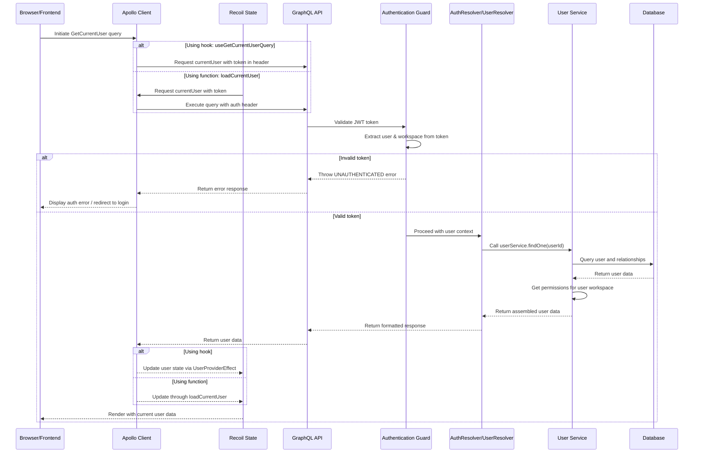
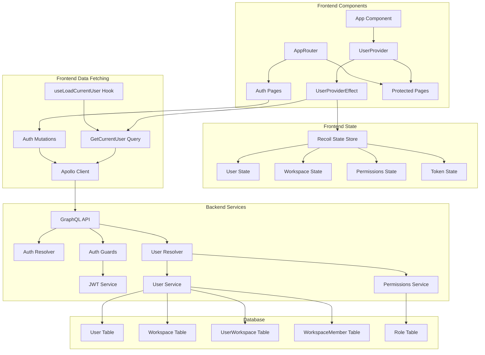
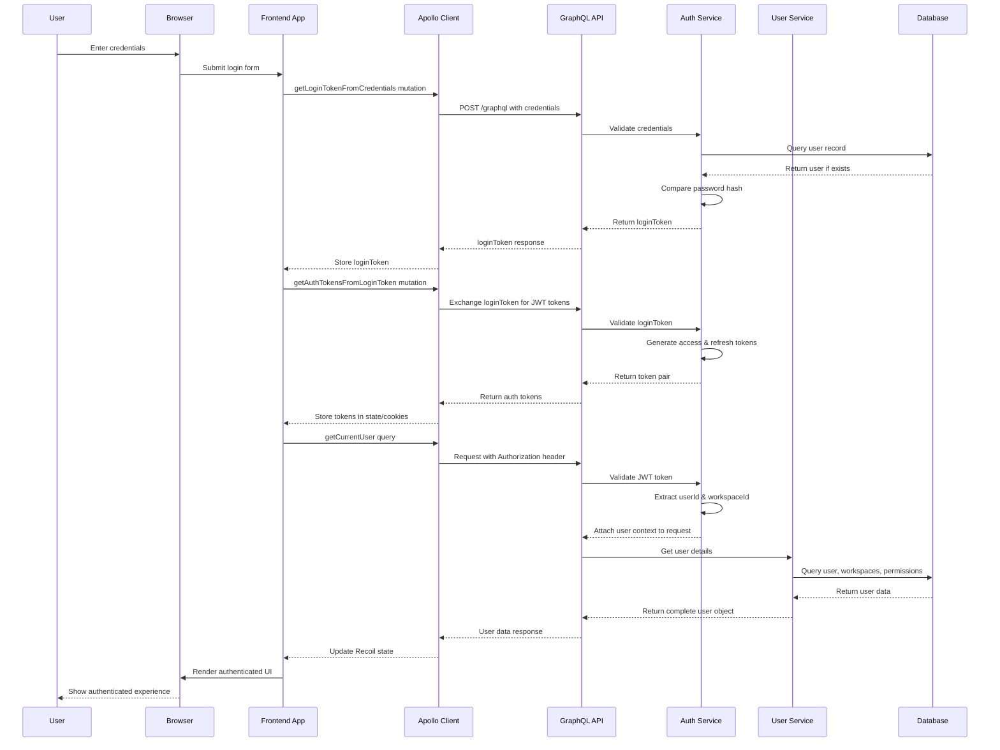

# Architecture and Flow Analysis of the GetCurrentUser Query in Twenty

## 1. Architecture Overview

The `GetCurrentUser` query is a central component in Twenty's authentication and user management system. It serves as the primary method for retrieving the currently authenticated user's data, which includes user information, workspace access, permissions, and related entities.

The query operates across the client-server architecture:

- **Client-side:** Implemented in React with Apollo Client for GraphQL operations and Recoil for state management
- **Server-side:** Built with NestJS, handling authentication, authorization, and data retrieval

This query is particularly important because:

1. It establishes the user's identity after authentication
2. It retrieves user-specific data including permissions and preferences
3. It populates the global state with user information for the entire application
4. It enables workspace-specific access control

## 2. Data Flow



## 3. Files Involved and Their Roles

### Frontend Files

| File | Role |
|------|------|
| `packages/twenty-front/src/modules/users/graphql/queries/getCurrentUser.ts` | Defines the GraphQL query for retrieving the current user |
| `packages/twenty-front/src/modules/users/hooks/useLoadCurrentUser.ts` | Hook for programmatically loading user data and updating state |
| `packages/twenty-front/src/modules/users/components/UserProviderEffect.tsx` | Component that automatically loads user data and updates global state |
| `packages/twenty-front/src/modules/auth/states/currentUserState.ts` | Recoil state definition for storing current user data |
| `packages/twenty-front/src/modules/auth/states/isCurrentUserLoadedState.ts` | Flag indicating if user data has been loaded |
| `packages/twenty-front/src/modules/users/components/UserProvider.tsx` | Provider component that renders loader or children based on user loaded state |

### Backend Files

| File | Role |
|------|------|
| `packages/twenty-server/src/engine/core-modules/user/user.resolver.ts` | GraphQL resolver for the `currentUser` query |
| `engine/core-modules/user/user.service.ts` | Service for retrieving and managing user data |
| `packages/twenty-server/src/engine/api/graphql/graphql-config/graphql-config.service.ts` | GraphQL configuration including context handling |
| `packages/twenty-server/src/engine/metadata-modules/permissions/permissions.service.ts` | Service for retrieving user permissions |
| `engine/metadata-modules/user-role/user-role.service.ts` | Service for managing user roles |
| `engine/core-modules/auth/strategies/*` | Authentication strategies |

## 4. Database Tables/Models Accessed

The `GetCurrentUser` query accesses several database tables/models:

1. `User` - Core user information (email, name, etc.)
2. `UserWorkspace` - Association between users and workspaces
3. `Workspace` - Workspace details
4. `WorkspaceMember` - User-specific workspace information
5. `TwoFactorAuthenticationMethod` - Two-factor authentication methods for the user
6. `Role` - User roles for permissions
7. `View` - User's views and UI settings

Here's the relevant database schema for the `User` entity from `setupCoreTables.ts`:

```ts
`CREATE TABLE "core"."user" (
    "id" uuid NOT NULL DEFAULT uuid_generate_v4(), 
    "firstName" character varying NOT NULL DEFAULT '', 
    "lastName" character varying NOT NULL DEFAULT '', 
    "email" character varying NOT NULL, 
    "emailVerified" boolean NOT NULL DEFAULT false, 
    "disabled" boolean NOT NULL DEFAULT false, 
    "passwordHash" character varying, 
    "canImpersonate" boolean NOT NULL DEFAULT false, 
    "createdAt" TIMESTAMP WITH TIME ZONE NOT NULL DEFAULT now(), 
    "updatedAt" TIMESTAMP WITH TIME ZONE NOT NULL DEFAULT now(), 
    "deletedAt" TIMESTAMP, 
    "defaultWorkspaceId" uuid, 
    CONSTRAINT "PK_a3ffb1c0c8416b9fc6f907b7433" PRIMARY KEY ("id")
)`
```

## 5. Authentication Flow

The authentication flow for the `GetCurrentUser` query follows these steps:

1. **Token Acquisition**:
   - User logs in via `getLoginTokenFromCredentials` mutation
   - Login token is exchanged for auth tokens via `getAuthTokensFromLoginToken`
   - Auth tokens (access token + refresh token) are stored in cookies/state

2. **Request Authorization**:
   - Apollo Client includes the access token in the Authorization header
   - GraphQL server extracts and validates the JWT token
   - Token payload contains userId, workspaceId, and workspaceMemberId

3. **Authentication Guard**:
   - `UserAuthGuard` validates the token
   - On success, it attaches user and workspace objects to the request
   - On failure, it throws an UNAUTHENTICATED error

4. **Permission Checking**:
   - After authentication, the resolver checks user permissions 
   - `PermissionsService` calculates user's workspace permissions
   - Permissions are included in the response as `permissionFlags`

Here's how the authentication guard works:

```ts
// Authentication guard that validates the user's token
@Injectable()
export class UserAuthGuard implements CanActivate {
  constructor(
    private readonly jwtService: JwtService,
    private readonly userService: UserService,
    // ...other services
  ) {}

  async canActivate(context: ExecutionContext): Promise<boolean> {
    const request = context.switchToHttp().getRequest();
    const token = extractTokenFromHeader(request);
    
    if (!token) {
      throw new UnauthorizedException();
    }
    
    try {
      const payload = await this.jwtService.verifyAsync(token);
      // Attach user to request
      request.user = await this.userService.findOne(payload.sub);
      return true;
    } catch {
      throw new UnauthorizedException();
    }
  }
}
```

## 6. Code Examples from Key Files

### GraphQL Query Definition

```ts
export const GET_CURRENT_USER = gql`
  query GetCurrentUser {
    currentUser {
      ...UserQueryFragment
    }
  }

  ${USER_QUERY_FRAGMENT}
`;
```

### User Fragment (simplified)

```ts
export const USER_QUERY_FRAGMENT = gql`
  fragment UserQueryFragment on User {
    id
    firstName
    lastName
    email
    canAccessFullAdminPanel
    canImpersonate
    supportUserHash
    onboardingStatus
    workspaceMember {
      ...WorkspaceMemberQueryFragment
    }
    workspaceMembers {
      ...PartialWorkspaceMemberQueryFragment
    }
    currentUserWorkspace {
      permissionFlags
      objectsPermissions {
        ...ObjectPermissionFragment
      }
      twoFactorAuthenticationMethodSummary {
        twoFactorAuthenticationMethodId
        status
        strategy
      }
    }
    currentWorkspace {
      id
      displayName
      logo
      inviteHash
      allowImpersonation
      activationStatus
      // ...more fields
    }
  }
`;
```

### UserProviderEffect Component

```tsx
export const UserProviderEffect = () => {
  // State hooks
  const [isCurrentUserLoaded, setIsCurrentUserLoaded] = useRecoilState(
    isCurrentUserLoadedState,
  );
  const setCurrentUser = useSetRecoilState(currentUserState);
  const setCurrentWorkspace = useSetRecoilState(currentWorkspaceState);
  // ...more state hooks

  const { data: queryData, loading: queryLoading } = useGetCurrentUserQuery({
    skip:
      !isLoggedIn ||
      isCurrentUserLoaded ||
      isMatchingLocation(location, AppPath.Verify) ||
      isMatchingLocation(location, AppPath.VerifyEmail),
  });

  useEffect(() => {
    if (!queryLoading) {
      setIsCurrentUserLoaded(true);
    }

    if (!isDefined(queryData?.currentUser)) return;

    // Update Recoil state with user data
    setCurrentUser(queryData.currentUser);

    if (isDefined(queryData.currentUser.currentWorkspace)) {
      setCurrentWorkspace({
        ...queryData.currentUser.currentWorkspace,
        defaultRole: queryData.currentUser.currentWorkspace.defaultRole ?? null,
        defaultAgent:
          queryData.currentUser.currentWorkspace.defaultAgent ?? null,
      });
    }

    // More state updates...
  }, [
    queryLoading,
    queryData?.currentUser,
    // ...dependencies
  ]);

  return null;
};
```

### UserResolver (Backend)

```ts
@Resolver(() => User)
@UseFilters(PermissionsGraphqlApiExceptionFilter)
export class UserResolver {
  // ...constructor and service injections

  @Query(() => User)
  @UseGuards(UserAuthGuard)
  async currentUser(
    @AuthUser() { id: userId }: User,
    @AuthWorkspace({ allowUndefined: true }) workspace: Workspace,
  ): Promise<User> {
    const user = await this.userRepository.findOne({
      where: {
        id: userId,
      },
      relations: {
        userWorkspaces: {
          twoFactorAuthenticationMethods: true,
        },
      },
    });

    userValidator.assertIsDefinedOrThrow(
      user,
      new AuthException('User not found', AuthExceptionCode.USER_NOT_FOUND),
    );

    if (!workspace) {
      return user;
    }

    const currentUserWorkspace = user.userWorkspaces.find(
      (userWorkspace) => userWorkspace.workspaceId === workspace.id,
    );

    if (!isDefined(currentUserWorkspace)) {
      throw new Error('Current user workspace not found');
    }

    // Get user workspace permissions
    const userWorkspacePermissions =
      fromUserWorkspacePermissionsToUserWorkspacePermissionsDto(
        await this.getUserWorkspacePermissions({
          currentUserWorkspace,
          workspace,
        }),
      );

    // Build 2FA method summary
    const twoFactorAuthenticationMethodSummary =
      buildTwoFactorAuthenticationMethodSummary(
        currentUserWorkspace.twoFactorAuthenticationMethods,
      );

    // Return user with permissions and workspace details
    return {
      ...user,
      currentUserWorkspace: {
        ...currentUserWorkspace,
        ...userWorkspacePermissions,
        twoFactorAuthenticationMethodSummary,
      },
      currentWorkspace: workspace,
    };
  }
}
```

### useLoadCurrentUser Hook

```ts
export const useLoadCurrentUser = () => {
  // State setters
  const setCurrentUser = useSetRecoilState(currentUserState);
  const setAvailableWorkspaces = useSetRecoilState(availableWorkspacesState);
  // ...more state setters

  const [getCurrentUser] = useGetCurrentUserLazyQuery();

  const loadCurrentUser = useCallback(async () => {
    const currentUserResult = await getCurrentUser({
      fetchPolicy: 'network-only',
    });

    if (isDefined(currentUserResult.error)) {
      throw new Error(currentUserResult.error.message);
    }

    const user = currentUserResult.data?.currentUser;

    if (!user) {
      throw new Error('No current user result');
    }

    let workspaceMember = null;

    setCurrentUser(user);

    // Update various states with user data
    if (isDefined(user.workspaceMembers)) {
      setCurrentWorkspaceMembers(user.workspaceMembers);
    }

    // ...more state updates

    return {
      user,
      workspaceMember,
      workspace,
    };
  }, [
    // dependencies
  ]);

  return {
    loadCurrentUser,
  };
};
```

## 7. How Frontend Components Use This Query

### Direct Usage with Hook

Frontend components can directly use the query via the generated hook:

```tsx
const { data, loading, error } = useGetCurrentUserQuery();

if (loading) return <LoadingSpinner />;
if (error) return <ErrorMessage error={error} />;

return (
  <div>
    <h1>Welcome, {data?.currentUser.firstName}!</h1>
    <p>Your workspace: {data?.currentUser.currentWorkspace.displayName}</p>
  </div>
);
```

### Through UserProviderEffect

Most commonly, the query is used through the `UserProviderEffect` component, which runs the query once and populates the global state:

```tsx
// In the application root
<RecoilRoot>
  <UserProvider>
    <UserProviderEffect />
    <App />
  </UserProvider>
</RecoilRoot>
```

### Accessing User Data Through Recoil State

Components access user data through Recoil state hooks:

```tsx
const currentUser = useRecoilValue(currentUserState);
const currentWorkspace = useRecoilValue(currentWorkspaceState);

return (
  <div>
    <UserAvatar user={currentUser} />
    <WorkspaceInfo workspace={currentWorkspace} />
  </div>
);
```

### Authentication Dependent Rendering

The `UserProvider` component conditionally renders content based on whether the user is loaded:

```tsx
export const UserProvider = ({ children }: React.PropsWithChildren) => {
  const isCurrentUserLoaded = useRecoilValue(isCurrentUserLoadedState);
  const location = useLocation();

  // Show loader until user is loaded, except on specific pages
  return !isCurrentUserLoaded &&
    !isMatchingLocation(location, AppPath.Verify) &&
    !isMatchingLocation(location, AppPath.VerifyEmail) &&
    !isMatchingLocation(location, AppPath.CreateWorkspace) ? (
    <UserOrMetadataLoader />
  ) : (
    <UserContext.Provider value={...}>
      {children}
    </UserContext.Provider>
  );
};
```

### Programmatic Usage via loadCurrentUser

For programmatic operations like post-login workflows, the `loadCurrentUser` function is used:

```ts
// Inside auth flow
const { loadCurrentUser } = useLoadCurrentUser();

const handleLogin = async (email, password) => {
  await loginUser(email, password);
  
  // After successful login, load user data
  const { user, workspace } = await loadCurrentUser();
  
  // Then redirect based on user data
  if (user.onboardingStatus === 'COMPLETED') {
    navigate(AppPath.Index);
  } else {
    navigate(AppPath.CreateProfile);
  }
};
```

## 8. Component Diagram



## 9. Complete Authentication Flow Diagram



## 10. Key Insights and Important Details

### User Authentication State

The application maintains several key states related to the user:

- `currentUserState`: Core user information
- `isCurrentUserLoadedState`: Flag to track if user data has been loaded
- `currentWorkspaceState`: Information about the active workspace
- `currentUserWorkspaceState`: User's role and permissions within the workspace

### Authentication Guards

Every GraphQL query and mutation is protected by guards that validate user authentication:

- `UserAuthGuard`: Verifies the user's JWT token
- `WorkspaceAuthGuard`: Ensures the user has access to the requested workspace
- `PermissionsGuard`: Checks if the user has required permissions

### Error Handling

The authentication system has sophisticated error handling:

- `AuthExceptionCode`: Enum of specific authentication error codes
- `AuthGraphqlApiExceptionFilter`: Converts auth errors to GraphQL-friendly formats
- Frontend error handling for expired tokens, including refresh flows

### JWT Token Structure

The JWT token contains critical information:

```ts
// JWT Payload structure
{
  sub: string;         // userId
  workspaceId: string; // Current workspace
  workspaceMemberId?: string; // Optional workspace member ID
  userWorkspaceId?: string;   // UserWorkspace relationship ID
  exp: number;         // Expiration timestamp
  iat: number;         // Issued at timestamp
}
```

### Permissions System

User permissions are calculated dynamically:

```ts
// Permissions are represented as flags
export enum PermissionFlagType {
  API_KEYS_AND_WEBHOOKS = 'API_KEYS_AND_WEBHOOKS',
  WORKSPACE = 'WORKSPACE',
  WORKSPACE_MEMBERS = 'WORKSPACE_MEMBERS',
  ROLES = 'ROLES',
  DATA_MODEL = 'DATA_MODEL',
  ADMIN_PANEL = 'ADMIN_PANEL',
  SECURITY = 'SECURITY',
  // ...more flags
}
```

## 11. Summary

The `GetCurrentUser` query serves as the backbone of Twenty's authentication system, enabling:

1. **User Authentication**: Verifying the user's identity and authorization level
2. **Workspace Context**: Loading the user's current workspace information
3. **UI Personalization**: Retrieving preferences and settings for the user interface
4. **Permission Control**: Determining what features and data the user can access
5. **Global State Population**: Initializing the application's state with user-specific data

This query follows a carefully designed architecture that separates concerns between:
- The GraphQL API layer that handles requests and responses
- Authentication services that validate credentials and tokens
- User services that retrieve and manipulate user data
- State management systems that make user data available throughout the application

Understanding this flow is crucial for working with Twenty's authentication system and for implementing features that depend on user context and permissions.