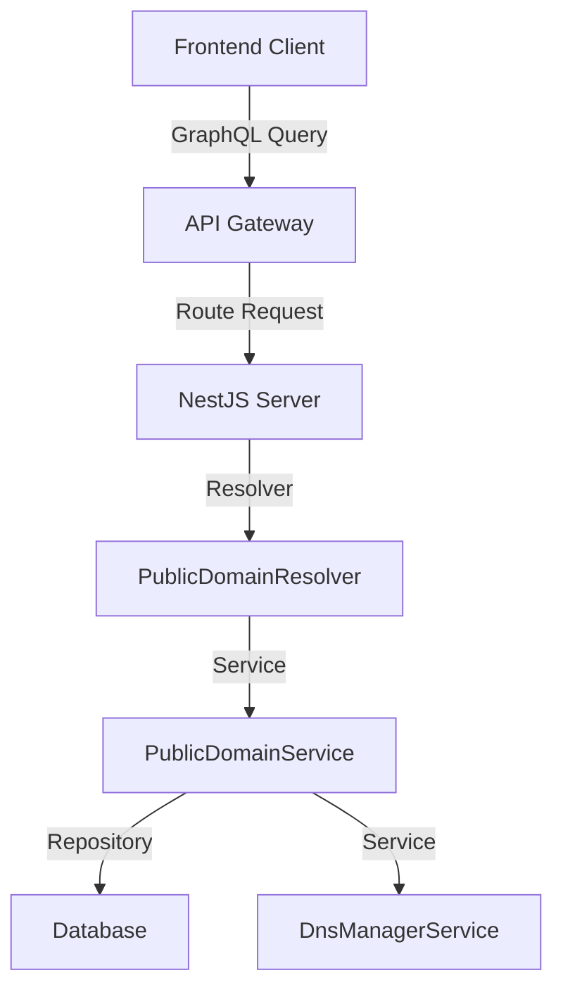
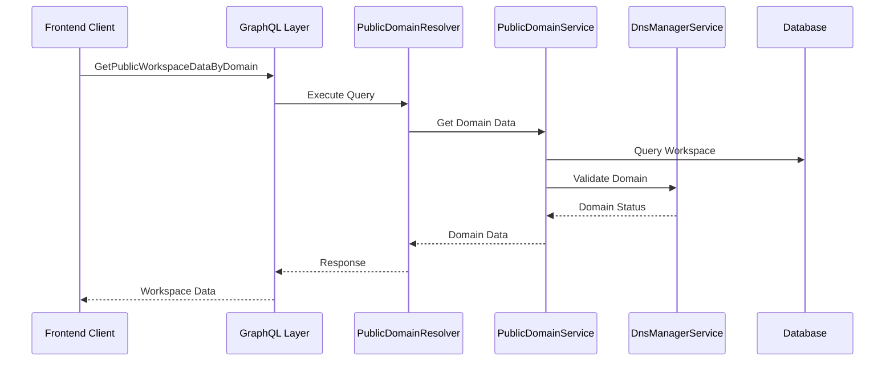
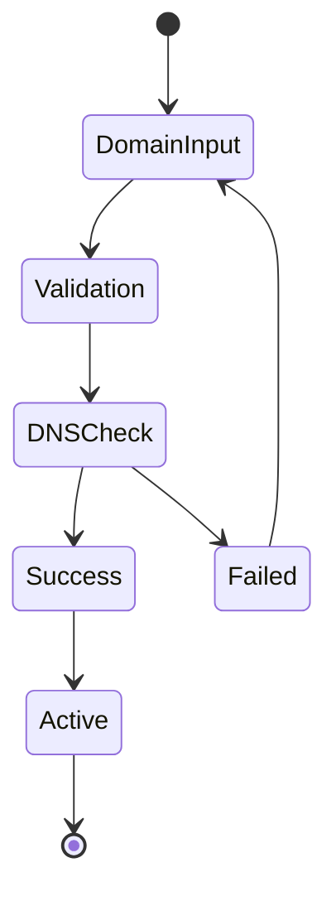

# GetPublicWorkspaceDataByDomain: Complete Analysis

## Table of Contents
- [Overview](#overview)
- [Architecture](#architecture)
- [Frontend Implementation](#frontend-implementation)
- [Backend Implementation](#backend-implementation)
- [Data Flow](#data-flow)
- [Component Breakdown](#component-breakdown)
- [API Schema](#api-schema)
- [Sequence Diagrams](#sequence-diagrams)
- [Error Handling](#error-handling)
- [Security Considerations](#security-considerations)

## Overview

The `GetPublicWorkspaceDataByDomain` functionality is a crucial part of Twenty's multi-workspace architecture that allows fetching public workspace information based on a domain. This feature is essential for the workspace discovery and authentication flow, enabling users to access workspace-specific data and authentication providers.

### Key Features
- Fetches workspace public data using domain information
- Retrieves workspace authentication providers
- Handles workspace URLs and configurations
- Manages workspace branding (logo, display name)
- Integrates with authentication flow

## Architecture



### Flow Description
1. Frontend initiates query using `useGetPublicWorkspaceDataByDomain` hook
2. API Gateway receives the request and routes to NestJS server
3. PublicDomainResolver handles the GraphQL query
4. PublicDomainService processes the business logic
5. Repository layer interacts with the database
6. DnsManagerService handles domain-related operations

## Frontend Implementation

### Main Hook: useGetPublicWorkspaceDataByDomain

```typescript
const useGetPublicWorkspaceDataByDomain = () => {
  const { origin } = useOrigin();
  const setWorkspaceAuthProviders = useSetRecoilState(workspaceAuthProvidersState);
  const workspacePublicData = useRecoilValue(workspacePublicDataState);
  
  const { loading, data, error } = useGetPublicWorkspaceDataByDomainQuery({
    variables: { origin },
    skip: conditions,
    onCompleted: (data) => {
      setWorkspaceAuthProviders(data.getPublicWorkspaceDataByDomain.authProviders);
      setWorkspacePublicDataState(data.getPublicWorkspaceDataByDomain);
    },
    onError: handleError
  });
  
  return { loading, data, error };
};
```

### GraphQL Query Definition

```graphql
query GetPublicWorkspaceDataByDomain($origin: String!) {
  getPublicWorkspaceDataByDomain(origin: $origin) {
    id
    logo
    displayName
    workspaceUrls {
      ...WorkspaceUrlsFragment
    }
    authProviders {
      sso {
        id
        name
        type
        status
        issuer
      }
      google
      magicLink
      password
      microsoft
    }
  }
}
```

## Backend Implementation

### PublicDomainResolver

```typescript
@Resolver()
export class PublicDomainResolver {
  constructor(
    @InjectRepository(PublicDomain)
    private readonly publicDomainRepository: Repository<PublicDomain>,
    private readonly publicDomainService: PublicDomainService,
  ) {}

  @Query(() => PublicDomainDTO)
  async getPublicWorkspaceDataByDomain(
    @Args('origin') origin: string
  ): Promise<PublicDomainDTO> {
    // Implementation
  }
}
```

### PublicDomainService

```typescript
@Injectable()
export class PublicDomainService {
  constructor(
    private readonly dnsManagerService: DnsManagerService,
    @InjectRepository(PublicDomain)
    private readonly publicDomainRepository: Repository<PublicDomain>,
    @InjectRepository(Workspace)
    private readonly workspaceRepository: Repository<Workspace>,
  ) {}

  async getPublicDomainData(origin: string): Promise<PublicDomainDTO> {
    // Implementation
  }
}
```

## Data Flow



## Component Breakdown

### Frontend Components

1. **Domain Manager Hook**
```typescript
// useGetPublicWorkspaceDataByDomain.ts
export const useGetPublicWorkspaceDataByDomain = () => {
  // Hook implementation
};
```

2. **Public Domain Settings**
```typescript
// SettingPublicDomain.tsx
export const SettingPublicDomain = () => {
  // Component implementation
};
```

3. **Domain List Card**
```typescript
// SettingsPublicDomainsListCard.tsx
export const SettingsPublicDomainsListCard = () => {
  // Component implementation
};
```

### Backend Components

1. **PublicDomainModule**
```typescript
@Module({
  imports: [
    NestjsQueryTypeOrmModule.forFeature([PublicDomain, Workspace]),
    DnsManagerModule,
  ],
  exports: [CheckPublicDomainsValidRecordsCronCommand, PublicDomainService],
  providers: [
    PublicDomainService,
    PublicDomainResolver,
    CheckPublicDomainsValidRecordsCronCommand,
    CheckPublicDomainsValidRecordsCronJob,
  ],
})
export class PublicDomainModule {}
```

2. **Domain Management**
```typescript
// DnsManagerService
export class DnsManagerService {
  async getHostnameWithRecords(domain: string, options: DnsOptions) {
    // Implementation
  }

  async isHostnameWorking(domain: string, options: DnsOptions) {
    // Implementation
  }
}
```

## API Schema

### Types

```typescript
interface PublicDomainDTO {
  id: string;
  domain: string;
  isValidated: boolean;
  createdAt: Date;
  workspaceId: string;
}

interface WorkspacePublicData {
  id: string;
  logo: string;
  displayName: string;
  workspaceUrls: WorkspaceUrls;
  authProviders: AuthProviders;
}

interface AuthProviders {
  sso: SSOProvider[];
  google: boolean;
  magicLink: boolean;
  password: boolean;
  microsoft: boolean;
}
```

## Error Handling

```typescript
// Frontend Error Handling
const handleError = (error: ApolloError) => {
  const isWorkspaceNotFoundError = error.graphQLErrors?.some(
    (graphQLError) => graphQLError.extensions?.code === 'NOT_FOUND',
  );

  if (isWorkspaceNotFoundError) {
    redirectToDefaultDomain();
  } else {
    console.error(error);
  }
};

// Backend Error Handling
@UseFilters(PublicDomainExceptionFilter)
export class PublicDomainResolver {
  // Implementation
}

export class PublicDomainException extends Error {
  constructor(
    message: string,
    code: PublicDomainExceptionCode,
    metadata?: Record<string, unknown>,
  ) {
    super(message);
  }
}
```

## Security Considerations

### 1. Authentication and Authorization

1. **Workspace Auth Guard**
```typescript
@UseGuards(WorkspaceAuthGuard)
@UsePipes(ResolverValidationPipe)
@UseFilters(
  PublicDomainExceptionFilter,
  PreventNestToAutoLogGraphqlErrorsFilter,
)
@Resolver()
export class PublicDomainResolver {
  // Protected resolver implementation
}
```

2. **Decorators and Guards**
- `@AuthWorkspace()` decorator for workspace context
- `WorkspaceAuthGuard` for validating workspace access
- `ResolverValidationPipe` for input validation
- Exception filters for error handling

3. **Permission-Based Access**
```typescript
async findManyPublicDomains(
  @AuthWorkspace() currentWorkspace: Workspace,
): Promise<PublicDomainDTO[]> {
  // Only return domains for authorized workspace
  return await this.publicDomainRepository.find({
    where: { workspaceId: currentWorkspace.id },
  });
}
```

### 2. Domain Validation

1. **Input Sanitization**
```typescript
async createPublicDomain({ domain, workspace }) {
  // Sanitize and normalize domain
  const formattedDomain = domain.trim().toLowerCase();
  
  // Validate uniqueness
  if (await this.workspaceRepository.findOneBy({
    customDomain: formattedDomain,
  })) {
    throw new PublicDomainException('Domain already registered');
  }
}
```

2. **DNS Record Verification**
```typescript
async checkPublicDomainValidRecords(publicDomain: PublicDomain) {
  // Verify DNS records
  const publicDomainWithRecords =
    await this.dnsManagerService.getHostnameWithRecords(
      publicDomain.domain,
      { isPublicDomain: true }
    );

  // Validate domain status
  const isCustomDomainWorking =
    await this.dnsManagerService.isHostnameWorking(
      publicDomain.domain,
      { isPublicDomain: true }
    );
}
```

### 3. Error Handling and Validation

1. **Custom Exception Filter**
```typescript
@UseFilters(
  PublicDomainExceptionFilter,
  PreventNestToAutoLogGraphqlErrorsFilter,
)
```

2. **Domain-Specific Exceptions**
```typescript
export class PublicDomainException extends Error {
  constructor(
    message: string,
    code: PublicDomainExceptionCode,
    metadata?: { userFriendlyMessage: string }
  ) {
    super(message);
  }
}
```

3. **Validation Pipeline**
```typescript
@UsePipes(ResolverValidationPipe)
export class PublicDomainResolver {
  // Validated inputs
}
```

### 4. Data Privacy

1. **Public Data Exposure Control**
```graphql
query GetPublicWorkspaceDataByDomain($origin: String!) {
  getPublicWorkspaceDataByDomain(origin: $origin) {
    # Only expose necessary public fields
    id
    logo
    displayName
    workspaceUrls {
      ...WorkspaceUrlsFragment
    }
    authProviders {
      sso {
        id
        name
        type
        status
        issuer
      }
      google
      magicLink
      password
      microsoft
    }
  }
}
```

2. **Workspace Data Isolation**
```typescript
// Ensure workspace data isolation
@Query(() => [PublicDomainDTO])
async findManyPublicDomains(
  @AuthWorkspace() currentWorkspace: Workspace,
): Promise<PublicDomainDTO[]> {
  return await this.publicDomainRepository.find({
    where: { workspaceId: currentWorkspace.id },
  });
}
```

### 5. Security Best Practices

1. **Rate Limiting**
- Implement API rate limiting for public endpoints
- Monitor and limit DNS record checks
- Control domain validation attempts

2. **SSL/TLS Security**
- Enforce HTTPS for all domain connections
- Validate SSL certificates for custom domains
- Implement secure communication channels

3. **Audit Trail**
- Log domain validation attempts
- Track ownership changes
- Monitor authentication providers

4. **Prevention of Common Attacks**
- Input validation to prevent injection
- CSRF protection for mutations
- XSS prevention in domain handling

### 6. Frontend Security

1. **State Management**
```typescript
// Secure state management with Recoil
const workspacePublicDataState = atom<WorkspacePublicData>({
  key: 'workspacePublicDataState',
  default: undefined,
});
```

2. **Error Handling**
```typescript
// Handle security-related errors gracefully
onError: (error) => {
  const isWorkspaceNotFoundError = error.graphQLErrors?.some(
    (graphQLError) => graphQLError.extensions?.code === 'NOT_FOUND',
  );

  if (isWorkspaceNotFoundError) {
    redirectToDefaultDomain();
  } else {
    console.error(error);
  }
}
```

3. **Authentication Flow**
- Secure token handling
- Protected route management
- Session management

## Public Domain Management Flow



### Domain Validation Process

1. **Input Validation**
   ```typescript
   const formattedDomain = domain.trim().toLowerCase();
   ```

2. **Duplicate Check**
   ```typescript
   if (await this.publicDomainRepository.findOneBy({
     domain: formattedDomain,
     workspaceId: workspace.id,
   })) {
     throw new PublicDomainException('Domain already registered');
   }
   ```

3. **DNS Registration**
   ```typescript
   await this.dnsManagerService.registerHostname(formattedDomain, {
     isPublicDomain: true,
   });
   ```

4. **Record Verification**
   ```typescript
   async checkPublicDomainValidRecords(publicDomain: PublicDomain) {
     const publicDomainWithRecords =
       await this.dnsManagerService.getHostnameWithRecords(
         publicDomain.domain,
         { isPublicDomain: true }
       );
   }
   ```

## Frontend State Management

```typescript
// Recoil States
export const workspacePublicDataState = atom<WorkspacePublicData>({
  key: 'workspacePublicDataState',
  default: undefined,
});

export const selectedPublicDomainState = atom<PublicDomain>({
  key: 'selectedPublicDomainState',
  default: undefined,
});
```

## Testing Considerations

### Unit Tests

1. **Service Tests** (PublicDomainService)
```typescript
describe('PublicDomainService', () => {
  let service: PublicDomainService;
  let mockDnsManagerService: jest.Mocked<DnsManagerService>;
  let mockPublicDomainRepo: jest.Mocked<Repository<PublicDomain>>;
  
  beforeEach(async () => {
    // Setup mocks
    mockDnsManagerService = {
      getHostnameWithRecords: jest.fn(),
      isHostnameWorking: jest.fn(),
      registerHostname: jest.fn(),
    } as any;

    const module: TestingModule = await Test.createTestingModule({
      providers: [
        PublicDomainService,
        {
          provide: DnsManagerService,
          useValue: mockDnsManagerService,
        },
        {
          provide: getRepositoryToken(PublicDomain),
          useValue: mockPublicDomainRepo,
        }
      ],
    }).compile();

    service = module.get<PublicDomainService>(PublicDomainService);
  });

  it('should validate domain records', async () => {
    // Test implementation
  });
});
```

2. **Resolver Tests** (PublicDomainResolver)
```typescript
describe('PublicDomainResolver', () => {
  let resolver: PublicDomainResolver;
  let mockPublicDomainService: jest.Mocked<PublicDomainService>;

  beforeEach(async () => {
    const module: TestingModule = await Test.createTestingModule({
      providers: [
        PublicDomainResolver,
        {
          provide: PublicDomainService,
          useValue: mockPublicDomainService,
        },
      ],
    }).compile();

    resolver = module.get<PublicDomainResolver>(PublicDomainResolver);
  });

  it('should get workspace data by domain', async () => {
    // Test implementation
  });
});
```

3. **Frontend Hook Tests**
```typescript
describe('useGetPublicWorkspaceDataByDomain', () => {
  const mockData = {
    getPublicWorkspaceDataByDomain: {
      id: 'test-id',
      logo: 'test-logo.png',
      displayName: 'Test Workspace',
      authProviders: {
        google: true,
        password: true,
      },
    },
  };

  it('should fetch and set workspace data', async () => {
    // Setup mock Apollo client
    const mockClient = new MockApolloClient([
      {
        request: {
          query: GET_PUBLIC_WORKSPACE_DATA_BY_DOMAIN,
          variables: { origin: 'test.domain.com' },
        },
        result: { data: mockData },
      },
    ]);

    const { result } = renderHook(() => useGetPublicWorkspaceDataByDomain(), {
      wrapper: createApolloWrapper(mockClient),
    });

    await waitFor(() => {
      expect(result.current.data).toEqual(mockData);
    });
  });
});
```

### Integration Tests

1. **API Endpoint Tests**
```typescript
describe('Public Domain API Integration', () => {
  let app: INestApplication;
  let publicDomainService: PublicDomainService;

  beforeEach(async () => {
    const moduleFixture: TestingModule = await Test.createTestingModule({
      imports: [PublicDomainModule],
    }).compile();

    app = moduleFixture.createNestApplication();
    await app.init();
    
    publicDomainService = moduleFixture.get<PublicDomainService>(PublicDomainService);
  });

  it('should validate and register domain', () => {
    return request(app.getHttpServer())
      .post('/graphql')
      .send({
        query: `
          mutation CreatePublicDomain($domain: String!) {
            createPublicDomain(domain: $domain) {
              id
              domain
              isValidated
            }
          }
        `,
        variables: {
          domain: 'test.domain.com',
        },
      })
      .expect(200)
      .expect((res) => {
        expect(res.body.data.createPublicDomain).toBeDefined();
      });
  });
});
```

2. **Domain Validation Flow Tests**
```typescript
describe('Domain Validation Flow', () => {
  it('should handle complete domain validation process', async () => {
    // Test DNS record creation
    // Test domain verification
    // Test error scenarios
  });
});
```

### E2E Tests

1. **Domain Management Flow**
```typescript
import { test, expect } from '@playwright/test';

test('complete domain management flow', async ({ page }) => {
  // Login flow
  await page.goto('/settings/domains');
  await page.click('text=Add Public Domain');
  
  // Add domain
  await page.fill('[data-testid="domain-input"]', 'test.domain.com');
  await page.click('text=Save');
  
  // Verify domain status
  await expect(page.locator('text=Pending')).toBeVisible();
  
  // Check DNS records
  await page.click('text=Reload');
  
  // Verify validation
  await expect(page.locator('text=Validated')).toBeVisible();
});
```

2. **Authentication Flow**
```typescript
test('workspace access with custom domain', async ({ page }) => {
  await page.goto('https://test.domain.com');
  
  // Verify workspace data
  await expect(page.locator('text=Test Workspace')).toBeVisible();
  
  // Test auth providers
  await expect(page.locator('[data-testid="google-auth"]')).toBeVisible();
  await expect(page.locator('[data-testid="password-auth"]')).toBeVisible();
});
```

3. **Error Handling Scenarios**
```typescript
test('handle invalid domain errors', async ({ page }) => {
  // Test invalid domain input
  await page.fill('[data-testid="domain-input"]', 'invalid@domain');
  await page.click('text=Save');
  await expect(page.locator('text=Invalid domain format')).toBeVisible();
  
  // Test duplicate domain
  await page.fill('[data-testid="domain-input"]', 'existing.domain.com');
  await page.click('text=Save');
  await expect(page.locator('text=Domain already registered')).toBeVisible();
});
```

## Best Practices

1. **Domain Management**
   - Always validate domain ownership
   - Implement retry mechanisms for DNS checks
   - Handle edge cases (invalid domains, DNS propagation delays)

2. **Error Handling**
   - Provide clear error messages
   - Implement proper error logging
   - Handle network timeouts

3. **Security**
   - Implement rate limiting
   - Validate input data
   - Use proper authentication guards

4. **Performance**
   - Cache DNS lookup results
   - Implement query optimization
   - Use proper indexing for database queries

## Conclusion

The GetPublicWorkspaceDataByDomain functionality is a critical component of Twenty's multi-workspace architecture. It provides a secure and efficient way to manage workspace access through domain validation and public data retrieval. The implementation follows best practices for both frontend and backend development, ensuring a robust and maintainable solution.

Key points to remember:
- Always validate domain ownership
- Implement proper error handling
- Follow security best practices
- Consider performance optimizations
- Maintain comprehensive testing coverage

This documentation provides a complete overview of the functionality, its implementation details, and best practices to follow when working with or extending the feature.