# 🏗️ Twenty Frontend Architecture Documentation

> **Complete Technical Deep-Dive**: Understanding Twenty CRM's frontend codebase architecture, core components, state management, and design patterns.

## 📋 Table of Contents

- [Overview](#overview)
- [Architecture Principles](#architecture-principles)
- [Package Structure](#package-structure)
- [Application Flow](#application-flow)
- [Core Systems](#core-systems)
- [UI Component Architecture](#ui-component-architecture)
- [State Management](#state-management)
- [Authentication & Authorization](#authentication--authorization)
- [Data Layer](#data-layer)
- [Module Architecture](#module-architecture)
- [Routing System](#routing-system)
- [Configuration Management](#configuration-management)
- [Development Tools](#development-tools)
- [Performance Optimizations](#performance-optimizations)
- [Best Practices](#best-practices)

---

## Overview

Twenty's frontend is a sophisticated React application built with modern TypeScript, featuring a modular architecture designed for scalability, maintainability, and developer experience. The application serves as a comprehensive CRM platform with advanced data management, customizable views, and real-time collaboration features.

### Key Characteristics

- **Technology Stack**: React 18, TypeScript, Recoil, Apollo Client, Emotion
- **Architecture Pattern**: Module-based monolithic structure with clear separation of concerns
- **Build System**: Vite with advanced optimizations and hot module replacement
- **State Management**: Hybrid approach using Recoil for global state and React hooks for local state
- **Styling**: Emotion-based CSS-in-JS with a comprehensive design system
- **Data Fetching**: Apollo Client with GraphQL for type-safe API communication

---

## Architecture Principles

### Core Design Principles


### Development Guidelines

1. **Functional Components Only**: No class components allowed
2. **Named Exports Only**: Consistent import/export patterns
3. **Types Over Interfaces**: Except when extending third-party interfaces
4. **String Literals Over Enums**: Except for GraphQL enums
5. **Event Handlers Over useEffect**: For state updates and side effects
6. **Composition Over Inheritance**: Favor component composition patterns

---

## Package Structure

### High-Level Directory Structure

```
packages/twenty-front/
├── src/                          # Source code root
│   ├── modules/                  # Feature modules (domain-specific)
│   ├── pages/                    # Page components and routing
│   ├── config/                   # Application configuration
│   ├── generated/                # Auto-generated GraphQL types
│   ├── generated-metadata/       # Auto-generated metadata types
│   ├── hooks/                    # Global utility hooks
│   ├── types/                    # Global type definitions
│   ├── utils/                    # Global utility functions
│   ├── testing/                  # Testing utilities and decorators
│   ├── locales/                  # Internationalization files
│   └── loading/                  # Loading components and states
├── public/                       # Static assets
├── .storybook/                   # Storybook configuration
├── scripts/                      # Build and deployment scripts
└── __mocks__/                    # Jest mocks
```

### Module Architecture Pattern

```typescript
// Standard module structure
src/modules/{domain}/
├── components/                   # React components
├── hooks/                        # Domain-specific hooks
├── states/                       # Recoil atoms and selectors
├── types/                        # Type definitions
├── utils/                        # Utility functions
├── graphql/                      # GraphQL queries and mutations
├── constants/                    # Domain constants
├── contexts/                     # React contexts
├── services/                     # Business logic services
└── validation-schemas/           # Form validation schemas
```

---

## Application Flow

### Application Bootstrap Sequence

```mermaid
sequenceDiagram
    participant Browser as 🌐 Browser
    participant App as 📱 App Component
    participant Router as 🚦 AppRouter
    participant Auth as 🔐 Authentication
    participant State as 📊 State Management
    participant UI as 🎨 UI Components
    
    Browser->>App: Load application
    App->>App: Initialize providers
    Note over App: RecoilRoot, I18n, ErrorBoundary, IconsProvider
    
    App->>Router: Route to current path
    Router->>Auth: Check authentication status
    
    alt User not authenticated
        Auth->>UI: Render authentication flow
        Note over UI: SignInUp, CreateWorkspace, etc.
    else User authenticated
        Auth->>State: Load user data
        State->>State: Initialize user context
        State->>UI: Render authenticated app
        Note over UI: Main navigation, object views, etc.
    end
    
    UI->>Browser: Render final interface
```



### Core Provider Hierarchy

```tsx
// Application provider structure
export const App = () => (
  <RecoilRoot>
    <AppErrorBoundary>
      <I18nProvider>
        <SnackBarComponentInstanceContext.Provider>
          <IconsProvider>
            <ExceptionHandlerProvider>
              <HelmetProvider>
                <ClickOutsideListenerContext.Provider>
                  <AppRouter />
                </ClickOutsideListenerContext.Provider>
              </HelmetProvider>
            </ExceptionHandlerProvider>
          </IconsProvider>
        </SnackBarComponentInstanceContext.Provider>
      </I18nProvider>
    </AppErrorBoundary>
  </RecoilRoot>
);
```

---

## Core Systems

### 1. Apollo Client Configuration

```typescript
// GraphQL client setup with advanced configuration
const apolloClient = new ApolloClient({
  uri: process.env.REACT_APP_SERVER_BASE_URL + '/graphql',
  cache: new InMemoryCache({
    typePolicies: {
      Query: {
        fields: {
          // Custom cache policies for optimistic updates
          objects: {
            merge: true,
          },
          // Field-level caching strategies
          currentUser: {
            read(cached, { canRead }) {
              return canRead(cached) ? cached : undefined;
            },
          },
        },
      },
    },
  }),
  // Authentication handling
  headers: {
    authorization: localStorage.getItem('accessToken') || '',
  },
  // Error handling and retry logic
  errorPolicy: 'all',
  defaultOptions: {
    watchQuery: {
      errorPolicy: 'all',
    },
  },
});
```

### 2. State Management Architecture


### 3. Component State System

Twenty implements a sophisticated component state system for managing local component state with global patterns:

```typescript
// Component family state pattern
export const componentFamilyState = atomFamily<StateType, string>({
  key: 'componentFamilyState',
  default: defaultValue,
});

// Usage in components
export const useComponentState = (instanceId: string) => {
  const [state, setState] = useRecoilState(
    componentFamilyState(instanceId)
  );
  
  return {
    state,
    setState,
  };
};
```

---

## UI Component Architecture

### Design System Structure


### Core UI Modules

#### 1. **Field System**
```typescript
// Universal field component architecture
interface FieldDefinition<T> {
  type: FieldMetadataType;
  metadata: FieldMetadata;
  component: FieldComponent<T>;
  displayComponent: FieldDisplayComponent<T>;
  inputComponent: FieldInputComponent<T>;
}

// Field registry for dynamic field rendering
export const fieldRegistry = new Map<FieldMetadataType, FieldDefinition>();
```

#### 2. **Layout System**
```typescript
// Flexible layout components
export const PageLayout = {
  Header: PageHeader,
  Body: PageBody,
  LeftDrawer: PageLeftDrawer,
  RightDrawer: PageRightDrawer,
  Footer: PageFooter,
};

// Usage pattern
<PageLayout>
  <PageLayout.Header>
    <PageTitle />
    <PageActions />
  </PageLayout.Header>
  <PageLayout.Body>
    <ContentArea />
  </PageLayout.Body>
</PageLayout>
```

#### 3. **Navigation System**
```typescript
// Adaptive navigation structure
export const NavigationStructure = {
  Main: MainNavigationDrawer,
  Settings: SettingsNavigationDrawer,
  Breadcrumb: NavigationBreadcrumb,
  TabBar: NavigationTabBar,
};
```

---

## State Management

### Recoil Architecture


### State Management Patterns

#### 1. **User State Management**
```typescript
// Core user state atoms
export const currentUserState = atom<User | null>({
  key: 'currentUserState',
  default: null,
});

export const isCurrentUserLoadedState = atom<boolean>({
  key: 'isCurrentUserLoadedState',
  default: false,
});

// Derived selectors
export const userPermissionsSelector = selector({
  key: 'userPermissionsSelector',
  get: ({ get }) => {
    const user = get(currentUserState);
    const workspace = get(currentWorkspaceState);
    
    return computePermissions(user, workspace);
  },
});
```

#### 2. **Object Metadata State**
```typescript
// Dynamic object metadata management
export const objectMetadataItemsState = atom<ObjectMetadataItem[]>({
  key: 'objectMetadataItemsState',
  default: [],
});

export const objectMetadataItemFamilySelector = selectorFamily({
  key: 'objectMetadataItemFamilySelector',
  get: (objectNameSingular: string) => ({ get }) => {
    const items = get(objectMetadataItemsState);
    return items.find(item => item.nameSingular === objectNameSingular);
  },
});
```

#### 3. **Component Instance State**
```typescript
// Component-scoped state management
export const componentInstanceIdState = atomFamily<string | null, string>({
  key: 'componentInstanceIdState',
  default: null,
});

export const useComponentStateWithInstanceId = <T>(
  componentState: ComponentState<T>,
  instanceId?: string
) => {
  const contextInstanceId = useContext(ComponentInstanceIdContext);
  const effectiveInstanceId = instanceId ?? contextInstanceId;
  
  return useRecoilState(componentState(effectiveInstanceId));
};
```

---

## Authentication & Authorization

### Authentication Flow Architecture


### User Provider System

```typescript
// User data loading and state management
export const UserProviderEffect = () => {
  const { data: currentUserData } = useGetCurrentUserQuery({
    skip: !isLoggedIn,
  });

  const setCurrentUser = useSetRecoilState(currentUserState);
  const setCurrentWorkspace = useSetRecoilState(currentWorkspaceState);
  const setIsCurrentUserLoaded = useSetRecoilState(isCurrentUserLoadedState);

  useEffect(() => {
    if (currentUserData?.currentUser) {
      setCurrentUser(currentUserData.currentUser);
      setCurrentWorkspace(currentUserData.currentUser.defaultWorkspace);
      setIsCurrentUserLoaded(true);
    }
  }, [currentUserData]);

  return null;
};
```

### Permission System

```typescript
// Role-based access control
export const usePermissions = () => {
  const currentUser = useRecoilValue(currentUserState);
  const currentWorkspace = useRecoilValue(currentWorkspaceState);

  return useMemo(() => ({
    canEditMetadata: hasPermission(currentUser, PermissionType.METADATA_EDIT),
    canAccessSettings: hasPermission(currentUser, PermissionType.SETTINGS_ACCESS),
    canManageUsers: hasPermission(currentUser, PermissionType.USER_MANAGEMENT),
    canAccessAdminPanel: currentUser?.canAccessFullAdminPanel ?? false,
  }), [currentUser, currentWorkspace]);
};
```

---

## Data Layer

### GraphQL Integration


### Query and Mutation Patterns

```typescript
// Standardized query pattern
export const useObjectRecords = (objectNameSingular: string) => {
  const { data, loading, error, refetch } = useQuery(
    FIND_MANY_RECORDS,
    {
      variables: { objectNameSingular },
      notifyOnNetworkStatusChange: true,
      errorPolicy: 'all',
    }
  );

  return {
    records: data?.records || [],
    loading,
    error,
    refetch,
  };
};

// Optimistic update pattern
export const useUpdateRecord = () => {
  const [updateRecord] = useMutation(UPDATE_RECORD, {
    optimisticResponse: ({ id, input }) => ({
      updateRecord: {
        __typename: 'Record',
        id,
        ...input,
      },
    }),
    update: (cache, { data }) => {
      // Update cache with optimistic response
      cache.modify({
        id: cache.identify(data.updateRecord),
        fields: {
          ...data.updateRecord,
        },
      });
    },
  });

  return { updateRecord };
};
```

### Data Synchronization

```typescript
// Real-time data synchronization
export const useRecordSubscription = (recordId: string) => {
  const { data } = useSubscription(RECORD_UPDATED, {
    variables: { recordId },
    onSubscriptionData: ({ client, subscriptionData }) => {
      const updatedRecord = subscriptionData.data?.recordUpdated;
      
      if (updatedRecord) {
        client.cache.writeFragment({
          id: client.cache.identify(updatedRecord),
          fragment: RECORD_FRAGMENT,
          data: updatedRecord,
        });
      }
    },
  });

  return data?.recordUpdated;
};
```

---

## Module Architecture

### Core Module Categories


### Module Dependency Graph

```typescript
// Module dependency hierarchy
const ModuleDependencies = {
  // Core infrastructure (no dependencies)
  'ui': [],
  'types': [],
  'utils': [],
  
  // Infrastructure layer
  'apollo': ['ui', 'types'],
  'auth': ['apollo', 'ui'],
  'error-handler': ['ui'],
  
  // Data layer
  'object-metadata': ['apollo', 'auth'],
  'object-record': ['object-metadata', 'apollo'],
  'views': ['object-record', 'object-metadata'],
  
  // Feature layer
  'companies': ['object-record', 'views'],
  'people': ['object-record', 'views'],
  'opportunities': ['object-record', 'views', 'companies', 'people'],
  
  // Application layer
  'navigation': ['auth', 'object-metadata'],
  'settings': ['auth', 'object-metadata', 'navigation'],
};
```

### Key Module Deep-Dive

#### 1. **Object Record Module**
```
object-record/
├── components/
│   ├── RecordTable/           # Data table component
│   ├── RecordBoard/           # Kanban board component
│   ├── RecordCalendar/        # Calendar view component
│   └── RecordShow/            # Record detail view
├── hooks/
│   ├── useRecordTable.ts      # Table state management
│   ├── useRecordBoard.ts      # Board state management
│   └── useRecordActions.ts    # CRUD operations
├── record-field/
│   ├── components/            # Field-specific components
│   ├── types/                 # Field type definitions
│   └── meta-types/            # Field metadata types
└── states/
    ├── recordTableState.ts    # Table configuration
    ├── recordFiltersState.ts  # Filter state
    └── recordSortsState.ts    # Sort configuration
```

#### 2. **UI Module**
```
ui/
├── layout/
│   ├── page/                  # Page layout components
│   ├── section/               # Section containers
│   └── navigation/            # Navigation components
├── input/
│   ├── components/            # Form input components
│   ├── button/                # Button variants
│   └── form/                  # Form containers
├── display/
│   ├── chip/                  # Chip components
│   ├── tag/                   # Tag components
│   └── status/                # Status indicators
└── utilities/
    ├── state/                 # State utilities
    ├── hotkey/                # Keyboard shortcuts
    └── pointer-event/         # Mouse/touch events
```

#### 3. **Navigation Module**
```
navigation/
├── components/
│   ├── AppNavigationDrawer.tsx    # Main drawer
│   ├── MainNavigationDrawer.tsx   # Standard navigation
│   ├── SettingsNavigationDrawer.tsx # Settings navigation
│   └── NavigationBreadcrumb.tsx   # Breadcrumb navigation
├── hooks/
│   ├── useIsSettingsDrawer.ts     # Drawer state detection
│   ├── useNavigationSection.ts    # Section management
│   └── useCommandMenu.ts          # Command palette
└── states/
    ├── navigationDrawerState.ts   # Drawer open/close state
    └── currentLocationState.ts    # Current route state
```

---

## Routing System

### Router Architecture


### Route Configuration

```typescript
// Dynamic router creation
export const useCreateAppRouter = (
  isFunctionSettingsEnabled: boolean,
  isAdminPageEnabled: boolean
) => {
  return useMemo(() => createBrowserRouter([
    {
      path: '/',
      element: <DefaultLayout />,
      children: [
        // Authentication routes
        { path: AppPath.VerifyEmail, element: <VerifyEmailEffect /> },
        { path: AppPath.SignInUp, element: <SignInUp /> },
        { path: AppPath.Invite, element: <SignInUp /> },
        
        // Protected routes
        {
          element: <ProtectedRoute />,
          children: [
            { path: AppPath.RecordIndexPage, element: <RecordIndexPage /> },
            { path: AppPath.RecordShowPage, element: <RecordShowPage /> },
            {
              path: AppPath.SettingsCatchAll,
              element: (
                <SettingsRoutes
                  isFunctionSettingsEnabled={isFunctionSettingsEnabled}
                  isAdminPageEnabled={isAdminPageEnabled}
                />
              ),
            },
          ],
        },
      ],
    },
  ]), [isFunctionSettingsEnabled, isAdminPageEnabled]);
};
```

### Route Guards Implementation

```typescript
// Authentication guard
export const ProtectedRoute = () => {
  const isLogged = useIsLogged();
  const currentUser = useRecoilValue(currentUserState);
  const isCurrentUserLoaded = useRecoilValue(isCurrentUserLoadedState);

  if (!isLogged) {
    return <Navigate to={AppPath.SignInUp} replace />;
  }

  if (!isCurrentUserLoaded) {
    return <PageLoader />;
  }

  if (currentUser?.onboardingStatus !== OnboardingStatus.COMPLETED) {
    return <Navigate to={AppPath.CreateProfile} replace />;
  }

  return <Outlet />;
};

// Permission guard
export const PermissionGuard = ({ 
  permission, 
  children 
}: { 
  permission: PermissionType;
  children: React.ReactNode;
}) => {
  const permissions = usePermissions();
  
  if (!permissions[permission]) {
    return <Navigate to={AppPath.NotFound} replace />;
  }
  
  return <>{children}</>;
};
```

---

## Configuration Management

### Client Configuration System


### Configuration Hooks

```typescript
// Centralized configuration management
export const useClientConfig = () => {
  const setIsMultiWorkspaceEnabled = useSetRecoilState(isMultiWorkspaceEnabledState);
  const setIsFreeAccessEnabled = useSetRecoilState(isFreeAccessEnabledState);
  const setIsGoogleCalendarEnabled = useSetRecoilState(isGoogleCalendarEnabledState);
  // ... other configuration states

  const { data: clientConfigData } = useGetClientConfigQuery();

  useEffect(() => {
    if (clientConfigData?.clientConfig) {
      const config = clientConfigData.clientConfig;
      
      setIsMultiWorkspaceEnabled(config.isMultiWorkspaceEnabled);
      setIsFreeAccessEnabled(config.isFreeAccessEnabled);
      setIsGoogleCalendarEnabled(config.isGoogleCalendarEnabled);
      // ... set other configuration values
    }
  }, [clientConfigData]);

  return {
    isLoaded: !!clientConfigData,
    config: clientConfigData?.clientConfig,
  };
};
```

### Feature Flag System

```typescript
// Feature flag management
export const useFeatureFlag = (flag: FeatureFlag) => {
  const labFeatureFlags = useRecoilValue(labPublicFeatureFlagsState);
  
  return {
    isEnabled: labFeatureFlags[flag] ?? false,
    toggle: () => {
      // Feature flag toggling logic
    },
  };
};

// Usage in components
export const ExperimentalFeature = () => {
  const { isEnabled } = useFeatureFlag(FeatureFlag.NEW_RECORD_BOARD);
  
  if (!isEnabled) return null;
  
  return <NewRecordBoard />;
};
```

---

## Development Tools

### Developer Experience Tools


### Storybook Integration

```typescript
// Storybook decorator pattern
export const PageDecorator = (
  Story: ComponentStory<any>,
  { args }: { args: { routePath: string; routeParams?: Record<string, string> } }
) => {
  const router = createRouter({
    Story,
    args,
    initialEntries: [computeLocation(args.routePath, args.routeParams)],
  });

  return <RouterProvider router={router} />;
};

// Component story example
export default {
  title: 'Modules/ObjectRecord/RecordTable',
  component: RecordTable,
  decorators: [ComponentDecorator, PageDecorator],
  args: {
    routePath: '/objects/companies',
  },
} as Meta<typeof RecordTable>;
```

### Testing Utilities

```typescript
// Custom render function with providers
export const renderWithProviders = (
  ui: React.ReactElement,
  {
    initialRecoilState = [],
    routerProps = {},
    apolloMocks = [],
    ...renderOptions
  } = {}
) => {
  const AllTheProviders = ({ children }: { children: React.ReactNode }) => (
    <RecoilRoot initializeState={initializeRecoilState(initialRecoilState)}>
      <MockedProvider mocks={apolloMocks}>
        <MemoryRouter {...routerProps}>
          <ThemeProvider theme={lightTheme}>
            {children}
          </ThemeProvider>
        </MemoryRouter>
      </MockedProvider>
    </RecoilRoot>
  );

  return render(ui, { wrapper: AllTheProviders, ...renderOptions });
};
```

---

## Performance Optimizations

### Code Splitting Strategy


### Performance Patterns

```typescript
// Lazy loading pattern
const RecordTable = lazy(() => 
  import('@/object-record/record-table/components/RecordTable')
);

const RecordBoard = lazy(() => 
  import('@/object-record/record-board/components/RecordBoard')
);

// Memoization pattern
export const RecordTableRow = memo(({ record, columns }: RecordTableRowProps) => {
  const memoizedCells = useMemo(
    () => columns.map(column => 
      <RecordTableCell 
        key={column.fieldMetadataId} 
        record={record} 
        column={column} 
      />
    ),
    [record, columns]
  );

  return <tr>{memoizedCells}</tr>;
});

// Virtual scrolling for large lists
export const VirtualizedRecordList = () => {
  const { records } = useRecords();
  
  return (
    <FixedSizeList
      height={600}
      itemCount={records.length}
      itemSize={48}
      itemData={records}
    >
      {VirtualizedRecordRow}
    </FixedSizeList>
  );
};
```

### Bundle Analysis

```typescript
// Vite bundle analysis configuration
export default defineConfig({
  build: {
    rollupOptions: {
      output: {
        manualChunks: {
          // Vendor chunks
          react: ['react', 'react-dom'],
          recoil: ['recoil'],
          apollo: ['@apollo/client'],
          
          // Feature chunks
          'object-record': [
            './src/modules/object-record',
          ],
          'ui-components': [
            './src/modules/ui',
          ],
        },
      },
    },
    sourcemap: process.env.VITE_BUILD_SOURCEMAP === 'true',
  },
});
```

---

## Best Practices

### Component Development Guidelines

#### 1. **Component Structure**
```typescript
// Standard component pattern
interface ComponentProps {
  // Props with clear, descriptive types
  data: RequiredDataType;
  onAction?: (param: ParamType) => void;
  className?: string;
}

export const Component = ({ 
  data, 
  onAction, 
  className 
}: ComponentProps) => {
  // Hooks at the top
  const [localState, setLocalState] = useState<StateType>(initialValue);
  const globalState = useRecoilValue(globalStateAtom);
  
  // Event handlers
  const handleAction = useCallback((param: ParamType) => {
    // Handler logic
    onAction?.(param);
  }, [onAction]);
  
  // Effects
  useEffect(() => {
    // Effect logic
  }, [dependencies]);
  
  // Early returns for conditional rendering
  if (!data) {
    return <LoadingState />;
  }
  
  // Main render
  return (
    <StyledContainer className={className}>
      <ComponentContent 
        data={data}
        onAction={handleAction}
      />
    </StyledContainer>
  );
};
```

#### 2. **State Management Best Practices**
```typescript
// ✅ GOOD: Specific, focused atoms
export const currentUserIdState = atom<string | null>({
  key: 'currentUserIdState',
  default: null,
});

export const userPermissionsState = atom<Permission[]>({
  key: 'userPermissionsState',
  default: [],
});

// ✅ GOOD: Derived state with selectors
export const canEditRecordsSelector = selector({
  key: 'canEditRecordsSelector',
  get: ({ get }) => {
    const permissions = get(userPermissionsState);
    return permissions.includes(Permission.EDIT_RECORDS);
  },
});

// ❌ BAD: Monolithic state
export const appState = atom({
  key: 'appState',
  default: {
    user: null,
    workspace: null,
    permissions: [],
    // ... everything in one place
  },
});
```

#### 3. **GraphQL Integration Patterns**
```typescript
// ✅ GOOD: Typed queries with error handling
export const useCompanyRecords = () => {
  const { data, loading, error, refetch } = useQuery(
    FIND_MANY_COMPANIES,
    {
      errorPolicy: 'all',
      notifyOnNetworkStatusChange: true,
    }
  );

  return {
    companies: data?.companies?.edges?.map(edge => edge.node) ?? [],
    totalCount: data?.companies?.totalCount ?? 0,
    loading,
    error,
    refetch,
  };
};

// ✅ GOOD: Optimistic mutations
export const useUpdateCompany = () => {
  const [updateCompany] = useMutation(UPDATE_COMPANY, {
    optimisticResponse: ({ id, input }) => ({
      updateCompany: {
        __typename: 'Company',
        id,
        ...input,
      },
    }),
    onError: (error) => {
      showErrorNotification('Failed to update company', error.message);
    },
  });

  return { updateCompany };
};
```

#### 4. **Error Handling Patterns**
```typescript
// Component-level error boundaries
export const RecordTableErrorBoundary = ({ children }: { children: React.ReactNode }) => (
  <ErrorBoundary
    FallbackComponent={({ error, resetErrorBoundary }) => (
      <ErrorDisplay 
        error={error}
        onRetry={resetErrorBoundary}
        message="Failed to load record table"
      />
    )}
    onError={(error, errorInfo) => {
      logError('RecordTable Error', { error, errorInfo });
    }}
  >
    {children}
  </ErrorBoundary>
);

// Async error handling
export const useAsyncOperation = () => {
  const [state, setState] = useState<{
    loading: boolean;
    error: Error | null;
    data: any;
  }>({
    loading: false,
    error: null,
    data: null,
  });

  const executeOperation = useCallback(async (operation: () => Promise<any>) => {
    setState(prev => ({ ...prev, loading: true, error: null }));
    
    try {
      const data = await operation();
      setState({ loading: false, error: null, data });
      return data;
    } catch (error) {
      setState({ loading: false, error: error as Error, data: null });
      throw error;
    }
  }, []);

  return { ...state, executeOperation };
};
```

#### 5. **Performance Optimization Patterns**
```typescript
// Memoization for expensive computations
export const useRecordTableColumns = (objectMetadataItem: ObjectMetadataItem) => {
  return useMemo(() => {
    return objectMetadataItem.fields
      .filter(field => field.isActive)
      .sort((a, b) => a.position - b.position)
      .map(field => ({
        fieldMetadataId: field.id,
        label: field.label,
        size: field.size || 150,
        type: field.type,
      }));
  }, [objectMetadataItem.fields]);
};

// Debounced operations
export const useSearch = () => {
  const [searchTerm, setSearchTerm] = useState('');
  const debouncedSearchTerm = useDebounce(searchTerm, 300);
  
  const { data: searchResults } = useQuery(SEARCH_RECORDS, {
    variables: { searchTerm: debouncedSearchTerm },
    skip: !debouncedSearchTerm,
  });
  
  return {
    searchTerm,
    setSearchTerm,
    searchResults: searchResults?.searchRecords ?? [],
  };
};
```

### Architecture Decision Records

#### 1. **Module Organization**
- **Decision**: Feature-based module organization over layer-based
- **Rationale**: Improves maintainability and team scalability
- **Consequences**: Clear ownership boundaries, easier testing, potential code duplication

#### 2. **State Management**
- **Decision**: Recoil for global state, React hooks for local state
- **Rationale**: Better performance than Redux, atomic state management
- **Consequences**: Learning curve, smaller ecosystem than Redux

#### 3. **Styling Strategy**
- **Decision**: Emotion CSS-in-JS with theme system
- **Rationale**: Component-scoped styles, dynamic theming, TypeScript integration
- **Consequences**: Runtime overhead, larger bundle size

#### 4. **Data Fetching**
- **Decision**: Apollo Client with GraphQL
- **Rationale**: Type safety, caching, optimistic updates
- **Consequences**: GraphQL learning curve, schema coordination with backend

---

## Summary

Twenty's frontend architecture represents a sophisticated, scalable solution for building complex CRM interfaces. The key architectural strengths include:

### **Core Strengths**
1. **Modular Architecture**: Clear separation of concerns with feature-based modules
2. **Type Safety**: Comprehensive TypeScript integration with generated types
3. **Performance**: Advanced optimization strategies and lazy loading
4. **Developer Experience**: Excellent tooling and development workflows
5. **Scalability**: Component composition and reusable abstractions

### **Key Patterns**
- **Component Composition**: Building complex UIs from simple, reusable components
- **State Atomization**: Granular state management with Recoil atoms
- **Hook-Based Logic**: Encapsulating business logic in custom hooks
- **GraphQL Integration**: Type-safe data fetching with Apollo Client
- **Configuration-Driven UI**: Dynamic interfaces based on metadata

### **Technology Excellence**
- Modern React patterns with hooks and suspense
- Advanced TypeScript usage with strict typing
- Sophisticated build tooling with Vite
- Comprehensive testing infrastructure
- Production-ready performance optimizations

This architecture enables Twenty to deliver a powerful, customizable CRM experience while maintaining code quality, developer productivity, and application performance at scale.

---

*This documentation provides a comprehensive overview of Twenty's frontend architecture. For specific implementation details, refer to the individual module documentation and component Storybook stories.*