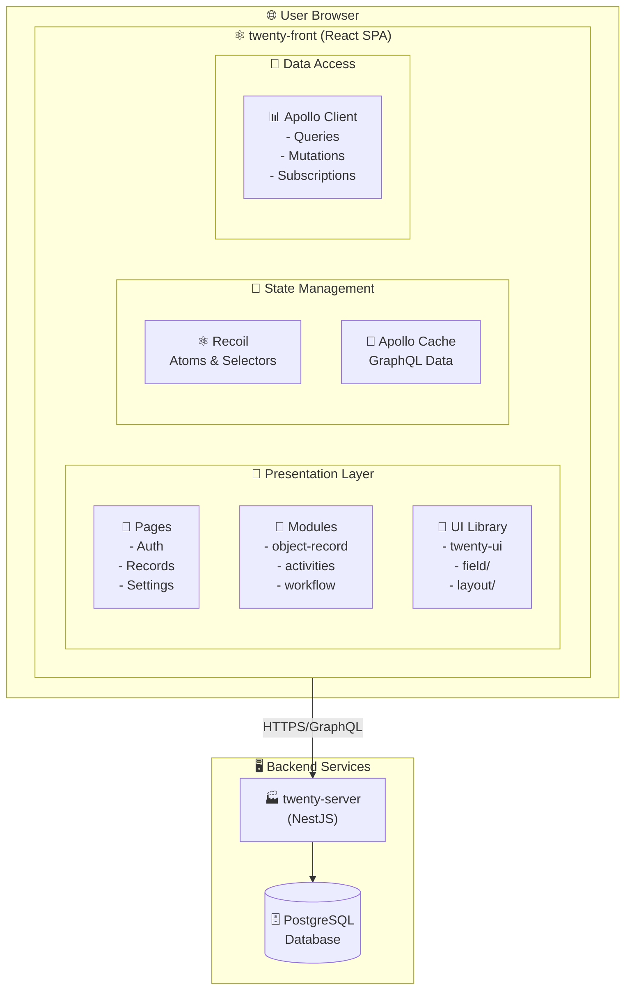
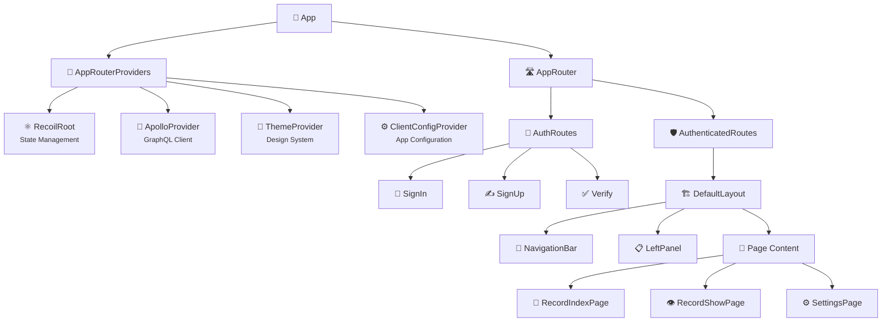

# 🏗️ Complete Architecture Guide

> **Your Complete Reference for Twenty's Architecture**
>
> This comprehensive guide explores Twenty's architecture from multiple perspectives - system design, frontend implementation, visual diagrams, and architectural patterns. It serves as your complete roadmap to understanding and working with the Twenty codebase.

## 📋 Table of Contents

- [🌟 Architecture Overview](#-architecture-overview)
- [🛠️ Technology Stack](#️-technology-stack)
- [📊 System Architecture Diagrams](#-system-architecture-diagrams)
- [🧩 Component Hierarchy](#-component-hierarchy)
- [🔄 Data Flow Patterns](#-data-flow-patterns)
- [📁 Folder Structure](#-folder-structure)
- [🏛️ Architectural Patterns](#️-architectural-patterns)
- [🧠 State Management](#-state-management)
- [🛣️ Routing Architecture](#️-routing-architecture)
- [🎨 UI Component System](#-ui-component-system)
- [🔧 Development Workflow](#-development-workflow)

---

## 🌟 Architecture Overview

Twenty follows a **feature-based modular architecture** where each module represents a business feature or a cohesive set of functionality. The frontend (`twenty-front`) is a modern React-based CRM built with TypeScript, designed for maintainability and developer productivity.

### 🎯 Design Principles

- **🎯 Separation of Concerns**: Clear boundaries between features
- **📈 Scalability**: Easy to add new features without affecting existing ones  
- **♻️ Reusability**: Shared components and utilities across modules
- **🔧 Maintainability**: Easier to understand, test, and modify code
- **🛡️ Type Safety**: Comprehensive TypeScript coverage

---

## 🛠️ Technology Stack

The twenty-front application is built on a modern, production-ready technology stack:

### ⚛️ Core Framework

- **React 18** 🚀 - Modern React with concurrent features
- **TypeScript** 📝 - Type-safe JavaScript with strict typing  
- **Vite** ⚡ - Next-generation frontend build tool for fast development

### 🧠 State Management

- **Recoil** ⚛️ - Flexible state management with atoms and selectors
- **Apollo Client** 🚀 - GraphQL client with built-in caching

### 🎨 Styling

- **Emotion** 💅 - CSS-in-JS library for component styling
- **Styled Components** 🎭 - Component-level styling with theming support

### 📊 GraphQL & Data

- **GraphQL** 📈 - Query language for the API
- **Apollo Client** 🚀 - Comprehensive GraphQL client
- **GraphQL Yoga** 🧘 - GraphQL server integration
- **GraphQL Code Generator** 🔧 - Automatic TypeScript types generation

### 🎪 UI & Interaction

- **React Hook Form** 📝 - Performant form management
- **@xyflow/react** 🔀 - For workflow diagram visualizations  
- **@hello-pangea/dnd** 🎯 - Drag and drop functionality
- **react-router-dom** 🛣️ - Client-side routing
- **react-datepicker** 📅 - Date selection components
- **BlockNote** ✍️ - Rich text editor with Markdown support

### 🌍 Internationalization

- **Lingui** 🗣️ - Modern i18n framework for React

### 🧪 Testing & Quality

- **Jest** ✅ - JavaScript testing framework
- **Storybook** 📚 - Component development and documentation
- **ESLint** 🔍 - Code linting with custom rules
- **Prettier** 💅 - Code formatting

### 📦 Monorepo Management

- **Nx** 🏗️ - Smart monorepo build system
- **Yarn 4** 🧶 - Package manager with workspaces

---

## 📊 System Architecture Diagrams

### 🌐 High-Level System Architecture



### 📊 Detailed ASCII Architecture

```
┌─────────────────────────────────────────────────────────────────────┐
│                         🌐 User Browser                             │
├─────────────────────────────────────────────────────────────────────┤
│                                                                     │
│  ┌─────────────────────────────────────────────────────────────┐   │
│  │                ⚛️ twenty-front (React SPA)                 │   │
│  │                                                             │   │
│  │  ┌──────────────┐  ┌─────────────────┐  ┌─────────────────┐ │   │
│  │  │   📄 Pages   │  │   🧩 Modules    │  │   🎯 UI Library │ │   │
│  │  │              │  │   (51 modules)  │  │   (twenty-ui)   │ │   │
│  │  │ • Auth       │  │ • object-record │  │ • field/        │ │   │
│  │  │ • Records    │  │ • activities    │  │ • layout/       │ │   │
│  │  │ • Settings   │  │ • workflow      │  │ • navigation/   │ │   │
│  │  └──────────────┘  └─────────────────┘  └─────────────────┘ │   │
│  │         │                   │                     │         │   │
│  │         └───────────────────┼─────────────────────┘         │   │
│  │                             │                               │   │
│  │         ┌───────────────────▼─────────────────────┐         │   │
│  │         │        🧠 State Management Layer        │         │   │
│  │         │  ┌─────────────┐  ┌──────────────────┐ │         │   │
│  │         │  │ ⚛️ Recoil   │  │ 🚀 Apollo Cache  │ │         │   │
│  │         │  │ (Atoms &    │  │ (GraphQL Data)   │ │         │   │
│  │         │  │ Selectors)  │  │                  │ │         │   │
│  │         │  └─────────────┘  └──────────────────┘ │         │   │
│  │         └───────────────────┬─────────────────────┘         │   │
│  │                             │                               │   │
│  │         ┌───────────────────▼─────────────────────┐         │   │
│  │         │        📡 Data Access Layer             │         │   │
│  │         │  ┌─────────────────────────────────────┐│         │   │
│  │         │  │   📊 Apollo Client (GraphQL)        ││         │   │
│  │         │  │   • Queries                         ││         │   │
│  │         │  │   • Mutations                       ││         │   │
│  │         │  │   • Subscriptions                   ││         │   │
│  │         │  │   • Cache Management                ││         │   │
│  │         │  └─────────────────────────────────────┘│         │   │
│  │         └───────────────────┬─────────────────────┘         │   │
│  └─────────────────────────────┼─────────────────────────────────┘   │
│                                │                                     │
└────────────────────────────────┼─────────────────────────────────────┘
                                 │
                                 │ HTTPS/GraphQL
                                 ▼
┌─────────────────────────────────────────────────────────────────────┐
│                       🖥️ Backend Services                          │
├─────────────────────────────────────────────────────────────────────┤
│  ┌─────────────────────────────────────────────────────────────┐    │
│  │               🏭 twenty-server (NestJS)                     │    │
│  │                                                             │    │
│  │  ┌─────────────────┐  ┌─────────────────┐  ┌─────────────┐ │    │
│  │  │  🔌 GraphQL API │  │  ⚙️ Core Modules│  │   🏗️ Engine │ │    │
│  │  │  (Yoga)         │  │  • Workflow     │  │   Modules   │ │    │
│  │  │                 │  │  • Calendar     │  │  • Metadata │ │    │
│  │  │                 │  │  • Messaging    │  │  • Data Src │ │    │
│  │  └─────────────────┘  └─────────────────┘  └─────────────┘ │    │
│  │         │                   │                     │        │    │
│  │         └───────────────────┼─────────────────────┘        │    │
│  │                             │                              │    │
│  │  ┌──────────────────────────▼──────────────────────────┐   │    │
│  │  │            🗄️ Database Layer (TypeORM)             │   │    │
│  │  └─────────────────────────────────────────────────────┘   │    │
│  └─────────────────────────────────────────────────────────────┘    │
└────────────────────────────┼────────────────────────────────────────┘
                             │
                             ▼
                ┌─────────────────────────┐
                │  🐘 PostgreSQL Database │
                └─────────────────────────┘
```

---

## 🧩 Component Hierarchy

### 🌳 Application Component Tree



### 📋 Detailed Component Tree

```
App
├── AppRouterProviders
│   ├── RecoilRoot                    # State management root
│   ├── ApolloProvider                # GraphQL client provider
│   ├── ThemeProvider                 # Theming system
│   └── ClientConfigProvider          # App configuration
│
└── AppRouter
    ├── AuthRoutes                    # Unauthenticated routes
    │   ├── /sign-in → SignIn
    │   ├── /sign-up → SignUp
    │   └── /verify → Verify
    │
    ├── AuthenticatedRoutes           # Protected routes
    │   ├── AppLayout
    │   │   ├── NavigationDrawer      # Left sidebar navigation
    │   │   ├── MainContent           # Main content area
    │   │   └── RightDrawer           # Right sidebar (contextual)
    │   │
    │   ├── /objects/:objectSlug      # Dynamic object routes
    │   │   └── RecordIndex
    │   │       ├── RecordTable       # Table view
    │   │       ├── RecordBoard       # Kanban view
    │   │       └── RecordFilters     # Filtering options
    │   │
    │   ├── /objects/:objectSlug/:recordId  # Record detail routes
    │   │   └── RecordShow
    │   │       ├── RecordDetails     # Main record form
    │   │       ├── RecordTimeline    # Activity timeline
    │   │       └── RecordRelations   # Related records
    │   │
    │   ├── /settings                 # Settings routes
    │   │   ├── /settings/profile     # User profile
    │   │   ├── /settings/workspace   # Workspace settings
    │   │   ├── /settings/objects     # Object configuration
    │   │   └── /settings/integrations # Integration settings
    │   │
    │   └── /workflows                # Workflow management
    │       ├── WorkflowList          # List of workflows
    │       └── WorkflowEditor        # Visual workflow editor
    │
    └── ErrorBoundary                 # Global error handling
```

---

## 🔄 Data Flow Patterns

### 📊 GraphQL Query Flow

```
👤 User Action
    │
    ▼
🎯 Event Handler (Component)
    │
    ▼
🔧 Custom Hook (Business Logic)
    │
    ├──► ⚛️ Recoil State Update (Local State)
    │
    └──► 🔌 GraphQL Mutation (Server State)
         │
         ▼
    💾 Apollo Cache Update
         │
         ▼
    🔄 Component Re-render
         │
         ▼
    ✨ UI Update
```

### 📈 Detailed Data Flow Diagram

```
┌──────────────┐
│  📱 Component │ ← User opens record list page
│ (RecordIndex) │
└──────┬───────┘
       │
       │ 1. Component renders
       ▼
┌──────────────────────┐
│  🔧 Custom Hook      │
│ (useFindManyRecords) │
└──────┬───────────────┘
       │
       │ 2. Execute GraphQL query
       ▼
┌──────────────────────┐
│  🚀 Apollo Client    │
│ • Check cache first  │
└──────┬───────────────┘
       │
       ├─── Cache hit? ─────────────────────┐
       │                                    │
       │ No                             Yes │
       ▼                                    │
┌──────────────────────┐                   │
│  🌐 Network Request  │                   │
│  POST /graphql       │                   │
│  {                   │                   │
│    query: "..."      │                   │
│    variables: {...}  │                   │
│  }                   │                   │
└──────┬───────────────┘                   │
       │                                    │
       │ 3. Server processes               │
       ▼                                    │
┌──────────────────────┐                   │
│  🏭 twenty-server    │                   │
│  GraphQL Resolver    │                   │
└──────┬───────────────┘                   │
       │                                    │
       │ 4. Database query                 │
       ▼                                    │
┌──────────────────────┐                   │
│   🐘 PostgreSQL      │                   │
│   Database           │                   │
└──────┬───────────────┘                   │
       │                                    │
       │ 5. Return data                    │
       ▼                                    │
┌──────────────────────┐                   │
│  📊 GraphQL Response │                   │
│  {                   │                   │
│    data: {...},      │                   │
│    extensions: {...} │                   │
│  }                   │                   │
└──────┬───────────────┘                   │
       │                                    │
       │ 6. Cache result                   │
       ▼                                    │
┌──────────────────────┐                   │
│  💾 Apollo Cache     │ ◄─────────────────┘
│  Normalized Storage  │
└──────┬───────────────┘
       │
       │ 7. Update component
       ▼
┌──────────────────────┐
│  🔄 Component        │
│  Re-renders with     │
│  new data            │
└──────────────────────┘
```

---

## 📁 Folder Structure

### 🗂️ Main Directory Structure

```
packages/twenty-front/
├── public/                           # Static assets
├── src/
│   ├── modules/                      # Feature modules (main application logic)
│   │   ├── activities/              # Activity management
│   │   ├── action-menu/             # Context menus
│   │   ├── auth/                    # Authentication
│   │   ├── companies/               # Company management
│   │   ├── people/                  # People/contacts management
│   │   ├── opportunities/           # Sales opportunities
│   │   ├── settings/                # Application settings
│   │   ├── ui/                      # UI components and utilities
│   │   ├── views/                   # View management (tables, boards)
│   │   ├── workflow/                # Workflow automation
│   │   └── object-record/           # Generic record operations
│   │
│   ├── pages/                       # Route components
│   │   ├── auth/                    # Authentication pages
│   │   ├── objects/                 # Object list/detail pages
│   │   ├── settings/                # Settings pages
│   │   └── workflows/               # Workflow pages
│   │
│   ├── generated/                   # Auto-generated files
│   │   └── graphql.tsx              # GraphQL types and hooks
│   │
│   ├── utils/                       # Utility functions
│   ├── hooks/                       # Shared custom hooks
│   ├── constants/                   # Application constants
│   └── App.tsx                      # Root application component
│
├── package.json                     # Dependencies and scripts
├── vite.config.ts                   # Vite configuration
├── tsconfig.json                    # TypeScript configuration
└── codegen.yml                      # GraphQL code generation config
```

### 🧩 Module Structure Example

```
src/modules/people/
├── components/                      # Module-specific components
│   ├── PeopleTable.tsx
│   ├── PersonCard.tsx
│   └── PersonForm.tsx
├── hooks/                          # Module-specific hooks
│   ├── usePeople.ts
│   └── usePersonForm.ts
├── graphql/                        # GraphQL queries/mutations
│   ├── queries.ts
│   └── mutations.ts
├── types/                          # Module-specific types
│   └── Person.ts
├── utils/                          # Module utilities
│   └── personUtils.ts
└── index.ts                        # Module exports
```

---

## 🏛️ Architectural Patterns

### 📊 Layered Architecture

```
┌─────────────────────────────────────────┐
│             📄 Pages Layer              │
│  (Route-level components)               │
│  • Compose features                     │
│  • Handle page-level logic              │
└──────────────┬──────────────────────────┘
               │
               ▼
┌─────────────────────────────────────────┐
│           🧩 Module Layer               │
│  (Feature-specific components)          │
│  • Business logic                       │
│  • Feature composition                  │
│  • State management                     │
└──────────────┬──────────────────────────┘
               │
               ▼
┌─────────────────────────────────────────┐
│            🎨 UI Layer                  │
│  (Reusable UI components)               │
│  • No business logic                    │
│  • Pure presentation                    │
│  • Fully reusable                       │
└─────────────────────────────────────────┘
```

### 🔧 Module-Based Architecture

Each module follows these principles:

- **🎯 Single Responsibility**: Each module handles one business domain
- **📦 Self-Contained**: Modules contain their own components, hooks, and utilities
- **🔗 Loose Coupling**: Modules communicate through well-defined interfaces
- **🔄 Reusable**: Components can be shared across modules when appropriate

---

## 🧠 State Management

### ⚛️ Recoil Architecture

```
Atoms (Global State)
├── currentUserState              # Current user information
├── currentWorkspaceState         # Active workspace
├── objectMetadataItemsState      # Object definitions
├── fieldMetadataItemsState       # Field definitions
└── viewFieldsState               # View configurations

Selectors (Derived State)
├── currentWorkspaceMemberState   # Current user's workspace membership
├── objectMetadataItemState       # Single object metadata by ID
├── availableFieldsState          # Fields available for current object
└── filteredRecordsState          # Records filtered by current view
```

### 🚀 Apollo Client Integration

```
Apollo Cache Structure
├── Object Types
│   ├── Person
│   ├── Company
│   ├── Opportunity
│   └── Activity
│
├── Fragments
│   ├── PersonFragment
│   ├── CompanyFragment
│   └── ActivityFragment
│
└── Policies
    ├── Type Policies
    ├── Field Policies
    └── Cache Directives
```

---

## 🛣️ Routing Architecture

### 📍 Route Structure

```
/                                   # Landing page (redirects to auth or app)
├── /sign-in                       # Sign in page
├── /sign-up                       # Sign up page
├── /verify                        # Email verification
├── /objects/:objectSlug           # Object list view
│   └── /:recordId                 # Record detail view
├── /settings                      # Settings root
│   ├── /profile                   # User profile settings
│   ├── /workspace                 # Workspace settings
│   ├── /objects                   # Object configuration
│   └── /integrations              # Integration settings
├── /workflows                     # Workflow management
└── /developers                    # Developer tools
    ├── /webhooks                  # Webhook management
    └── /api-keys                  # API key management
```

---

## 🎨 UI Component System

### 🎯 Component Categories

1. **🧱 Atomic Components** (`twenty-ui`)
   - Button, Input, Icon, Typography
   - No business logic, pure presentation

2. **🔧 Composite Components**
   - Form fields, Data tables, Modals
   - Combine multiple atomic components

3. **🧩 Feature Components**
   - Record forms, Activity timeline, Settings panels
   - Business logic and data integration

4. **📄 Page Components**
   - Complete page layouts
   - Route-level components

### 🎨 Design System Integration

```
Theme Structure
├── Colors
│   ├── Primary palette
│   ├── Secondary palette
│   ├── Semantic colors (success, warning, error)
│   └── Neutral colors
├── Typography
│   ├── Font families
│   ├── Font sizes
│   └── Line heights
├── Spacing
│   ├── Margin scale
│   └── Padding scale
└── Components
    ├── Button variants
    ├── Input variants
    └── Card variants
```

---

## 🔧 Development Workflow

### 🚀 Getting Started

1. **🔄 Clone and Setup**
   ```bash
   git clone [repository]
   cd twenty
   yarn install
   ```

2. **🔧 Environment Configuration**
   ```bash
   cp packages/twenty-front/.env.example packages/twenty-front/.env.local
   # Configure your environment variables
   ```

3. **🏃 Start Development Server**
   ```bash
   yarn front:dev
   ```

### 🧪 Testing Strategy

- **🔍 Unit Tests**: Jest + React Testing Library
- **🧩 Component Tests**: Storybook
- **🌐 E2E Tests**: Playwright
- **📊 Type Checking**: TypeScript strict mode

### 📦 Build Process

```
Development Build (Vite)
├── Hot Module Replacement
├── TypeScript compilation
├── ESLint checking
└── GraphQL code generation

Production Build
├── Code splitting
├── Asset optimization
├── Bundle analysis
└── Performance optimization
```

---

## 🔗 Related Documentation

- [📊 GraphQL Complete Guide](./graphql-complete-guide.mdx) - Complete GraphQL API reference
- [⚙️ Backend Architecture](./BACKEND_ARCHITECTURE.md) - Backend system overview
- [🐳 Docker Architecture](./twenty-docker-architecture.mdx) - Deployment and containerization
- [🔧 Backend Modules](./backend-modules.mdx) - Backend module documentation

---

*This comprehensive architecture guide is maintained to provide developers with a complete understanding of Twenty's frontend system and development patterns.*