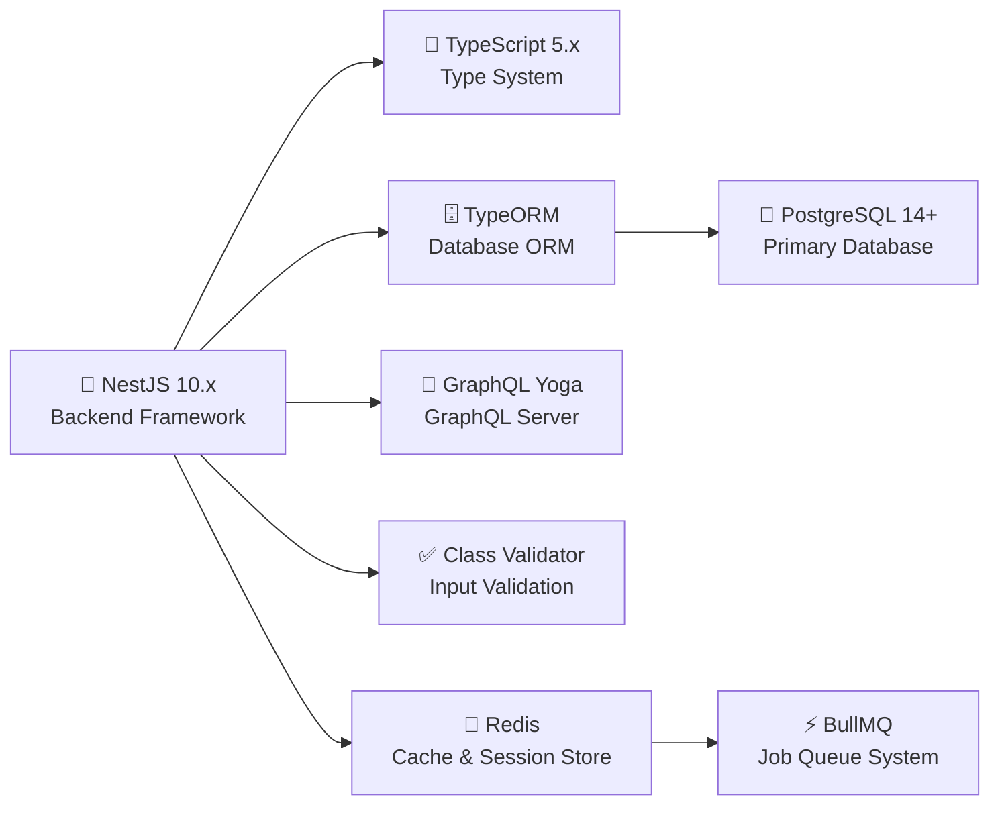
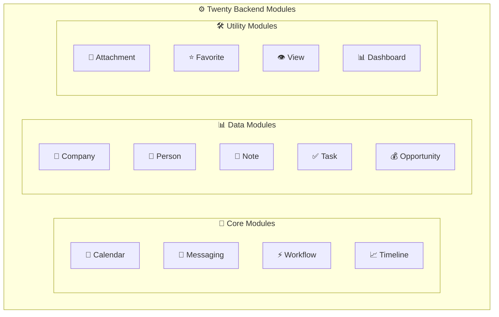

# 🏗️ Complete Backend Guide

> **Your Complete Reference for Twenty's Backend System**
>
> This comprehensive guide covers everything about Twenty's backend - from high-level architecture and technology stack to detailed module documentation and development guidelines. It serves as your complete roadmap to understanding and building with the Twenty backend.

## 📋 Table of Contents

- [🌟 Architecture Overview](#-architecture-overview)
- [🛠️ Technology Stack](#️-technology-stack)
- [📁 Project Structure](#-project-structure)
- [🏛️ Architecture Patterns](#️-architecture-patterns)
- [⚙️ Core Engine](#️-core-engine)
- [📊 Metadata System](#-metadata-system)
- [🏢 Workspace Architecture](#-workspace-architecture)
- [🔌 GraphQL API Layer](#-graphql-api-layer)
- [🗄️ Database Layer](#️-database-layer)
- [⚡ Background Jobs](#-background-jobs)
- [🧩 Business Modules](#-business-modules)
- [📖 Development Guidelines](#-development-guidelines)

---

## 🌟 Architecture Overview

The Twenty backend (`twenty-server`) is a sophisticated NestJS application that provides a robust, scalable, and flexible API layer for the Twenty CRM platform. It implements a multi-tenant architecture with dynamic schema generation, comprehensive metadata management, and powerful workflow capabilities.

### 🔑 Key Characteristics

- **🏢 Multi-Tenant**: Complete workspace isolation with separate schemas
- **⚡ Dynamic**: GraphQL schema generated from metadata
- **🛡️ Type-Safe**: Full TypeScript coverage
- **📈 Scalable**: Horizontal scaling with Redis and PostgreSQL
- **🔧 Extensible**: Plugin architecture for custom functionality
- **🔐 Secure**: Role-based access control and field-level permissions

### 🎯 Design Principles

- **🎯 Separation of Concerns**: Clear boundaries between features
- **📈 Scalability**: Easy to add new features without affecting existing ones  
- **♻️ Reusability**: Shared components and utilities across modules
- **🔧 Maintainability**: Easier to understand, test, and modify code
- **🛡️ Type Safety**: Comprehensive TypeScript coverage

---

## 🛠️ Technology Stack

### ⚙️ Core Technologies



### 📚 Key Libraries

```
Authentication:
├── Passport.js         # Auth middleware
├── JWT                 # Token-based auth
└── OAuth2              # Third-party auth

Data Processing:
├── BullMQ              # Background jobs
├── TypeORM             # ORM
└── DataLoader          # Batch loading

Integration:
├── Google APIs         # Gmail, Calendar
├── Microsoft Graph     # Outlook
└── Stripe              # Payments

Validation & Testing:
├── Class Validator     # Input validation
├── Jest                # Testing framework
└── Supertest           # HTTP testing
```

---

## 📁 Project Structure

### 🗂️ Main Directory Structure

```
twenty-server/
├── src/
│   ├── engine/                      # Core engine (main architecture)
│   │   ├── core-modules/           # Core functionality modules
│   │   │   ├── auth/               # Authentication & authorization
│   │   │   ├── user/               # User management
│   │   │   ├── workspace/          # Workspace management
│   │   │   ├── workspace-member/   # Member management
│   │   │   ├── billing/            # Billing & subscriptions
│   │   │   ├── feature-flag/       # Feature flags
│   │   │   ├── file/               # File storage
│   │   │   ├── analytics/          # Analytics tracking
│   │   │   ├── api-key/            # API key management
│   │   │   └── webhook/            # Webhook management
│   │   ├── metadata-modules/       # Metadata system
│   │   │   ├── object-metadata/    # Object definitions
│   │   │   ├── field-metadata/     # Field definitions
│   │   │   ├── relation-metadata/  # Relation definitions
│   │   │   ├── data-source/        # Data source management
│   │   │   └── workspace-migration/ # Schema migrations
│   │   ├── workspace-manager/      # Workspace management
│   │   │   ├── workspace-sync-metadata/ # Metadata sync
│   │   │   └── workspace-migration-runner/ # Migration execution
│   │   ├── api/                    # API layer
│   │   │   ├── graphql/            # GraphQL API
│   │   │   └── rest/               # REST API
│   │   ├── workspace-datasource/   # Dynamic data sources
│   │   └── workspace-resolver-builder/ # Dynamic resolvers
│   ├── modules/                     # Business logic modules
│   │   ├── messaging/              # Email integration
│   │   │   ├── message-import-manager/ # Email sync
│   │   │   ├── message-participant/ # Email participants
│   │   │   └── message-thread/     # Email threading
│   │   ├── calendar/               # Calendar integration
│   │   │   ├── calendar-event-import-manager/ # Event sync
│   │   │   └── calendar-event/     # Event management
│   │   ├── connected-account/      # Third-party accounts
│   │   ├── workflow/               # Workflow automation
│   │   │   ├── workflow-runner/    # Workflow execution
│   │   │   ├── workflow-trigger/   # Trigger system
│   │   │   └── workflow-action/    # Action system
│   │   ├── view/                   # View system
│   │   ├── favorite/               # Favorites
│   │   └── favorite-folder/        # Favorite folders
│   ├── database/                    # Database layer
│   │   ├── typeorm/                # TypeORM config
│   │   │   ├── core/               # Core schema
│   │   │   │   ├── migrations/     # Core migrations
│   │   │   │   └── core.datasource.ts # Core connection
│   │   │   └── metadata/           # Metadata schema
│   │   │       ├── migrations/     # Metadata migrations
│   │   │       └── metadata.datasource.ts # Metadata connection
│   │   └── typeorm-seeds/          # Database seeds
│   ├── queue-worker/               # Background worker
│   │   ├── queues/                 # Queue definitions
│   │   └── jobs/                   # Job handlers
│   ├── command/                     # CLI commands
│   │   ├── database/               # Database commands
│   │   └── workspace/              # Workspace commands
│   ├── filters/                     # Exception filters
│   ├── utils/                       # Utility functions
│   └── app.module.ts               # Root module
├── test/                            # Integration tests
│   └── integration/                # Integration test suites
└── package.json                     # Dependencies
```

### 🧩 Module Structure Example

```
src/modules/people/
├── components/                      # Module-specific components
│   ├── PeopleTable.tsx
│   ├── PersonCard.tsx
│   └── PersonForm.tsx
├── hooks/                          # Module-specific hooks
│   ├── usePeople.ts
│   └── usePersonForm.ts
├── graphql/                        # GraphQL queries/mutations
│   ├── queries.ts
│   └── mutations.ts
├── types/                          # Module-specific types
│   └── Person.ts
├── utils/                          # Module utilities
│   └── personUtils.ts
└── index.ts                        # Module exports
```

---

## 🏛️ Architecture Patterns

### 📊 Layered Architecture

```
┌─────────────────────────────────────────────┐
│         🔌 API Layer (GraphQL/REST)         │
│  • Request validation                       │
│  • Authentication/Authorization             │
│  • Response formatting                      │
└──────────────────┬──────────────────────────┘
                   │
┌──────────────────▼──────────────────────────┐
│           ⚙️ Service Layer                  │
│  • Business logic                           │
│  • Transaction management                   │
│  • Integration orchestration                │
└──────────────────┬──────────────────────────┘
                   │
┌──────────────────▼──────────────────────────┐
│       🗄️ Repository Layer (TypeORM)        │
│  • Data access                              │
│  • Query building                           │
│  • Cache management                         │
└──────────────────┬──────────────────────────┘
                   │
┌──────────────────▼──────────────────────────┐
│      🐘 Database Layer (PostgreSQL)         │
│  • Data persistence                         │
│  • Transactions                             │
│  • Constraints                              │
└─────────────────────────────────────────────┘
```

### 🧩 Module Architecture

```
NestJS Module Structure:

@Module({
  imports: [
    // Dependencies
    TypeOrmModule.forFeature([Entity]),
    OtherModule,
  ],
  controllers: [
    // REST controllers
    EntityController,
  ],
  providers: [
    // Services
    EntityService,
    // Resolvers (GraphQL)
    EntityResolver,
    // Repositories
    EntityRepository,
  ],
  exports: [
    // Exported services
    EntityService,
  ],
})
export class EntityModule {}
```

---

## ⚙️ Core Engine

The engine is the heart of Twenty's architecture, providing core functionality:

### 🔧 Core Modules

#### 1. 🔐 Auth Module (`engine/core-modules/auth`)

**Purpose**: Authentication and authorization

**Key Components:**
- `AuthService`: Main authentication logic
- `TokenService`: JWT token management
- `AuthResolver`: GraphQL auth endpoints
- `JwtAuthGuard`: Route protection

**Features:**
- Email/password authentication
- OAuth (Google, Microsoft)
- JWT token generation/validation
- Refresh token rotation
- API key authentication

**Flow:**
```
Login Request
    │
    ▼
AuthResolver.signIn()
    │
    ▼
AuthService.validateUser()
    │
    ├─► Verify credentials
    └─► Generate tokens
        │
        ▼
    Return { accessToken, refreshToken }
```

#### 2. 👤 User Module (`engine/core-modules/user`)

**Purpose**: User management

**Entities:**
```typescript
@Entity()
class User {
  @PrimaryGeneratedColumn('uuid')
  id: string;

  @Column()
  email: string;

  @Column({ nullable: true })
  firstName: string;

  @Column({ nullable: true })
  lastName: string;

  @Column({ nullable: true })
  passwordHash: string;

  @ManyToOne(() => Workspace)
  defaultWorkspace: Workspace;

  @OneToMany(() => WorkspaceMember, member => member.user)
  workspaceMembers: WorkspaceMember[];
}
```

#### 3. 🏢 Workspace Module (`engine/core-modules/workspace`)

**Purpose**: Multi-tenant workspace management

**Key Features:**
- Workspace creation
- Schema provisioning
- Workspace settings
- Member invitation
- Workspace deletion

**Workspace Creation Flow:**
```
1. Create workspace record (core schema)
2. Create PostgreSQL schema (workspace_xxx)
3. Run metadata migrations
4. Sync standard objects
5. Create default data (views, etc.)
6. Add creator as admin member
```

#### 4. 💰 Billing Module (`engine/core-modules/billing`)

**Purpose**: Subscription and billing management

**Integration:** Stripe

**Features:**
- Subscription management
- Payment processing
- Plan upgrades/downgrades
- Usage tracking
- Billing portal

---

## 📊 Metadata System

The metadata system is what makes Twenty flexible and extensible.

### 🎯 Metadata Architecture

```
┌─────────────────────────────────────────────┐
│         Metadata Schema (metadata)           │
├─────────────────────────────────────────────┤
│                                              │
│  ┌──────────────────────────────────────┐  │
│  │   Object Metadata                     │  │
│  │   - nameSingular: 'company'          │  │
│  │   - namePlural: 'companies'          │  │
│  │   - labelSingular: 'Company'         │  │
│  │   - isSystem: false                  │  │
│  └──────────────────┬───────────────────┘  │
│                     │                       │
│  ┌──────────────────▼───────────────────┐  │
│  │   Field Metadata                      │  │
│  │   - name: 'name'                     │  │
│  │   - type: 'TEXT'                     │  │
│  │   - label: 'Name'                    │  │
│  │   - isNullable: false                │  │
│  └──────────────────┬───────────────────┘  │
│                     │                       │
│  ┌──────────────────▼───────────────────┐  │
│  │   Relation Metadata                   │  │
│  │   - relationType: 'ONE_TO_MANY'      │  │
│  │   - fromObjectId: xxx                │  │
│  │   - toObjectId: yyy                  │  │
│  └──────────────────────────────────────┘  │
│                                              │
└─────────────────────────────────────────────┘
                     │
                     ▼
┌─────────────────────────────────────────────┐
│      Schema Generator                        │
│  - Generates GraphQL types                   │
│  - Generates database tables                 │
│  - Generates resolvers                       │
└─────────────────────────────────────────────┘
```

### 📋 Object Metadata

```typescript
@Entity()
class ObjectMetadata {
  @PrimaryGeneratedColumn('uuid')
  id: string;

  @Column()
  nameSingular: string;

  @Column()
  namePlural: string;

  @Column()
  labelSingular: string;

  @Column()
  labelPlural: string;

  @Column()
  description: string;

  @Column({ nullable: true })
  icon: string;

  @Column({ default: false })
  isSystem: boolean;

  @Column({ default: true })
  isActive: boolean;

  @OneToMany(() => FieldMetadata, field => field.object)
  fields: FieldMetadata[];

  @ManyToOne(() => Workspace)
  workspace: Workspace;
}
```

### 🏷️ Field Types

```typescript
enum FieldMetadataType {
  UUID = 'UUID',
  TEXT = 'TEXT',
  PHONE = 'PHONE',
  EMAIL = 'EMAIL',
  NUMERIC = 'NUMERIC',
  NUMBER = 'NUMBER',
  BOOLEAN = 'BOOLEAN',
  DATE_TIME = 'DATE_TIME',
  DATE = 'DATE',
  SELECT = 'SELECT',
  MULTI_SELECT = 'MULTI_SELECT',
  CURRENCY = 'CURRENCY',
  LINK = 'LINK',
  LINKS = 'LINKS',
  FULL_NAME = 'FULL_NAME',
  ADDRESS = 'ADDRESS',
  RATING = 'RATING',
  RELATION = 'RELATION',
  RICH_TEXT = 'RICH_TEXT',
}
```

### 🔄 Metadata Sync Process

When objects/fields are created or modified:

```
1. Update metadata tables
    │
    ▼
2. Generate migration SQL
    │
    ▼
3. Execute migration
    │
    ▼
4. Regenerate GraphQL schema
    │
    ▼
5. Update resolvers
    │
    ▼
6. Clear cache
    │
    ▼
7. Notify clients (if needed)
```

---

## 🏢 Workspace Architecture

### 🔄 Multi-Schema Design

Each workspace has its own PostgreSQL schema:

```sql
-- Core schema (shared)
CREATE SCHEMA core;
CREATE TABLE core.users (...);
CREATE TABLE core.workspaces (...);

-- Metadata schema (shared)
CREATE SCHEMA metadata;
CREATE TABLE metadata.object_metadata (...);
CREATE TABLE metadata.field_metadata (...);

-- Workspace 1 schema
CREATE SCHEMA workspace_abc123;
CREATE TABLE workspace_abc123.companies (...);
CREATE TABLE workspace_abc123.people (...);

-- Workspace 2 schema
CREATE SCHEMA workspace_def456;
CREATE TABLE workspace_def456.companies (...);
CREATE TABLE workspace_def456.people (...);
```

### 🏭 Workspace Datasource

Dynamic datasource creation per workspace:

```typescript
@Injectable()
class WorkspaceDatasourceFactory {
  async createDatasource(workspaceId: string): Promise<DataSource> {
    const workspace = await this.findWorkspace(workspaceId);
    
    return new DataSource({
      type: 'postgres',
      host: process.env.DB_HOST,
      port: parseInt(process.env.DB_PORT),
      username: process.env.DB_USER,
      password: process.env.DB_PASSWORD,
      database: process.env.DB_NAME,
      schema: `workspace_${workspace.id}`,
      entities: await this.buildEntities(workspace),
    });
  }
}
```

---

## 🔌 GraphQL API Layer

### 🎯 Dynamic Schema Generation

Schema is generated from metadata at runtime:

```typescript
class WorkspaceSchemaFactory {
  async createSchema(workspaceId: string): Promise<GraphQLSchema> {
    const objectMetadataCollection = await this.getObjectMetadata(workspaceId);
    
    // Generate types
    const types = objectMetadataCollection.map(object => 
      this.generateType(object)
    );
    
    // Generate queries
    const queries = objectMetadataCollection.map(object => ({
      [object.nameSingular]: this.generateFindOneQuery(object),
      [object.namePlural]: this.generateFindManyQuery(object),
    }));
    
    // Generate mutations
    const mutations = objectMetadataCollection.map(object => ({
      [`create${capitalize(object.nameSingular)}`]: this.generateCreateMutation(object),
      [`update${capitalize(object.nameSingular)}`]: this.generateUpdateMutation(object),
      [`delete${capitalize(object.nameSingular)}`]: this.generateDeleteMutation(object),
    }));
    
    return makeExecutableSchema({
      typeDefs: buildTypeDefs(types, queries, mutations),
      resolvers: buildResolvers(objectMetadataCollection),
    });
  }
}
```

### 📊 Generated Schema Example

```graphql
type Company {
  id: ID!
  name: String!
  domainName: String
  employees: Int
  address: Address
  createdAt: DateTime!
  updatedAt: DateTime!
  deletedAt: DateTime
  
  # Relations
  people: [Person!]!
  opportunities: [Opportunity!]!
}

type Query {
  company(id: ID!): Company
  companies(
    filter: CompanyFilterInput
    orderBy: [CompanyOrderByInput!]
    limit: Int
    offset: Int
  ): [Company!]!
}

type Mutation {
  createCompany(data: CompanyCreateInput!): Company!
  updateCompany(id: ID!, data: CompanyUpdateInput!): Company!
  deleteCompany(id: ID!): Company!
}
```

---

## 🗄️ Database Layer

### ⚙️ TypeORM Configuration

```typescript
// Core datasource
export const CoreDataSource = new DataSource({
  type: 'postgres',
  host: process.env.DB_HOST,
  port: parseInt(process.env.DB_PORT),
  username: process.env.DB_USER,
  password: process.env.DB_PASSWORD,
  database: process.env.DB_NAME,
  schema: 'core',
  entities: [User, Workspace, WorkspaceMember],
  migrations: ['src/database/typeorm/core/migrations/*.ts'],
});

// Metadata datasource
export const MetadataDataSource = new DataSource({
  type: 'postgres',
  host: process.env.DB_HOST,
  port: parseInt(process.env.DB_PORT),
  username: process.env.DB_USER,
  password: process.env.DB_PASSWORD,
  database: process.env.DB_NAME,
  schema: 'metadata',
  entities: [ObjectMetadata, FieldMetadata, RelationMetadata],
  migrations: ['src/database/typeorm/metadata/migrations/*.ts'],
});
```

### 🔧 Repository Pattern

```typescript
@Injectable()
class CompanyService {
  constructor(
    @InjectRepository(Company, 'workspace')
    private companyRepository: Repository<Company>,
  ) {}

  async findAll(filter?: CompanyFilter): Promise<Company[]> {
    const queryBuilder = this.companyRepository.createQueryBuilder('company');
    
    if (filter?.name) {
      queryBuilder.andWhere('company.name ILIKE :name', {
        name: `%${filter.name}%`,
      });
    }
    
    return queryBuilder.getMany();
  }

  async create(data: CreateCompanyDto): Promise<Company> {
    const company = this.companyRepository.create(data);
    return this.companyRepository.save(company);
  }
}
```

---

## ⚡ Background Jobs

### 🎯 BullMQ Architecture

```
┌─────────────────────────────────────────────┐
│            API Server (Producer)             │
│  - Enqueue jobs                              │
│  - Monitor job status                        │
└──────────────────┬──────────────────────────┘
                   │ Redis
                   ▼
┌─────────────────────────────────────────────┐
│              Redis (Queue)                   │
│  - Job persistence                           │
│  - Job scheduling                            │
│  - Job status                                │
└──────────────────┬──────────────────────────┘
                   │
                   ▼
┌─────────────────────────────────────────────┐
│          Worker Process (Consumer)           │
│  - Process jobs                              │
│  - Handle retries                            │
│  - Report progress                           │
└─────────────────────────────────────────────┘
```

### 🏭 Job Producer

```typescript
@Injectable()
class MessagingService {
  constructor(
    @InjectQueue('messaging')
    private messagingQueue: Queue,
  ) {}

  async syncMessages(connectedAccountId: string): Promise<void> {
    await this.messagingQueue.add('sync-messages', {
      connectedAccountId,
    }, {
      attempts: 3,
      backoff: {
        type: 'exponential',
        delay: 2000,
      },
    });
  }
}
```

### 🔧 Job Consumer

```typescript
@Processor('messaging')
class MessagingProcessor {
  constructor(
    private messagingImportService: MessagingImportService,
  ) {}

  @Process('sync-messages')
  async handleSyncMessages(job: Job<{ connectedAccountId: string }>) {
    const { connectedAccountId } = job.data;
    
    // Update progress
    await job.progress(10);
    
    // Process messages
    const messages = await this.messagingImportService.fetchMessages(
      connectedAccountId
    );
    
    await job.progress(50);
    
    await this.messagingImportService.importMessages(messages);
    
    await job.progress(100);
    
    return { imported: messages.length };
  }

  @OnQueueError()
  onError(error: Error) {
    console.error('Queue error:', error);
  }

  @OnQueueFailed()
  onFailed(job: Job, error: Error) {
    console.error(`Job ${job.id} failed:`, error);
  }
}
```

---

## 🧩 Business Modules

### 🎯 Module Architecture Overview

The Twenty backend follows a modular architecture where each module represents a distinct feature or domain. All modules are located in `packages/twenty-server/src/modules/` and are imported into the main `ModulesModule`.



### 📁 Directory Structure

```
📁 modules/
├── 📄 attachment/              # File attachments
├── 🚫 blocklist/              # Contact/domain blocking
├── 📅 calendar/               # Calendar synchronization
├── 🏢 company/                # Company entities
├── 🔗 connected-account/      # External account connections
├── 🤖 contact-creation-manager/ # Contact automation
├── 📊 dashboard/              # Dashboard widgets
├── ⭐ favorite/               # Favorites management
├── 📁 favorite-folder/        # Favorite folders
├── 🔍 match-participant/      # Participant matching
├── 📧 messaging/              # Email/message sync
├── 📝 note/                   # Notes management
├── 💰 opportunity/            # Sales opportunities
├── 👤 person/                 # Person/contact entities
├── ✅ task/                   # Task management
├── 📈 timeline/               # Activity timeline
├── 👁️ view/                   # Custom views & filters
├── ⚡ workflow/               # Workflow automation
└── 👥 workspace-member/       # Workspace members
```

## 🌟 Core Modules

### 📅 Calendar Module

**Purpose**: Manages calendar events and synchronization with external calendar providers (Google Calendar, Microsoft Calendar, CalDAV).

**Location**: `src/modules/calendar/`

**Key Components**:
- `CalendarEventImportManagerModule` - Imports calendar events from external providers
- `CalendarEventCleanerModule` - Cleans up old or orphaned calendar events
- `CalendarEventParticipantManagerModule` - Manages event participants and attendees
- `CalendarBlocklistManagerModule` - Handles blocked calendar contacts
- `CalendarCommonModule` - Shared calendar utilities and services

**Submodules**:
- **Calendar Event Import Manager**: Handles importing events from various calendar providers
  - `drivers/google-calendar/` - Google Calendar API integration
  - `drivers/microsoft-calendar/` - Microsoft Calendar API integration
  - `drivers/caldav/` - CalDAV protocol support
  - Services: Event fetching, saving, and exception handling

**Use Cases**:
- Sync calendar events from external providers
- Display user calendar events in the CRM
- Manage meeting participants and attendees
- Handle calendar event notifications

---

### 📧 Messaging Module

**Purpose**: Manages email and message synchronization from external email providers (Gmail, Outlook, IMAP).

**Location**: `src/modules/messaging/`

**Key Components**:
- `MessagingImportManagerModule` - Core message import functionality
- `MessagingMessageCleanerModule` - Cleans up messages and maintains data hygiene
- `MessageParticipantManagerModule` - Manages email participants and threads
- `MessagingBlocklistManagerModule` - Handles blocked email addresses
- `MessagingMonitoringModule` - Monitors messaging system health and performance

**Submodules**:
- **Message Import Manager**: Comprehensive email import system
  - `drivers/gmail/` - Gmail API integration
  - `drivers/microsoft/` - Microsoft Graph API for Outlook
  - `drivers/imap/` - IMAP protocol support
  - Cron jobs for scheduled imports
  - Services for message parsing and storage

- **Message Folder Manager**: Manages email folder structure
  - Syncs folder hierarchies from external providers
  - Maps external folders to internal structure

**Use Cases**:
- Sync emails from connected accounts
- Display email threads in contact timelines
- Track email communications with leads/customers
- Monitor email engagement

---

### ⚡ Workflow Module

**Purpose**: Provides workflow automation capabilities, including triggers, actions, and execution engine.

**Location**: `src/modules/workflow/`

**Key Components**:
- `WorkflowBuilderModule` - Visual workflow builder and schema management
- `WorkflowExecutorModule` - Executes workflow actions
- `WorkflowRunnerModule` - Manages workflow runs and execution queue
- `WorkflowTriggerModule` - Handles workflow triggers (manual, automated)
- `WorkflowStatusModule` - Tracks workflow execution status
- `WorkflowToolsModule` - Provides workflow utility functions
- `WorkflowCommonModule` - Shared workflow utilities

**Submodules**:

**Workflow Builder**:
- `WorkflowVersionModule` - Manages workflow versions
- `WorkflowVersionStepModule` - Individual workflow steps
- `WorkflowVersionEdgeModule` - Connections between steps
- `WorkflowSchemaModule` - Workflow schema validation

**Workflow Executor**:
- **Actions**: Different types of workflow actions
  - `ai-agent/` - AI-powered actions
  - `code/` - Custom code execution
  - `filter/` - Conditional logic
  - `form/` - Form submissions
  - `iterator/` - Loop through items
  - `record-crud/` - Create, read, update, delete records
  - `empty/` - Placeholder actions

**Workflow Runner**:
- `WorkflowRunModule` - Individual workflow run management
- `WorkflowRunQueueModule` - Queue for workflow execution using BullMQ

**Workflow Trigger**:
- `AutomatedTriggerModule` - Database-based triggers
- Query hooks for triggering workflows on data changes

**Use Cases**:
- Automate repetitive tasks
- Create custom business logic flows
- Trigger actions based on data changes
- Build complex multi-step processes

---

### 🔗 Connected Account Module

**Purpose**: Manages external account connections (email, calendar) and OAuth authentication.

**Location**: `src/modules/connected-account/`

**Key Components**:
- `AccountsToReconnectService` - Identifies accounts needing re-authentication
- `ConnectedAccountListener` - Listens to account events
- `ConnectedAccountWorkspaceMemberListener` - Handles workspace member account changes
- `DeleteWorkspaceMemberConnectedAccountsCleanupJob` - Cleanup job for deleted accounts

**Submodules**:
- **OAuth2 Client Manager**: Manages OAuth2 authentication flows
  - Token acquisition and refresh
  - Provider-specific OAuth implementations

- **Refresh Tokens Manager**: Handles token refresh logic
  - Automatic token renewal
  - Token expiration management

- **Email Alias Manager**: Manages email aliases for sending
  - Configure send-as addresses
  - Verify email ownership

- **IMAP API**: Direct IMAP protocol support
  - Alternative to API-based email access
  - Self-hosted email server support

**Use Cases**:
- Connect Gmail/Outlook accounts
- Manage OAuth tokens and refresh
- Handle account disconnections
- Support multiple connected accounts per user

---

### 👁️ View Module

**Purpose**: Manages custom views, filters, sorts, and field configurations for data tables.

**Location**: `src/modules/view/`

**Key Components**:
- View entities (ViewEntity, ViewFieldEntity, ViewFilterEntity, etc.)
- Integration with ObjectMetadataEntity for dynamic views
- Feature flag support for view capabilities

**Features**:
- **ViewEntity**: Stores view configurations
- **ViewFieldEntity**: Defines which fields are visible in a view
- **ViewFilterEntity**: Stores filter conditions
- **ViewFilterGroupEntity**: Groups multiple filters with AND/OR logic
- **ViewSortEntity**: Defines sort order
- **ViewGroupEntity**: Defines grouping logic

**Use Cases**:
- Create custom table views
- Save filter and sort configurations
- Share views across workspace members
- Personalize data display per user

---

### ⭐ Favorite Module

**Purpose**: Manages user favorites for quick access to records.

**Location**: `src/modules/favorite/`

**Key Components**:
- Standard objects for favorite records
- Services for managing favorites
- Listeners for favorite events
- Background jobs for cleanup

**Features**:
- Add/remove favorites
- Organize favorites in folders
- Quick access to frequently used records

**Use Cases**:
- Mark important contacts as favorites
- Quick access to active deals
- Organize frequently accessed records

---

## 📊 Data Management Modules

### 🏢 Company Module

**Purpose**: Manages company/organization entities in the CRM.

**Location**: `src/modules/company/`

**Features**:
- Company standard object definitions
- Relationships with contacts and opportunities
- Company-specific fields and metadata

**Use Cases**:
- Store company information
- Link contacts to companies
- Track company-level activities

---

### 👤 Person Module

**Purpose**: Manages person/contact entities in the CRM.

**Location**: `src/modules/person/`

**Features**:
- Person standard object definitions
- Contact information management
- Relationships with companies and opportunities

**Use Cases**:
- Store contact information
- Track contact interactions
- Manage contact relationships

---

### 💰 Opportunity Module

**Purpose**: Manages sales opportunities and pipeline stages.

**Location**: `src/modules/opportunity/`

**Features**:
- Opportunity standard object definitions
- Pipeline stage management
- Revenue and probability tracking

**Use Cases**:
- Track sales pipeline
- Forecast revenue
- Manage deal stages

---

### ✅ Task Module

**Purpose**: Manages tasks and to-do items.

**Location**: `src/modules/task/`

**Features**:
- Task standard object definitions
- Due dates and assignments
- Task status tracking

**Use Cases**:
- Create and assign tasks
- Track completion status
- Set reminders and due dates

---

### 📝 Note Module

**Purpose**: Manages notes and text annotations.

**Location**: `src/modules/note/`

**Features**:
- Rich text note storage
- Association with any record type
- Note sharing and permissions

**Use Cases**:
- Add notes to contacts or deals
- Document meeting outcomes
- Share information with team

---

### 📄 Attachment Module

**Purpose**: Manages file attachments and uploads.

**Location**: `src/modules/attachment/`

**Features**:
- File upload handling
- Storage integration (local, S3, etc.)
- Association with any record type

**Use Cases**:
- Upload documents to records
- Store contracts and agreements
- Share files with team members

---

## 🛠️ Supporting Modules

### 📈 Timeline Module

**Purpose**: Displays chronological activity timeline for records.

**Location**: `src/modules/timeline/`

**Features**:
- Aggregates activities across modules
- Displays emails, tasks, notes chronologically
- Filterable and searchable timeline

**Use Cases**:
- View all interactions with a contact
- Track deal progression history
- Audit record changes

---

### 📊 Dashboard Module

**Purpose**: Manages dashboard widgets and analytics.

**Location**: `src/modules/dashboard/`

**Features**:
- Widget management
- Dashboard layouts
- Data visualization

**Use Cases**:
- Display key metrics
- Create custom dashboards
- Track KPIs

---

### 🚫 Blocklist Module

**Purpose**: Manages blocked contacts and domains for calendar and messaging.

**Location**: `src/modules/blocklist/`

**Features**:
- Block specific email addresses or domains
- Prevent sync from blocked sources
- Shared blocklist across workspace

**Use Cases**:
- Block spam contacts
- Exclude internal emails from sync
- Filter unwanted calendar invites

---

### 🤖 Contact Creation Manager Module

**Purpose**: Automates contact creation from emails and calendar events.

**Location**: `src/modules/contact-creation-manager/`

**Features**:
- Automatic contact creation from email participants
- De-duplication logic
- Smart contact matching

**Use Cases**:
- Auto-create contacts from email threads
- Populate CRM from calendar meetings
- Reduce manual data entry

---

### 🔍 Match Participant Module

**Purpose**: Matches email/calendar participants with existing contacts.

**Location**: `src/modules/match-participant/`

**Features**:
- Email-based matching
- Fuzzy name matching
- Conflict resolution

**Use Cases**:
- Link email participants to CRM contacts
- Match calendar attendees to people records
- Resolve duplicate contacts

---

### 👥 Workspace Member Module

**Purpose**: Manages workspace members and their permissions.

**Location**: `src/modules/workspace-member/`

**Features**:
- Member management
- Role and permission assignments
- Member activity tracking

**Use Cases**:
- Add team members to workspace
- Assign roles and permissions
- Track member activity

---

## 🔄 Module Relationships

```
┌─────────────────────────────────────────────────────────┐
│                     ModulesModule                        │
└─────────────────────────────────────────────────────────┘
                           │
          ┌────────────────┼────────────────┐
          │                │                │
          ▼                ▼                ▼
  ┌──────────────┐  ┌──────────────┐  ┌──────────────┐
  │   Calendar   │  │  Messaging   │  │  Workflow    │
  │   Module     │  │   Module     │  │   Module     │
  └──────────────┘  └──────────────┘  └──────────────┘
          │                │                │
          └────────────────┼────────────────┘
                           │
                           ▼
                ┌──────────────────────┐
                │  ConnectedAccount    │
                │      Module          │
                └──────────────────────┘
                           │
          ┌────────────────┼────────────────┐
          │                │                │
          ▼                ▼                ▼
  ┌──────────────┐  ┌──────────────┐  ┌──────────────┐
  │   Person     │  │   Company    │  │ Opportunity  │
  │   Module     │  │   Module     │  │   Module     │
  └──────────────┘  └──────────────┘  └──────────────┘
```

---

## 📖 Development Guidelines

### 🏗️ Module Structure

Most modules follow this standard structure:

```
module-name/
├── module-name.module.ts     # Main module definition
├── services/                 # Business logic services
├── listeners/                # Event listeners
├── jobs/                     # Background jobs (cron)
├── query-hooks/              # Database query hooks
├── standard-objects/         # Standard object definitions
├── types/                    # TypeScript types
├── utils/                    # Utility functions
└── constants/                # Module constants
```

### 🔧 Service Layer

Services contain the core business logic and are exported for use by other modules. Example:

```typescript
@Injectable()
export class MyService {
  constructor(
    private readonly workspaceDataSourceService: WorkspaceDataSourceService,
  ) {}

  async doSomething(): Promise<Result> {
    // Business logic here
  }
}
```

### 🎧 Listeners

Listeners respond to events from other parts of the system:

```typescript
@Injectable()
export class MyListener {
  @OnEvent('entity.created')
  async handleEntityCreated(payload: EntityCreatedEvent) {
    // Handle event
  }
}
```

### ⚡ Background Jobs

Background jobs run on schedules or in response to queue events:

```typescript
@Processor(MessageQueue.cronQueue)
export class MyJob {
  @Process(MyJobPattern)
  async process(job: Job<MyJobData>) {
    // Job execution logic
  }
}
```

### 📊 DTO Validation

```typescript
// dto/create-entity.dto.ts
export class CreateEntityDto {
  @IsString()
  @IsNotEmpty()
  name: string;

  @IsEmail()
  @IsOptional()
  email?: string;

  @IsNumber()
  @Min(0)
  @Max(1000)
  @IsOptional()
  employees?: number;
}
```

### 🚨 Error Handling

```typescript
// Custom exception
export class EntityNotFoundException extends NotFoundException {
  constructor(id: string) {
    super(`Entity with ID ${id} not found`);
  }
}

// Usage
async findById(id: string): Promise<Entity> {
  const entity = await this.entityRepository.findOne({ where: { id } });
  
  if (!entity) {
    throw new EntityNotFoundException(id);
  }
  
  return entity;
}
```

### 🧪 Testing

```typescript
// entity.service.spec.ts
describe('EntityService', () => {
  let service: EntityService;
  let repository: Repository<Entity>;

  beforeEach(async () => {
    const module = await Test.createTestingModule({
      providers: [
        EntityService,
        {
          provide: getRepositoryToken(Entity),
          useValue: {
            find: jest.fn(),
            findOne: jest.fn(),
            save: jest.fn(),
          },
        },
      ],
    }).compile();

    service = module.get<EntityService>(EntityService);
    repository = module.get<Repository<Entity>>(getRepositoryToken(Entity));
  });

  it('should find all entities', async () => {
    const entities = [{ id: '1', name: 'Test' }];
    jest.spyOn(repository, 'find').mockResolvedValue(entities);

    expect(await service.findAll()).toEqual(entities);
  });
});
```

### 🎯 Best Practices

1. **Follow the modular approach**: Each module should have a single, well-defined responsibility
2. **Export services**: Make services available to other modules through the `exports` array
3. **Use dependency injection**: Leverage NestJS DI for loose coupling
4. **Implement listeners**: Use event-driven architecture for cross-module communication
5. **Define standard objects**: Use the standard object system for consistent data models
6. **Add query hooks**: Implement authorization and validation at the data layer
7. **Create background jobs**: Use jobs for long-running or scheduled operations
8. **Write tests**: Include unit and integration tests for all services
9. **Document types**: Use TypeScript interfaces and types for type safety
10. **Handle errors**: Implement proper error handling and logging

### 🧪 Testing Modules

Each module should include:
- **Unit tests** for services and utilities
- **Integration tests** for complex workflows
- **E2E tests** for API endpoints

Run tests:
```bash
npx nx test twenty-server                          # Unit tests
npx nx run twenty-server:test:integration:with-db-reset  # Integration tests
```

### ➕ Adding a New Module

To add a new module:

1. Create module directory: `src/modules/my-module/`
2. Create module file: `my-module.module.ts`
3. Add services, listeners, jobs as needed
4. Export module in `modules.module.ts`
5. Define standard objects if needed
6. Add tests
7. Document the module

Example module:

```typescript
import { Module } from '@nestjs/common';

@Module({
  imports: [],
  providers: [MyService],
  exports: [MyService],
})
export class MyModule {}
```

---

## 🔗 Related Documentation

- [📊 GraphQL Complete Guide](./graphql-complete-guide.mdx) - Complete GraphQL API reference
- [🏗️ Complete Architecture Guide](./complete-architecture-guide.mdx) - Frontend architecture overview
- [🐳 Docker Architecture](./twenty-docker-architecture.mdx) - Deployment and containerization

### 📚 External Resources

- [NestJS Documentation](https://docs.nestjs.com)
- [TypeORM Documentation](https://typeorm.io)
- [GraphQL Yoga Documentation](https://the-guild.dev/graphql/yoga-server)
- [BullMQ Documentation](https://docs.bullmq.io)
- [PostgreSQL Documentation](https://www.postgresql.org/docs)

---

*This comprehensive backend guide is maintained to provide developers with a complete understanding of Twenty's backend system, modules, and development patterns. It serves as the definitive reference for backend development on the Twenty platform.*