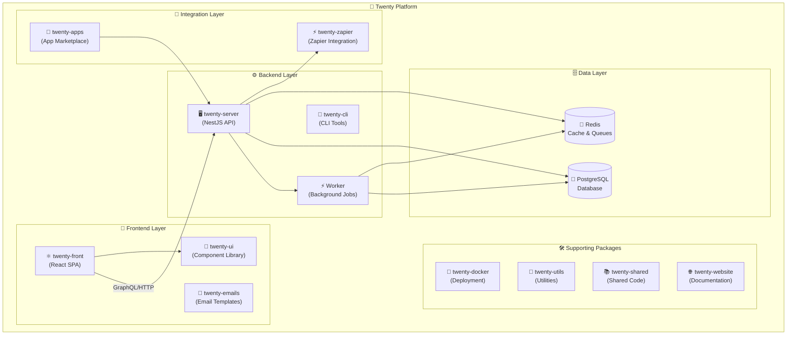

# 🚀 Complete Project Overview

> **Your Complete Guide to the Twenty CRM Platform**
>
> This comprehensive overview covers everything about Twenty - from high-level architecture and project structure to detailed development workflows and best practices. It serves as your complete introduction to understanding and working with the Twenty platform.

## 📋 Table of Contents

- [🌟 Platform Overview](#-platform-overview)
- [🏗️ Project Architecture](#️-project-architecture)
- [📦 Monorepo Structure](#-monorepo-structure)
- [🎨 Frontend Layer](#-frontend-layer)
- [⚙️ Backend Layer](#️-backend-layer)
- [🛠️ Technology Stack](#️-technology-stack)
- [🧩 Key Features & Modules](#-key-features--modules)
- [🔄 Development Workflow](#-development-workflow)
- [📚 Additional Resources](#-additional-resources)

---

## 🌟 Platform Overview

Twenty is an open-source CRM (Customer Relationship Management) platform built with modern web technologies. The project is designed to be flexible, extensible, and developer-friendly, offering a fresh alternative to traditional CRM systems.

### ✨ Key Features

- **🎯 Customizable Data Models**: Create and manage custom objects and fields
- **👁️ Flexible Views**: Table, Kanban, and other view types with filters, sorting, and grouping
- **⚙️ Workflow Automation**: Triggers and actions for automating business processes
- **🔐 Role-Based Permissions**: Fine-grained access control with custom roles
- **📧 Email & Calendar Integration**: Seamless integration with email and calendar events
- **🔌 GraphQL & REST APIs**: Modern API architecture for integration
- **🏢 Multi-Tenancy**: Complete workspace isolation with separate schemas
- **⚡ Real-time Updates**: Live updates via GraphQL subscriptions
- **🔍 Advanced Search**: Full-text search across all objects with quick access
- **🛡️ Type Safety**: Full TypeScript coverage throughout the platform

### 💡 Design Philosophy

- **🌍 Open-source and community-driven**: Built for transparency and collaboration
- **🎨 Modern UX patterns**: Inspired by tools like Notion, Airtable, and Linear
- **🔧 Extensible architecture**: Plugin capabilities and custom functionality
- **👩‍💻 Developer-friendly**: Comprehensive documentation and modern tooling
- **📈 Performance-focused**: Optimized for speed and scalability
- **♿ Accessibility**: ARIA compliance and keyboard navigation support

---

## 🏗️ Project Architecture

Twenty follows a **monorepo architecture** managed with Nx, containing multiple interconnected packages that work together to provide a complete CRM solution.

### 🌐 High-Level Architecture



### 📊 Detailed Platform Architecture

```
┌─────────────────────────────────────────────────────────────────────┐
│                         🚀 Twenty Platform                          │
├─────────────────────────────────────────────────────────────────────┤
│                                                                     │
│  ┌─────────────────────────────────────────────────────────────┐   │
│  │                🎨 Frontend Layer                            │   │
│  │                                                             │   │
│  │  ┌──────────────┐  ┌─────────────────┐  ┌─────────────────┐ │   │
│  │  │ twenty-front │  │    twenty-ui    │  │ twenty-emails   │ │   │
│  │  │ (React SPA)  │  │  (Components)   │  │  (Templates)    │ │   │
│  │  └──────────────┘  └─────────────────┘  └─────────────────┘ │   │
│  └─────────────────────────────────────────────────────────────┘   │
│                             │                                       │
│                             │ HTTPS/GraphQL/WebSocket               │
│                             ▼                                       │
│  ┌─────────────────────────────────────────────────────────────┐   │
│  │                ⚙️ Backend Layer                             │   │
│  │                                                             │   │
│  │  ┌──────────────┐  ┌─────────────────┐  ┌─────────────────┐ │   │
│  │  │twenty-server │  │     Worker      │  │   twenty-cli    │ │   │
│  │  │ (NestJS API) │  │ (Background)    │  │  (CLI Tools)    │ │   │
│  │  └──────────────┘  └─────────────────┘  └─────────────────┘ │   │
│  └─────────────────────────────────────────────────────────────┘   │
│                             │                                       │
│                             ▼                                       │
│  ┌─────────────────────────────────────────────────────────────┐   │
│  │                🗄️ Data Layer                                │   │
│  │                                                             │   │
│  │  ┌──────────────┐                    ┌─────────────────┐   │   │
│  │  │ PostgreSQL   │                    │     Redis       │   │   │
│  │  │ (Database)   │                    │ (Cache/Queue)   │   │   │
│  │  │              │                    │                 │   │   │
│  │  │ • Core       │                    │ • Sessions      │   │   │
│  │  │ • Metadata   │                    │ • Cache         │   │   │
│  │  │ • Workspaces │                    │ • Job Queue     │   │   │
│  │  └──────────────┘                    └─────────────────┘   │   │
│  └─────────────────────────────────────────────────────────────┘   │
│                                                                     │
│  ┌─────────────────────────────────────────────────────────────┐   │
│  │              🔗 Integration & Support Layer                 │   │
│  │                                                             │   │
│  │  ┌──────────────┐  ┌─────────────────┐  ┌─────────────────┐ │   │
│  │  │twenty-zapier │  │   twenty-apps   │  │ twenty-docker   │ │   │
│  │  │(Integration) │  │ (Marketplace)   │  │ (Deployment)    │ │   │
│  │  └──────────────┘  └─────────────────┘  └─────────────────┘ │   │
│  └─────────────────────────────────────────────────────────────┘   │
│                                                                     │
└─────────────────────────────────────────────────────────────────────┘
```

### 🎯 Architecture Principles

1. **🎯 Separation of Concerns**: Clear boundaries between frontend, backend, and shared code
2. **🧩 Modular Design**: Features organized into self-contained modules
3. **🔌 API-First**: GraphQL and REST APIs for all interactions
4. **🛡️ Type Safety**: TypeScript throughout the stack
5. **📈 Scalability**: Horizontal scaling with Redis and PostgreSQL
6. **🧪 Testability**: Comprehensive test infrastructure at all levels
7. **🔐 Security**: Multi-layer security with workspace isolation
8. **⚡ Performance**: Optimized queries, caching, and real-time updates

---

## 📦 Monorepo Structure

The project uses **Nx** for monorepo management and **Yarn 4** for package management.

### 🗂️ Directory Structure

```
twenty/
├── packages/
│   ├── twenty-front/           # React frontend application
│   ├── twenty-server/          # NestJS backend API
│   ├── twenty-ui/              # Shared UI component library
│   ├── twenty-shared/          # Shared types and utilities
│   ├── twenty-emails/          # Email templates (React Email)
│   ├── twenty-website/         # Next.js documentation website
│   ├── twenty-zapier/          # Zapier integration package
│   ├── twenty-e2e-testing/     # Playwright E2E tests
│   ├── twenty-apps/            # App marketplace
│   ├── twenty-cli/             # CLI tools
│   ├── twenty-docker/          # Docker configuration
│   └── twenty-utils/           # Utility functions
├── tools/                       # Build and development tools
│   ├── eslint-rules/           # Custom ESLint rules
│   └── ...
├── .github/                     # GitHub workflows and actions
├── nx.json                      # Nx workspace configuration
├── package.json                 # Root package configuration
├── tsconfig.base.json          # Base TypeScript configuration
├── eslint.config.mjs           # ESLint configuration
└── README.md                   # Project documentation
```

### 📊 Package Overview

| Package | Purpose | Technology | Size |
|---------|---------|------------|------|
| **twenty-front** | Main frontend application | React 18, Recoil, Emotion, Vite | Large |
| **twenty-server** | Backend API and worker | NestJS, TypeORM, GraphQL Yoga | Large |
| **twenty-ui** | Reusable UI components | React, Emotion, Storybook | Medium |
| **twenty-shared** | Shared types and utilities | TypeScript | Small |
| **twenty-emails** | Email templates | React Email | Small |
| **twenty-website** | Documentation site | Next.js | Medium |
| **twenty-zapier** | Zapier integration | Node.js | Small |
| **twenty-e2e-testing** | End-to-end tests | Playwright | Medium |
| **twenty-apps** | App marketplace | - | Small |
| **twenty-cli** | Command-line tools | Node.js | Small |
| **twenty-docker** | Docker configuration | Docker Compose | Small |
| **twenty-utils** | Utility functions | TypeScript | Small |

---

## 🎨 Frontend Layer

The frontend is a modern React application built with TypeScript, using Recoil for state management and Emotion for styling.

### 🏗️ Frontend Architecture

```
twenty-front/
├── src/
│   ├── modules/                 # Feature modules (51 modules)
│   │   ├── activities/         # Activity tracking
│   │   ├── auth/               # Authentication
│   │   ├── object-record/      # Record management
│   │   ├── object-metadata/    # Metadata management
│   │   ├── settings/           # Settings UI
│   │   ├── views/              # View management
│   │   ├── workflow/           # Workflow automation
│   │   ├── ui/                 # UI components
│   │   └── ...                 # Many more modules
│   ├── pages/                   # Route-level components
│   │   ├── auth/               # Auth pages
│   │   ├── object-record/      # Record pages
│   │   ├── onboarding/         # Onboarding flow
│   │   └── not-found/          # 404 page
│   ├── generated/              # GraphQL generated code
│   ├── generated-metadata/     # Metadata generated code
│   ├── hooks/                   # Global hooks
│   ├── utils/                   # Utility functions
│   ├── config/                  # Configuration
│   └── index.tsx               # Application entry
├── .storybook/                  # Storybook configuration
├── public/                      # Static assets
└── package.json                 # Package configuration
```

### 🧩 Key Frontend Technologies

- **⚛️ React 18**: Modern React with concurrent features
- **📝 TypeScript**: Full type safety with strict mode
- **🔗 Recoil**: Flexible state management with atoms and selectors
- **💅 Emotion**: CSS-in-JS with theming support
- **🚀 Apollo Client**: GraphQL client with caching and real-time updates
- **🛣️ React Router**: Client-side routing with nested routes
- **⚡ Vite**: Fast development server and optimized builds
- **🌍 Lingui**: Internationalization framework
- **📚 Storybook**: Component documentation and testing

### 🔄 Frontend Data Flow

```
User Interaction
    │
    ▼
React Component
    │
    ├─► Recoil State (Local)
    │
    └─► Apollo Client (Server)
        │
        ▼
    GraphQL Query/Mutation
        │
        ▼
    Backend API
        │
        ▼
    Database Update
        │
        ▼
    Real-time Subscription
        │
        ▼
    UI Update
```

---

## ⚙️ Backend Layer

The backend is built with NestJS, providing a robust and scalable API layer with advanced features like multi-tenancy and dynamic schema generation.

### 🏗️ Backend Architecture

```
twenty-server/
├── src/
│   ├── engine/                  # Core engine modules
│   │   ├── core-modules/       # Core functionality
│   │   │   ├── auth/           # Authentication
│   │   │   ├── user/           # User management
│   │   │   ├── workspace/      # Workspace management
│   │   │   ├── billing/        # Billing integration
│   │   │   └── ...
│   │   ├── metadata-modules/   # Metadata system
│   │   │   ├── object-metadata/ # Object definitions
│   │   │   ├── field-metadata/  # Field definitions
│   │   │   └── relation-metadata/ # Relations
│   │   ├── workspace-manager/  # Workspace isolation
│   │   ├── workspace-datasource/ # Dynamic data sources
│   │   └── api/                # API layer
│   ├── modules/                 # Business logic modules
│   │   ├── messaging/          # Email integration
│   │   ├── calendar/           # Calendar integration
│   │   ├── workflow/           # Workflow engine
│   │   ├── connected-account/  # Account connections
│   │   └── ...
│   ├── database/               # Database layer
│   │   ├── typeorm/            # TypeORM configuration
│   │   └── typeorm-seeds/      # Database seeds
│   ├── queue-worker/           # Background job worker
│   ├── command/                # CLI commands
│   ├── filters/                # Exception filters
│   ├── utils/                  # Utility functions
│   └── app.module.ts           # Root module
├── test/                        # Integration tests
└── package.json                 # Package configuration
```

### 🔧 Key Backend Technologies

- **🚀 NestJS**: Modern Node.js framework with dependency injection
- **📝 TypeScript**: Full type safety and modern JavaScript features
- **🗄️ TypeORM**: Advanced ORM with migration support
- **🔌 GraphQL Yoga**: High-performance GraphQL server
- **🐘 PostgreSQL**: Reliable relational database with advanced features
- **🔴 Redis**: High-performance caching and session storage
- **⚡ BullMQ**: Robust job queue system for background processing
- **🔐 Passport**: Authentication middleware with multiple strategies
- **🧪 Jest**: Comprehensive testing framework

### 🏢 Multi-Tenant Architecture

```
┌─────────────────────────────────────────┐
│         PostgreSQL Database             │
├─────────────────────────────────────────┤
│  Core Schema (core)                     │
│  - users, workspaces, auth              │
├─────────────────────────────────────────┤
│  Metadata Schema (metadata)             │
│  - object definitions                   │
│  - field definitions                    │
├─────────────────────────────────────────┤
│  Workspace Schema 1 (workspace_xxx)     │
│  - companies, people, opportunities     │
├─────────────────────────────────────────┤
│  Workspace Schema 2 (workspace_yyy)     │
│  - companies, people, opportunities     │
└─────────────────────────────────────────┘
```

---

## 🛠️ Technology Stack

### 🎨 Frontend Technologies

| Technology | Purpose | Version | Features |
|------------|---------|---------|----------|
| **React** | UI framework | 18.x | Concurrent features, Suspense |
| **TypeScript** | Type safety | 5.x | Strict mode, advanced types |
| **Recoil** | State management | Latest | Atoms, selectors, async state |
| **Emotion** | CSS-in-JS styling | Latest | Theming, responsive design |
| **Apollo Client** | GraphQL client | Latest | Caching, subscriptions, batching |
| **React Router** | Routing | 6.x | Nested routes, code splitting |
| **Vite** | Build tool | Latest | Fast HMR, optimized builds |
| **Lingui** | Internationalization | Latest | Compile-time optimization |
| **React Email** | Email templates | Latest | JSX-based email templating |
| **Storybook** | Component documentation | Latest | Visual testing, documentation |

### ⚙️ Backend Technologies

| Technology | Purpose | Version | Features |
|------------|---------|---------|----------|
| **NestJS** | Backend framework | 10.x | Decorators, DI, modular architecture |
| **TypeScript** | Type safety | 5.x | Strict mode, decorators |
| **TypeORM** | Database ORM | Latest | Active Record, migrations, relations |
| **GraphQL Yoga** | GraphQL server | Latest | Schema stitching, subscriptions |
| **PostgreSQL** | Primary database | 14+ | JSONB, full-text search, partitioning |
| **Redis** | Cache & sessions | Latest | Clustering, pub/sub, persistence |
| **BullMQ** | Job queue | Latest | Retries, rate limiting, priorities |
| **Passport** | Authentication | Latest | OAuth, JWT, local strategies |
| **Jest** | Testing framework | Latest | Mocking, coverage, parallelization |

### 🛠️ Development Tools

| Tool | Purpose | Features |
|------|---------|----------|
| **Nx** | Monorepo management | Caching, computation graph, generators |
| **Yarn 4** | Package manager | Plug'n'Play, workspaces, zero-installs |
| **ESLint** | Code linting | Custom rules, auto-fixing |
| **Prettier** | Code formatting | Consistent styling |
| **Playwright** | E2E testing | Cross-browser, visual testing |
| **Docker** | Containerization | Multi-stage builds, compose |
| **GitHub Actions** | CI/CD | Matrix builds, caching, deployment |

---

## 🧩 Key Features & Modules

### 🎯 Core Features

#### 1. 📊 Object & Field Management
**The metadata system allows users to create custom objects and fields:**
- **Standard Objects**: Companies, People, Opportunities, Tasks, Notes
- **Custom Objects**: User-defined entities with complete CRUD operations
- **Field Types**: Text, Number, Date, Select, Multi-Select, Email, Phone, URL, Currency, Rating, Address, Relation
- **Relations**: One-to-Many, Many-to-One, Many-to-Many with referential integrity

#### 2. 👁️ Views & Filters
**Flexible data presentation and manipulation:**
- **View Types**: Table (default), Kanban boards, Calendar view (upcoming)
- **Advanced Filters**: Multi-level filtering with AND/OR logic, nested conditions
- **Sorting**: Multi-column sorting with custom orders
- **Grouping**: Group by any field with collapsible sections
- **Saved Views**: Personal and shared views with permissions

#### 3. 📈 Activities & Timeline
**Comprehensive activity tracking and history:**
- **Tasks**: To-do items with due dates, assignees, and priorities
- **Notes**: Rich-text notes with attachments and mentions
- **Emails**: Integrated email tracking with threading and participants
- **Timeline**: Chronological activity feed with filtering and search
- **Automated Activities**: System-generated activities for record changes

#### 4. ⚡ Workflow Automation
**Powerful automation engine for business processes:**
- **Triggers**: Record events (create, update, delete), scheduled triggers, webhook triggers
- **Actions**: Update records, send emails, call webhooks, execute custom code
- **Conditions**: Advanced conditional logic with multiple criteria
- **Versioning**: Workflow version history and rollback capabilities
- **Monitoring**: Execution logs and error tracking

#### 5. 🔐 Permissions & Roles
**Fine-grained access control system:**
- **Role-Based Access**: Admin, Member, Viewer, and custom roles
- **Object-Level Permissions**: CRUD permissions per object type
- **Field-Level Permissions**: Read/Write permissions per field
- **Workspace Isolation**: Complete data separation between workspaces
- **API Key Management**: Granular API access control

#### 6. 🔗 Integrations
**Connect with external services and platforms:**
- **Email Providers**: Gmail, Outlook with bi-directional sync
- **Calendar Providers**: Google Calendar, Outlook Calendar with event sync
- **Zapier Integration**: Connect to 5000+ applications
- **Webhooks**: Custom integrations with real-time event notifications
- **APIs**: GraphQL & REST APIs with comprehensive documentation

#### 7. 🔍 Search & Navigation
**Powerful search and quick access capabilities:**
- **Full-text Search**: Across all objects and fields with relevance ranking
- **Quick Search**: Command-K interface for instant access
- **Recent Items**: Quick access to recently viewed records
- **Favorites**: Bookmark important records for easy access
- **Global Navigation**: Consistent navigation patterns across the application

### 🏗️ Frontend Modules

#### Core UI Modules
- **ui/display**: Components for displaying data (chips, tags, icons, avatars)
- **ui/input**: Form components (buttons, inputs, selects, toggles)
- **ui/navigation**: Navigation components (menus, breadcrumbs, tabs)
- **ui/data**: Data components (tables, lists, grids)
- **ui/layout**: Layout components (pages, sections, panels)
- **ui/feedback**: User feedback (modals, notifications, loading states)

#### Business Logic Modules  
- **auth**: Authentication and authorization flows
- **object-record**: Core record management and CRUD operations
- **object-metadata**: Dynamic object and field management
- **views**: View configuration and management
- **activities**: Activity tracking and timeline
- **workflow**: Workflow builder and execution
- **settings**: Application and workspace settings

### ⚙️ Backend Modules

#### Core Engine Modules
- **auth**: JWT authentication, OAuth providers, API keys
- **user**: User management and profile handling
- **workspace**: Multi-tenant workspace management
- **billing**: Stripe integration for subscriptions
- **metadata**: Dynamic schema and object management

#### Business Logic Modules
- **messaging**: Email sync (Gmail, Outlook, IMAP)
- **calendar**: Calendar event sync and management
- **workflow**: Workflow automation engine
- **connected-account**: Third-party account management
- **view**: View configuration and filtering
- **favorite**: User favorites and quick access

---

## 🔄 Development Workflow

### 🚀 Getting Started

```bash
# Clone the repository
git clone https://github.com/twentyhq/twenty.git
cd twenty

# Install dependencies
yarn install

# Start development environment
yarn start
```

This starts:
- Frontend dev server (http://localhost:3001)
- Backend API server (http://localhost:3000)
- Background worker
- PostgreSQL (via Docker)
- Redis (via Docker)

### 💻 Development Commands

#### 🎨 Frontend Development
```bash
# Start frontend dev server
npx nx start twenty-front

# Run frontend tests
npx nx test twenty-front

# Run frontend linting
npx nx lint twenty-front

# Fix linting issues
npx nx lint twenty-front --fix

# Build frontend for production
npx nx build twenty-front

# Run Storybook for component development
npx nx storybook:dev twenty-front

# Generate GraphQL types
npx nx run twenty-front:graphql:generate
```

#### ⚙️ Backend Development
```bash
# Start backend server
npx nx start twenty-server

# Start background worker
npx nx run twenty-server:worker

# Run backend tests
npx nx test twenty-server

# Run integration tests
npx nx run twenty-server:test:integration:with-db-reset

# Run backend linting
npx nx lint twenty-server

# Build backend for production
npx nx build twenty-server

# Database management
npx nx database:reset twenty-server
npx nx run twenty-server:database:migrate:prod
npx nx run twenty-server:command workspace:sync-metadata -f
```

#### 🧪 Testing & Quality
```bash
# Run all tests
npx nx run-many -t test

# Run E2E tests
npx nx e2e twenty-e2e-testing

# Run Storybook tests
npx nx storybook:serve-and-test:static twenty-front

# Lint all packages
npx nx run-many -t lint

# Format all packages
npx nx run-many -t fmt

# Type check all packages
npx nx run-many -t typecheck
```

### 📏 Development Guidelines

#### 🎨 Frontend Best Practices
1. **Functional components only** - Use React hooks for state and effects
2. **Named exports only** - Avoid default exports for better tree-shaking
3. **Types over interfaces** - Use `type` except when extending third-party interfaces
4. **Event handlers over useEffect** - Prefer event-driven state updates
5. **No 'any' type allowed** - Always use proper TypeScript types
6. **Component composition** - Build complex components from simpler ones

#### ⚙️ Backend Best Practices
1. **Modular architecture** - Organize features into separate NestJS modules
2. **Dependency injection** - Use NestJS DI container for loose coupling
3. **DTOs for validation** - Input validation with class-validator decorators
4. **Repository pattern** - Abstract data access layer
5. **Service layer** - Keep business logic in services, not controllers
6. **Error handling** - Use custom exceptions and global filters

### 🧪 Testing Strategy

#### 1. **Unit Tests**
**Test individual functions and components in isolation**
- **Frontend**: Jest + React Testing Library for component testing
- **Backend**: Jest with mocking for service and utility testing
- **Coverage**: Aim for >80% code coverage on critical paths

#### 2. **Integration Tests**
**Test module interactions and API endpoints**
- **Backend**: Jest with test database for API endpoint testing
- **Database**: Test database operations and migrations
- **Services**: Test service interactions and external API calls

#### 3. **End-to-End Tests**
**Test complete user workflows**
- **Playwright**: Browser automation for critical user journeys
- **Visual Testing**: Screenshot comparison for UI regression testing
- **Performance**: Load testing and performance monitoring

#### 4. **Component Tests**
**Visual testing and component behavior**
- **Storybook**: Component stories and interaction testing
- **Visual Regression**: Chromatic for visual diff testing
- **Accessibility**: Automated accessibility testing

### 🚀 CI/CD Pipeline

**GitHub Actions automate the development workflow:**

#### 🔍 Code Quality
- **Linting**: ESLint with custom rules for code standards
- **Formatting**: Prettier for consistent code formatting
- **Type Checking**: TypeScript compilation across all packages
- **Dependency Checking**: Automated security vulnerability scanning

#### 🧪 Testing
- **Unit Tests**: Parallel test execution across packages
- **Integration Tests**: Database and API testing
- **E2E Tests**: Cross-browser testing with Playwright
- **Visual Tests**: Storybook and Chromatic integration

#### 🏗️ Build & Deploy
- **Build Optimization**: Parallel builds with Nx caching
- **Docker Images**: Multi-stage builds for production deployment
- **Environment Management**: Automated deployment to staging and production
- **Performance Monitoring**: Build performance tracking and optimization

---

## 📚 Additional Resources

### 📖 Documentation
- [📊 Complete Backend Guide](./complete-backend-guide.mdx) - Comprehensive backend documentation
- [🏗️ Complete Architecture Guide](./complete-architecture-guide.mdx) - Frontend architecture details
- [📈 GraphQL Complete Guide](./graphql-complete-guide.mdx) - GraphQL API reference
- [🐳 Docker Architecture](./twenty-docker-architecture.mdx) - Deployment guide
- [📚 Documentation Guide](./DOCUMENTATION_GUIDE.md) - How to write documentation

### 🌐 External Links
- [Official Documentation](https://twenty.com/developers) - Complete developer documentation
- [Local Setup Guide](https://twenty.com/developers/local-setup) - Development environment setup
- [Self-Hosting Guide](https://twenty.com/developers/section/self-hosting) - Production deployment
- [API Documentation](https://twenty.com/developers/graphql-apis) - GraphQL API reference

### 🤝 Community
- [Discord Server](https://discord.gg/cx5n4Jzs57) - Join the developer community
- [GitHub Discussions](https://github.com/twentyhq/twenty/discussions) - Technical discussions
- [Contributing Guide](https://github.com/twentyhq/twenty/blob/main/.github/CONTRIBUTING.md) - How to contribute
- [Code of Conduct](https://github.com/twentyhq/twenty/blob/main/CODE_OF_CONDUCT.md) - Community guidelines

### 🎨 Design Resources
- [Figma Design Files](https://www.figma.com/file/xt8O9mFeLl46C5InWwoMrN/Twenty) - Design system and mockups
- [UI Component Library](https://twenty.com/twenty-ui) - Storybook documentation
- [Brand Guidelines](https://twenty.com/brand) - Brand assets and guidelines

---

## 🎯 Conclusion

Twenty represents a modern approach to CRM development, combining proven technologies with innovative architectural patterns. The platform's modular design, comprehensive type safety, and developer-friendly tooling make it an excellent choice for both contribution and deployment.

### 🌟 Key Strengths

- **🏗️ Solid Architecture**: Well-designed monorepo with clear separation of concerns
- **🛡️ Type Safety**: Full TypeScript coverage ensures reliability and maintainability
- **📈 Scalability**: Multi-tenant architecture designed for growth
- **🧪 Quality Assurance**: Comprehensive testing strategy across all layers
- **👥 Developer Experience**: Modern tooling and excellent documentation
- **🌍 Open Source**: Transparent development with active community

### 🚀 Getting Involved

Whether you're looking to:
- **Contribute** to the open-source project
- **Deploy** your own instance
- **Integrate** with the APIs
- **Extend** the platform with custom features

This documentation provides the foundation you need to get started. For specific technical details, refer to the specialized guides linked in the [Additional Resources](#-additional-resources) section.

**Ready to dive in? Start with the [local setup guide](https://twenty.com/developers/local-setup) and join our [Discord community](https://discord.gg/cx5n4Jzs57)!**

---

*This project overview is regularly updated to reflect the latest developments and improvements in the Twenty platform. Last updated: December 2024*