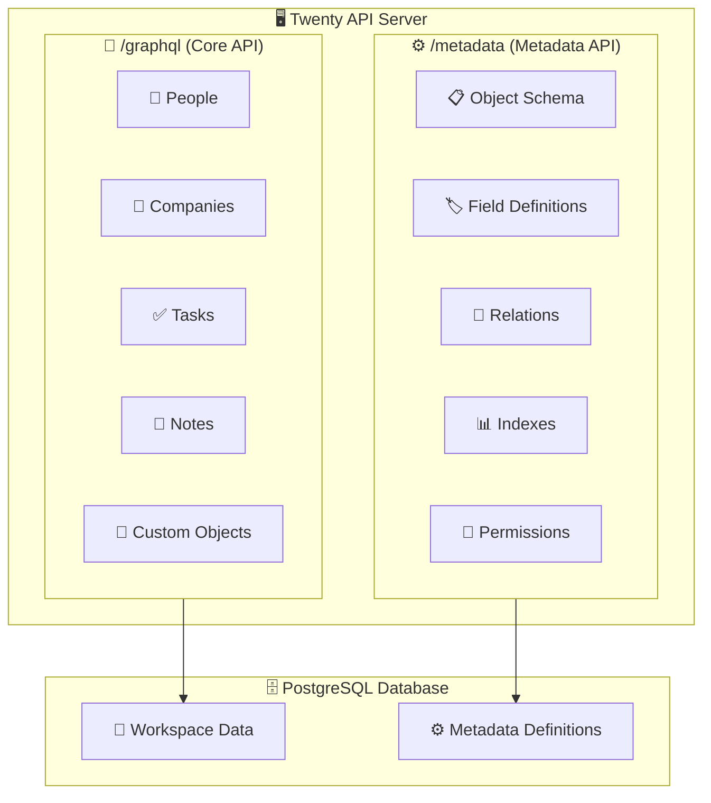

# 🔌 GraphQL Complete Guide

> **Your Complete Reference for Twenty's GraphQL APIs**
>
> This comprehensive guide covers everything you need to know about Twenty's GraphQL implementation, including both Core API (`/graphql`) and Metadata API (`/metadata`) endpoints, with practical examples and architectural insights.

## 📋 Table of Contents

- [🎯 API Overview](#-api-overview)
- [🏗️ System Architecture](#️-system-architecture)
- [🚀 Core API (`/graphql`)](#-core-api-graphql)
- [⚙️ Metadata API (`/metadata`)](#️-metadata-api-metadata)
- [📊 Schema Generation](#-schema-generation)
- [💡 Quick Examples](#-quick-examples)
- [🛠️ Best Practices](#️-best-practices)
- [🔧 Development Tips](#-development-tips)

---

## 🎯 API Overview

Twenty provides two distinct GraphQL API endpoints that serve different purposes in the CRM platform:

1. **🚀 Core API (`/graphql`)** - Dynamic workspace data operations
2. **⚙️ Metadata API (`/metadata`)** - Schema configuration and data model management

### 📊 Quick Comparison

| Feature | 🚀 `/graphql` (Core API) | ⚙️ `/metadata` (Metadata API) |
|---------|----------------------|----------------------------|
| **🔗 URL** | `https://api.twenty.com/graphql` | `https://api.twenty.com/metadata` |
| **🎯 Purpose** | Query and modify CRM data | Configure data model |
| **📋 Schema** | Dynamic per workspace | Fixed schema |
| **📊 Data Type** | Records (people, companies) | Definitions (objects, fields) |
| **🔐 Authentication** | API Key (workspace access) | API Key (admin access) |
| **👥 Typical Users** | Integrations, apps, scripts | Admin tools, schema managers |
| **💾 Cache Strategy** | Schema cached by version | Short TTL |
| **🔍 Example Query** | `{ people { ... } }` | `{ objects { ... } }` |
| **✏️ Example Mutation** | `createPerson(...)` | `createOneField(...)` |

---

## 🏗️ System Architecture

### 🌐 High-Level Overview



### 🔄 System Architecture (ASCII)

```
┌─────────────────────────────────────────────────────────────────────────┐
│                      🚀 Twenty CRM Platform                             │
│                                                                         │
│  ┌────────────────────────────────────────────────────────────────────┐ │
│  │                 🔌 API Layer (NestJS)                              │ │
│  │                                                                    │ │
│  │  ┌───────────────────────┐      ┌──────────────────────────┐      │ │
│  │  │                       │      │                          │      │ │
│  │  │   🚀 /graphql         │      │   ⚙️ /metadata          │      │ │
│  │  │   Core API            │      │   Metadata API           │      │ │
│  │  │                       │      │                          │      │ │
│  │  │   GraphQL Yoga        │      │   GraphQL Yoga           │      │ │
│  │  │   + Workspace Schema  │      │   + Fixed Schema         │      │ │
│  │  │                       │      │                          │      │ │
│  │  └───────────┬───────────┘      └───────────┬──────────────┘      │ │
│  │              │                              │                     │ │
│  │              └──────────────┬───────────────┘                     │ │
│  │                             │                                     │ │
│  │  ┌──────────────────────────▼─────────────────────────────────┐   │ │
│  │  │                                                            │   │ │
│  │  │             ⚙️ Core Modules & Services                     │   │ │
│  │  │                                                            │   │ │
│  │  │  • Authentication        • Cache Storage                  │   │ │
│  │  │  • Authorization         • Dataloaders                    │   │ │
│  │  │  • Schema Factory        • Exception Handlers             │   │ │
│  │  │  • Resolver Factory      • Metrics                        │   │ │
│  │  │                                                            │   │ │
│  │  └────────────────────────────┬───────────────────────────────┘   │ │
│  └───────────────────────────────┼─────────────────────────────────────┘ │
│                                  │                                     │
│  ┌───────────────────────────────▼─────────────────────────────────┐   │
│  │                     🗄️ Data Layer                              │   │
│  │                                                                 │   │
│  │  ┌────────────────────┐      ┌────────────────────┐            │   │
│  │  │   🐘 PostgreSQL    │      │   🔴 Redis         │            │   │
│  │  │                    │      │                    │            │   │
│  │  │  • Workspace Data  │      │  • Schema Cache    │            │   │
│  │  │  • Metadata Tables │      │  • Session Store   │            │   │
│  │  │  • User Data       │      │  • Rate Limiting   │            │   │
│  │  └────────────────────┘      └────────────────────┘            │   │
│  └─────────────────────────────────────────────────────────────────┘   │
└─────────────────────────────────────────────────────────────────────────┘
```

---

## 🚀 Core API (`/graphql`)

The Core API is a **dynamically generated GraphQL endpoint** that provides access to your workspace's actual CRM data. The schema for this endpoint is unique to each workspace and is built at runtime based on the metadata configuration.

### 🔑 Key Characteristics

- **⚡ Dynamic Schema**: Generated automatically from workspace metadata
- **📊 Data Operations**: CRUD operations on CRM entities (people, companies, tasks, etc.)
- **🏢 Workspace-Specific**: Each workspace has its own unique schema
- **⚡ Real-time**: Reflects current workspace data structure
- **🔧 Custom Objects**: Includes both standard and custom objects defined in the workspace

### 📋 Schema Generation Process

```
┌─────────────────────────────────────────────────────────────┐
│              🚀 Core API Schema Generation                  │
│                                                             │
│  1. 🔐 User Authentication                                  │
│     └─▶ Extract workspace ID from JWT token                │
│                                                             │
│  2. 📊 Metadata Retrieval                                  │
│     └─▶ Fetch object metadata from cache or database       │
│     └─▶ Include field definitions, relations, indexes      │
│                                                             │
│  3. 🏗️ Schema Building                                     │
│     └─▶ Generate GraphQL types from object metadata        │
│     └─▶ Create query resolvers (findOne, findMany)         │
│     └─▶ Create mutation resolvers (create, update, delete) │
│     └─▶ Build relationship resolvers                       │
│                                                             │
│  4. 💾 Caching                                             │
│     └─▶ Cache generated schema with metadata version       │
│     └─▶ Reuse cached schema until metadata changes         │
│                                                             │
│  5. 🎯 Serve GraphQL Endpoint                              │
│     └─▶ Execute queries against workspace database         │
└─────────────────────────────────────────────────────────────┘
```

### 🔄 Request Processing Flow

```
📨 Incoming Request
    │
    ▼
🔐 Authentication & Workspace Extraction
    │
┌──────────────────────────────────────────┐
│ WorkspaceAuthGuard                       │
│  • Validate API Key / JWT Token         │
│  • Extract Workspace ID                 │
│  • Load User Context                    │
│  • Check Workspace Access               │
└──────────────────┬───────────────────────┘
                   │
                   │ ✅ Success: workspace = { id: "uuid", ... }
                   ▼
📋 Schema Resolution
    │
┌──────────────────────────────────────────┐
│ SchemaBuilder                            │
│  • Load Workspace Metadata              │
│  • Check Schema Cache                   │
│  • Generate/Retrieve GraphQL Schema     │
└──────────────────┬───────────────────────┘
                   │
                   ▼
🎯 Query Execution
    │
┌──────────────────────────────────────────┐
│ GraphQL Execution Engine                │
│  • Parse & Validate Query               │
│  • Execute Field Resolvers              │
│  • Apply Authorization Rules            │
│  • Return Response                      │
└──────────────────────────────────────────┘
```

### 🛠️ Available Operations

For each object in your workspace, the Core API generates the following operations:

#### 📊 Queries
- **`findMany{Object}`** - Retrieve multiple records with filtering, sorting, and pagination
- **`findOne{Object}`** - Retrieve a single record by ID
- **`findDuplicate{Object}`** - Find duplicate records based on specified fields

#### ✏️ Mutations
- **`create{Object}`** - Create a new record
- **`update{Object}`** - Update an existing record
- **`delete{Object}`** - Delete a record

---

## ⚙️ Metadata API (`/metadata`)

The Metadata API provides access to the schema configuration and data model definitions. Unlike the Core API, it has a **fixed schema** that doesn't vary by workspace.

### 🔑 Key Characteristics

- **🔒 Fixed Schema**: Consistent across all workspaces
- **⚙️ Configuration Focus**: Manages data model definitions
- **🔧 Admin Access**: Typically used by admin tools and schema managers
- **📋 Metadata Operations**: CRUD on objects, fields, relations, and permissions

### 🛠️ Available Operations

#### 📊 Object Management
```graphql
# Get all objects in workspace
query GetObjects {
  objects {
    id
    nameSingular
    namePlural
    fields {
      name
      type
    }
  }
}

# Create a new object
mutation CreateObject {
  createOneObject(
    data: {
      nameSingular: "product"
      namePlural: "products"
      labelSingular: "Product"
      labelPlural: "Products"
    }
  ) {
    id
    nameSingular
  }
}
```

#### 🏷️ Field Management
```graphql
# Create a new field
mutation CreateField {
  createOneField(
    data: {
      name: "description"
      label: "Description"
      type: TEXT
      objectMetadataId: "object-uuid"
    }
  ) {
    id
    name
    type
  }
}
```

---

## 💡 Quick Examples

### 🚀 Core API Examples

#### 📊 Fetching Data

```graphql
# Get all people with pagination
query GetPeople {
  people(first: 10) {
    edges {
      node {
        id
        name { firstName lastName }
        email
        company { name }
      }
    }
    pageInfo {
      hasNextPage
      endCursor
    }
  }
}

# Get a single person
query GetPerson {
  person(id: "uuid-here") {
    id
    name { firstName lastName }
    email
    company {
      name
      domainName
    }
  }
}

# Filter and sort
query FilterPeople {
  people(
    filter: {
      name: { firstName: { eq: "John" } }
    }
    orderBy: { createdAt: DescNullsLast }
  ) {
    edges {
      node {
        id
        name { firstName lastName }
        createdAt
      }
    }
  }
}
```

#### ✏️ Creating Data

```graphql
# Create a person
mutation CreatePerson {
  createPerson(
    data: {
      name: {
        firstName: "John"
        lastName: "Doe"
      }
      email: "john.doe@example.com"
    }
  ) {
    id
    name { firstName lastName }
    email
  }
}

# Create a company
mutation CreateCompany {
  createCompany(
    data: {
      name: "Acme Corp"
      domainName: "acme.com"
      address: {
        street: "123 Main St"
        city: "New York"
        state: "NY"
        postalCode: "10001"
      }
    }
  ) {
    id
    name
    domainName
  }
}
```

#### 🔄 Updating Data

```graphql
# Update a person
mutation UpdatePerson {
  updatePerson(
    id: "person-uuid"
    data: {
      name: {
        firstName: "Jane"
        lastName: "Smith"
      }
    }
  ) {
    id
    name { firstName lastName }
  }
}
```

### ⚙️ Metadata API Examples

#### 📋 Schema Inspection

```graphql
# Get workspace schema
query GetWorkspaceSchema {
  objects {
    id
    nameSingular
    namePlural
    fields {
      name
      label
      type
      isRequired
      defaultValue
    }
    relations {
      relationType
      fromObjectMetadata { nameSingular }
      toObjectMetadata { nameSingular }
    }
  }
}
```

#### 🔧 Schema Modification

```graphql
# Add a custom field
mutation AddCustomField {
  createOneField(
    data: {
      name: "customRating"
      label: "Custom Rating"
      type: NUMBER
      objectMetadataId: "person-object-id"
      defaultValue: 0
    }
  ) {
    id
    name
    type
  }
}

# Create a relationship
mutation CreateRelation {
  createOneRelation(
    data: {
      relationType: ONE_TO_MANY
      fromObjectMetadataId: "company-id"
      toObjectMetadataId: "person-id"
      fromFieldMetadataName: "employees"
      toFieldMetadataName: "company"
    }
  ) {
    id
    relationType
  }
}
```

---

## 🛠️ Best Practices

### 🔐 Authentication

```typescript
// API Key authentication
const headers = {
  'Authorization': 'Bearer your-api-key',
  'Content-Type': 'application/json'
}

// JWT authentication
const headers = {
  'Authorization': 'Bearer your-jwt-token',
  'Content-Type': 'application/json'
}
```

### 📊 Pagination

```graphql
# Cursor-based pagination
query GetPaginatedPeople {
  people(
    first: 20
    after: "cursor-string"
  ) {
    edges {
      node { id name { firstName lastName } }
      cursor
    }
    pageInfo {
      hasNextPage
      hasPreviousPage
      startCursor
      endCursor
    }
  }
}
```

### 🔍 Filtering

```graphql
# Complex filtering
query FilteredQuery {
  people(
    filter: {
      and: [
        { name: { firstName: { contains: "John" } } }
        { email: { endsWith: "@company.com" } }
        { createdAt: { gte: "2024-01-01" } }
      ]
    }
  ) {
    edges {
      node {
        id
        name { firstName lastName }
        email
      }
    }
  }
}
```

### 📈 Performance Optimization

```graphql
# Use field selection to minimize data transfer
query OptimizedQuery {
  people(first: 100) {
    edges {
      node {
        id
        name { firstName lastName }
        # Only select needed fields
      }
    }
  }
}

# Use fragments for reusable field sets
fragment PersonBasics on Person {
  id
  name { firstName lastName }
  email
}

query GetPeople {
  people {
    edges {
      node {
        ...PersonBasics
      }
    }
  }
}
```

---

## 🔧 Development Tips

### 🛠️ Using GraphQL Playground

Access the GraphQL Playground at:
- Core API: `https://your-domain.com/graphql`
- Metadata API: `https://your-domain.com/metadata`

### 📱 Client Integration

```typescript
// Apollo Client setup
import { ApolloClient, InMemoryCache, createHttpLink } from '@apollo/client'
import { setContext } from '@apollo/client/link/context'

const httpLink = createHttpLink({
  uri: 'https://api.twenty.com/graphql',
})

const authLink = setContext((_, { headers }) => {
  return {
    headers: {
      ...headers,
      authorization: `Bearer ${YOUR_API_KEY}`,
    }
  }
})

const client = new ApolloClient({
  link: authLink.concat(httpLink),
  cache: new InMemoryCache(),
})
```

### 🔄 Error Handling

```typescript
// Handle GraphQL errors
import { useQuery } from '@apollo/client'

const { data, loading, error } = useQuery(GET_PEOPLE)

if (error) {
  // GraphQL errors
  if (error.graphQLErrors?.length > 0) {
    console.error('GraphQL errors:', error.graphQLErrors)
  }
  
  // Network errors
  if (error.networkError) {
    console.error('Network error:', error.networkError)
  }
}
```

### 📊 Schema Introspection

```graphql
# Get schema information
query IntrospectSchema {
  __schema {
    types {
      name
      kind
      fields {
        name
        type {
          name
          kind
        }
      }
    }
  }
}
```

---

## 🔗 Related Documentation

- [Backend Architecture](./BACKEND_ARCHITECTURE.md) - Complete backend system overview
- [Frontend Architecture](./FRONTEND_ARCHITECTURE.md) - Frontend integration patterns
- [API Authentication](./api-authentication.md) - Authentication methods and security
- [Workspace Management](./workspace-management.md) - Multi-tenant architecture

---

*This comprehensive GraphQL guide is maintained to provide developers with everything needed to effectively use Twenty's GraphQL APIs.*