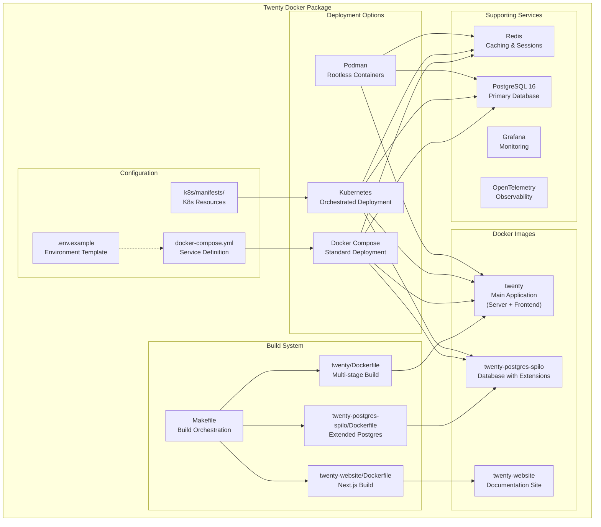
```mermaid
graph TB
    subgraph "Twenty Docker Package"
        subgraph "Docker Images"
            TwentyImage["twenty<br/>Main Application<br/>(Server + Frontend)"]
            PostgresImage["twenty-postgres-spilo<br/>Database with Extensions"]
            WebsiteImage["twenty-website<br/>Documentation Site"]
        end
        
        subgraph "Deployment Options"
            DockerCompose["Docker Compose<br/>Standard Deployment"]
            K8s["Kubernetes<br/>Orchestrated Deployment"]
            Podman["Podman<br/>Rootless Containers"]
        end
        
        subgraph "Build System"
            Makefile["Makefile<br/>Build Orchestration"]
            Dockerfile1["twenty/Dockerfile<br/>Multi-stage Build"]
            Dockerfile2["twenty-postgres-spilo/Dockerfile<br/>Extended Postgres"]
            Dockerfile3["twenty-website/Dockerfile<br/>Next.js Build"]
        end
        
        subgraph "Configuration"
            EnvExample[".env.example<br/>Environment Template"]
            ComposeYml["docker-compose.yml<br/>Service Definition"]
            K8sManifests["k8s/manifests/<br/>K8s Resources"]
        end
        
        subgraph "Supporting Services"
            Redis["Redis<br/>Caching & Sessions"]
            Postgres["PostgreSQL 16<br/>Primary Database"]
            Grafana["Grafana<br/>Monitoring"]
            OtelCollector["OpenTelemetry<br/>Observability"]
        end
    end
    
    Makefile --> Dockerfile1
    Makefile --> Dockerfile2
    Makefile --> Dockerfile3
    
    Dockerfile1 --> TwentyImage
    Dockerfile2 --> PostgresImage
    Dockerfile3 --> WebsiteImage
    
    DockerCompose --> TwentyImage
    DockerCompose --> PostgresImage
    DockerCompose --> Redis
    DockerCompose --> Postgres
    
    K8s --> TwentyImage
    K8s --> PostgresImage
    K8s --> Redis
    K8s --> Postgres
    
    Podman --> TwentyImage
    Podman --> Redis
    Podman --> Postgres
    
    EnvExample -.-> ComposeYml
    ComposeYml --> DockerCompose
    K8sManifests --> K8s
```

## Container Architecture

### Twenty Main Application Image

The main Twenty application image combines both the backend (NestJS) and frontend (React) into a single container.

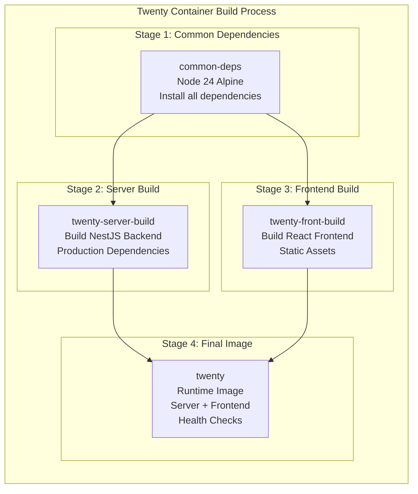
```mermaid
graph LR
    subgraph "Twenty Container Build Process"
        subgraph "Stage 1: Common Dependencies"
            CommonDeps["common-deps<br/>Node 24 Alpine<br/>Install all dependencies"]
        end
        
        subgraph "Stage 2: Server Build"
            ServerBuild["twenty-server-build<br/>Build NestJS Backend<br/>Production Dependencies"]
        end
        
        subgraph "Stage 3: Frontend Build"
            FrontBuild["twenty-front-build<br/>Build React Frontend<br/>Static Assets"]
        end
        
        subgraph "Stage 4: Final Image"
            FinalImage["twenty<br/>Runtime Image<br/>Server + Frontend<br/>Health Checks"]
        end
    end
    
    CommonDeps --> ServerBuild
    CommonDeps --> FrontBuild
    ServerBuild --> FinalImage
    FrontBuild --> FinalImage
```

**Build Stages:**

1. **common-deps**: Base stage that installs all workspace dependencies using Yarn
2. **twenty-server-build**: Builds the backend server using Nx
3. **twenty-front-build**: Builds the frontend application using Nx
4. **twenty**: Final production image combining both builds

**Key Features:**
- Multi-stage build for optimized image size
- Non-root user (UID 1000) for security
- Health check endpoint at `/healthz`
- Persistent storage for uploads at `/app/.local-storage`
- Entrypoint script for database initialization and migrations

### Runtime Architecture

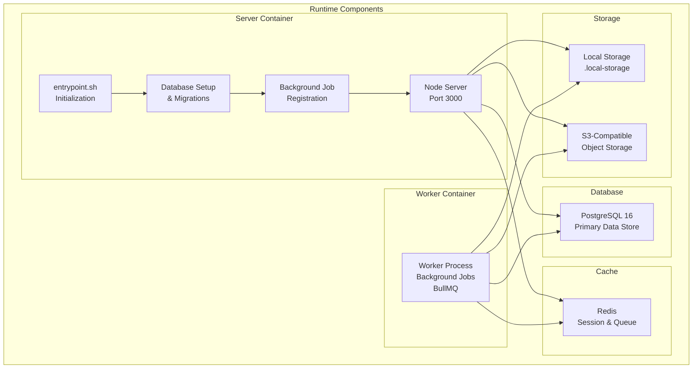
```mermaid
graph TB
    subgraph "Runtime Components"
        subgraph "Server Container"
            EntryPoint["entrypoint.sh<br/>Initialization"]
            DBMigrations["Database Setup<br/>& Migrations"]
            CronJobs["Background Job<br/>Registration"]
            ServerProcess["Node Server<br/>Port 3000"]
        end
        
        subgraph "Worker Container"
            WorkerProcess["Worker Process<br/>Background Jobs<br/>BullMQ"]
        end
        
        subgraph "Database"
            PostgresDB["PostgreSQL 16<br/>Primary Data Store"]
        end
        
        subgraph "Cache"
            RedisCache["Redis<br/>Session & Queue"]
        end
        
        subgraph "Storage"
            LocalStorage["Local Storage<br/>.local-storage"]
            S3Storage["S3-Compatible<br/>Object Storage"]
        end
    end
    
    EntryPoint --> DBMigrations
    DBMigrations --> CronJobs
    CronJobs --> ServerProcess
    
    ServerProcess --> PostgresDB
    ServerProcess --> RedisCache
    ServerProcess --> LocalStorage
    ServerProcess --> S3Storage
    
    WorkerProcess --> PostgresDB
    WorkerProcess --> RedisCache
    WorkerProcess --> LocalStorage
    WorkerProcess --> S3Storage
```

### PostgreSQL with Extensions (Spilo)

The `twenty-postgres-spilo` image extends the Zalando Spilo PostgreSQL image with additional extensions:

**Extensions Included:**
- **mysql_fdw**: Foreign data wrapper for MySQL connections
- **Supabase Wrappers**: Additional foreign data wrappers for external services
- **OpenSSL 1.1.1**: Custom-built for wrapper compatibility

**Architecture:**
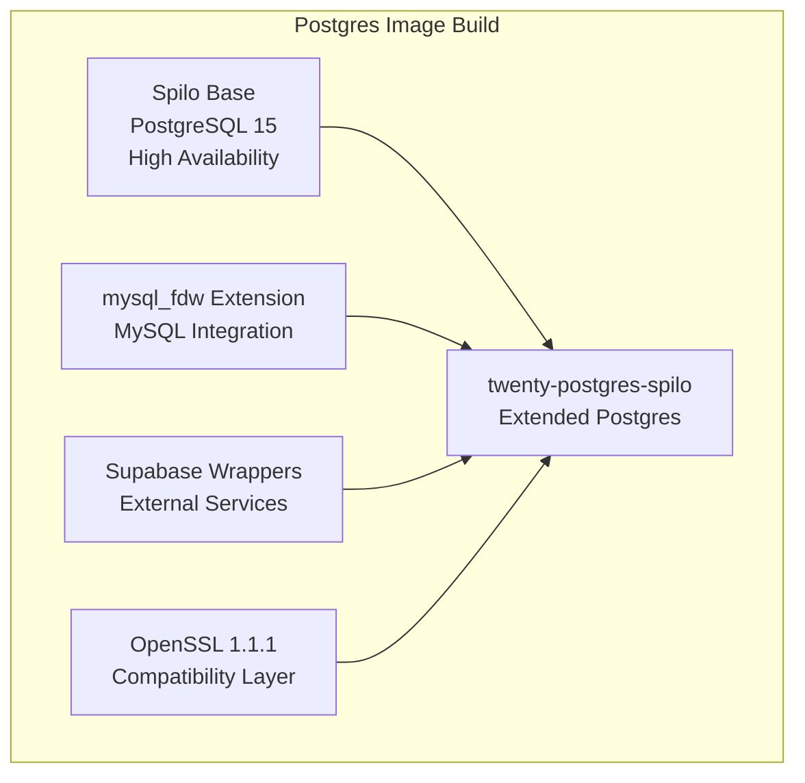
```mermaid
graph TD
    subgraph "Postgres Image Build"
        BaseSpilo["Spilo Base<br/>PostgreSQL 15<br/>High Availability"]
        MySQLFDW["mysql_fdw Extension<br/>MySQL Integration"]
        Wrappers["Supabase Wrappers<br/>External Services"]
        LibSSL["OpenSSL 1.1.1<br/>Compatibility Layer"]
        FinalPostgres["twenty-postgres-spilo<br/>Extended Postgres"]
    end
    
    BaseSpilo --> FinalPostgres
    MySQLFDW --> FinalPostgres
    Wrappers --> FinalPostgres
    LibSSL --> FinalPostgres
```

## Deployment Options

### Docker Compose Deployment

The standard deployment method using Docker Compose.

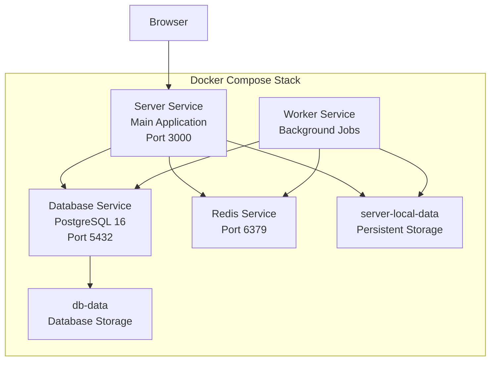
```mermaid
graph TB
    subgraph "Docker Compose Stack"
        Server["Server Service<br/>Main Application<br/>Port 3000"]
        Worker["Worker Service<br/>Background Jobs"]
        DB["Database Service<br/>PostgreSQL 16<br/>Port 5432"]
        Redis["Redis Service<br/>Port 6379"]
        
        ServerVolume["server-local-data<br/>Persistent Storage"]
        DBVolume["db-data<br/>Database Storage"]
    end
    
    Server --> DB
    Server --> Redis
    Server --> ServerVolume
    
    Worker --> DB
    Worker --> Redis
    Worker --> ServerVolume
    
    DB --> DBVolume
    
    Client[Browser] --> Server
```

**Services:**
- **server**: Main application (frontend + backend)
- **worker**: Background job processor
- **db**: PostgreSQL database
- **redis**: Cache and message broker

**Volumes:**
- `server-local-data`: Persistent storage for uploads and files
- `db-data`: PostgreSQL data directory

**Health Checks:**
- Server: `curl --fail http://localhost:3000/healthz`
- Database: `pg_isready -U postgres -h localhost`

### Kubernetes (K8s) Deployment

Enterprise-grade orchestrated deployment with Kubernetes.

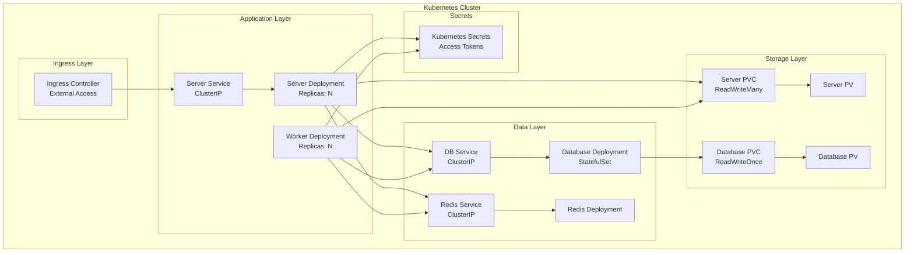
```mermaid
graph TB
    subgraph "Kubernetes Cluster"
        subgraph "Ingress Layer"
            Ingress["Ingress Controller<br/>External Access"]
        end
        
        subgraph "Application Layer"
            ServerDeploy["Server Deployment<br/>Replicas: N"]
            WorkerDeploy["Worker Deployment<br/>Replicas: N"]
            ServerSvc["Server Service<br/>ClusterIP"]
        end
        
        subgraph "Data Layer"
            DBDeploy["Database Deployment<br/>StatefulSet"]
            RedisDeploy["Redis Deployment"]
            DBSvc["DB Service<br/>ClusterIP"]
            RedisSvc["Redis Service<br/>ClusterIP"]
        end
        
        subgraph "Storage Layer"
            ServerPVC["Server PVC<br/>ReadWriteMany"]
            DBPVC["Database PVC<br/>ReadWriteOnce"]
            ServerPV["Server PV"]
            DBPV["Database PV"]
        end
        
        subgraph "Secrets"
            TokenSecrets["Kubernetes Secrets<br/>Access Tokens"]
        end
    end
    
    Ingress --> ServerSvc
    ServerSvc --> ServerDeploy
    
    ServerDeploy --> DBSvc
    ServerDeploy --> RedisSvc
    ServerDeploy --> ServerPVC
    ServerDeploy --> TokenSecrets
    
    WorkerDeploy --> DBSvc
    WorkerDeploy --> RedisSvc
    WorkerDeploy --> ServerPVC
    WorkerDeploy --> TokenSecrets
    
    DBSvc --> DBDeploy
    RedisSvc --> RedisDeploy
    
    DBDeploy --> DBPVC
    ServerPVC --> ServerPV
    DBPVC --> DBPV
```

**Resources:**
- Deployments: server, worker, db, redis
- Services: ClusterIP services for internal communication
- Ingress: External access configuration
- PersistentVolumes: Storage for data and uploads
- Secrets: Token management

**Terraform Support:**
The k8s directory includes Terraform configurations for infrastructure-as-code deployment.

### Podman Deployment

Rootless container deployment using Podman.

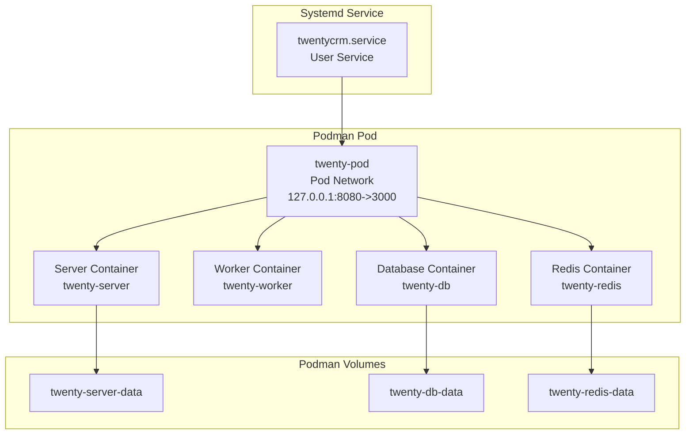
```mermaid
graph TB
    subgraph "Podman Pod"
        Pod["twenty-pod<br/>Pod Network<br/>127.0.0.1:8080->3000"]
        
        ServerContainer["Server Container<br/>twenty-server"]
        WorkerContainer["Worker Container<br/>twenty-worker"]
        DBContainer["Database Container<br/>twenty-db"]
        RedisContainer["Redis Container<br/>twenty-redis"]
    end
    
    subgraph "Podman Volumes"
        ServerVolume["twenty-server-data"]
        DBVolume["twenty-db-data"]
        RedisVolume["twenty-redis-data"]
    end
    
    subgraph "Systemd Service"
        SystemdService["twentycrm.service<br/>User Service"]
    end
    
    Pod --> ServerContainer
    Pod --> WorkerContainer
    Pod --> DBContainer
    Pod --> RedisContainer
    
    ServerContainer --> ServerVolume
    DBContainer --> DBVolume
    RedisContainer --> RedisVolume
    
    SystemdService --> Pod
```

**Features:**
- Rootless execution for enhanced security
- Pod-based networking (shared network namespace)
- Systemd integration for service management
- Volume mounts with SELinux support (`:Z` flag)

## Build System

### Makefile Commands

The build system is orchestrated through a Makefile with the following targets:

```makefile
# Build the main Twenty application image
make prod-build PLATFORM=linux/amd64 TAG=latest

# Run the Twenty application
make prod-run TAG=latest

# Build the PostgreSQL image
make prod-postgres-run TAG=latest

# Build the website image
make prod-website-build PLATFORM=linux/amd64 TAG=latest

# Run the website
make prod-website-run TAG=latest
```

**Variables:**
- `PLATFORM`: Target platform (default: `linux/amd64`)
- `TAG`: Docker image tag (default: `latest`)

### Multi-Architecture Support

The build system supports multiple CPU architectures:

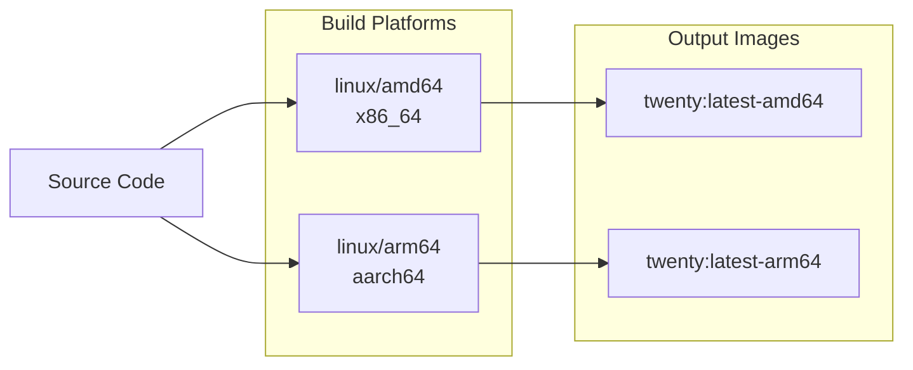
```mermaid
graph LR
    Source["Source Code"]
    
    subgraph "Build Platforms"
        AMD64["linux/amd64<br/>x86_64"]
        ARM64["linux/arm64<br/>aarch64"]
    end
    
    subgraph "Output Images"
        ImageAMD64["twenty:latest-amd64"]
        ImageARM64["twenty:latest-arm64"]
    end
    
    Source --> AMD64
    Source --> ARM64
    
    AMD64 --> ImageAMD64
    ARM64 --> ImageARM64
```

## Configuration

### Environment Variables

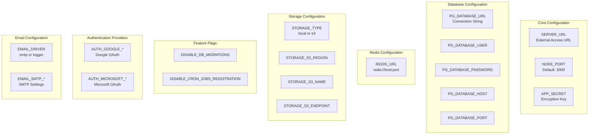
```mermaid
graph TB
    subgraph "Core Configuration"
        ServerURL["SERVER_URL<br/>External Access URL"]
        NodePort["NODE_PORT<br/>Default: 3000"]
        AppSecret["APP_SECRET<br/>Encryption Key"]
    end
    
    subgraph "Database Configuration"
        PGURL["PG_DATABASE_URL<br/>Connection String"]
        PGUser["PG_DATABASE_USER"]
        PGPassword["PG_DATABASE_PASSWORD"]
        PGHost["PG_DATABASE_HOST"]
        PGPort["PG_DATABASE_PORT"]
    end
    
    subgraph "Redis Configuration"
        RedisURL["REDIS_URL<br/>redis://host:port"]
    end
    
    subgraph "Storage Configuration"
        StorageType["STORAGE_TYPE<br/>local or s3"]
        S3Region["STORAGE_S3_REGION"]
        S3Bucket["STORAGE_S3_NAME"]
        S3Endpoint["STORAGE_S3_ENDPOINT"]
    end
    
    subgraph "Feature Flags"
        DisableMigrations["DISABLE_DB_MIGRATIONS"]
        DisableCron["DISABLE_CRON_JOBS_REGISTRATION"]
    end
    
    subgraph "Authentication Providers"
        GoogleAuth["AUTH_GOOGLE_*<br/>Google OAuth"]
        MicrosoftAuth["AUTH_MICROSOFT_*<br/>Microsoft OAuth"]
    end
    
    subgraph "Email Configuration"
        EmailDriver["EMAIL_DRIVER<br/>smtp or logger"]
        EmailSMTP["EMAIL_SMTP_*<br/>SMTP Settings"]
    end
```

### Essential Variables

**Required:**
- `SERVER_URL`: The URL where Twenty will be accessed (e.g., `https://crm.example.com`)
- `APP_SECRET`: Random string for encryption (generate with `openssl rand -base64 32`)
- `PG_DATABASE_PASSWORD`: Strong database password

**Database:**
- `PG_DATABASE_URL`: Full PostgreSQL connection string
- Default: `postgres://postgres:postgres@db:5432/default`

**Storage:**
- `STORAGE_TYPE`: `local` (default) or `s3`
- For S3: Configure `STORAGE_S3_REGION`, `STORAGE_S3_NAME`, `STORAGE_S3_ENDPOINT`

**Optional Features:**
- Authentication providers (Google, Microsoft)
- Email configuration
- Calendar and messaging integrations

### Configuration Flow

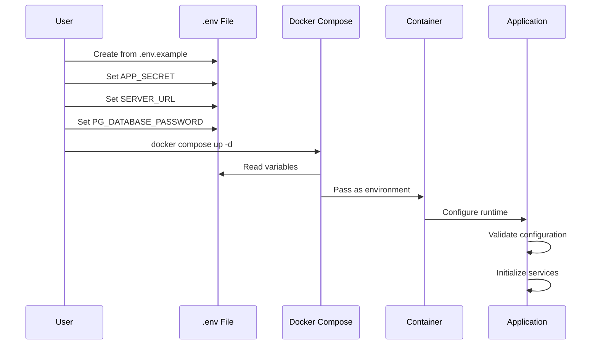
```mermaid
sequenceDiagram
    participant User
    participant EnvFile as .env File
    participant Compose as Docker Compose
    participant Container
    participant App as Application
    
    User->>EnvFile: Create from .env.example
    User->>EnvFile: Set APP_SECRET
    User->>EnvFile: Set SERVER_URL
    User->>EnvFile: Set PG_DATABASE_PASSWORD
    
    User->>Compose: docker compose up -d
    Compose->>EnvFile: Read variables
    Compose->>Container: Pass as environment
    Container->>App: Configure runtime
    App->>App: Validate configuration
    App->>App: Initialize services
```

## Entrypoint Process

The server container uses an entrypoint script for initialization:

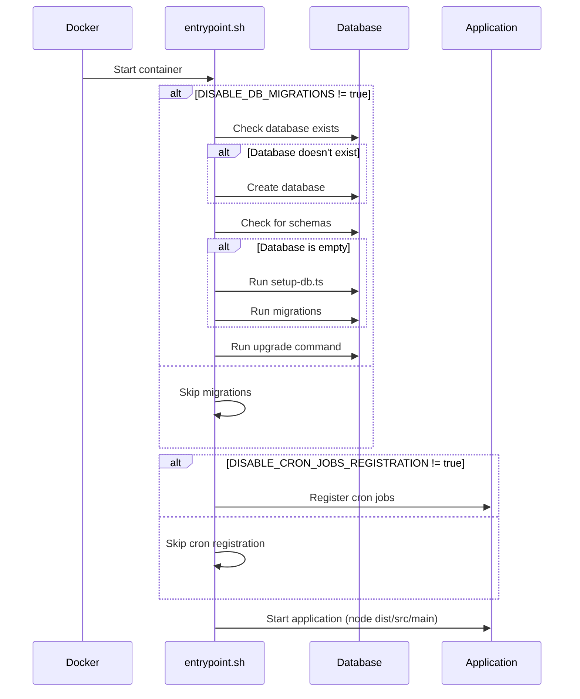
```mermaid
sequenceDiagram
    participant Docker
    participant Entrypoint as entrypoint.sh
    participant DB as Database
    participant App as Application
    
    Docker->>Entrypoint: Start container
    
    alt DISABLE_DB_MIGRATIONS != true
        Entrypoint->>DB: Check database exists
        alt Database doesn't exist
            Entrypoint->>DB: Create database
        end
        
        Entrypoint->>DB: Check for schemas
        alt Database is empty
            Entrypoint->>DB: Run setup-db.ts
            Entrypoint->>DB: Run migrations
        end
        
        Entrypoint->>DB: Run upgrade command
    else
        Entrypoint->>Entrypoint: Skip migrations
    end
    
    alt DISABLE_CRON_JOBS_REGISTRATION != true
        Entrypoint->>App: Register cron jobs
    else
        Entrypoint->>Entrypoint: Skip cron registration
    end
    
    Entrypoint->>App: Start application (node dist/src/main)
```

**Entrypoint Responsibilities:**
1. Parse database connection URL
2. Create database if it doesn't exist
3. Check if database needs initialization
4. Run migrations on first startup
5. Execute upgrade commands
6. Register background cron jobs
7. Start the application server

## Monitoring and Observability

### Grafana Integration

The package includes Grafana configuration for monitoring:

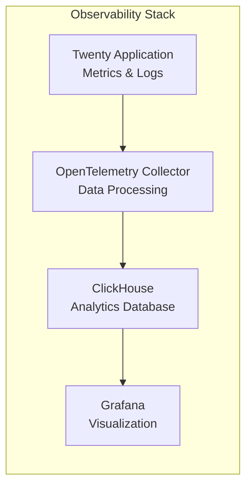
```mermaid
graph LR
    subgraph "Observability Stack"
        App["Twenty Application<br/>Metrics & Logs"]
        OtelCollector["OpenTelemetry Collector<br/>Data Processing"]
        ClickHouse["ClickHouse<br/>Analytics Database"]
        Grafana["Grafana<br/>Visualization"]
    end
    
    App --> OtelCollector
    OtelCollector --> ClickHouse
    ClickHouse --> Grafana
```

**Components:**
- **OpenTelemetry Collector**: Collects and processes telemetry data
- **ClickHouse**: Stores analytics and metrics (optional)
- **Grafana**: Provides dashboards and visualization
- **Datasources**: Pre-configured ClickHouse datasource

**Configuration Files:**
- `otel-collector/otel-collector-config.yaml`: Collector configuration
- `grafana/provisioning/datasources/clickhouse-datasource.yaml`: Grafana datasource

## Installation Scripts

### One-Line Installation

```bash
bash <(curl -sL https://raw.githubusercontent.com/twentyhq/twenty/main/packages/twenty-docker/scripts/install.sh)
```

**Installation Flow:**

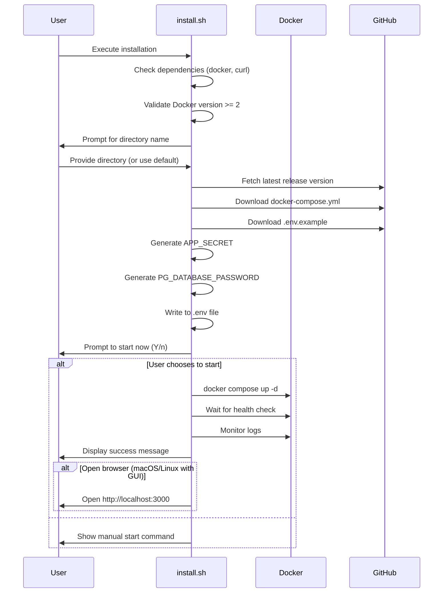
```mermaid
sequenceDiagram
    participant User
    participant Script as install.sh
    participant Docker
    participant GitHub
    
    User->>Script: Execute installation
    Script->>Script: Check dependencies (docker, curl)
    Script->>Script: Validate Docker version >= 2
    
    Script->>User: Prompt for directory name
    User->>Script: Provide directory (or use default)
    
    Script->>GitHub: Fetch latest release version
    Script->>GitHub: Download docker-compose.yml
    Script->>GitHub: Download .env.example
    
    Script->>Script: Generate APP_SECRET
    Script->>Script: Generate PG_DATABASE_PASSWORD
    Script->>Script: Write to .env file
    
    Script->>User: Prompt to start now (Y/n)
    
    alt User chooses to start
        Script->>Docker: docker compose up -d
        Script->>Docker: Wait for health check
        Script->>Docker: Monitor logs
        Script->>User: Display success message
        
        alt Open browser (macOS/Linux with GUI)
            Script->>User: Open http://localhost:3000
        end
    else
        Script->>User: Show manual start command
    end
```

**Features:**
- Automatic dependency checking
- Version detection (latest release)
- Secret generation
- Port conflict detection
- Interactive prompts
- Automatic browser opening (optional)

### Manual Installation Steps

For users who prefer manual control:

1. **Download configuration files**
2. **Generate secrets** with `openssl rand -base64 32`
3. **Configure .env file**
4. **Start services** with `docker compose up -d`

See the [Docker Compose guide](https://twenty.com/developers/section/self-hosting/docker-compose) for detailed manual setup instructions.

## Security Considerations

### Container Security

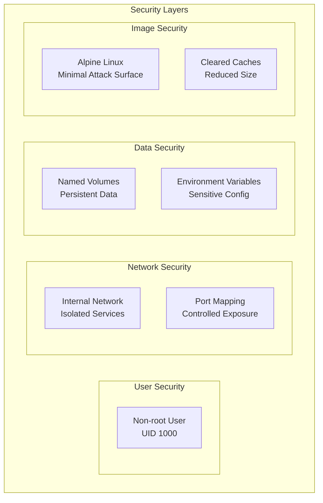
```mermaid
graph TB
    subgraph "Security Layers"
        subgraph "User Security"
            NonRoot["Non-root User<br/>UID 1000"]
        end
        
        subgraph "Network Security"
            InternalNet["Internal Network<br/>Isolated Services"]
            PortMapping["Port Mapping<br/>Controlled Exposure"]
        end
        
        subgraph "Data Security"
            Volumes["Named Volumes<br/>Persistent Data"]
            Secrets["Environment Variables<br/>Sensitive Config"]
        end
        
        subgraph "Image Security"
            AlpineBase["Alpine Linux<br/>Minimal Attack Surface"]
            NoCache["Cleared Caches<br/>Reduced Size"]
        end
    end
```

**Best Practices:**
- All containers run as non-root users
- Secrets are never committed to images
- Volumes are used for persistent data
- Alpine base images minimize attack surface
- Health checks ensure service reliability

### Secrets Management

**Required Secrets:**
1. `APP_SECRET`: Application encryption key
2. `PG_DATABASE_PASSWORD`: Database password
3. OAuth client secrets (if using external auth)

**Generation:**
```bash
# Generate a secure random string
openssl rand -base64 32
```

**Storage:**
- Docker Compose: `.env` file (git-ignored)
- Kubernetes: Kubernetes Secrets
- Podman: Environment file with restricted permissions

## Data Persistence

### Volume Architecture

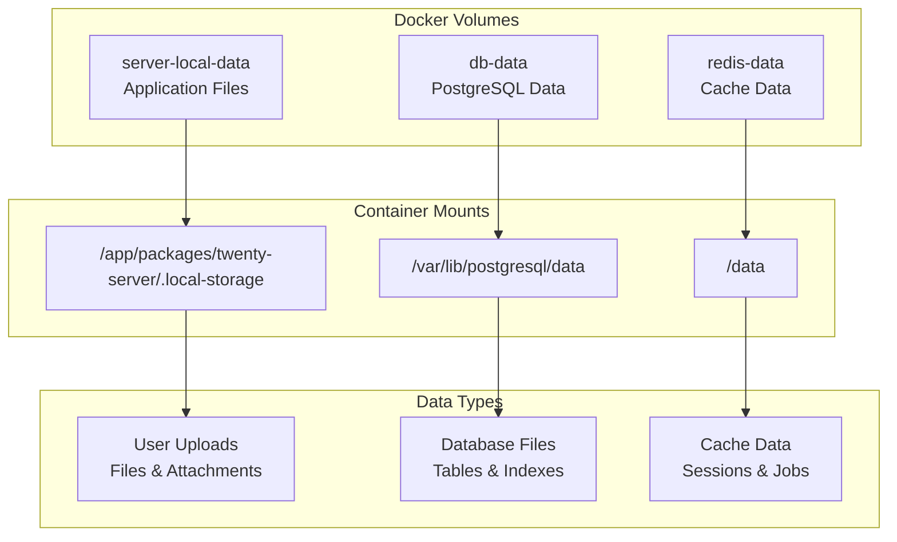
```mermaid
graph TB
    subgraph "Docker Volumes"
        ServerData["server-local-data<br/>Application Files"]
        DBData["db-data<br/>PostgreSQL Data"]
        RedisData["redis-data<br/>Cache Data"]
    end
    
    subgraph "Container Mounts"
        ServerMount["/app/packages/twenty-server/.local-storage"]
        DBMount["/var/lib/postgresql/data"]
        RedisMount["/data"]
    end
    
    subgraph "Data Types"
        Uploads["User Uploads<br/>Files & Attachments"]
        DBFiles["Database Files<br/>Tables & Indexes"]
        CacheFiles["Cache Data<br/>Sessions & Jobs"]
    end
    
    ServerData --> ServerMount
    DBData --> DBMount
    RedisData --> RedisMount
    
    ServerMount --> Uploads
    DBMount --> DBFiles
    RedisMount --> CacheFiles
```

### Backup Recommendations

**Database Backups:**
```bash
# Backup PostgreSQL
docker compose exec db pg_dump -U postgres default > backup.sql

# Restore
docker compose exec -T db psql -U postgres default < backup.sql
```

**File Storage Backups:**
```bash
# Backup uploaded files
docker run --rm -v twenty_server-local-data:/data -v $(pwd):/backup \
  alpine tar czf /backup/files-backup.tar.gz /data

# Restore
docker run --rm -v twenty_server-local-data:/data -v $(pwd):/backup \
  alpine tar xzf /backup/files-backup.tar.gz -C /
```

## Troubleshooting

### Common Issues

**Container Health Check Failures:**
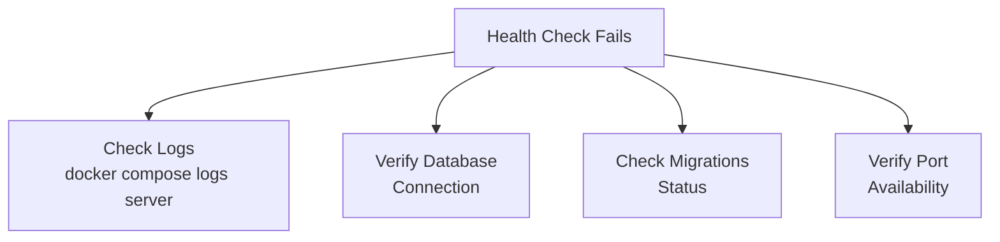
```mermaid
graph TD
    Issue["Health Check Fails"]
    
    CheckLogs["Check Logs<br/>docker compose logs server"]
    CheckDB["Verify Database<br/>Connection"]
    CheckMigrations["Check Migrations<br/>Status"]
    CheckPort["Verify Port<br/>Availability"]
    
    Issue --> CheckLogs
    Issue --> CheckDB
    Issue --> CheckMigrations
    Issue --> CheckPort
```

**Database Connection Issues:**
- Verify `PG_DATABASE_URL` is correct
- Ensure database container is healthy
- Check network connectivity between containers

**Migration Failures:**
- Check database user permissions
- Verify database exists
- Review migration logs in server container

**Port Conflicts:**
- Change port mapping in docker-compose.yml: `"8080:3000"`
- Update `SERVER_URL` in .env to match new port

### Debug Commands

```bash
# View container logs
docker compose logs -f server

# Check container status
docker compose ps

# Access container shell
docker compose exec server sh

# Check database
docker compose exec db psql -U postgres -d default

# Restart services
docker compose restart server worker

# Full reset (WARNING: deletes data)
docker compose down -v
```

## Package Structure

```
packages/twenty-docker/
├── .env.example                  # Environment template
├── Makefile                      # Build orchestration
├── docker-compose.yml            # Standard deployment
│
├── twenty/                       # Main application image
│   ├── Dockerfile               # Multi-stage build
│   └── entrypoint.sh           # Initialization script
│
├── twenty-postgres-spilo/       # Extended PostgreSQL image
│   └── Dockerfile               # Custom extensions
│
├── twenty-website/              # Documentation site image
│   └── Dockerfile               # Next.js build
│
├── k8s/                         # Kubernetes deployment
│   ├── manifests/              # K8s resource definitions
│   │   ├── deployment-server.yaml
│   │   ├── deployment-worker.yaml
│   │   ├── deployment-db.yaml
│   │   ├── deployment-redis.yaml
│   │   ├── service-*.yaml
│   │   ├── pv-*.yaml           # Persistent volumes
│   │   ├── pvc-*.yaml          # Volume claims
│   │   └── ingress.yaml
│   ├── terraform/              # IaC deployment
│   │   ├── main.tf
│   │   ├── variables.tf
│   │   └── README.md
│   └── README.md
│
├── podman/                      # Podman deployment
│   ├── podman-compose.yml      # Podman configuration
│   ├── twentycrm.service       # Systemd service
│   ├── install-systemd-user-service
│   └── README.md
│
├── scripts/                     # Installation scripts
│   ├── install.sh              # One-line installer
│   └── 1-click.sh              # Alternative installer
│
├── grafana/                     # Monitoring configuration
│   └── provisioning/
│       └── datasources/
│           └── clickhouse-datasource.yaml
│
└── otel-collector/              # Observability
    └── otel-collector-config.yaml
```

## Version Management

### Image Tags

Twenty Docker images follow semantic versioning:

```
twentycrm/twenty:latest          # Latest stable release
twentycrm/twenty:v0.23.0         # Specific version
twentycrm/twenty:main            # Development branch
```

### Upgrade Process

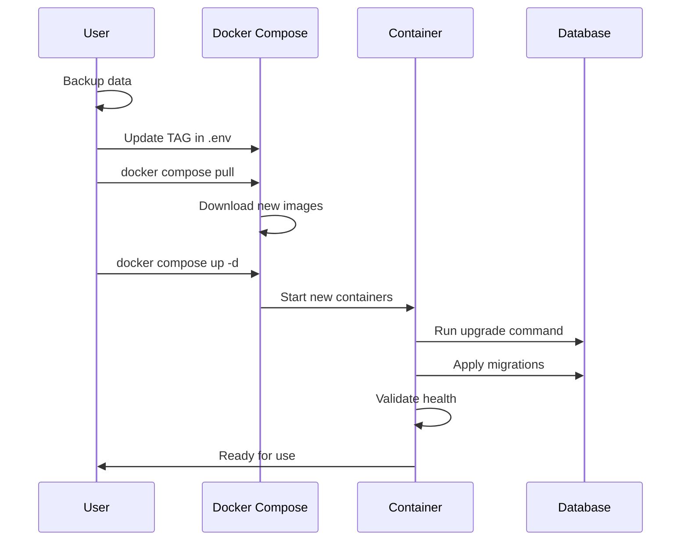
```mermaid
sequenceDiagram
    participant User
    participant Compose as Docker Compose
    participant Container
    participant DB as Database
    
    User->>User: Backup data
    User->>Compose: Update TAG in .env
    User->>Compose: docker compose pull
    Compose->>Compose: Download new images
    
    User->>Compose: docker compose up -d
    Compose->>Container: Start new containers
    Container->>DB: Run upgrade command
    Container->>DB: Apply migrations
    Container->>Container: Validate health
    Container->>User: Ready for use
```

**Steps:**
1. Backup database and files
2. Update `TAG` variable in `.env`
3. Pull new images: `docker compose pull`
4. Restart services: `docker compose up -d`
5. Monitor logs: `docker compose logs -f server`

See [Upgrade Guide](https://twenty.com/developers/section/self-hosting/upgrade-guide) for detailed instructions.

## Performance Optimization

### Resource Allocation

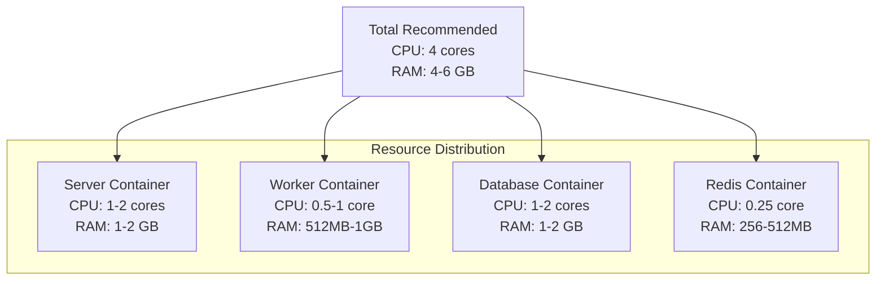
```mermaid
graph TB
    subgraph "Resource Distribution"
        Server["Server Container<br/>CPU: 1-2 cores<br/>RAM: 1-2 GB"]
        Worker["Worker Container<br/>CPU: 0.5-1 core<br/>RAM: 512MB-1GB"]
        DB["Database Container<br/>CPU: 1-2 cores<br/>RAM: 1-2 GB"]
        Redis["Redis Container<br/>CPU: 0.25 core<br/>RAM: 256-512MB"]
    end
    
    Total["Total Recommended<br/>CPU: 4 cores<br/>RAM: 4-6 GB"]
    
    Total --> Server
    Total --> Worker
    Total --> DB
    Total --> Redis
```

### Scaling Strategies

**Horizontal Scaling (Kubernetes):**
- Scale server pods for more concurrent users
- Scale worker pods for faster job processing
- Use load balancer for traffic distribution

**Vertical Scaling (Docker Compose):**
- Increase container resource limits
- Optimize database configuration
- Use faster storage for volumes

## Development vs Production

### Development Setup

For development, use the local setup instead of Docker:
- See [Local Setup](https://twenty.com/developers/local-setup)
- Provides hot-reload and debugging
- Direct access to source code

### Production Setup

Use Docker for production:
- Isolated environment
- Easy deployment and updates
- Consistent across environments
- Built-in health checks
- Volume-based persistence

## Related Documentation

- [Docker Compose Setup](https://twenty.com/developers/section/self-hosting/docker-compose) - Detailed deployment guide
- [Setup Environment Variables](https://twenty.com/developers/section/self-hosting/setup) - Complete variable reference
- [Upgrade Guide](https://twenty.com/developers/section/self-hosting/upgrade-guide) - Version upgrade instructions
- [Troubleshooting](https://twenty.com/developers/section/self-hosting/troubleshooting) - Common issues and solutions
- [Cloud Providers](https://twenty.com/developers/section/self-hosting/cloud-providers) - Platform-specific guides

## Community Deployments

**Maintained by Community:**
- Kubernetes (k8s) deployments
- Podman configurations
- Platform-specific guides

**Note:** The Twenty core team officially maintains Docker Compose deployment. Community deployments are provided and maintained by contributors.

## Summary

The twenty-docker package provides:

✅ **Production-ready images** for all components
✅ **Multiple deployment options** (Docker Compose, K8s, Podman)
✅ **Automated setup** with installation scripts
✅ **Security best practices** with non-root users and secrets management
✅ **Monitoring integration** with Grafana and OpenTelemetry
✅ **Data persistence** through volumes
✅ **Health checks** for reliability
✅ **Multi-architecture support** (amd64, arm64)

For most users, **Docker Compose** provides the simplest and most reliable deployment method.

---\n\n*This Docker architecture documentation is maintained to help you deploy and manage Twenty in containerized environments.*
