# Twenty Server - Architecture Documentation

This document provides an in-depth look at the architectural design and patterns used in Twenty Server.

## Table of Contents

- [System Overview](#system-overview)
- [Architectural Patterns](#architectural-patterns)
- [Module Architecture](#module-architecture)
- [Data Flow](#data-flow)
- [Multi-Tenancy](#multi-tenancy)
- [GraphQL Schema Generation](#graphql-schema-generation)
- [Request Lifecycle](#request-lifecycle)
- [Performance & Scalability](#performance--scalability)

---

## System Overview

Twenty Server is built on a **layered, modular architecture** with clear separation of concerns:

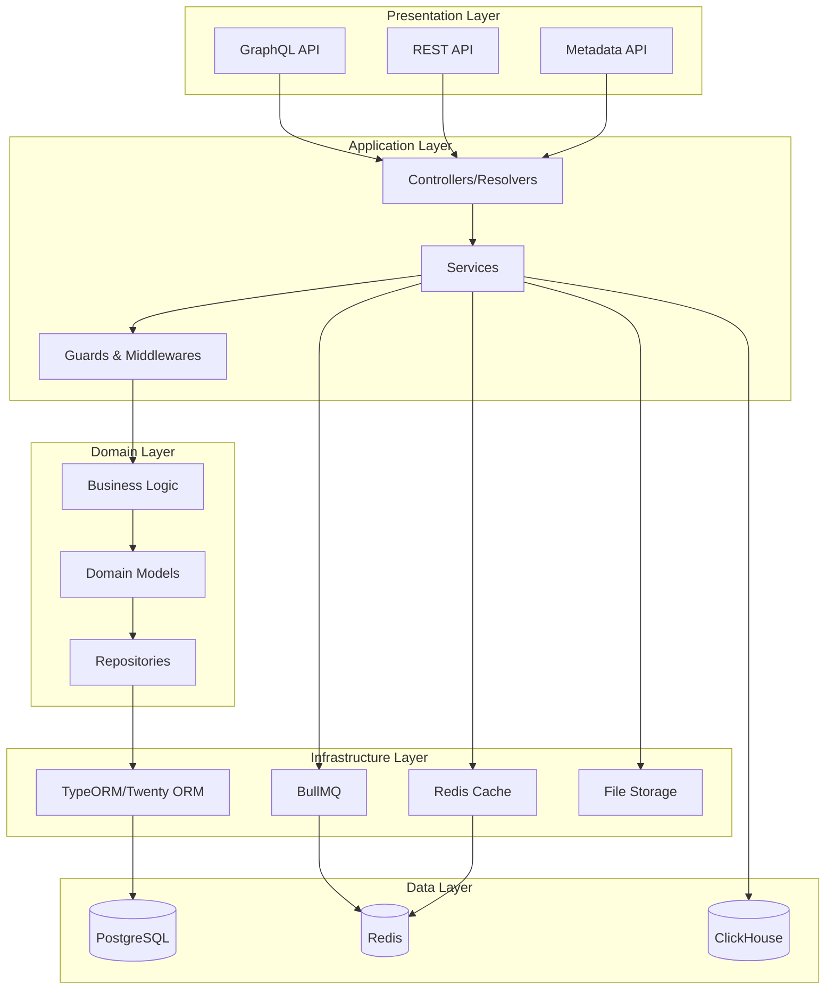
```mermaid
graph TB
    subgraph "Presentation Layer"
        A[GraphQL API]
        B[REST API]
        C[Metadata API]
    end
    
    subgraph "Application Layer"
        D[Controllers/Resolvers]
        E[Services]
        F[Guards & Middlewares]
    end
    
    subgraph "Domain Layer"
        G[Business Logic]
        H[Domain Models]
        I[Repositories]
    end
    
    subgraph "Infrastructure Layer"
        J[TypeORM/Twenty ORM]
        K[BullMQ]
        L[Redis Cache]
        M[File Storage]
    end
    
    subgraph "Data Layer"
        N[(PostgreSQL)]
        O[(Redis)]
        P[(ClickHouse)]
    end
    
    A --> D
    B --> D
    C --> D
    D --> E
    E --> F
    F --> G
    G --> H
    H --> I
    I --> J
    J --> N
    K --> O
    E --> K
    E --> L
    L --> O
    E --> M
    E --> P
```

---

## Architectural Patterns

### 1. Modular Monolith

Twenty Server follows the **modular monolith** pattern:
- Single deployable unit
- Clear module boundaries
- Independent, cohesive modules
- Easier to reason about than microservices
- Can be split into microservices if needed

### 2. Dependency Injection

Built on NestJS's powerful DI container:
```typescript
@Injectable()
export class CompanyService {
  constructor(
    @InjectRepository(Company)
    private companyRepository: Repository<Company>,
    private workspaceService: WorkspaceService
  ) {}
}
```

### 3. Repository Pattern

Data access abstraction:
```typescript
// Abstract data access
interface CompanyRepository {
  find(criteria: FindCriteria): Promise<Company[]>
  create(data: CreateCompanyInput): Promise<Company>
}

// Implementation using Twenty ORM
class CompanyTwentyORMRepository implements CompanyRepository {
  // ...implementation
}
```

### 4. CQRS (Command Query Responsibility Segregation)

Separate read and write operations:
```typescript
// Command - writes data
class CreateCompanyCommand {
  execute(input: CreateCompanyInput): Promise<Company>
}

// Query - reads data
class GetCompanyQuery {
  execute(id: string): Promise<Company>
}
```

### 5. Event-Driven Architecture

Events trigger workflows and integrations:
```typescript
// Emit event
this.eventEmitter.emit('company.created', {
  companyId: company.id,
  workspaceId: workspace.id
});

// Handle event
@OnEvent('company.created')
handleCompanyCreated(payload: CompanyCreatedEvent) {
  // Trigger workflow, send notification, etc.
}
```

---

## Module Architecture

### Core Engine Module Structure

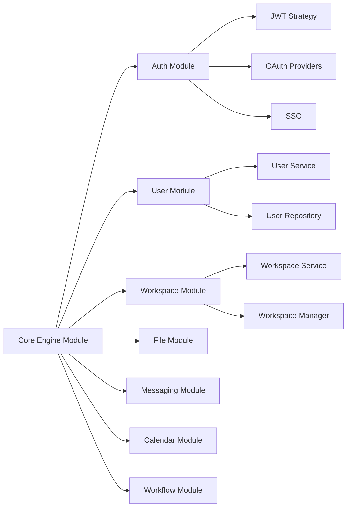
```mermaid
graph LR
    A[Core Engine Module] --> B[Auth Module]
    A --> C[User Module]
    A --> D[Workspace Module]
    A --> E[File Module]
    A --> F[Messaging Module]
    A --> G[Calendar Module]
    A --> H[Workflow Module]
    
    B --> I[JWT Strategy]
    B --> J[OAuth Providers]
    B --> K[SSO]
    
    C --> L[User Service]
    C --> M[User Repository]
    
    D --> N[Workspace Service]
    D --> O[Workspace Manager]
```

### Module Dependency Graph

Modules have clear dependency hierarchies:

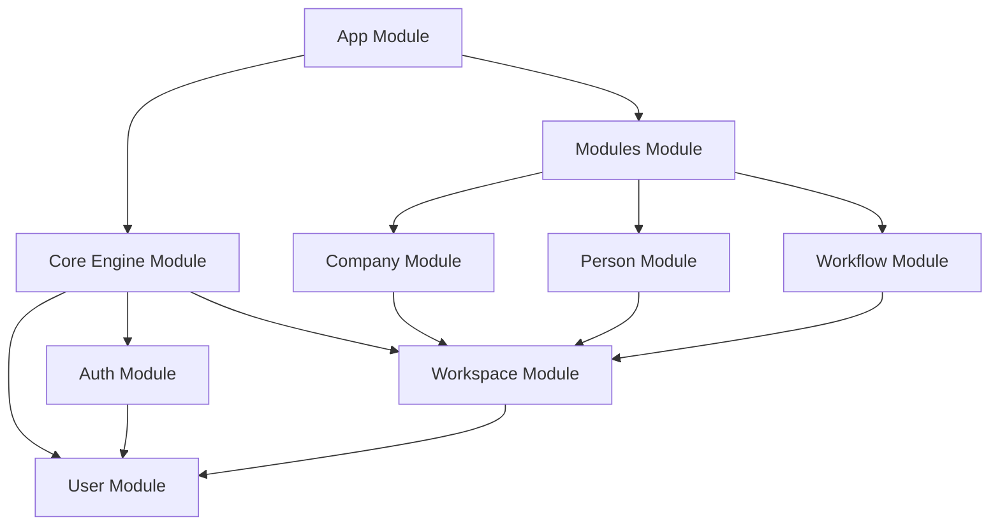
```mermaid
graph TD
    A[App Module] --> B[Core Engine Module]
    A --> C[Modules Module]
    
    B --> D[Auth Module]
    B --> E[User Module]
    B --> F[Workspace Module]
    
    C --> G[Company Module]
    C --> H[Person Module]
    C --> I[Workflow Module]
    
    G --> F
    H --> F
    I --> F
    
    D --> E
    F --> E
```

### Module Anatomy

Each module follows a consistent structure:

```
module-name/
├── module-name.module.ts           # NestJS module definition
├── module-name.service.ts          # Business logic
├── module-name.controller.ts       # REST endpoints (optional)
├── module-name.resolver.ts         # GraphQL resolvers (optional)
├── module-name.repository.ts       # Data access
├── dto/                            # Data transfer objects
│   ├── create-module-name.input.ts
│   └── update-module-name.input.ts
├── entities/                       # Domain entities
│   └── module-name.entity.ts
├── guards/                         # Authorization guards
├── interfaces/                     # TypeScript interfaces
└── __tests__/                      # Tests
    ├── module-name.service.spec.ts
    └── module-name.integration.spec.ts
```

---

## Data Flow

### GraphQL Query Flow

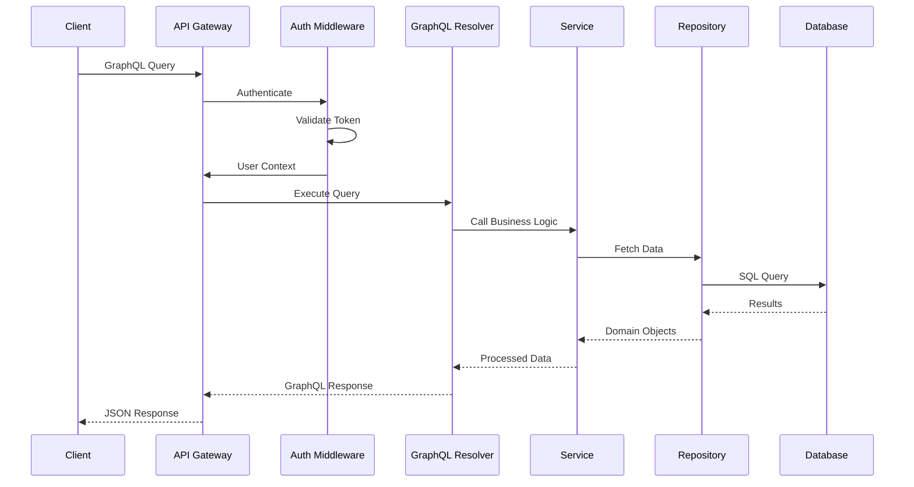
```mermaid
sequenceDiagram
    participant Client
    participant API Gateway
    participant Auth Middleware
    participant GraphQL Resolver
    participant Service
    participant Repository
    participant Database
    
    Client->>API Gateway: GraphQL Query
    API Gateway->>Auth Middleware: Authenticate
    Auth Middleware->>Auth Middleware: Validate Token
    Auth Middleware->>API Gateway: User Context
    API Gateway->>GraphQL Resolver: Execute Query
    GraphQL Resolver->>Service: Call Business Logic
    Service->>Repository: Fetch Data
    Repository->>Database: SQL Query
    Database-->>Repository: Results
    Repository-->>Service: Domain Objects
    Service-->>GraphQL Resolver: Processed Data
    GraphQL Resolver-->>API Gateway: GraphQL Response
    API Gateway-->>Client: JSON Response
```

### GraphQL Mutation Flow

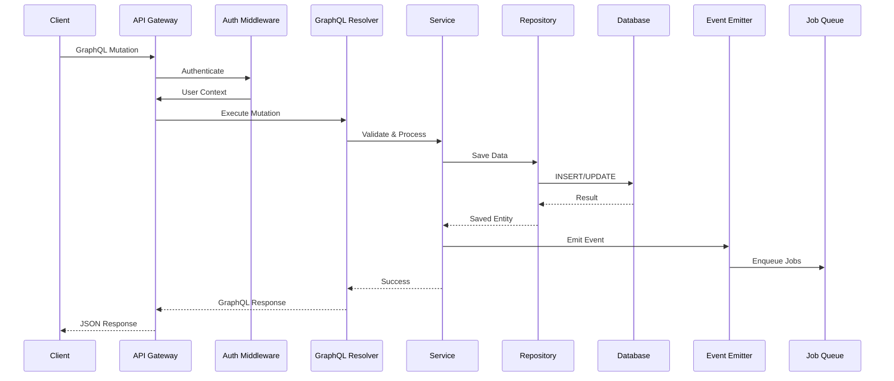
```mermaid
sequenceDiagram
    participant Client
    participant API Gateway
    participant Auth Middleware
    participant GraphQL Resolver
    participant Service
    participant Repository
    participant Database
    participant Event Emitter
    participant Job Queue
    
    Client->>API Gateway: GraphQL Mutation
    API Gateway->>Auth Middleware: Authenticate
    Auth Middleware->>API Gateway: User Context
    API Gateway->>GraphQL Resolver: Execute Mutation
    GraphQL Resolver->>Service: Validate & Process
    Service->>Repository: Save Data
    Repository->>Database: INSERT/UPDATE
    Database-->>Repository: Result
    Repository-->>Service: Saved Entity
    Service->>Event Emitter: Emit Event
    Event Emitter->>Job Queue: Enqueue Jobs
    Service-->>GraphQL Resolver: Success
    GraphQL Resolver-->>API Gateway: GraphQL Response
    API Gateway-->>Client: JSON Response
```

### Background Job Flow

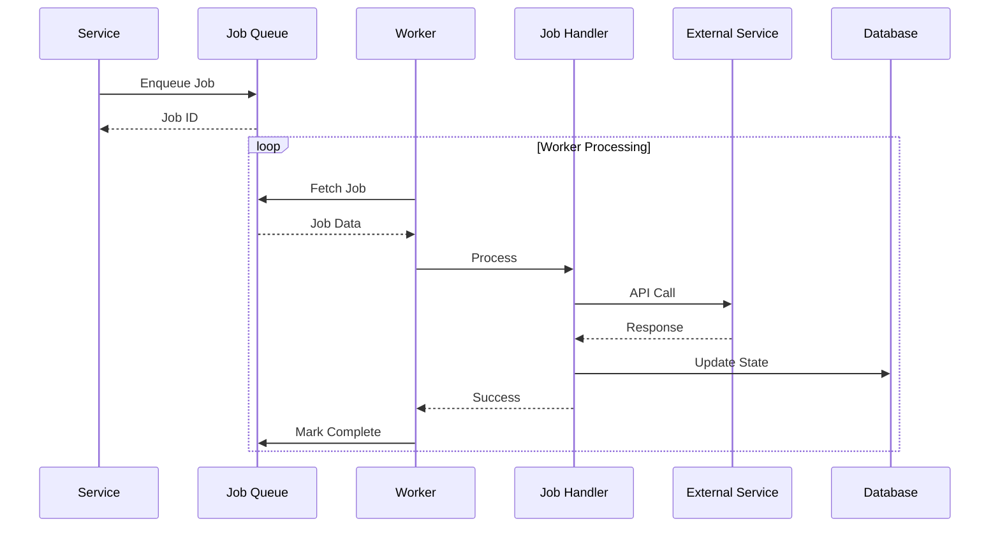
```mermaid
sequenceDiagram
    participant Service
    participant Job Queue
    participant Worker
    participant Job Handler
    participant External Service
    participant Database
    
    Service->>Job Queue: Enqueue Job
    Job Queue-->>Service: Job ID
    
    loop Worker Processing
        Worker->>Job Queue: Fetch Job
        Job Queue-->>Worker: Job Data
        Worker->>Job Handler: Process
        Job Handler->>External Service: API Call
        External Service-->>Job Handler: Response
        Job Handler->>Database: Update State
        Job Handler-->>Worker: Success
        Worker->>Job Queue: Mark Complete
    end
```

---

## Multi-Tenancy

### Workspace Isolation

Each workspace has isolated data in separate schemas:

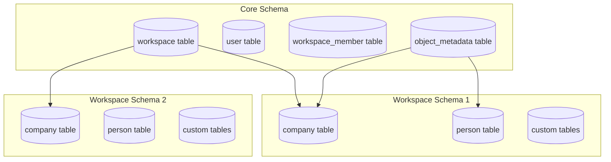
```mermaid
graph TB
    subgraph "Core Schema"
        A[(workspace table)]
        B[(user table)]
        C[(workspace_member table)]
        D[(object_metadata table)]
    end
    
    subgraph "Workspace Schema 1"
        E[(company table)]
        F[(person table)]
        G[(custom tables)]
    end
    
    subgraph "Workspace Schema 2"
        H[(company table)]
        I[(person table)]
        J[(custom tables)]
    end
    
    A --> E
    A --> H
    D --> E
    D --> F
```

### Schema-per-Workspace Pattern

```sql
-- Core tables (shared)
core.workspace
core.user
core.workspace_member
core.object_metadata

-- Workspace-specific schemas
CREATE SCHEMA workspace_abc123;
CREATE TABLE workspace_abc123.company (...);
CREATE TABLE workspace_abc123.person (...);

CREATE SCHEMA workspace_def456;
CREATE TABLE workspace_def456.company (...);
CREATE TABLE workspace_def456.person (...);
```

### Workspace Context Resolution

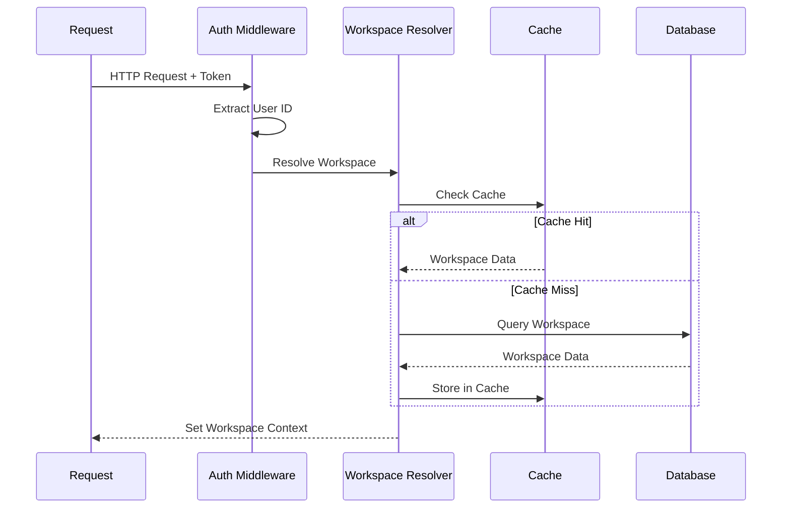
```mermaid
sequenceDiagram
    participant Request
    participant Auth Middleware
    participant Workspace Resolver
    participant Cache
    participant Database
    
    Request->>Auth Middleware: HTTP Request + Token
    Auth Middleware->>Auth Middleware: Extract User ID
    Auth Middleware->>Workspace Resolver: Resolve Workspace
    Workspace Resolver->>Cache: Check Cache
    
    alt Cache Hit
        Cache-->>Workspace Resolver: Workspace Data
    else Cache Miss
        Workspace Resolver->>Database: Query Workspace
        Database-->>Workspace Resolver: Workspace Data
        Workspace Resolver->>Cache: Store in Cache
    end
    
    Workspace Resolver-->>Request: Set Workspace Context
```

---

## GraphQL Schema Generation

### Dynamic Schema Architecture

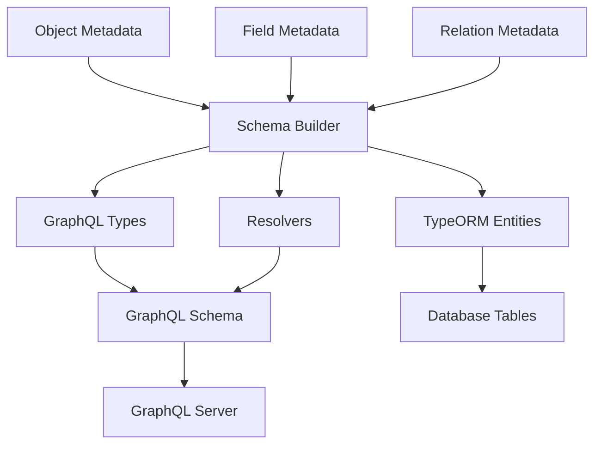
```mermaid
graph TD
    A[Object Metadata] --> B[Schema Builder]
    B --> C[GraphQL Types]
    B --> D[Resolvers]
    B --> E[TypeORM Entities]
    
    C --> F[GraphQL Schema]
    D --> F
    
    F --> G[GraphQL Server]
    E --> H[Database Tables]
    
    I[Field Metadata] --> B
    J[Relation Metadata] --> B
```

### Schema Generation Process

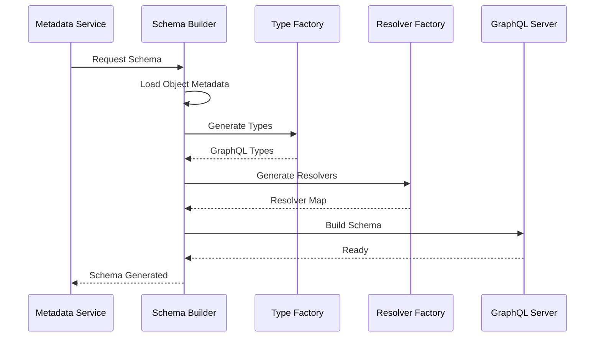
```mermaid
sequenceDiagram
    participant Metadata Service
    participant Schema Builder
    participant Type Factory
    participant Resolver Factory
    participant GraphQL Server
    
    Metadata Service->>Schema Builder: Request Schema
    Schema Builder->>Schema Builder: Load Object Metadata
    Schema Builder->>Type Factory: Generate Types
    Type Factory-->>Schema Builder: GraphQL Types
    Schema Builder->>Resolver Factory: Generate Resolvers
    Resolver Factory-->>Schema Builder: Resolver Map
    Schema Builder->>GraphQL Server: Build Schema
    GraphQL Server-->>Schema Builder: Ready
    Schema Builder-->>Metadata Service: Schema Generated
```

### Schema Caching Strategy

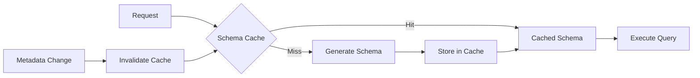
```mermaid
graph LR
    A[Request] --> B{Schema Cache}
    B -->|Hit| C[Cached Schema]
    B -->|Miss| D[Generate Schema]
    D --> E[Store in Cache]
    E --> C
    C --> F[Execute Query]
    
    G[Metadata Change] --> H[Invalidate Cache]
    H --> B
```

---

## Request Lifecycle

### Complete Request Flow

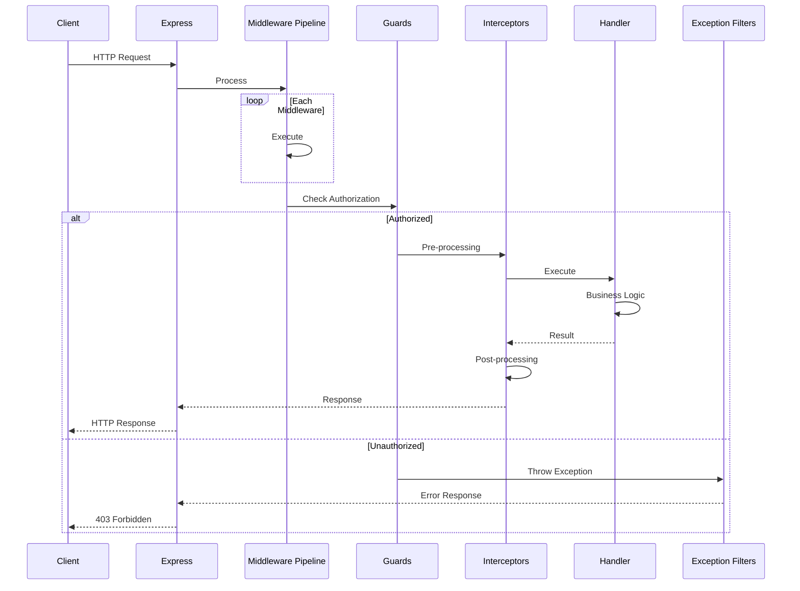
```mermaid
sequenceDiagram
    participant Client
    participant Express
    participant Middleware Pipeline
    participant Guards
    participant Interceptors
    participant Handler
    participant Exception Filters
    
    Client->>Express: HTTP Request
    Express->>Middleware Pipeline: Process
    
    loop Each Middleware
        Middleware Pipeline->>Middleware Pipeline: Execute
    end
    
    Middleware Pipeline->>Guards: Check Authorization
    
    alt Authorized
        Guards->>Interceptors: Pre-processing
        Interceptors->>Handler: Execute
        Handler->>Handler: Business Logic
        Handler-->>Interceptors: Result
        Interceptors->>Interceptors: Post-processing
        Interceptors-->>Express: Response
        Express-->>Client: HTTP Response
    else Unauthorized
        Guards->>Exception Filters: Throw Exception
        Exception Filters-->>Express: Error Response
        Express-->>Client: 403 Forbidden
    end
```

### Middleware Pipeline

```typescript
// Request processing order:
1. CORS Middleware
2. Body Parser
3. Session Middleware
4. Authentication Middleware (JWT validation)
5. Workspace Context Middleware
6. Logging Middleware
7. GraphQL File Upload Middleware
8. Guards (Authorization)
9. Interceptors (Pre-processing)
10. Handler/Resolver
11. Interceptors (Post-processing)
12. Exception Filters (if error)
```

---

## Performance & Scalability

### Caching Strategy

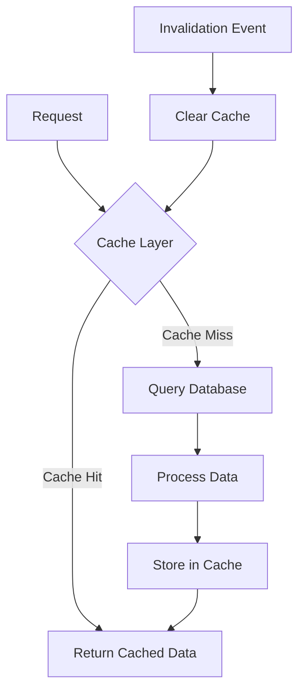
```mermaid
graph TD
    A[Request] --> B{Cache Layer}
    B -->|Cache Hit| C[Return Cached Data]
    B -->|Cache Miss| D[Query Database]
    D --> E[Process Data]
    E --> F[Store in Cache]
    F --> C
    
    G[Invalidation Event] --> H[Clear Cache]
    H --> B
```

### Cache Layers

1. **Memory Cache** (Node.js process)
   - Schema cache
   - Configuration cache
   - Fast but not shared

2. **Redis Cache** (Shared)
   - Session data
   - Workspace metadata
   - Query results
   - Shared across instances

3. **Database Query Cache**
   - PostgreSQL query cache
   - Prepared statements

### Horizontal Scaling

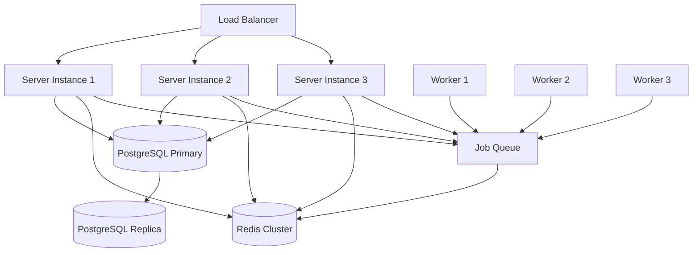
```mermaid
graph TB
    A[Load Balancer] --> B[Server Instance 1]
    A --> C[Server Instance 2]
    A --> D[Server Instance 3]
    
    B --> E[(PostgreSQL Primary)]
    C --> E
    D --> E
    
    E --> F[(PostgreSQL Replica)]
    
    B --> G[(Redis Cluster)]
    C --> G
    D --> G
    
    H[Worker 1] --> I[Job Queue]
    J[Worker 2] --> I
    K[Worker 3] --> I
    
    I --> G
    
    B --> I
    C --> I
    D --> I
```

### Database Optimization

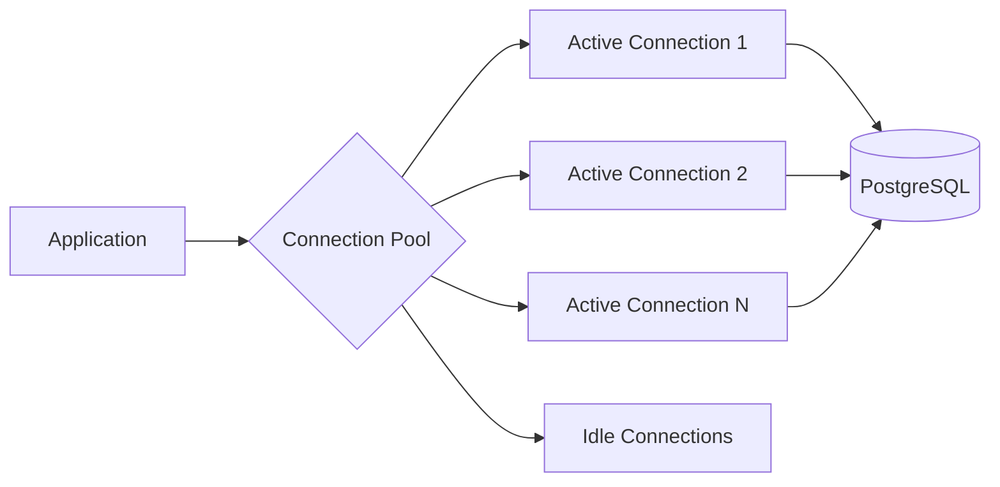
```mermaid
graph LR
    A[Application] --> B{Connection Pool}
    B --> C[Active Connection 1]
    B --> D[Active Connection 2]
    B --> E[Active Connection N]
    B --> F[Idle Connections]
    
    C --> G[(PostgreSQL)]
    D --> G
    E --> G
```

**Connection Pooling:**
- Default pool size: 10-20 connections per instance
- Max pool size scales with instance count
- Use PgBouncer for additional pooling

**Query Optimization:**
- Indexes on frequently queried fields
- Eager loading with joins
- DataLoader for N+1 prevention
- Query result caching

### DataLoader Pattern

Prevents N+1 queries:

```typescript
// Without DataLoader - N+1 problem
for (const company of companies) {
  const contacts = await getContacts(company.id); // N queries
}

// With DataLoader - batched
const contactLoader = new DataLoader(async (companyIds) => {
  return await getContactsByCompanyIds(companyIds); // 1 query
});

for (const company of companies) {
  const contacts = await contactLoader.load(company.id);
}
```

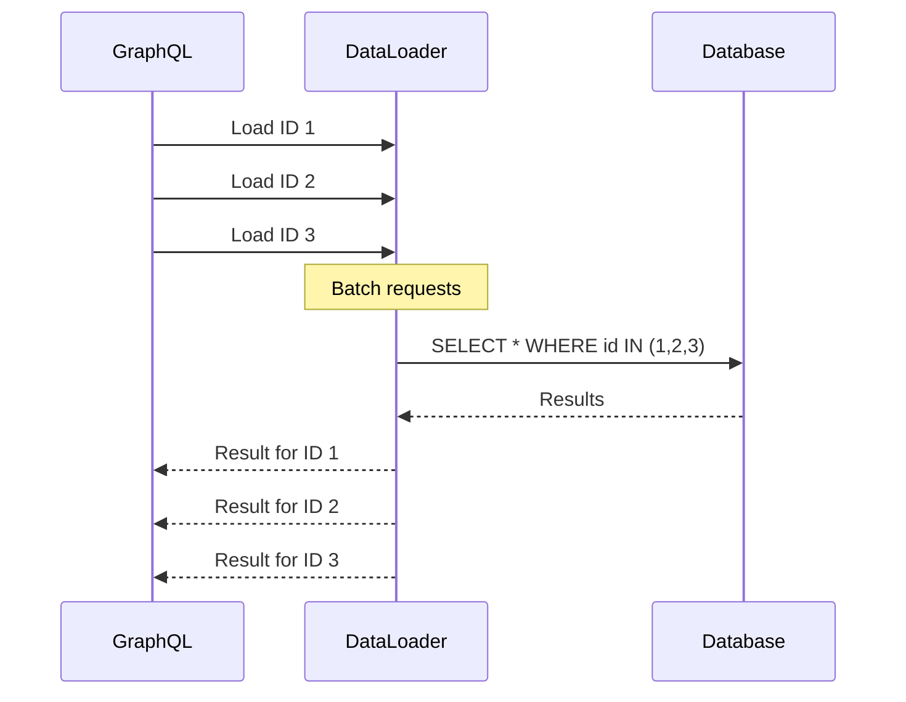
```mermaid
sequenceDiagram
    participant GraphQL
    participant DataLoader
    participant Database
    
    GraphQL->>DataLoader: Load ID 1
    GraphQL->>DataLoader: Load ID 2
    GraphQL->>DataLoader: Load ID 3
    
    Note over DataLoader: Batch requests
    
    DataLoader->>Database: SELECT * WHERE id IN (1,2,3)
    Database-->>DataLoader: Results
    
    DataLoader-->>GraphQL: Result for ID 1
    DataLoader-->>GraphQL: Result for ID 2
    DataLoader-->>GraphQL: Result for ID 3
```

### Rate Limiting

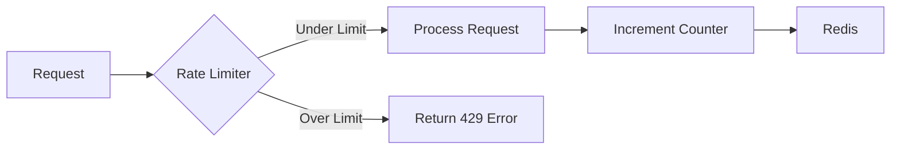
```mermaid
graph LR
    A[Request] --> B{Rate Limiter}
    B -->|Under Limit| C[Process Request]
    B -->|Over Limit| D[Return 429 Error]
    
    C --> E[Increment Counter]
    E --> F[Redis]
```

Configuration:
```typescript
// Per-endpoint rate limits
{
  '/graphql': { ttl: 60, limit: 100 },  // 100 req/min
  '/rest': { ttl: 60, limit: 200 },     // 200 req/min
  '/metadata': { ttl: 60, limit: 50 }   // 50 req/min
}
```

---

## Security Architecture

### Authentication Layers

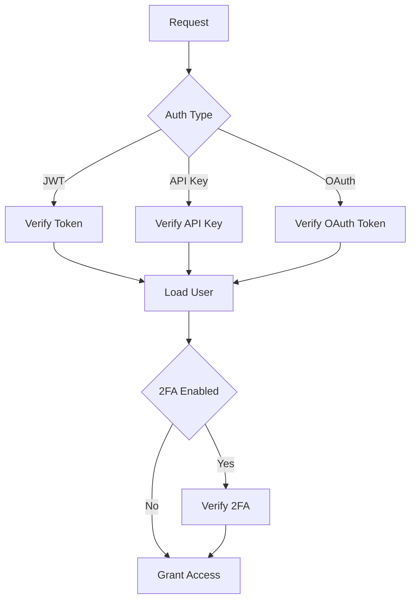
```mermaid
graph TD
    A[Request] --> B{Auth Type}
    B -->|JWT| C[Verify Token]
    B -->|API Key| D[Verify API Key]
    B -->|OAuth| E[Verify OAuth Token]
    
    C --> F[Load User]
    D --> F
    E --> F
    
    F --> G{2FA Enabled}
    G -->|Yes| H[Verify 2FA]
    G -->|No| I[Grant Access]
    H --> I
```

### Authorization Flow

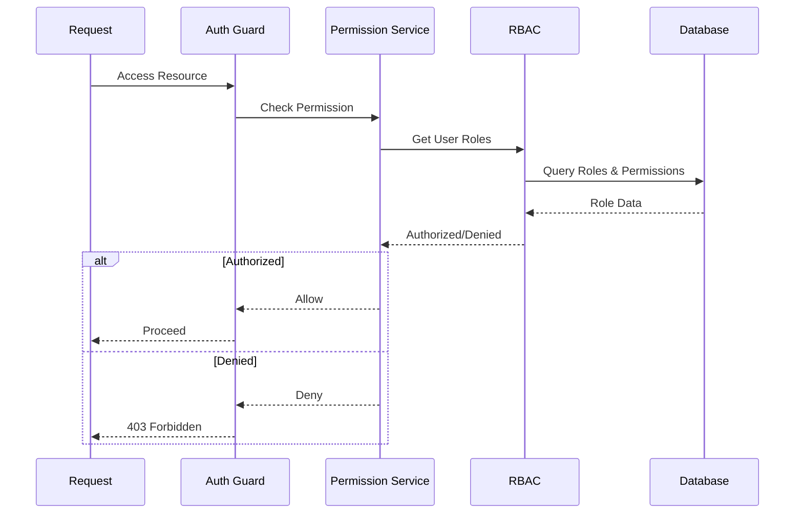
```mermaid
sequenceDiagram
    participant Request
    participant Auth Guard
    participant Permission Service
    participant RBAC
    participant Database
    
    Request->>Auth Guard: Access Resource
    Auth Guard->>Permission Service: Check Permission
    Permission Service->>RBAC: Get User Roles
    RBAC->>Database: Query Roles & Permissions
    Database-->>RBAC: Role Data
    RBAC-->>Permission Service: Authorized/Denied
    
    alt Authorized
        Permission Service-->>Auth Guard: Allow
        Auth Guard-->>Request: Proceed
    else Denied
        Permission Service-->>Auth Guard: Deny
        Auth Guard-->>Request: 403 Forbidden
    end
```

---

## Deployment Architecture

### Production Deployment

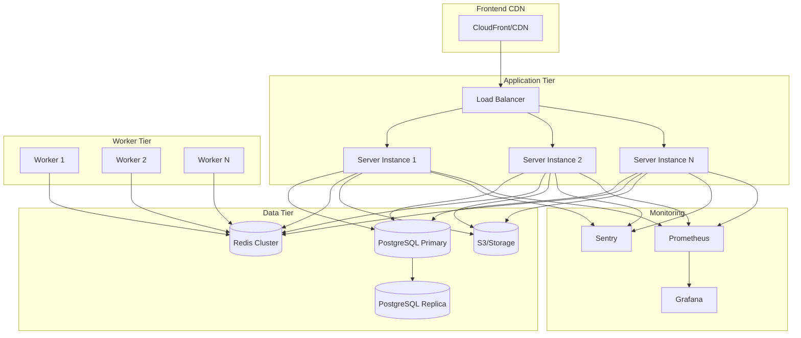
```mermaid
graph TB
    subgraph "Frontend CDN"
        A[CloudFront/CDN]
    end
    
    subgraph "Application Tier"
        B[Load Balancer]
        C[Server Instance 1]
        D[Server Instance 2]
        E[Server Instance N]
    end
    
    subgraph "Worker Tier"
        F[Worker 1]
        G[Worker 2]
        H[Worker N]
    end
    
    subgraph "Data Tier"
        I[(PostgreSQL Primary)]
        J[(PostgreSQL Replica)]
        K[(Redis Cluster)]
        L[(S3/Storage)]
    end
    
    subgraph "Monitoring"
        M[Sentry]
        N[Prometheus]
        O[Grafana]
    end
    
    A --> B
    B --> C
    B --> D
    B --> E
    
    C --> I
    D --> I
    E --> I
    
    I --> J
    
    C --> K
    D --> K
    E --> K
    
    F --> K
    G --> K
    H --> K
    
    C --> L
    D --> L
    E --> L
    
    C --> M
    D --> M
    E --> M
    
    C --> N
    D --> N
    E --> N
    N --> O
```

---

## Conclusion

Twenty Server's architecture balances:
- **Modularity** for maintainability
- **Performance** through caching and optimization
- **Scalability** via horizontal scaling
- **Multi-tenancy** with workspace isolation
- **Flexibility** through metadata-driven schemas

This architecture supports the platform's growth from small teams to enterprise deployments while maintaining code quality and developer experience.
