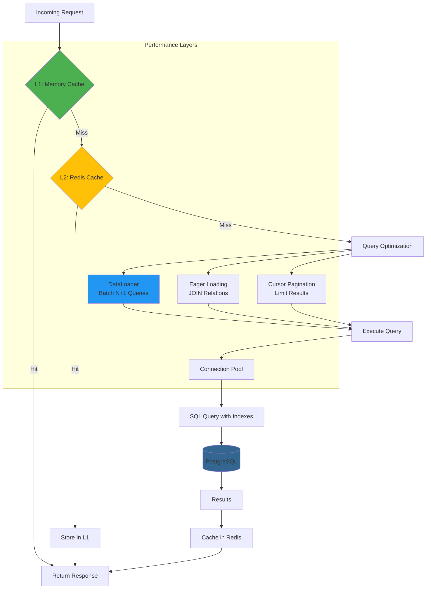

# Twenty Server - Visual Architecture Guide

Quick reference diagrams for understanding Twenty Server's architecture.

## System Architecture Overview


---

## Request Flow

### GraphQL Query Flow


### Mutation with Background Job


---

## Multi-Tenancy Architecture


---

## GraphQL Schema Generation


---

## Module Dependency Tree


---

## Authentication & Authorization Flow


---

## Background Job Processing


---

## Data Access Patterns


---

## Deployment Architecture


---

## Entity Relationship Diagram (Core Tables)

```mermaid
erDiagram
    WORKSPACE ||--o{ WORKSPACE_MEMBER : has
    WORKSPACE ||--o{ OBJECT_METADATA : defines
    WORKSPACE ||--o{ API_KEY : has
    WORKSPACE ||--o{ WEBHOOK : has
    
    USER ||--o{ WORKSPACE_MEMBER : belongs_to
    USER ||--o{ CONNECTED_ACCOUNT : has
    
    WORKSPACE_MEMBER }o--|| ROLE : has
    
    OBJECT_METADATA ||--o{ FIELD_METADATA : contains
    OBJECT_METADATA ||--o{ RELATION_METADATA : defines
    
    RELATION_METADATA }o--|| OBJECT_METADATA : from
    RELATION_METADATA }o--|| OBJECT_METADATA : to
    
    CONNECTED_ACCOUNT ||--o{ MESSAGE_CHANNEL : has
    MESSAGE_CHANNEL ||--o{ MESSAGE : contains
    
    WORKSPACE {
        uuid id PK
        string name
        string subdomain
        string logo
        boolean isActive
        timestamp createdAt
    }
    
    USER {
        uuid id PK
        string email UK
        string firstName
        string lastName
        string passwordHash
        boolean emailVerified
        timestamp createdAt
    }
    
    WORKSPACE_MEMBER {
        uuid id PK
        uuid workspaceId FK
        uuid userId FK
        uuid roleId FK
        timestamp createdAt
    }
    
    OBJECT_METADATA {
        uuid id PK
        uuid workspaceId FK
        string nameSingular UK
        string namePlural
        string labelSingular
        string labelPlural
        string description
        string icon
        boolean isActive
        boolean isCustom
        boolean isSystem
    }
    
    FIELD_METADATA {
        uuid id PK
        uuid objectMetadataId FK
        string name UK
        string label
        string type
        string description
        jsonb options
        boolean isNullable
        boolean isCustom
        jsonb defaultValue
    }
    
    RELATION_METADATA {
        uuid id PK
        string relationType
        uuid fromObjectMetadataId FK
        uuid toObjectMetadataId FK
        uuid fromFieldMetadataId FK
        uuid toFieldMetadataId FK
    }
```

---

## Performance Optimization Strategy



---

## Security Layers


---

## Legend

### Common Colors Used

- 🟢 **Green**: Entry points, success paths, workers
- 🔵 **Blue**: Core services, APIs, processing
- 🟠 **Orange**: Metadata, configuration, warnings
- 🔴 **Red**: Errors, denials, failures
- 🟡 **Yellow**: Cache layers, decisions
- 🟣 **Purple**: Infrastructure, load balancers

### Symbol Meanings

- **Rectangle**: Process/Service
- **Cylinder**: Database/Storage
- **Diamond**: Decision Point
- **Rounded Rectangle**: External Service
- **Subgraph**: Logical Grouping

---

## Quick Reference

### Key Endpoints
- GraphQL: `/graphql`
- REST: `/rest/*`
- Metadata: `/metadata`
- Health: `/healthz`

### Key Technologies
- Framework: NestJS
- Database: PostgreSQL + TypeORM
- Cache: Redis
- Queue: BullMQ
- Analytics: ClickHouse (optional)

### Default Ports
- Server: 3000
- PostgreSQL: 5432
- Redis: 6379
- ClickHouse: 8123

---

This visual guide provides quick reference diagrams for understanding Twenty Server's architecture, flows, and patterns.
